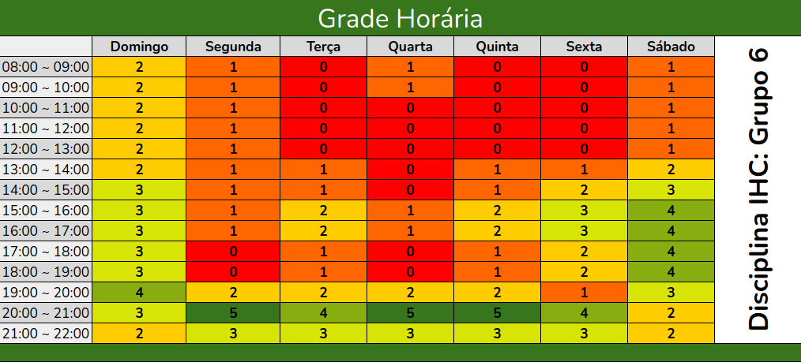

Responsável: Luis Henrique Arruda Luna — Cronograma e planejamento

# Heatmap de disponibilidade

O heatmap consolida as disponibilidades informadas pelos integrantes do Grupo 06 e facilita a identificação dos melhores horários para reuniões e atividades coletivas.

## Legenda

- **0 (vermelho):** nenhum integrante disponível;
- **1 (laranja):** um integrante disponível;
- **2 (amarelo):** dois integrantes disponíveis;
- **3 (verde-claro):** três integrantes disponíveis;
- **4 (verde):** quatro integrantes disponíveis;
- **5 (verde-escuro):** todos os integrantes disponíveis.

## Disponibilidade semanal

<figure markdown="span">
  
  <figcaption>Figura 1 — Heatmap de disponibilidade do Grupo 06.</figcaption>
</figure>

Fonte: elaboração do Grupo 06 (2026).

## Como interpretar o heatmap

As colunas representam os dias da semana e as linhas representam intervalos de uma hora, entre 08h e 22h. O número exibido em cada célula corresponde à quantidade de integrantes disponíveis naquele período.

As cores variam do vermelho ao verde-escuro. Os horários vermelhos apresentam menor disponibilidade, enquanto os horários verdes apresentam maior disponibilidade. Dessa forma, os períodos com valor **5** são os mais adequados para reuniões, pois contam com a disponibilidade de todos os integrantes do grupo.

## Janela sugerida de reunião

Com base no heatmap, a janela recorrente sugerida deve priorizar uma célula com valor **5**:

- Dia e horário recorrente:
- Canal (Teams / outro):
- Responsável por emitir a ata: Bruno Ferreira Dornelas

## Histórico de versão

| Versão | Data | Descrição | Autor(es) | Revisor(es) |
| :---: | :---: | --- | --- | --- |
| `0.1` | 04/09/2026 | Grade inicial para coleta | [Caio Breno de Souza Bezerra](https://github.com/CaioBezerra-Dev) | [Luis Henrique Arruda Luna](https://github.com/Donnk61) |
| `0.2` | 04/09/2026 | Faixas de horário e legenda para preenchimento | [Caio Breno de Souza Bezerra](https://github.com/CaioBezerra-Dev) | [Luis Henrique Arruda Luna](https://github.com/Donnk61) |
| `0.3` | 05/09/2026 | Inclusão do heatmap consolidado e de sua explicação | [Luis Henrique Arruda Luna](https://github.com/Donnk61) | [Caio Breno de Souza Bezerra](https://github.com/CaioBezerra-Dev) |

## Referências

[1] SALES, André Barros de. Plano de Ensino FIHC 022026 — Turma 01. Brasília: FCTE/UnB, 2026.
