Responsável: Bruno Ferreira Dornelas e Heitor Pinheiro — Verificação

# Lista de verificação da Entrega 1

## Introdução

Este artefato reúne a lista de verificação da Entrega 1, elaborada com base nos critérios definidos pelo professor André Barros no plano de ensino [1]. Use esta página no ensaio da apresentação e na autoavaliação para garantir que todos os requisitos estejam atendidos antes da entrega. Conforme a rubrica da disciplina, cada item registra a resposta (**Sim**, **Não** ou **Incompleto**), a **versão, data e hora da avaliação** e a respectiva **evidência** no repositório.

!!! note "Localização na navegação"
    Esta lista também se encontra no menu lateral sob **Verificação → Verificação do Grupo → Etapa 1** ([acesse aqui](../verificacao/grupo-06/etapa-1/lista-verificacao.md)).

## Itens do planejamento geral

A Tabela 1 apresenta a avaliação dos itens de planejamento geral exigidos para a Entrega 1.

| # | Questão: O GitHub Pages possui… | Resposta | Versão, data e hora da avaliação | Evidência |
| :---: | --- | :---: | :---: | --- |
| 1 | Uma página apresentando os integrantes da equipe (com foto) com nome e sem matrícula? | Sim | `v1.1` — 05/09/2026 às 21:00 | [Equipe](../equipe.md) |
| 2 | O cronograma do planejamento apresenta todas as atividades de todas as etapas para cada integrante com as datas de início e fim das entrega dos artefatos e com o período da revisão deles? | Sim | `v1.1` — 05/09/2026 às 21:00 | [Cronograma](cronograma.md) |
| 3 | O cronograma do planejamento apresenta um período de gravação da apresentação de cada etapa? | Sim | `v1.1` — 05/09/2026 às 21:00 | [Cronograma](cronograma.md#etapa-1-planejamento-do-projeto) |
| 4 | O cronograma prevê um período de revisão/ajustes nos artefatos devidos às considerações dos monitores/professor? | Sim | `v1.1` — 05/09/2026 às 21:00 | [Cronograma](cronograma.md#etapa-1-planejamento-do-projeto) |
| 5 | A motivação e os critérios para a escolha do site? | Sim | `v1.1` — 05/09/2026 às 21:00 | [Site escolhido](site-escolhido.md) |
| 6 | O planejamento e avaliação dos sites selecionados? | Sim | `v1.1` — 05/09/2026 às 21:00 | [Sites avaliados](sites-avaliados.md) |
| 7 | Possui opção de contraste de cores? | Sim | `v1.0` — 05/09/2026 às 21:00 | [Acessibilidade](../guia/acessibilidade.md) |
| 8 | Os artefatos: Planejamento do Projeto, equipe, lista de sites avaliados, site selecionado para o projeto da disciplina, Ferramentas do projeto, Processo de Design, cronograma das atividades? | Sim | `v1.2` — 05/09/2026 às 21:00 | [Cronograma](cronograma.md) |
| 9 | Uma página com as atas de reunião com o acesso à gravação (vídeo), quando houver? | Sim | `v1.1` — 05/09/2026 às 21:00 | [Atas](../atas/index.md) |

Tabela 1 — Itens de planejamento geral da Entrega 1.

Fonte: SALES (2026).

## Itens do desenvolvimento do projeto

A Tabela 2 lista os itens de desenvolvimento do projeto avaliados na Entrega 1.

| # | Questão: O GitHub Pages possui… | Resposta | Versão, data e hora da avaliação | Evidência |
| :---: | --- | :---: | :---: | --- |
| 1 | O histórico de versão padronizado? | Sim | `v1.1` — 05/09/2026 às 21:00 | [Autoria e versões](../guia/autoria-revisao-versoes.md) |
| 2 | O(s) autor(es) e o(s) revisor(es) para cada artefato? | Sim | `v1.2` — 05/09/2026 às 21:00 | Históricos em todos os artefatos |
| 3 | Referências bibliográficas e/ou bibliografia em todos os artefatos? | Sim | `v1.2` — 05/09/2026 às 21:00 | Seção Referências em todos os artefatos |
| 4 | As tabelas e imagens possuem legenda e fonte e elas chamadas dentro do texto? | Sim | `v1.2` — 05/09/2026 às 21:00 | [Figuras e tabelas](../guia/figuras-tabelas-referencias.md) |
| 5 | Um texto fazendo uma introdução dos artefatos? | Sim | `v1.2` — 05/09/2026 às 21:00 | Seção Introdução em todos os artefatos |
| 6 | O cronograma executado com quem realizou cada artefato/atividade com as datas de início e fim da construção/realização do artefato/atividade? | Sim | `v1.1` — 05/09/2026 às 21:00 | [Cronograma executado](cronograma.md#cronograma-executado) |
| 7 | Ata(s) da(s) reuniões (com data, horário de início e do final, participantes, objetivo, atividades definidas etc)? | Sim | `v1.1` — 05/09/2026 às 21:00 | [Ata 01](../atas/ata-01.md) |
| 8 | A gravação da reunião do grupo? | Sim | `v1.1` — 05/09/2026 às 21:00 | [Ata 01](../atas/ata-01.md#gravacao) |
| 9 | Vídeo de apresentação na categoria "não listado" no YouTube? | Incompleto | `v1.0` — 05/09/2026 às 21:00 | [Apresentação](../apresentacoes/etapa-01.md) (Previsto no cronograma) |
| 10 | Tabela de contribuição no início do artefato com o nome de todos os integrantes com a contribuição de cada integrante com hiperligação atividade e da gravação, se houver? | Sim | `v1.5` — 05/09/2026 às 21:55 | Início de cada artefato e [Apresentação da Etapa 1](../apresentacoes/etapa-01.md) |
| 11 | A seção de agradecimentos apresentando o uso de Inteligência Artificial (IA) Generativa no artefato? | Sim | `v1.1` — 05/09/2026 às 21:00 | [Ata 01](../atas/ata-01.md#agradecimentos) |

Tabela 2 — Itens de desenvolvimento da Entrega 1.

Fonte: SALES (2026).

## Itens de conteúdo da disciplina

A Tabela 3 apresenta os itens de conteúdo da disciplina verificados na Entrega 1.

| # | Item | Resposta | Versão, data e hora da avaliação | Autor(es) / Evidência |
| :---: | --- | :---: | :---: | --- |
| 1 | A justificativa da escolha do Processo de Design? Adicionar: referência bibliográfica da fonte e foto do texto da referência. Autor(es) | — | — | [Israel Soares de Paiva](processo-design.md) |
| 2 | Todos os integrantes da equipe devem elaborar itens de conteúdo da disciplina com referência bibliográfica da fonte e foto do texto da referência e o nome do autor do item. Cada item deve ter o(s) autor(es) do item. Quantos mais item melhor. | — | — | [Processo de Design](processo-design.md), [Ferramentas](ferramentas.md), [Heatmap](heatmap.md) e [Sites avaliados](sites-avaliados.md) |

Tabela 3 — Itens de conteúdo da disciplina na Entrega 1.

Fonte: SALES (2026).

## Itens elaborados pelo grupo

A lista oficial pede que cada integrante elabore ao menos um item de conteúdo, com referência e foto do trecho. A resposta fica em branco até a verificação.

| # | Item | Resposta | Versão, data e hora da avaliação | Autor |
| :---: | --- | :---: | :---: | --- |
| 3 | O processo de design reúne análise da situação atual, síntese de uma intervenção e avaliação? | — | — | [Israel Soares de Paiva](https://github.com/IsraelSoares-25) |
| 4 | O planejamento da avaliação determina os objetivos gerais? | — | — | [Caio Breno de Souza Bezerra](https://github.com/CaioBezerra-Dev) |
| 5 | A avaliação heurística é apresentada como método de inspeção? | — | — | [Heitor Pinheiro Gonçalves das Chagas](https://github.com/Heitorovski01) |
| 6 | O relato da avaliação descreve o problema encontrado e a severidade? | — | — | [Bruno Ferreira Dornelas](https://github.com/brunnf) |
| 7 | O planejamento trata das questões práticas: recrutamento, equipamentos, prazos e mão de obra? | — | — | [Luís Henrique Luna de Arruda](https://github.com/Donnk61) |

| 8 | O ciclo de Mayhew organiza o processo em análise de requisitos, design/avaliação/desenvolvimento e instalação? | — | — | [Israel Soares de Paiva](https://github.com/IsraelSoares-25) |
| 9 | Para cada objetivo, o planejamento elabora perguntas específicas a serem respondidas na avaliação? | — | — | [Caio Breno de Souza Bezerra](https://github.com/CaioBezerra-Dev) |
| 10 | A avaliação heurística parte de um conjunto explícito de heurísticas? | — | — | [Heitor Pinheiro Gonçalves das Chagas](https://github.com/Heitorovski01) |
| 11 | O relato informa o número e o perfil dos avaliadores? | — | — | [Bruno Ferreira Dornelas](https://github.com/brunnf) |
| 12 | O planejamento decide como lidar com as questões éticas, para que os participantes não sejam prejudicados? | — | — | [Luís Henrique Luna de Arruda](https://github.com/Donnk61) |

Tabela — Itens elaborados pelo Grupo 06 na Entrega 1.

Fonte: elaboração do Grupo 06 (2026).

### Item 3 — Israel Soares de Paiva

**Referência:** BARBOSA, Simone Diniz Junqueira; SILVA, Bruno Santana da. Interação humano-computador. Rio de Janeiro: Elsevier, 2010. cap. 4.

??? note "Figura — Atividades básicas do processo de design"

    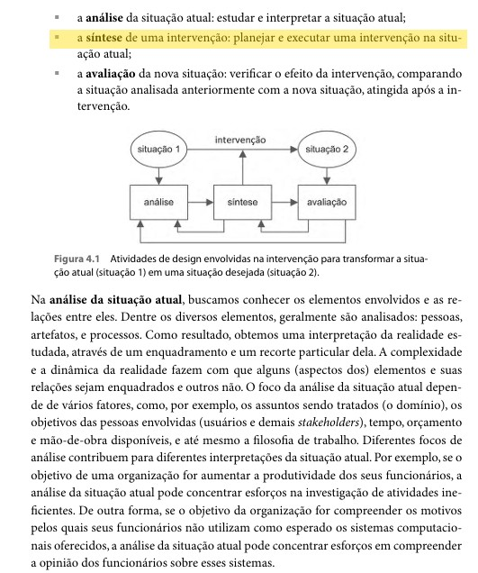

    
Figura — Atividades básicas do processo de design.

    
Fonte: BARBOSA; SILVA (2010, cap. 4).

### Item 4 — Caio Breno de Souza Bezerra

**Referência:** BARBOSA, Simone D. J.; SILVA, Bruno S. da; SILVEIRA, Milene S.; GASPARINI, Isabela; DARIN, Ticianne; BARBOSA, Gabriel D. J. Interação humano-computador e experiência do usuário. Autopublicação, 2021. p. 280.

??? note "Figura — Determinar os objetivos no framework DECIDE"

    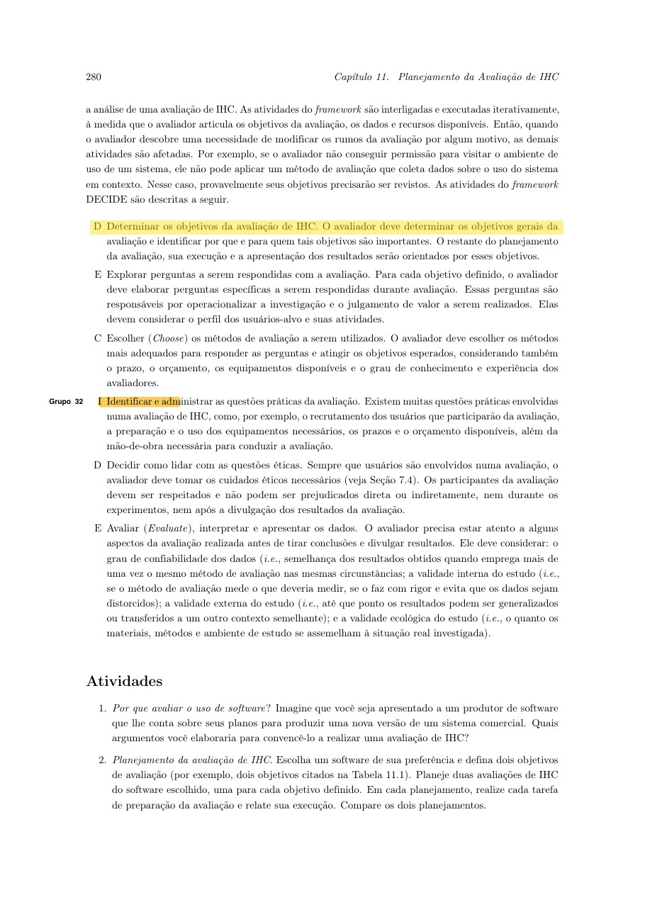

    
Figura — Barbosa et al. (2021, p. 280). Objetivos da avaliação.

    
Fonte: BARBOSA et al. (2021, p. 280).

### Item 5 — Heitor Pinheiro Gonçalves das Chagas

**Referência:** BARBOSA, Simone D. J. et al. Interação humano-computador e experiência do usuário. Autopublicação, 2021. p. 282.

??? note "Figura — Avaliação heurística como método de inspeção"

    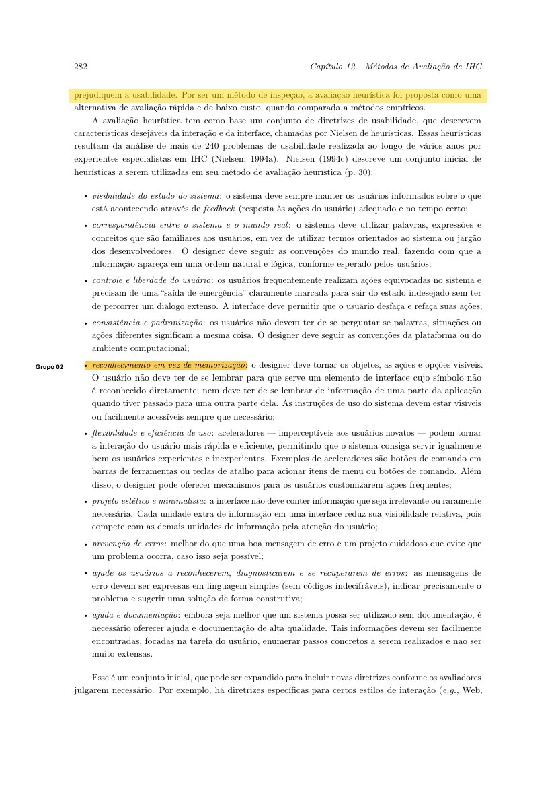

    
Figura — Barbosa et al. (2021, p. 282). Avaliação heurística.

    
Fonte: BARBOSA et al. (2021, p. 282).

### Item 6 — Bruno Ferreira Dornelas

**Referência:** BARBOSA, Simone D. J. et al. Interação humano-computador e experiência do usuário. Autopublicação, 2021. p. 285.

??? note "Figura — Relato com descrição do problema e severidade"

    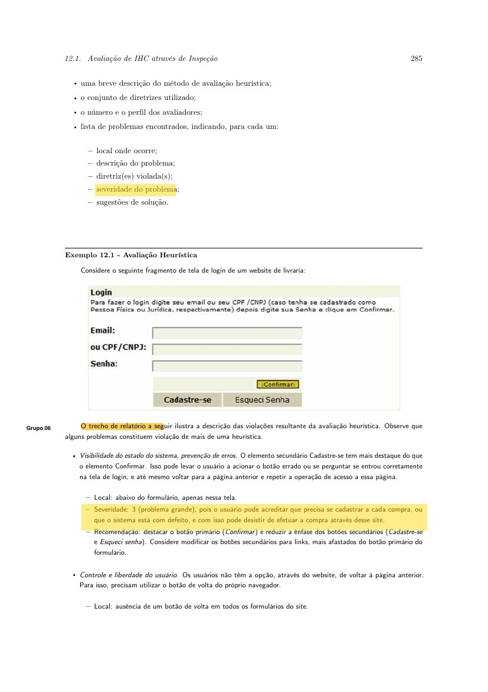

    
Figura — Barbosa et al. (2021, p. 285). Relato da avaliação.

    
Fonte: BARBOSA et al. (2021, p. 285).

### Item 7 — Luís Henrique Luna de Arruda

**Referência:** BARBOSA, Simone D. J. et al. Interação humano-computador e experiência do usuário. Autopublicação, 2021. p. 280.

??? note "Figura — Questões práticas da avaliação no DECIDE"

    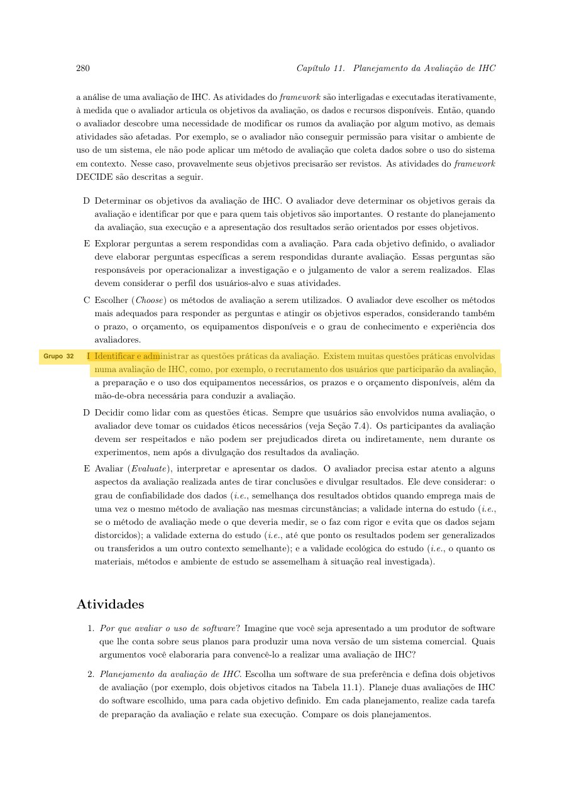

    
Figura — Barbosa et al. (2021, p. 280). Questões práticas.

    
Fonte: BARBOSA et al. (2021, p. 280).

### Item 8 — Israel Soares de Paiva

**Referência:** BARBOSA, Simone Diniz Junqueira; SILVA, Bruno Santana da. Interação humano-computador. Rio de Janeiro: Elsevier, 2010. p. 109.

??? note "Figura — Fases do ciclo de Mayhew"

    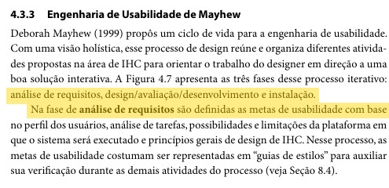

    
Figura — Barbosa e Silva (2010, p. 109). Fases do ciclo de Mayhew, com o trecho grifado.

    
Fonte: BARBOSA; SILVA (2010, p. 109).

### Item 9 — Caio Breno de Souza Bezerra

**Referência:** BARBOSA, Simone D. J. et al. Interação humano-computador e experiência do usuário. Autopublicação, 2021. p. 280.

??? note "Figura — Perguntas específicas de cada objetivo"

    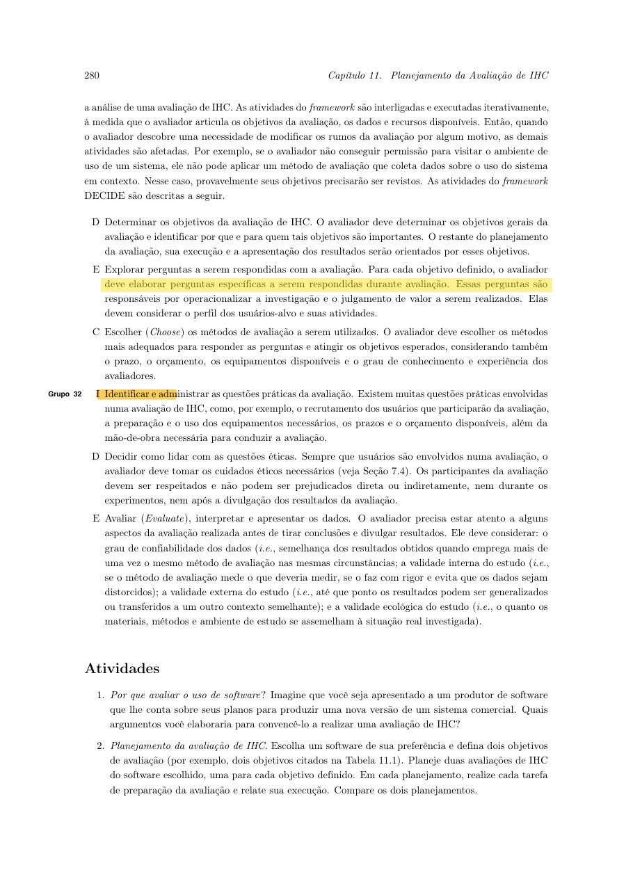

    
Figura — Barbosa et al. (2021, p. 280). Perguntas da avaliação, com o trecho grifado.

    
Fonte: BARBOSA et al. (2021, p. 280).

### Item 10 — Heitor Pinheiro Gonçalves das Chagas

**Referência:** BARBOSA, Simone D. J. et al. Interação humano-computador e experiência do usuário. Autopublicação, 2021. p. 282.

??? note "Figura — Conjunto de heurísticas"

    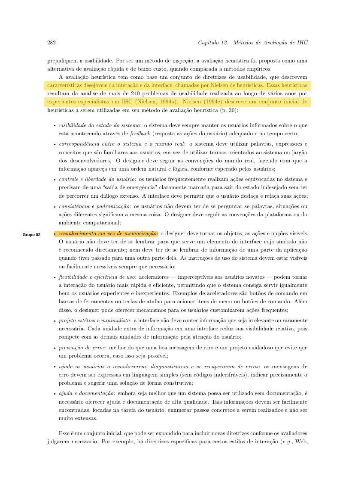

    
Figura — Barbosa et al. (2021, p. 282). Conjunto de heurísticas, com o trecho grifado.

    
Fonte: BARBOSA et al. (2021, p. 282).

### Item 11 — Bruno Ferreira Dornelas

**Referência:** BARBOSA, Simone D. J. et al. Interação humano-computador e experiência do usuário. Autopublicação, 2021. p. 285.

??? note "Figura — Número e perfil dos avaliadores"

    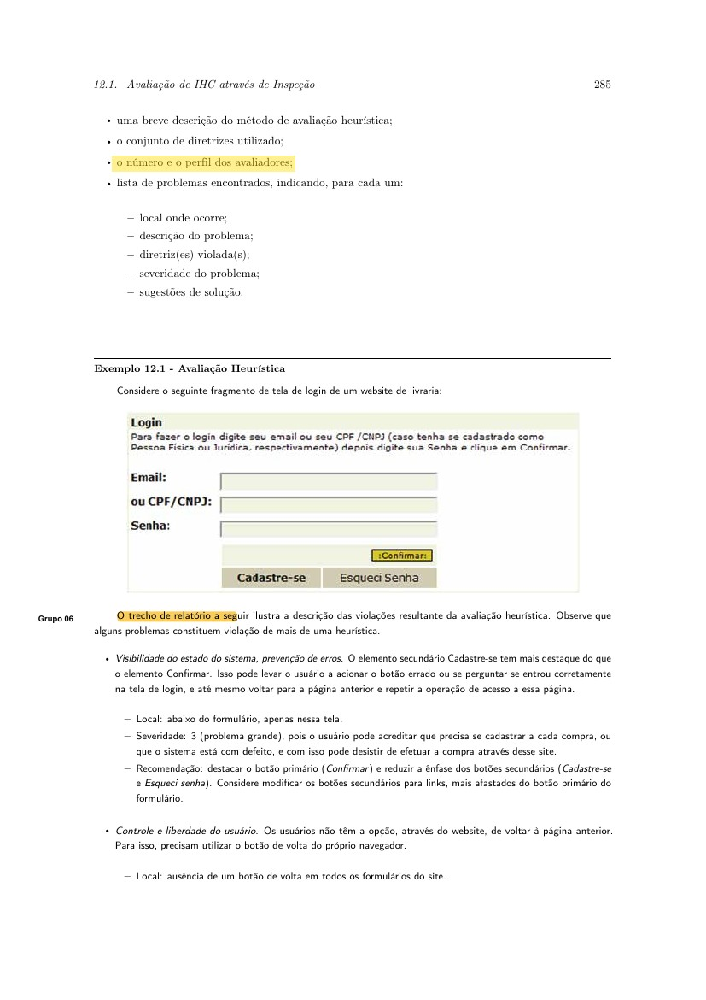

    
Figura — Barbosa et al. (2021, p. 285). Número e perfil dos avaliadores, com o trecho grifado.

    
Fonte: BARBOSA et al. (2021, p. 285).

### Item 12 — Luís Henrique Luna de Arruda

**Referência:** BARBOSA, Simone D. J. et al. Interação humano-computador e experiência do usuário. Autopublicação, 2021. p. 280.

??? note "Figura — Questões éticas da avaliação"

    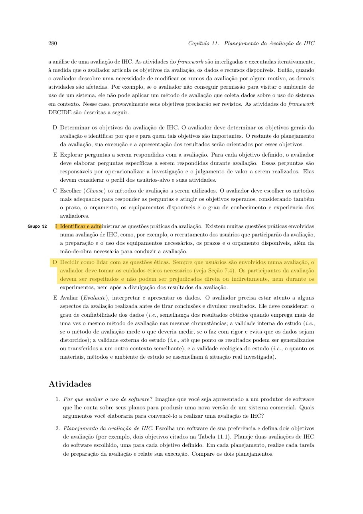

    
Figura — Barbosa et al. (2021, p. 280). Questões éticas, com o trecho grifado.

    
Fonte: BARBOSA et al. (2021, p. 280).

## Planejamento da avaliação de IHC

O monitor pediu ao menos 15 itens sobre o planejamento da avaliação, no quadro do framework DECIDE (BARBOSA et al., 2021, p. 280). A Figura 1 reproduz a página usada. Cada linha tem o autor do item da lista.

| # | Critério | Autor do item | Referência | Foto |
| :---: | --- | --- | --- | --- |
| 1 | Determina os objetivos gerais da avaliação? | [Caio Breno de Souza Bezerra](https://github.com/CaioBezerra-Dev) | BARBOSA et al., 2021, p. 280 | Figura 1 |
| 2 | Diz por que e para quem esses objetivos importam? | [Caio Breno de Souza Bezerra](https://github.com/CaioBezerra-Dev) | BARBOSA et al., 2021, p. 280 | Figura 1 |
| 3 | Elabora perguntas específicas para cada objetivo? | [Caio Breno de Souza Bezerra](https://github.com/CaioBezerra-Dev) | BARBOSA et al., 2021, p. 280 | Figura 1 |
| 4 | As perguntas consideram o perfil dos usuários-alvo e as atividades deles? | [Luís Henrique Luna de Arruda](https://github.com/Donnk61) | BARBOSA et al., 2021, p. 280 | Figura 1 |
| 5 | Escolhe os métodos adequados às perguntas e aos objetivos? | [Luís Henrique Luna de Arruda](https://github.com/Donnk61) | BARBOSA et al., 2021, p. 280 | Figura 1 |
| 6 | A escolha do método considera prazo, orçamento, equipamentos e experiência dos avaliadores? | [Luís Henrique Luna de Arruda](https://github.com/Donnk61) | BARBOSA et al., 2021, p. 280 | Figura 1 |
| 7 | Trata o recrutamento de quem participará da avaliação? | [Israel Soares de Paiva](https://github.com/IsraelSoares-25) | BARBOSA et al., 2021, p. 280 | Figura 1 |
| 8 | Descreve a preparação e o uso dos equipamentos? | [Israel Soares de Paiva](https://github.com/IsraelSoares-25) | BARBOSA et al., 2021, p. 280 | Figura 1 |
| 9 | Registra prazos e orçamento? | [Israel Soares de Paiva](https://github.com/IsraelSoares-25) | BARBOSA et al., 2021, p. 280 | Figura 1 |
| 10 | Indica a mão de obra necessária para conduzir a avaliação? | [Bruno Ferreira Dornelas](https://github.com/brunnf) | BARBOSA et al., 2021, p. 280 | Figura 1 |
| 11 | Decide como lidar com as questões éticas, inclusive não prejudicar os participantes? | [Bruno Ferreira Dornelas](https://github.com/brunnf) | BARBOSA et al., 2021, p. 280 | Figura 1 |
| 12 | Prevê o exame da confiabilidade dos dados? | [Bruno Ferreira Dornelas](https://github.com/brunnf) | BARBOSA et al., 2021, p. 280 | Figura 1 |
| 13 | Considera a validade interna? | [Heitor Pinheiro Gonçalves das Chagas](https://github.com/Heitorovski01) | BARBOSA et al., 2021, p. 280 | Figura 1 |
| 14 | Considera a validade externa? | [Heitor Pinheiro Gonçalves das Chagas](https://github.com/Heitorovski01) | BARBOSA et al., 2021, p. 280 | Figura 1 |
| 15 | Considera a validade ecológica e como os resultados serão apresentados? | [Heitor Pinheiro Gonçalves das Chagas](https://github.com/Heitorovski01) | BARBOSA et al., 2021, p. 280 | Figura 1 |

Tabela — Itens de planejamento da avaliação de IHC, a partir do DECIDE.

Fonte: BARBOSA et al. (2021, p. 280).

??? note "Figura 1 — Barbosa et al. (2021, p. 280). Atividades do framework DECIDE."

    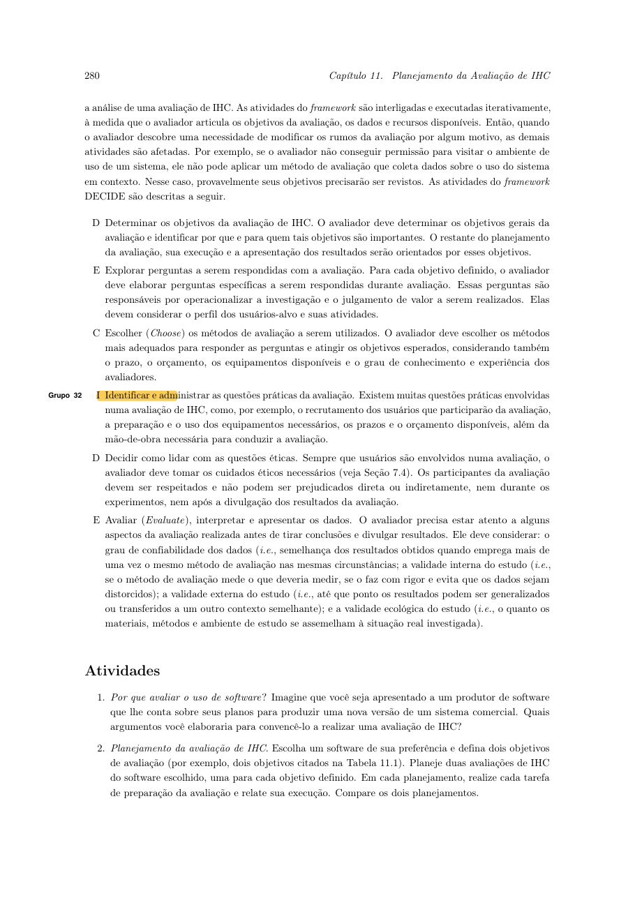

    
Figura 1 — Barbosa et al. (2021, p. 280). Atividades do framework DECIDE.

    
Fonte: BARBOSA et al. (2021, p. 280).

## Avaliação de IHC

O monitor pediu ao menos 10 itens sobre a avaliação em si. A base é o capítulo de métodos (BARBOSA et al., 2021, p. 282 e p. 285): inspeção, relato do problema e severidade. A Figura 2 e a Figura 3 reproduzem esses trechos.

| # | Critério | Autor do item | Referência | Foto |
| :---: | --- | --- | --- | --- |
| 1 | O método está nomeado (heurística, percurso cognitivo, inspeção semiótica ou teste)? | [Caio Breno de Souza Bezerra](https://github.com/CaioBezerra-Dev) | BARBOSA et al., 2021, p. 282 | Figura 2 |
| 2 | Se for avaliação heurística, o conjunto de heurísticas está explícito? | [Caio Breno de Souza Bezerra](https://github.com/CaioBezerra-Dev) | BARBOSA et al., 2021, p. 282 | Figura 2 |
| 3 | Cada problema tem descrição? | [Luís Henrique Luna de Arruda](https://github.com/Donnk61) | BARBOSA et al., 2021, p. 285 | Figura 3 |
| 4 | Cada problema tem justificativa e ideia de correção? | [Luís Henrique Luna de Arruda](https://github.com/Donnk61) | BARBOSA et al., 2021, p. 285 | Figura 3 |
| 5 | A severidade do problema está classificada? | [Israel Soares de Paiva](https://github.com/IsraelSoares-25) | BARBOSA et al., 2021, p. 285 | Figura 3 |
| 6 | O relato separa inspeção de observação com usuários? | [Israel Soares de Paiva](https://github.com/IsraelSoares-25) | BARBOSA et al., 2021, p. 282 | Figura 2 |
| 7 | O relato responde às perguntas do planejamento? | [Bruno Ferreira Dornelas](https://github.com/brunnf) | BARBOSA et al., 2021, p. 280 e 285 | Figura 1 e Figura 3 |
| 8 | Limitações do método aparecem no relato? | [Bruno Ferreira Dornelas](https://github.com/brunnf) | BARBOSA et al., 2021, p. 285 | Figura 3 |
| 9 | O número de avaliadores está declarado? | [Heitor Pinheiro Gonçalves das Chagas](https://github.com/Heitorovski01) | BARBOSA et al., 2021, p. 285 | Figura 3 |
| 10 | Há uma breve descrição do método no próprio relato? | [Heitor Pinheiro Gonçalves das Chagas](https://github.com/Heitorovski01) | BARBOSA et al., 2021, p. 285 | Figura 3 |

Tabela — Itens da avaliação de IHC.

Fonte: BARBOSA et al. (2021, p. 282 e p. 285).

??? note "Figura 2 — Barbosa et al. (2021, p. 282). Avaliação heurística."

    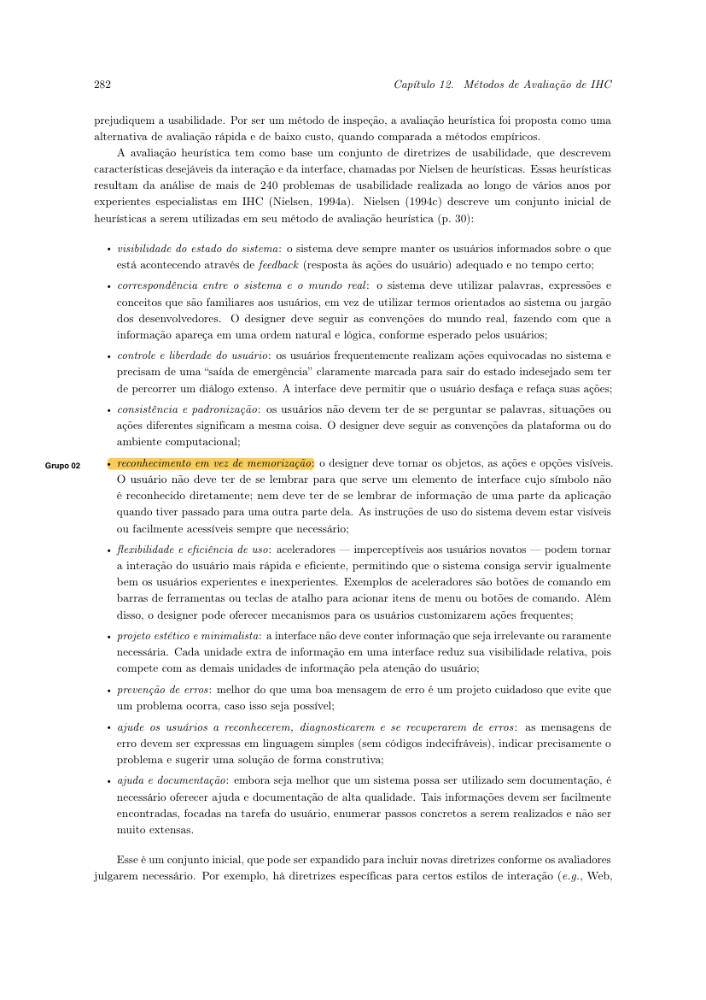

    
Figura 2 — Barbosa et al. (2021, p. 282). Avaliação heurística.

    
Fonte: BARBOSA et al. (2021, p. 282).

??? note "Figura 3 — Barbosa et al. (2021, p. 285). Relato da avaliação heurística."

    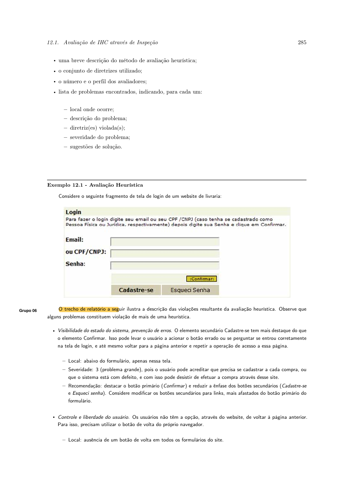

    
Figura 3 — Barbosa et al. (2021, p. 285). Relato da avaliação heurística.

    
Fonte: BARBOSA et al. (2021, p. 285).

## Aplicação aos planejamentos e relatos do Grupo 06

A mesma aplicação está na [lista da Etapa 1 do Grupo 06](../verificacao/grupo-06/etapa-1/lista-verificacao.md#aplicacao-aos-planejamentos-e-relatos-do-grupo-06). Resumo: **Incompleto** em 03/10/2026 às 21:20, porque Luís Henrique não tem PDF individual na pasta de sites e os demais documentos não cobrem, todos, o DECIDE e o relato pedido pelo livro.

A aplicação ao Grupo 07 está na [lista do Grupo 07](../verificacao/grupo-07/etapa-1/lista-verificacao.md#aplicacao-aos-planejamentos-e-relatos-do-grupo-07), também **Incompleto**: a inspeção de 07/09 não abriu esses relatórios.

## Histórico de versão

| Versão | Data | Descrição | Autor(es) | Revisor(es) |
| :---: | :---: | --- | --- | --- |
| `1.0` | 04/09/2026 | Transposição da lista oficial para o site | [Caio Breno de Souza Bezerra](https://github.com/CaioBezerra-Dev) | [Bruno Ferreira Dornelas](https://github.com/brunnf) |
| `1.1` | 05/09/2026 | Marca sites e escolha como prontos e atribui o processo a Israel | [Caio Breno de Souza Bezerra](https://github.com/CaioBezerra-Dev) | [Heitor Pinheiro Gonçalves das Chagas](https://github.com/Heitorovski01) |
| `1.2` | 05/09/2026 | Aponta a tabela de contribuição para o Planejamento da Entrega 1 | [Caio Breno de Souza Bezerra](https://github.com/CaioBezerra-Dev) | [Heitor Pinheiro Gonçalves das Chagas](https://github.com/Heitorovski01) |
| `1.3` | 05/09/2026 | Preenchimento dos itens concluídos da lista de verificação da Entrega 1 | [Bruno Ferreira Dornelas](https://github.com/brunnf) | [Caio Breno de Souza Bezerra](https://github.com/CaioBezerra-Dev) |
| `1.4` | 05/09/2026 | Adição do atributo de Versão, data e hora da avaliação e alinhamento com a lista oficial | [Heitor Pinheiro Gonçalves das Chagas](https://github.com/Heitorovski01) | [Caio Breno de Souza Bezerra](https://github.com/CaioBezerra-Dev) |
| `1.5` | 05/09/2026 | Atualiza o item 10 para a tabela no início de cada artefato | [Caio Breno de Souza Bezerra](https://github.com/CaioBezerra-Dev) | [Heitor Pinheiro Gonçalves das Chagas](https://github.com/Heitorovski01) |
| `1.6` | 03/10/2026 | Inclui 15 itens de planejamento DECIDE e 10 itens de avaliação, com autor, referência, foto e aplicação | [Caio Breno de Souza Bezerra](https://github.com/CaioBezerra-Dev) | [Bruno Ferreira Dornelas](https://github.com/brunnf) |

## Referências

[1] SALES, André Barros de. Plano de Ensino FIHC 022026 — Turma 01. Brasília: FCTE/UnB, 2026.

[2] BARBOSA, Simone D. J.; SILVA, Bruno S. da; SILVEIRA, Milene S.; GASPARINI, Isabela; DARIN, Ticianne; BARBOSA, Gabriel D. J. Interação humano-computador e experiência do usuário. Autopublicação, 2021.

