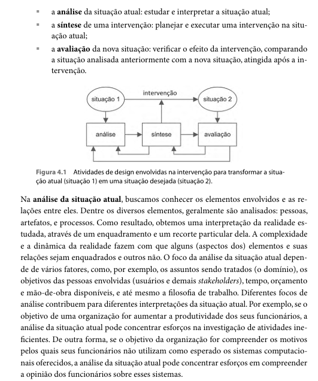
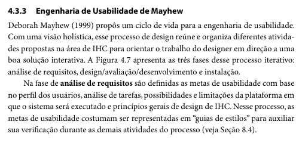
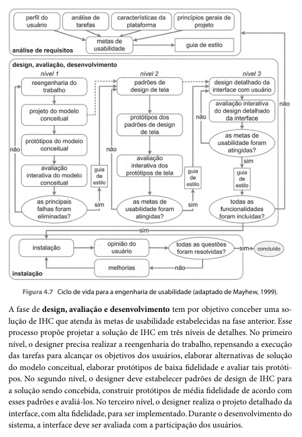
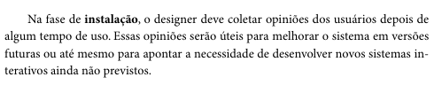

Responsável: Israel Soares de Paiva — Processo de Design

# Processo de Design

Compreender esse processo é essencial explorar pois destaca a importância de envolver o usuário durante suas atividades possibilitando participar direta ou indiretamente, nas decisões tomadas. Segundo Barbosa e Silva,design pode ser definido como processo composto por três atividades fundamentais:análise da situação atual(identificação de um problema), síntese de uma intervenção e avaliação da nova situação resultante dessa intervenção.

**Autor do item:** Israel Soares de Paiva

## Atividades básicas

O proceso de design é composto por três atividades: análise,sítese e avaliação. Análise busca entender e conhever elemento envolvidos e as relações entre eles, como resultado, obtemos diferentes interpretações da realidade e podemos ver as necessidades do usuário. a síntese é o momento de gerar as soluções proprimente ditas(protótipos e ideis conceituais), a avaliação é a forma de verificar o que foi produzido atende às necessidades identificadas, e seus resultados normalmente realimentam uma nova rodada de análise ou síntese, o que torna o processo cíclico em vez de linear. 

**Descrição do Processo de Design**

## Processos possíveis

### Ciclo de vida simples

ciclo de vida simples é o modelo mais enxuto entre os apresentados no capítulo. Depois da fase de análise, a síntese se divide em duas atividades: design (ou redesign) da solução e construção de uma versão interativa dela. Essa versão é então avaliada, e o ciclo pode se repetir quantas vezes forem necessárias até que o resultado seja satisfatório. Por não detalhar como cada uma dessas atividades deve ser conduzida internamente, esse modelo costuma ser indicado para designers com mais experiência, que já sabem preencher essas lacunas por conta própria.

### Ciclo de vida em estrela

O ciclo em estrela relaxa a ideia de sequência: o designer pode iniciar o trabalho por qualquer uma das atividades, desde que, ao final de cada uma delas, faça uma avaliação antes de seguir adiante. Aqui a síntese é dividida em quatro atividades mais específicas — projeto conceitual, especificação, prototipação e implementação — o que já é um nível de detalhe maior que o ciclo simples. Ainda assim, o modelo continua sendo pouco prescritivo quanto à ordem e à forma de executar cada atividade.

### Engenharia de usabilidade de Mayhew

O modelo de Mayhew organiza o processo em três grandes fases: análise de requisitos, design/avaliação/desenvolvimento (em geral executada de forma iterativa) e instalação. Entre os processos do capítulo, é o mais detalhado, pois cada fase é acompanhada de um conjunto específico de atividades e técnicas recomendadas.

### Outros

Nielsen lista atividades essenciais de engenharia de usabilidade, sem impor uma ordem única. Só use se Heitor argumentar melhor do que Mayhew ou o ciclo em estrela.

## Comparação rápida

| Processo | Detalhamento | Ordem das atividades | Encaixa no semestre? |
| --- | --- | --- | --- |
| Ciclo simples | Baixo | Análise → design → construção → avaliação | 0 |
| Ciclo em estrela | Médio | Qualquer ponta, com avaliação depois de cada uma | 0 |
| Mayhew | Alto | Requisitos → design/avaliação → instalação | X |

Tabela 1 — Comparação dos processos do capítulo 4.

Fonte: elaboração do Grupo 06 a partir de BARBOSA; SILVA (2010) e Lichess (2022).

## Processo escolhido

**Nome:** Engenharia de Usuabilidade de Mayhew

### O que é

Deborah Mayhew (1999) propôs um ciclo de vida para a engenharia de usuabilidade, com uma visão holística.
(BARBOSA; SILVA, 2010, p. 109).

### Por que este processo

O Portal da Transparência do DF é um sistema que já está no ar e em uso real, não um produto sendo criado do zero. Isso muda o tipo de trabalho que o Grupo 06 precisa fazer: em vez de propor uma interface inédita, a tarefa é analisar como usuários reais tentam encontrar informações públicas (gastos, contratos, salários) na interface existente, e verificar onde ela falha em atender a esse objetivo. É exatamente esse cenário — avaliação de um sistema existente, com foco em requisitos de usabilidade bem definidos — que o modelo de Mayhew foi criado para atender, ao contrário do ciclo simples ou do ciclo em estrela, que pressupõem que o design ainda será construído do zero

### Como vamos percorrê-lo

| Fase do processo | O que o grupo faz | Entrega |
| --- | --- | :---: |
| Inicial | Documento Inicial | 1 |

Tabela 2 — Processo de design e entregas da disciplina.

Fonte: elaboração do Grupo 06 (2026).

## Foto do trecho

**Introdução de Usuabilidade de Mayhew** 

**Parte do Gráfico**

**Fase de Instalação**

Fonte: BARBOSA; SILVA (2010, p. 109-111). Foto a inserir.

## Histórico de versão

| Versão | Data | Descrição | Autor(es) | Revisor(es) |
| :---: | :---: | --- | --- | --- |
| `0.1` | 04/09/2026 | Modelo com foto da referência | [Caio Breno de Souza Bezerra](https://github.com/CaioBezerra-Dev) | [Caio Breno de Souza Bezerra](https://github.com/CaioBezerra-Dev) |
| `1.0` | 05/09/2026 | Preenchimento da página | [Israel Soares de Paiva](https://github.com/IsraelSoares-25) | [Caio Breno de Souza Bezerra](https://github.com/CaioBezerra-Dev) |

## Referências

[1] BARBOSA, Simone Diniz Junqueira; SILVA, Bruno Santana da. Interação humano-computador. Rio de Janeiro: Elsevier, 2010. cap. 4.

[2] SALES, André Barros de. Plano de Ensino FIHC 022026 — Turma 01. Brasília: FCTE/UnB, 2026.

[3] Processo de Design. In: Lichess — IHC 2022.2. Disponível em: https://interacao-humano-computador.github.io/2022.2-Lichess/planejamento/processo_de_design/. Acesso em: 4 set. 2026.
