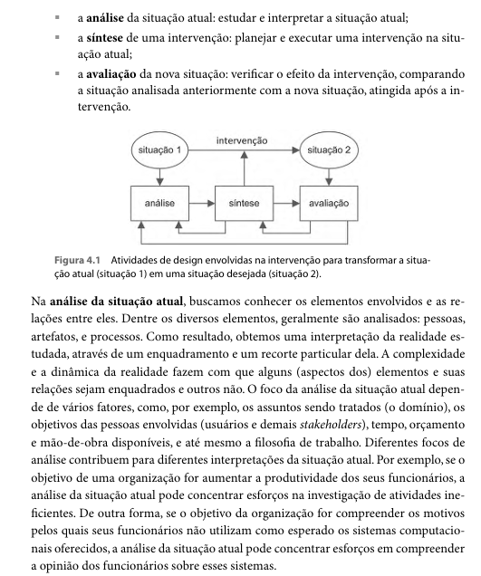
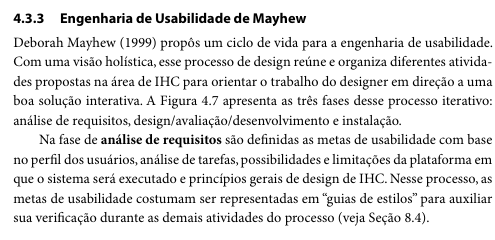
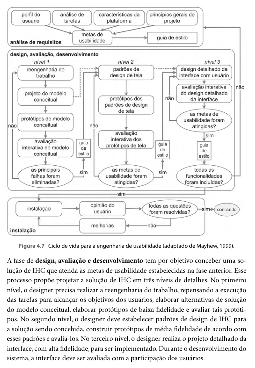
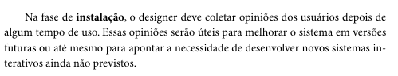

Responsável: Israel Soares de Paiva — Processo de Design

# Processo de Design

## Tabela de contribuição

A Tabela 1 registra quem atuou neste artefato. Cada linha é uma atividade.

| Integrante | Contribuição | Artefato / atividade |
| --- | --- | --- |
| [Israel Soares de Paiva](https://github.com/IsraelSoares-25) | Redação e justificativa do processo | [Processo escolhido](processo-design.md#processo-escolhido) |
| [Israel Soares de Paiva](https://github.com/IsraelSoares-25) | Fotos da referência do processo | [Foto do trecho](processo-design.md#foto-do-trecho) |
| Google Gemini | Apoio na organização do texto e na formatação Markdown | [Agradecimentos](processo-design.md#agradecimentos) |

Tabela 1 — Contribuição neste artefato.

Fonte: elaboração do Grupo 06 (2026).

## Introdução

Esta página justifica o processo de design adotado pelo Grupo 06 para avaliar e reprojetar o Portal do Senado Federal. O capítulo 4 de Barbosa e Silva (2010) apresenta atividades básicas e modelos de ciclo de vida. O grupo compara esses modelos e registra a escolha da engenharia de usabilidade de Mayhew.

## Processo de Design

Compreender o processo de design importa porque o usuário participa, direta ou indiretamente, das decisões. Barbosa e Silva (2010) definem design como um processo com três atividades fundamentais: análise da situação atual, síntese de uma intervenção e avaliação da nova situação. A Figura 1 reproduz essa descrição.

??? note "Figura 1 — Atividades básicas do processo de design."

    

    
Figura 1 — Atividades básicas do processo de design.

    
Fonte: BARBOSA; SILVA (2010, cap. 4).

## Atividades básicas

O processo de design é composto por análise, síntese e avaliação. A análise busca entender os elementos envolvidos e as relações entre eles. O resultado são interpretações da realidade e das necessidades do usuário. A síntese gera as soluções, como protótipos e ideias conceituais. A avaliação verifica se o que foi produzido atende às necessidades identificadas. Os resultados em geral alimentam uma nova rodada de análise ou de síntese, e o processo é cíclico, não linear (BARBOSA; SILVA, 2010).

## Processos possíveis

### Ciclo de vida simples

O ciclo de vida simples é o modelo mais enxuto do capítulo. Depois da análise, a síntese se divide em design (ou redesign) da solução e construção de uma versão interativa. Essa versão é avaliada, e o ciclo pode se repetir até o resultado ser satisfatório. Por não detalhar como cada atividade é conduzida, o modelo costuma servir a designers com mais experiência (BARBOSA; SILVA, 2010).

### Ciclo de vida em estrela

O ciclo em estrela relaxa a sequência: o designer pode começar por qualquer atividade, desde que avalie ao final de cada uma antes de seguir. A síntese se divide em projeto conceitual, especificação, prototipação e implementação. O modelo continua pouco prescritivo quanto à ordem e à forma de executar cada atividade (BARBOSA; SILVA, 2010).

### Engenharia de usabilidade de Mayhew

O modelo de Mayhew organiza o processo em três fases: análise de requisitos, design, avaliação e desenvolvimento, em geral iterativos, e instalação. É o mais detalhado do capítulo, porque cada fase traz atividades e técnicas recomendadas (BARBOSA; SILVA, 2010, p. 109). A Figura 2 mostra a introdução desse ciclo.

### Engenharia de usabilidade de Nielsen

Nielsen (1993, apud BARBOSA; SILVA, 2010) lista atividades essenciais de engenharia de usabilidade sem impor uma ordem única. O grupo não adotou esse modelo: as entregas da disciplina pedem fases reconhecíveis, e Mayhew associa técnicas a cada fase. Nielsen permanece como referência das atividades, não como o ciclo que organiza o semestre.

## Comparação rápida

A Tabela 2 compara os processos do capítulo usado neste artefato.

| Processo | Detalhamento | Ordem das atividades | Encaixa no semestre? |
| --- | --- | --- | --- |
| Ciclo simples | Baixo | Análise, design, construção e avaliação | Não |
| Ciclo em estrela | Médio | Qualquer ponta, com avaliação depois de cada uma | Não |
| Mayhew | Alto | Requisitos, design e avaliação, instalação | Sim |
| Nielsen | Médio | Atividades essenciais, sem ordem fixa | Não |

Tabela 2 — Comparação dos processos do capítulo 4.

Fonte: elaboração do Grupo 06 a partir de BARBOSA; SILVA (2010) e Lichess (2022).

## Processo escolhido

**Nome:** Engenharia de usabilidade de Mayhew

### O que é

Deborah Mayhew (1999) propôs um ciclo de vida para a engenharia de usabilidade, com uma visão holística (BARBOSA; SILVA, 2010, p. 109). A Figura 2, a Figura 3 e a Figura 4 reproduzem a introdução do modelo, parte do gráfico e a fase de instalação.

### Por que este processo

O Portal do Senado Federal é um sistema que já está no ar e em uso real, não um produto sendo criado do zero. Isso muda o tipo de trabalho que o Grupo 06 precisa fazer: em vez de propor uma interface inédita, a tarefa é analisar como usuários reais tentam encontrar informações e serviços públicos (a tramitação de um projeto de lei, os dados de um senador, um canal de participação) na interface existente, e verificar onde ela falha em atender a esse objetivo. É exatamente esse cenário — avaliação de um sistema existente, com foco em requisitos de usabilidade bem definidos — que o modelo de Mayhew foi criado para atender, ao contrário do ciclo simples ou do ciclo em estrela, que pressupõem que o design ainda será construído do zero

### Como vamos percorrê-lo

A Tabela 3 liga as fases do processo escolhido às entregas da disciplina.

| Fase do processo | O que o grupo faz | Entrega |
| --- | --- | :---: |
| Inicial | Documento Inicial | 1 |

Tabela 3 — Processo de design e entregas da disciplina.

Fonte: elaboração do Grupo 06 (2026).

## Foto do trecho

??? note "Figura 2 — Introdução da engenharia de usabilidade de Mayhew."

    

    
Figura 2 — Introdução da engenharia de usabilidade de Mayhew.

    
Fonte: BARBOSA; SILVA (2010, p. 109).

??? note "Figura 3 — Parte do gráfico do ciclo de vida de Mayhew."

    

    
Figura 3 — Parte do gráfico do ciclo de vida de Mayhew.

    
Fonte: BARBOSA; SILVA (2010, p. 110).

??? note "Figura 4 — Fase de instalação do ciclo de Mayhew."

    

    
Figura 4 — Fase de instalação do ciclo de Mayhew.

    
Fonte: BARBOSA; SILVA (2010, p. 111).

## Agradecimentos

A equipe agradece o apoio do Google Gemini na organização do texto, no ajuste da clareza e na formatação Markdown desta página. O nome da ferramenta é o mesmo registrado na [Ata 01](../atas/ata-01.md#agradecimentos). A escolha do processo e a responsabilidade pelo que está publicado são de Israel Soares.

## Histórico de versão

| Versão | Data | Descrição | Autor(es) | Revisor(es) |
| :---: | :---: | --- | --- | --- |
| `0.1` | 04/09/2026 | Modelo com foto da referência | [Caio Breno de Souza Bezerra](https://github.com/CaioBezerra-Dev) | [Caio Breno de Souza Bezerra](https://github.com/CaioBezerra-Dev) |
| `1.0` | 05/09/2026 | Preenchimento da página | [Israel Soares de Paiva](https://github.com/IsraelSoares-25) | [Caio Breno de Souza Bezerra](https://github.com/CaioBezerra-Dev) |
| `1.1` | 05/09/2026 | Recoloca a tabela de contribuição no início do artefato | [Caio Breno de Souza Bezerra](https://github.com/CaioBezerra-Dev) | [Israel Soares de Paiva](https://github.com/IsraelSoares-25) |
| `1.2` | 03/10/2026 | Corrige figuras, numeração, fontes, chamada no texto, recado interno e ortografia; nomeia o Google Gemini | [Caio Breno de Souza Bezerra](https://github.com/CaioBezerra-Dev) | [Bruno Ferreira Dornelas](https://github.com/brunnf) |

## Referências

[1] BARBOSA, Simone Diniz Junqueira; SILVA, Bruno Santana da. Interação humano-computador. Rio de Janeiro: Elsevier, 2010. cap. 4.

[2] SALES, André Barros de. Plano de Ensino FIHC 022026 — Turma 01. Brasília: FCTE/UnB, 2026.

[3] Processo de Design. In: Lichess — IHC 2022.2. Disponível em: https://interacao-humano-computador.github.io/2022.2-Lichess/planejamento/processo_de_design/. Acesso em: 4 set. 2026.
