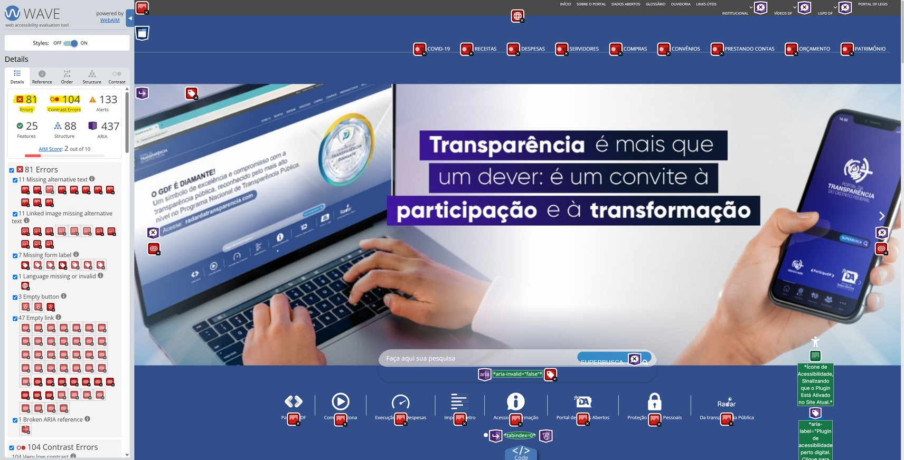
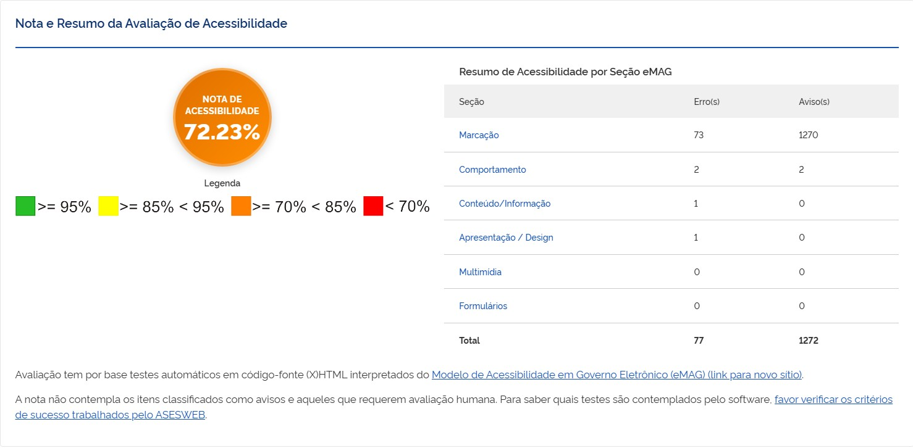

Responsável: Caio Breno de Souza Bezerra — Pesquisa e seleção do site

# Site escolhido

## Tabela de contribuição

A Tabela 1 registra quem fez o quê neste artefato.

| Integrante | Contribuição | Artefato / atividade | Gravação |
| --- | --- | --- | --- |
| [Caio Breno de Souza Bezerra](https://github.com/CaioBezerra-Dev) | Redação da justificativa e do recorte do projeto | [Esta página](site-escolhido.md) | [Ata 01](../atas/ata-01.md) |
| [Heitor Pinheiro Gonçalves das Chagas](https://github.com/Heitorovski01) | Inspeção individual do portal escolhido e revisão desta página | [Planejamento](../assets/docs/sites/02_Heitor_Chagas_Planejamento_Avaliacao_IHC.pdf) e [relatório](../assets/docs/sites/01_Heitor_Chagas_Relatorio_Avaliacao_IHC.pdf) | [Ata 01](../atas/ata-01.md) |
| [Bruno Ferreira Dornelas](https://github.com/brunnf) | Participou da decisão de escolha do objeto | [Ata 01](../atas/ata-01.md) | [Ata 01](../atas/ata-01.md) |
| [Israel Soares de Paiva](https://github.com/IsraelSoares-25) | Participou da decisão de escolha do objeto | [Ata 01](../atas/ata-01.md) | [Ata 01](../atas/ata-01.md) |
| [Luis Henrique Arruda Luna](https://github.com/Donnk61) | Participou da decisão de escolha do objeto | [Ata 01](../atas/ata-01.md) | [Ata 01](../atas/ata-01.md) |

Tabela 1 — Contribuição neste artefato.

Fonte: elaboração do Grupo 06 (2026).

## Introdução

O grupo selecionou o [Portal da Transparência do Distrito Federal](https://www.transparencia.df.gov.br/) como objeto do projeto. Esta página justifica a escolha a partir da comparação em [Sites avaliados](sites-avaliados.md), registra os aspectos que serão trabalhados nas oito etapas e aponta o planejamento e o relatório individuais já existentes — os dois PDFs padronizados que o professor pode abrir neste site.

## Identificação

| Campo | Informação |
| --- | --- |
| Nome | Portal da Transparência do Distrito Federal |
| Endereço | <https://www.transparencia.df.gov.br/> |
| Mantenedor | Governo do Distrito Federal |
| Tipo | Site governamental de dados abertos e prestação de contas |
| Recorte inicial | Consulta pública a receitas, despesas e painéis de transparência |
| Documentos padronizados | [Planejamento da avaliação](../assets/docs/sites/02_Heitor_Chagas_Planejamento_Avaliacao_IHC.pdf) e [relatório de avaliação](../assets/docs/sites/01_Heitor_Chagas_Relatorio_Avaliacao_IHC.pdf) |

Tabela 2 — Identificação do site selecionado.

Fonte: DISTRITO FEDERAL (2026); GONÇALVES DAS CHAGAS (2026).

A Tabela 2 identifica o portal e liga os dois documentos padronizados da inspeção individual.

<figure markdown="span">
  
  <figcaption>Figura 1 — Página inicial do Portal da Transparência do DF na inspeção WAVE.</figcaption>
</figure>

Fonte: GONÇALVES DAS CHAGAS (2026); DISTRITO FEDERAL (2026).

A Figura 1 apresenta a homepage inspecionada. A pontuação AIM 2 de 10 e os 81 erros do WAVE evidenciam problemas de acessibilidade no próprio serviço escolhido.

## Por que este site, e não os outros

A comparação dos quatro candidatos está em [Sites avaliados](sites-avaliados.md). O Portal da Transparência do DF foi escolhido porque reúne, ao mesmo tempo:

- serviço público do Distrito Federal, usado por cidadãs e cidadãos para acompanhar receitas, despesas e servidores
- tarefas reais sem cadastro (buscar despesa, ler painel, localizar receita)
- falhas documentadas de marcação, contraste e formulários
- acesso contínuo e gratuito
- recorte que cabe no processo de design, na ética da pesquisa e no protótipo até a entrega final

LexML e Senado também são portais públicos com problemas reais. O primeiro atende sobretudo a um público jurídico; o segundo tem arquitetura larga demais e trechos com login. Unaí tem interrupções graves na interface, mas o município de Minas Gerais afasta o grupo de participantes acessíveis no semestre.

## Motivação

O grupo escolheu o Portal da Transparência do DF pelos motivos abaixo, já confirmados na comparação:

- é um serviço público de acesso à informação, alinhado a governo eletrônico e inclusão digital
- a avaliação individual de Heitor Pinheiro Gonçalves das Chagas mapeou falhas de marcação, contraste e formulários à luz do e-MAG e do WCAG
- o domínio permite tarefas realistas sem exigir cadastro
- há margem clara para reprojeto de interface e de interação ao longo das oito etapas
- o público-alvo (cidadão do DF) é recrutável pelo grupo na FCTE/UnB

## Aspectos selecionados para o projeto

O grupo vai trabalhar, de fato, os seguintes aspectos:

1. Clareza da busca e dos painéis para cidadãs e cidadãos leigos
2. Conformidade de acessibilidade (contraste, rótulos, alternativas textuais e links vazios)
3. Consistência da navegação e controle do usuário ao abrir painéis e links em nova aba
4. Linguagem e hierarquia visual dos dados financeiros

Esses quatro eixos saem dos problemas P01 a P05 do relatório padronizado e cabem nas entregas de perfil, princípios, storyboard, protótipo de papel, alta fidelidade e verificação.

## Planejamento e avaliação prévia

A avaliação individual do Heitor usou inspeção heurística com apoio dos validadores ASES e WAVE. Esse material **não substitui** os artefatos do grupo; serve de ponto de partida. O que o grupo aproveita e o que será refeito no processo de design coletivo aparece na Tabela 3.

| Fonte | O que oferece | Como o grupo usa | Documento padronizado |
| --- | --- | --- | --- |
| Planejamento DECIDE (Heitor, 2026) | Objetivos, perguntas e método de conformidade | Base para delimitar o recorte das etapas 2 a 4 | [PDF](../assets/docs/sites/02_Heitor_Chagas_Planejamento_Avaliacao_IHC.pdf) |
| Relatório de avaliação (Heitor, 2026) | Problemas de contraste, `alt`, rótulos e `target="_blank"` | Hipóteses a revalidar nas etapas 2 a 7 | [PDF](../assets/docs/sites/01_Heitor_Chagas_Relatorio_Avaliacao_IHC.pdf) |

Tabela 3 — Aproveitamento do planejamento individual no projeto coletivo.

Fonte: elaboração do Grupo 06 (2026).

A Tabela 3 deixa explícito que os dois PDFs padronizados permanecem acessíveis neste site e que o processo coletivo vai revalidar, e não copiar, a inspeção individual.

<figure markdown="span">
  
  <figcaption>Figura 2 — Nota e resumo da avaliação ASES do portal escolhido.</figcaption>
</figure>

Fonte: GONÇALVES DAS CHAGAS (2026); ASESWEB (2024).

A Figura 2 mostra a nota 72,23% no ASES, abaixo do patamar verde (≥ 95%). Esse resultado reforça a motivação: o portal já é público e relevante, mas ainda falha em conformidade de acessibilidade.

## Problemas que o grupo leva adiante

Os cinco problemas do relatório padronizado viram hipóteses do projeto coletivo:

1. Imagens de navegação sem `alt` e links vazios
2. Contraste insuficiente da fonte clara sobre o menu azul
3. Superbusca sem `label` ou `aria-label`
4. Células de cabeçalho vazias em tabelas
5. Links internos forçados em nova aba, sem aviso

O plano de reprojeto individual já aponta correções verificáveis (atributos `alt`, razão de contraste 4,5:1, rótulos, `scope` em tabelas e restrição de `target="_blank"`). O grupo trata essas correções como ponto de partida, a ser confrontado com perfil de usuário, ética e prototipação nas etapas seguintes.

## Histórico de versão

| Versão | Data | Descrição | Autor(es) | Revisor(es) |
| :---: | :---: | --- | --- | --- |
| `0.1` | 04/09/2026 | Registro do domínio combinado e gancho para a justificativa | [Caio Breno de Souza Bezerra](https://github.com/CaioBezerra-Dev) | [Heitor Pinheiro Gonçalves das Chagas](https://github.com/Heitorovski01) |
| `1.0` | 05/09/2026 | Justificativa da escolha, recorte e PDFs padronizados | [Caio Breno de Souza Bezerra](https://github.com/CaioBezerra-Dev) | [Heitor Pinheiro Gonçalves das Chagas](https://github.com/Heitorovski01) |
| `1.1` | 05/09/2026 | Remove a tabela de contribuição e a pontuação numérica da justificativa | [Caio Breno de Souza Bezerra](https://github.com/CaioBezerra-Dev) | [Heitor Pinheiro Gonçalves das Chagas](https://github.com/Heitorovski01) |
| `1.2` | 05/09/2026 | Recoloca a tabela de contribuição no início do artefato | [Caio Breno de Souza Bezerra](https://github.com/CaioBezerra-Dev) | [Heitor Pinheiro Gonçalves das Chagas](https://github.com/Heitorovski01) |

## Referências

[1] ASESWEB. ASES — Avaliador e Simulador de Acessibilidade em Sítios. Disponível em: https://asesweb.governoeletronico.gov.br/. Acesso em: 5 set. 2026.

[2] BARBOSA, Simone Diniz Junqueira; SILVA, Bruno Santana da. Interação humano-computador. Rio de Janeiro: Elsevier, 2010. cap. 11–12.

[3] DISTRITO FEDERAL. Portal da Transparência do Distrito Federal. Disponível em: https://www.transparencia.df.gov.br/. Acesso em: 5 set. 2026.

[4] GONÇALVES DAS CHAGAS, Heitor Pinheiro. Planejamento da avaliação de IHC (Portal da Transparência do DF). Brasília: FCTE/UnB, 2026. Disponível em: [PDF padronizado](../assets/docs/sites/02_Heitor_Chagas_Planejamento_Avaliacao_IHC.pdf).

[5] GONÇALVES DAS CHAGAS, Heitor Pinheiro. Relatório de avaliação de interação humano-computador: Portal da Transparência do Distrito Federal. Brasília: FCTE/UnB, 2026. Disponível em: [PDF padronizado](../assets/docs/sites/01_Heitor_Chagas_Relatorio_Avaliacao_IHC.pdf).

[6] NIELSEN, Jakob. 10 usability heuristics for user interface design. Nielsen Norman Group, 1994.

[7] SALES, André Barros de. Plano de Ensino FIHC 022026 — Turma 01. Brasília: FCTE/UnB, 2026.

[8] WORLD WIDE WEB CONSORTIUM. Web Content Accessibility Guidelines (WCAG) 2.1. 2018. Disponível em: https://www.w3.org/TR/WCAG21/. Acesso em: 5 set. 2026.
