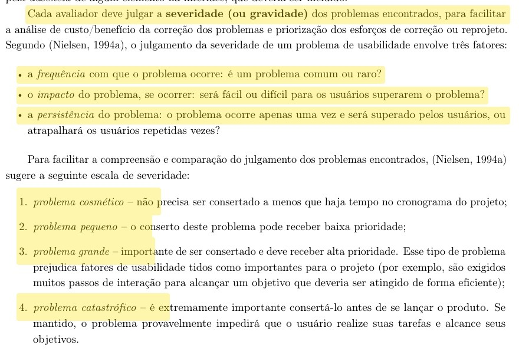
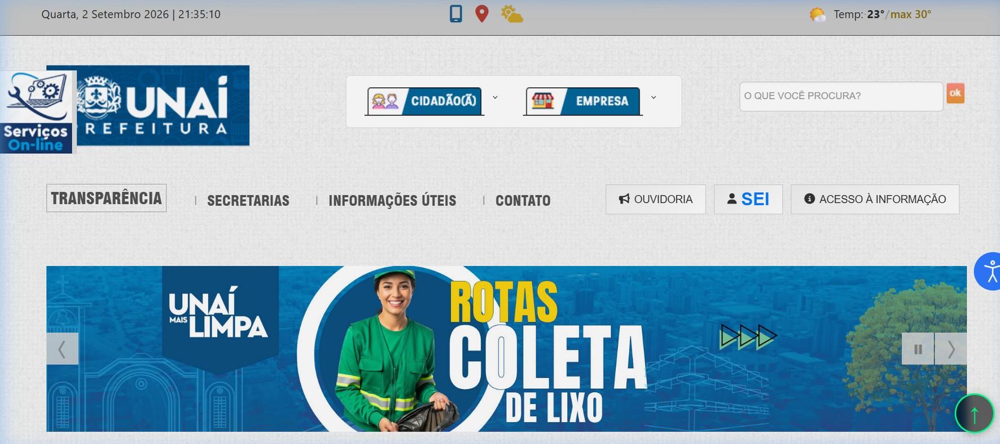
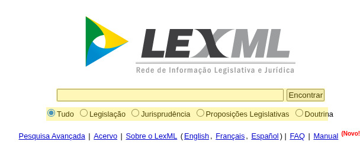
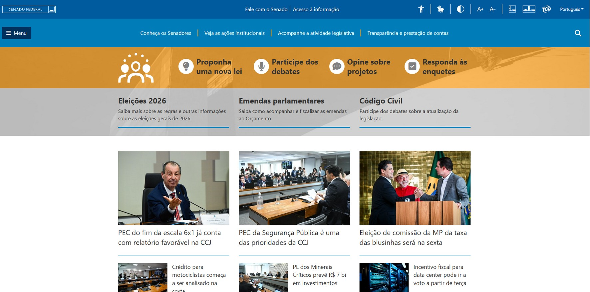

Responsável: Caio Breno de Souza Bezerra — Pesquisa e seleção do site

# Sites avaliados

## Introdução

Na Entrega 1, o grupo precisava apresentar os sites considerados antes de justificar o objeto do semestre. Quatro integrantes concluíram o planejamento e a avaliação individuais de um portal governamental, com o framework DECIDE e avaliação heurística. Este artefato reúne esses candidatos e disponibiliza, para cada site, os **dois documentos padronizados** — planejamento e relatório — para consulta do professor.

O objeto já combinado pelo grupo é o **Portal da Transparência do Distrito Federal**. Os demais candidatos existem para mostrar que a escolha foi comparada, e não assumida. A justificativa final está em [Site escolhido](site-escolhido.md). A contribuição de cada integrante nesta etapa está no [Planejamento](index.md).

## Sites e documentos padronizados

A Tabela 1 lista o site inspecionado por cada integrante e os dois PDFs padronizados correspondentes. Os arquivos são a versão entregue na atividade individual, já padronizada, e abrem neste site.

| Site | Endereço | Integrante | Planejamento | Relatório / segundo documento |
| --- | --- | --- | --- | --- |
| Portal da Transparência do DF | <https://www.transparencia.df.gov.br/> | Heitor Pinheiro Gonçalves das Chagas | [PDF](../assets/docs/sites/02_Heitor_Chagas_Planejamento_Avaliacao_IHC.pdf) | [PDF](../assets/docs/sites/01_Heitor_Chagas_Relatorio_Avaliacao_IHC.pdf) |
| Prefeitura Municipal de Unaí (MG) | <https://www.prefeituraunai.mg.gov.br/pmu2/> | Bruno Ferreira Dornelas | [PDF](../assets/docs/sites/07_Bruno_Dornelas_Planejamento_Avaliacao_DECIDE.pdf) | [PDF](../assets/docs/sites/03_Bruno_Dornelas_Relatorio_Avaliacao_Unai.pdf) |
| LexML Brasil | <https://www.lexml.gov.br/> | Caio Breno de Souza Bezerra | [PDF](../assets/docs/sites/05_Caio_Bezerra_Planejamento_Avaliacao_LexML.pdf) | [PDF](../assets/docs/sites/04_Caio_Bezerra_Relatorio_Avaliacao_LexML.pdf) |
| Portal do Senado Federal | <https://www12.senado.leg.br/> | Israel Soares de Paiva | [PDF](../assets/docs/sites/08_Israel_Paiva_Planejamento_Avaliacao_Senado.pdf) | [PDF](../assets/docs/sites/06_Israel_Paiva_Planejamento_Avaliacao_DECIDE.pdf) |

Tabela 1 — Candidatos, responsáveis e documentos padronizados.

Fonte: elaboração do Grupo 06 (2026).

A Tabela 1 concentra o acesso aos oito PDFs. Luis Henrique Arruda Luna não produziu inspeção individual de um quinto portal; o grupo trabalhou com os quatro candidatos acima.

## Método das inspeções individuais

Cada integrante planejou a avaliação com o framework DECIDE e inspecionou a interface com avaliação heurística, nas dez heurísticas de Nielsen (NIELSEN, 1994; BARBOSA; SILVA, 2010, cap. 12). A gravidade dos problemas usou a escala de 0 a 4 (cosmético a catastrófico), segundo frequência, impacto e persistência.

**Autor do item:** Caio Breno de Souza Bezerra

Barbosa e Silva (2010, p. 284) organizam a gravidade a partir de três fatores — frequência, impacto e persistência — e da escala de Nielsen, de problema cosmético a catastrófico. Essa escala foi a referência comum das fichas individuais.

<figure markdown="span">
  
  <figcaption>Figura 1 — Fatores e escala de gravidade usados nas inspeções.</figcaption>
</figure>

Fonte: BARBOSA; SILVA (2010, p. 284).

A Figura 1 é o trecho usado para classificar os problemas descritos a seguir.

## Portal da Transparência do Distrito Federal

Heitor Pinheiro inspecionou o [Portal da Transparência do Distrito Federal](https://www.transparencia.df.gov.br/). O objetivo foi verificar a conformidade com o e-MAG e com o WCAG, com apoio dos validadores ASES e WAVE e inspeção manual no navegador.

Problemas principais:

1. Texto alternativo ausente e 47 links vazios (heurística de correspondência com o mundo real / WCAG 1.1.1).
2. Contraste insuficiente no menu superior (WCAG 1.4.3).
3. Campos da Superbusca sem rótulo associado (WCAG 3.3.2 e 1.3.1).
4. Cabeçalhos de tabela vazios (WCAG 1.3.1).
5. Uso de `target="_blank"` em links internos, sem aviso de nova aba (WCAG 3.2.5).

A dor principal é o acesso de pessoas que usam tecnologias assistivas a receitas, despesas e painéis públicos. O site permanece como candidato e foi o escolhido: é serviço do GDF, não exige cadastro e deixa recorte claro para as oito etapas.

<figure markdown="span">
  
  <figcaption>Figura 2 — Página inicial do Portal da Transparência do DF na inspeção WAVE.</figcaption>
</figure>

Fonte: GONÇALVES DAS CHAGAS (2026); DISTRITO FEDERAL (2026).

A Figura 2 mostra a página inicial no momento da inspeção. Os documentos padronizados estão na Tabela 1.

## Portal da Prefeitura Municipal de Unaí

Bruno Ferreira inspecionou o [portal da Prefeitura de Unaí](https://www.prefeituraunai.mg.gov.br/pmu2/). O planejamento e o relatório usaram DECIDE e avaliação heurística, com quatro tarefas (homepage, busca, transparência e serviços).

Problemas principais:

1. Painel lateral de serviços abre sozinho e cobre o conteúdo (heurística 8 — estética e design minimalista).
2. Pop-up automático de WhatsApp na Transparência (heurística 3 — controle e liberdade do usuário).
3. Dois cards *Alvará* com o mesmo ícone (heurística 4 — consistência e padrões).
4. Resultado de busca expõe trecho de CSS no lugar da descrição (heurística 2 — correspondência com o mundo real).
5. Busca vazia sem orientação e títulos truncados (*tícias ::...*).

A dor principal são interrupções não pedidas no primeiro acesso. O site **não** segue como objeto do semestre: os problemas existem, mas o município de Minas Gerais afasta o grupo de usuárias e usuários acessíveis no Distrito Federal.

<figure markdown="span">
  
  <figcaption>Figura 3 — Página inicial do portal da Prefeitura de Unaí.</figcaption>
</figure>

Fonte: DORNELAS (2026); PREFEITURA MUNICIPAL DE UNAÍ (2026).

A Figura 3 apresenta a homepage depois do fechamento do painel automático. Os dois PDFs padronizados estão na Tabela 1.

## LexML Brasil

Caio Breno inspecionou o [LexML](https://www.lexml.gov.br/), rede de informação legislativa e jurídica. O planejamento DECIDE e o relatório heurístico cobriram busca simples, pesquisa avançada e abertura do texto vigente, em 29 de agosto de 2026.

Problemas principais:

1. A caixa de pesquisa não diz o que pode ser digitado (heurística de reconhecimento em vez de memorização).
2. A página inicial não destaca a busca como ação principal.
3. A pesquisa avançada usa termos técnicos sem explicação (problema prioritário).
4. O resumo da consulta mostra operadores internos em inglês.
5. Busca vazia devolve milhões de resultados.
6. Filtros só saem por um `[X]` pequeno; FAQ e Manual somem nas páginas internas.
7. O registro não deixa claro qual link abre o texto vigente (problema prioritário).

A dor principal é a linguagem da pesquisa avançada e a escolha entre versões do documento. O site **não** segue como objeto do semestre: o recorte é viável e a inspeção é completa, mas o público cotidiano é mais jurídico do que o cidadão leigo do DF.

<figure markdown="span">
  
  <figcaption>Figura 4 — Página inicial do LexML Brasil.</figcaption>
</figure>

Fonte: BEZERRA (2026); LEXML BRASIL (2026).

A Figura 4 mostra a busca da página inicial, ponto de partida das tarefas T1 a T3. Os dois PDFs padronizados estão na Tabela 1.

## Portal do Senado Federal

Israel Soares planejou a avaliação do [Portal do Senado Federal](https://www12.senado.leg.br/) com o framework DECIDE. Os dois documentos padronizados são o planejamento da avaliação e o planejamento DECIDE. O foco foi a sobrecarga de menus na página inicial e a localização de serviços (acompanhar projeto de lei, consulta pública, dados de senador).

Problemas principais, já apontados no planejamento:

1. Página inicial com muitos menus e submenus simultâneos (heurística 7 — projeto estético e minimalista).
2. Cidadão comum precisa de várias tentativas para achar um serviço (heurística 2 — correspondência com o mundo real).
3. Parte dos serviços pede login e verificação adicional, como reCAPTCHA.
4. Risco de inconsistência entre seções institucionais, legislativas e de transparência (heurística 4).

A dor principal é a arquitetura de informação da homepage. O site **não** segue como objeto do semestre: é serviço público federal relevante, mas o recorte é amplo demais para oito etapas e alguns fluxos exigem cadastro. Há planejamento estruturado, sem relatório de execução equivalente aos dos outros três candidatos.

<figure markdown="span">
  
  <figcaption>Figura 5 — Página inicial do Portal do Senado Federal.</figcaption>
</figure>

Fonte: PAIVA (2026); SENADO FEDERAL (2026).

A Figura 5 ilustra a densidade de seções e atalhos da homepage. Os dois PDFs padronizados estão na Tabela 1.

## Síntese da comparação

A comparação dos quatro candidatos leva o grupo ao Portal da Transparência do DF:

- é o único portal do Distrito Federal entre os quatro, o que facilita recrutamento e tarefas realistas nas etapas 2 a 7
- a inspeção já documentou falhas de marcação, contraste e formulários à luz do e-MAG e do WCAG
- não exige login para consultar receitas, despesas e painéis
- o recorte cabe no processo de design do semestre, com margem para reprojeto de busca, painéis e acessibilidade

O detalhamento da escolha está em [Site escolhido](site-escolhido.md).

## Histórico de versão

| Versão | Data | Descrição | Autor(es) | Revisor(es) |
| :---: | :---: | --- | --- | --- |
| `0.1` | 04/09/2026 | Modelo da lista | [Caio Breno de Souza Bezerra](https://github.com/CaioBezerra-Dev) | [Heitor Pinheiro Gonçalves das Chagas](https://github.com/Heitorovski01) |
| `1.0` | 05/09/2026 | Lista dos quatro candidatos e PDFs padronizados | [Caio Breno de Souza Bezerra](https://github.com/CaioBezerra-Dev) | [Heitor Pinheiro Gonçalves das Chagas](https://github.com/Heitorovski01) |
| `1.1` | 05/09/2026 | Remove pontuação numérica e a tabela de contribuição da página | [Caio Breno de Souza Bezerra](https://github.com/CaioBezerra-Dev) | [Heitor Pinheiro Gonçalves das Chagas](https://github.com/Heitorovski01) |

## Referências

[1] BARBOSA, Simone Diniz Junqueira; SILVA, Bruno Santana da. Interação humano-computador. Rio de Janeiro: Elsevier, 2010. cap. 11–12.

[2] BEZERRA, Caio Breno de Souza. Relatório de avaliação de IHC: LexML Brasil. Brasília: FCTE/UnB, 2026. Disponível em: [PDF padronizado](../assets/docs/sites/04_Caio_Bezerra_Relatorio_Avaliacao_LexML.pdf).

[3] BEZERRA, Caio Breno de Souza. Planejamento da avaliação de IHC: LexML Brasil. Brasília: FCTE/UnB, 2026. Disponível em: [PDF padronizado](../assets/docs/sites/05_Caio_Bezerra_Planejamento_Avaliacao_LexML.pdf).

[4] DISTRITO FEDERAL. Portal da Transparência do Distrito Federal. Disponível em: https://www.transparencia.df.gov.br/. Acesso em: 5 set. 2026.

[5] DORNELAS, Bruno Ferreira. Execução e relato da avaliação heurística do Portal da Prefeitura Municipal de Unaí (MG). Brasília: FCTE/UnB, 2026. Disponível em: [PDF padronizado](../assets/docs/sites/03_Bruno_Dornelas_Relatorio_Avaliacao_Unai.pdf).

[6] DORNELAS, Bruno Ferreira. Planejamento de avaliação de IHC — framework DECIDE: Prefeitura de Unaí. Brasília: FCTE/UnB, 2026. Disponível em: [PDF padronizado](../assets/docs/sites/07_Bruno_Dornelas_Planejamento_Avaliacao_DECIDE.pdf).

[7] GONÇALVES DAS CHAGAS, Heitor Pinheiro. Relatório de avaliação de interação humano-computador: Portal da Transparência do Distrito Federal. Brasília: FCTE/UnB, 2026. Disponível em: [PDF padronizado](../assets/docs/sites/01_Heitor_Chagas_Relatorio_Avaliacao_IHC.pdf).

[8] GONÇALVES DAS CHAGAS, Heitor Pinheiro. Planejamento da avaliação de IHC (Portal da Transparência do DF). Brasília: FCTE/UnB, 2026. Disponível em: [PDF padronizado](../assets/docs/sites/02_Heitor_Chagas_Planejamento_Avaliacao_IHC.pdf).

[9] LEXML BRASIL. Rede de Informação Legislativa e Jurídica. Disponível em: https://www.lexml.gov.br/. Acesso em: 5 set. 2026.

[10] NIELSEN, Jakob. 10 usability heuristics for user interface design. Nielsen Norman Group, 1994.

[11] PAIVA, Israel Soares de. Planejamento da avaliação de um site/aplicativo: Portal do Senado Federal. Brasília: FCTE/UnB, 2026. Disponível em: [PDF padronizado](../assets/docs/sites/08_Israel_Paiva_Planejamento_Avaliacao_Senado.pdf).

[12] PAIVA, Israel Soares de. Planejamento de avaliação de IHC — framework DECIDE. Brasília: FCTE/UnB, 2026. Disponível em: [PDF padronizado](../assets/docs/sites/06_Israel_Paiva_Planejamento_Avaliacao_DECIDE.pdf).

[13] PREFEITURA MUNICIPAL DE UNAÍ. Portal da Prefeitura de Unaí. Disponível em: https://www.prefeituraunai.mg.gov.br/pmu2/. Acesso em: 5 set. 2026.

[14] SALES, André Barros de. Plano de Ensino FIHC 022026 — Turma 01. Brasília: FCTE/UnB, 2026.

[15] SENADO FEDERAL. Portal do Senado Federal. Disponível em: https://www12.senado.leg.br/. Acesso em: 5 set. 2026.
