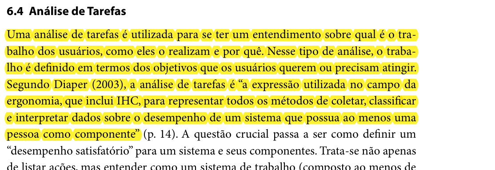
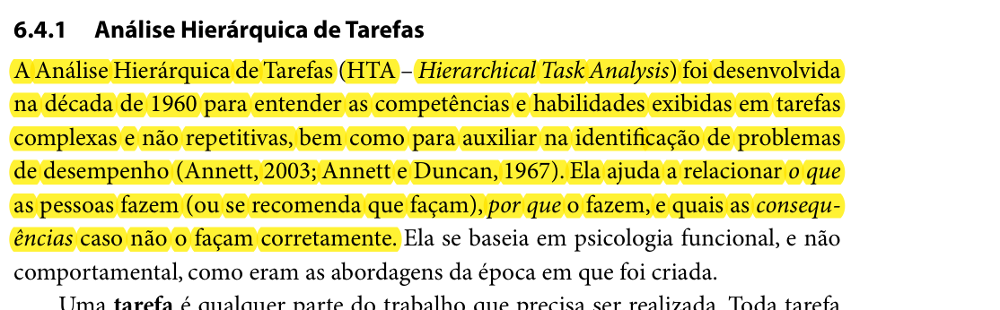
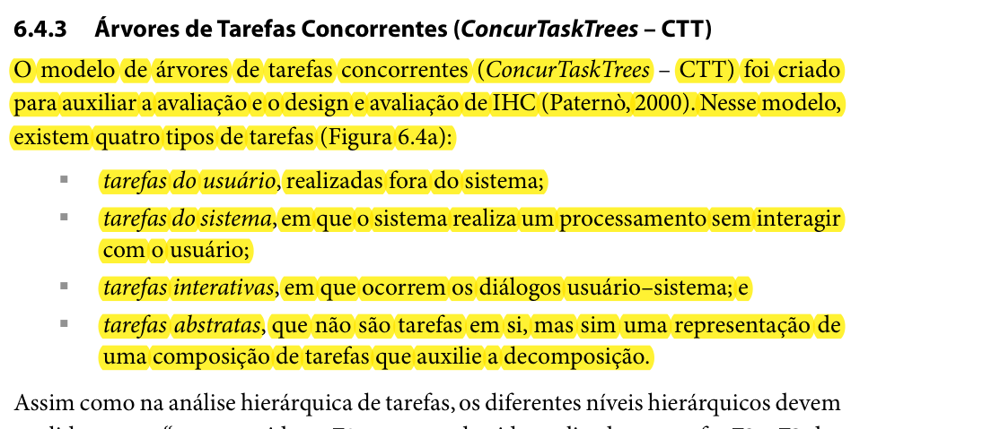

# Análise de tarefas

## Histórico de Versões

| Versão | Data | Descrição | Autor | Revisor |
| :---: | :---: | :--- | :---: | :---: |
| 1.0 | 25/09/2026 | Criação do documento de Análise de Tarefas | Heitor | |

## 1. Introdução

A **Análise de Tarefas** é uma etapa essencial na área de Interação Humano-Computador (IHC). Segundo Barbosa e Silva (2010):

> "Uma análise de tarefas é utilizada para se ter um entendimento sobre qual é o trabalho dos usuários, como eles o realizam e por quê. Nesse tipo de análise, o trabalho é definido em termos dos objetivos que os usuários querem ou precisam atingir. Segundo Diaper (2003), a análise de tarefas é 'a expressão utilizada no campo da ergonomia, que inclui IHC, para representar todos os métodos de coletar, classificar e interpretar dados sobre o desempenho de um sistema que possua ao menos uma pessoa como componente' (p. 14)."

O principal objetivo dessa análise é compreender as intenções e o contexto do usuário ao interagir com o sistema, decompondo suas ações para facilitar o mapeamento de requisitos e a tomada de decisões de design.

<figcaption>Figura 1: Definição de Análise de Tarefas. Fonte: Barbosa e Silva (2010, p. 191)</figcaption>

Para a condução deste processo, o projeto fará o uso das técnicas **HTA** e **CTT**.

### 1.1 Análise Hierárquica de Tarefas (HTA)

A técnica HTA (*Hierarchical Task Analysis*) busca mapear a estrutura hierárquica dos objetivos do usuário, detalhando passo a passo as ações e sub-objetivos necessários para alcançá-los. De acordo com a literatura base:

> "A Análise Hierárquica de Tarefas (HTA - *Hierarchical Task Analysis*) foi desenvolvida na década de 1960 para entender as competências e habilidades exibidas em tarefas complexas e não repetitivas, bem como para auxiliar na identificação de problemas de desempenho (Annett, 2003; Annett e Duncan, 1967). Ela ajuda a relacionar o que as pessoas fazem (ou se recomenda que façam), por que o fazem, e quais as consequências caso não o façam corretamente." (BARBOSA e SILVA, 2010).

<figcaption>Figura 2: Definição da Análise Hierárquica de Tarefas (HTA). Fonte: Barbosa e Silva (2010, p. 192)</figcaption>

### 1.2 ConcurTaskTrees (CTT)

A técnica CTT (*ConcurTaskTrees*) complementa a HTA, oferecendo um modelo visual que permite analisar a interface através das relações temporais e lógicas das tarefas. O CTT é utilizado para visualizar características como paralelismo, ordenação sequencial, escolha e exclusão mútua entre as tarefas executadas tanto pelo usuário quanto pelo sistema. Dessa forma, é possível simular e planejar a interação de forma mais dinâmica.

<figcaption>Figura 3: Representação da técnica ConcurTaskTrees (CTT). Fonte: Barbosa e Silva (2010, p. 203)</figcaption>

## 2. Referências

BARBOSA, S. D. J.; SILVA, B. S. Interação humano-computador. Rio de Janeiro: Elsevier, 2010.
