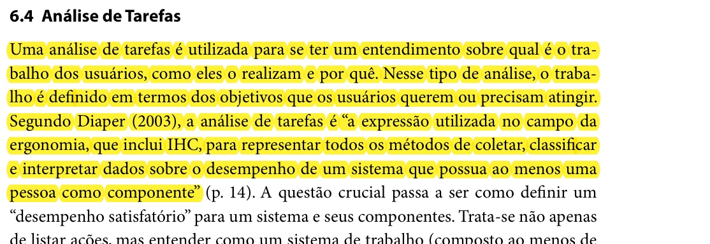
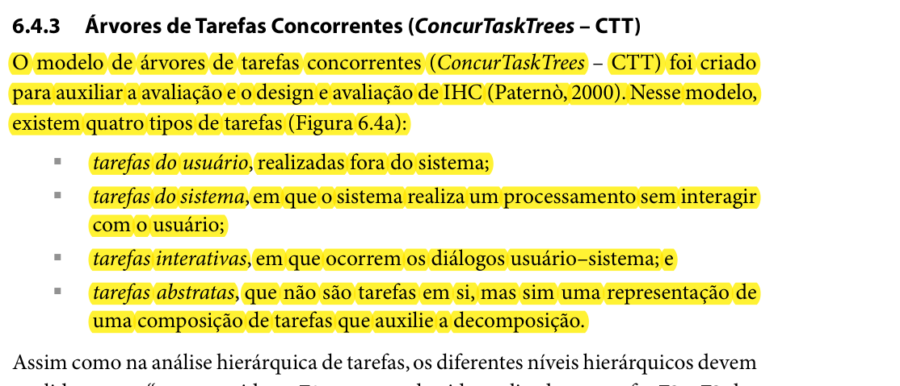

Responsável: Heitor Pinheiro Gonçalves das Chagas — Análise de tarefas — Autor do item: Heitor Pinheiro Gonçalves das Chagas

# Análise de tarefas

## Tabela de contribuição

A Tabela 1 registra quem atuou neste artefato.

| Integrante | Contribuição | Artefato / atividade |
| --- | --- | --- |
| [Heitor Pinheiro Gonçalves das Chagas](https://github.com/Heitorovski01) | Criação da página e fundamentação teórica de Análise de Tarefas | [Item de conteúdo](analise-tarefas.md#item-de-conteudo-da-disciplina) |
| [Heitor Pinheiro Gonçalves das Chagas](https://github.com/Heitorovski01) | Fundamentação e conceituação de HTA e CTT | [HTA e CTT](analise-tarefas.md#analise-hierarquica-de-tarefas-hta) |
| [Heitor Pinheiro Gonçalves das Chagas](https://github.com/Heitorovski01) | Estruturação da página e índice das análises do grupo | [Análises do grupo](analise-tarefas.md#analises-de-tarefas-do-grupo) |
| [Luís Henrique Luna de Arruda](https://github.com/Donnk61) | HTA e CTT da consulta à reunião da CCJ | [Análise individual](individual/luis/analise-tarefas.md) |
| ChatGPT (OpenAI GPT-4o) | Diagramas, organização de tabelas e estruturação do texto | [Agradecimentos](analise-tarefas.md#agradecimentos) |
| Codex (OpenAI) | Correções de consistência e rastreabilidade | [Agradecimentos](#agradecimentos) |

Tabela 1 — Contribuição neste artefato.

Fonte: elaboração do Grupo 06 (2026).

## Introdução

Esta página reúne as análises de tarefas desenvolvidas pelo Grupo 06 no escopo da Entrega 2. A análise de tarefas permite compreender em profundidade o trabalho das pessoas usuárias, decompondo suas ações, estratégias e objetivos para subsidiar a identificação de problemas de usabilidade no Portal do Senado Federal e direcionar futuras propostas de reprojeto. 

Cada integrante conduziu a modelagem da tarefa investigada na sessão empírica e narrada no respectivo [cenário](cenarios.md), empregando duas técnicas complementares amplamente consolidadas na literatura de IHC: a **Análise Hierárquica de Tarefas (HTA)** e a **Árvore de Tarefas Concorrentes (CTT)**.

## Item de conteúdo da disciplina

**Autor do item:** Heitor Pinheiro Gonçalves das Chagas

A **Análise de Tarefas** é uma etapa essencial na área de Interação Humano-Computador (IHC). Segundo Barbosa e Silva (2010):

> "Uma análise de tarefas é utilizada para se ter um entendimento sobre qual é o trabalho dos usuários, como eles o realizam e por quê. Nesse tipo de análise, o trabalho é definido em termos dos objetivos que os usuários querem ou precisam atingir. Segundo Diaper (2003), a análise de tarefas é 'a expressão utilizada no campo da ergonomia, que inclui IHC, para representar todos os métodos de coletar, classificar e interpretar dados sobre o desempenho de um sistema que possua ao menos uma pessoa como componente' (p. 14)."

O principal objetivo dessa análise é compreender as intenções e o contexto do usuário ao interagir com o sistema, decompondo suas ações para facilitar o mapeamento de requisitos e a tomada de decisões de design.

??? note "Figura 1 — Definição de Análise de Tarefas."

    
    
Figura 1 — Definição de Análise de Tarefas.

    
Fonte: Barbosa e Silva (2010, p. 191).

Para a condução deste processo, o projeto faz o uso articulado das técnicas **HTA** e **CTT**.

### Análise Hierárquica de Tarefas (HTA)

A técnica HTA (*Hierarchical Task Analysis*) busca mapear a estrutura hierárquica dos objetivos do usuário, detalhando passo a passo as ações e sub-objetivos necessários para alcançá-los. De acordo com a literatura base:

> "A Análise Hierárquica de Tarefas (HTA - *Hierarchical Task Analysis*) foi desenvolvida na década de 1960 para entender as competências e habilidades exibidas em tarefas complexas e não repetitivas, bem como para auxiliar na identificação de problemas de desempenho (Annett, 2003; Annett e Duncan, 1967). Ela ajuda a relacionar o que as pessoas fazem (ou se recomenda que façam), por que o fazem, e quais as consequências caso não o façam corretamente." (BARBOSA; SILVA, 2010, p. 192).

??? note "Figura 2 — Definição da Análise Hierárquica de Tarefas (HTA)."

    
    
Figura 2 — Definição da Análise Hierárquica de Tarefas (HTA).

    
Fonte: Barbosa e Silva (2010, p. 192).

### ConcurTaskTrees (CTT)

A técnica CTT (*ConcurTaskTrees*) complementa a HTA, oferecendo um modelo visual baseado na engenharia de software e na ergonomia cognitiva, que permite analisar a interface através das relações temporais e lógicas das tarefas (PATERNÒ, 2000). O CTT é utilizado para modelar características essenciais da interação contemporânea, como paralelismo, ordenação sequencial, escolha, desativação e interrupção entre as tarefas executadas tanto pelo usuário quanto pelo sistema.

??? note "Figura 3 — Representação da técnica ConcurTaskTrees (CTT)."

    
    
Figura 3 — Representação da técnica ConcurTaskTrees (CTT).

    
Fonte: Barbosa e Silva (2010, p. 203).

## Análises de tarefas do grupo

A Tabela 2 reúne as análises de tarefas individuais desenvolvidas pelos integrantes da equipe, detalhando o integrante responsável, a tarefa modelada, a persona associada e o link para a modelagem completa (contendo tabelas HTA, planos de execução e diagramas CTT).

| Integrante | Análise de Tarefas | Persona / Ator | Tarefa modelada |
| --- | --- | --- | --- |
| Bruno Ferreira Dornelas | [Busca por jornada de trabalho](individual/bruno/analise-tarefas.md) | [Lucas Mendes](individual/bruno/persona.md) | Acompanhar tramitação e detalhes de projeto de lei sobre jornada |
| Caio Breno de Souza Bezerra | [Levantamento de notícias para anuário](individual/caio/analise-tarefas.md) | [Renata Moreira](individual/caio/persona.md) | Filtrar e salvar notícias temáticas no portal |
| Heitor Pinheiro Gonçalves das Chagas | [Votação em consulta pública](individual/heitor/analise-tarefas.md) | [Letícia Oliveira](individual/heitor/persona.md) | Localizar matéria (PL 1215/2025) e votar no portal e-Cidadania |
| Israel Soares de Paiva | [Verificação de auditório](individual/israel/analise-tarefas.md) | [Marta Oliveira](individual/israel/persona.md) | Consultar disponibilidade de auditório para reserva |
| Luís Henrique Luna de Arruda | [Pauta e resultado de reunião da CCJ](individual/luis/analise-tarefas.md) | [Marina Alves](individual/luis/persona.md) | Consultar pauta e resultado de item deliberado em comissão |

Tabela 2 — Análises de tarefas do Grupo 06.

Fonte: elaboração do Grupo 06 (2026).

## Agradecimentos

Esta página contou com o auxílio do ChatGPT (OpenAI GPT-4o) na estruturação textual preliminar, formatação de tabelas e diagramação em Markdown. A revisão conceitual, a seleção dos trechos e figuras da literatura e a consolidação do índice do grupo são de inteira responsabilidade do autor, que permanece responsável pela publicação.

Nesta rodada, o Codex (OpenAI), sob orientação de Bruno Ferreira Dornelas, aplicou as correções descritas no histórico. Caio Breno de Souza Bezerra é o responsável designado pela revisão humana desta versão, ainda pendente. Os créditos anteriores foram preservados.

## Histórico de versão

| Versão | Data | Descrição | Autor(es) | Revisor(es) |
| :---: | :---: | --- | --- | --- |
| `0.1` | 25/09/2026 | Criação do documento, introdução e fundamentação teórica de HTA e CTT | [Heitor Pinheiro Gonçalves das Chagas](https://github.com/Heitorovski01) | [Caio Breno de Souza Bezerra](https://github.com/CaioBezerra-Dev) |
| `0.2` | 27/09/2026 | Adição de tabela de contribuição padronizada, índice das tarefas do grupo e padronização do histórico de versões | [Heitor Pinheiro Gonçalves das Chagas](https://github.com/Heitorovski01) | [Caio Breno de Souza Bezerra](https://github.com/CaioBezerra-Dev) |
| `0.3` | 27/09/2026 | Atualiza a análise da tarefa de Luís com os modelos validados pela transcrição | [Luís Henrique Luna de Arruda](https://github.com/Donnk61) | [Israel Soares de Paiva](https://github.com/IsraelSoares-25) |
| `0.4` | 03/10/2026 | Nomeia a ferramenta de IA nos agradecimentos e na tabela de contribuição | [Caio Breno de Souza Bezerra](https://github.com/CaioBezerra-Dev) | [Luís Henrique Luna de Arruda](https://github.com/Donnk61) |
| `1.0` | 05/10/2026 | Atualiza a referência da persona de P1 para Lucas Mendes e alinha a descrição da atividade | [Bruno Ferreira Dornelas](https://github.com/brunnf) | [Caio Breno de Souza Bezerra](https://github.com/CaioBezerra-Dev) |

## Referências

[1] BARBOSA, Simone Diniz Junqueira; SILVA, Bruno Santana da. Interação humano-computador. Rio de Janeiro: Elsevier, 2010.

[2] DIAPER, Dan. Understanding tasks for HCI: The task-oriented approach. In: DIAPER, Dan; STANTON, Neville (Ed.). The handbook of task analysis for human-computer interaction. Mahwah, NJ: Lawrence Erlbaum Associates, 2003.

[3] PATERNÒ, Fabio. Model-based design and evaluation of interactive applications. London: Springer, 2000.
