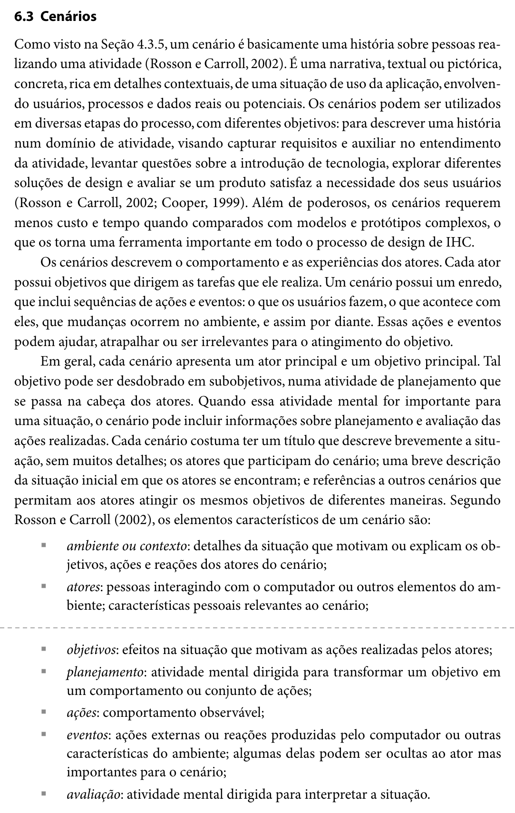

Responsável: Caio Breno de Souza Bezerra — Elaboração dos cenários · Autor do item: Caio Breno de Souza Bezerra

# Cenários

## Tabela de contribuição

A Tabela 1 registra quem atuou neste artefato.

| Integrante | Contribuição | Artefato / atividade |
| --- | --- | --- |
| [Caio Breno de Souza Bezerra](https://github.com/CaioBezerra-Dev) | Item de conteúdo sobre cenários | [Item de conteúdo](cenarios.md#item-de-conteudo-da-disciplina) |
| [Caio Breno de Souza Bezerra](https://github.com/CaioBezerra-Dev) | Estrutura comum e organização da página | [Estrutura](cenarios.md#estrutura-dos-cenarios) |
| [Caio Breno de Souza Bezerra](https://github.com/CaioBezerra-Dev) | Cenário de Renata Moreira | [Cenário](individual/caio/cenario.md) |
| [Bruno Ferreira Dornelas](https://github.com/brunnf) | Cenário de Mariana Costa | [Cenário](individual/bruno/cenario.md) |
| [Heitor Pinheiro Gonçalves das Chagas](https://github.com/Heitorovski01) | Cenário de Letícia Oliveira | [Cenário](individual/heitor/cenario.md) |
| [Israel Soares de Paiva](https://github.com/IsraelSoares-25) | Cenário de Marta Oliveira | [Cenário](individual/israel/cenario.md) |
| [Luís Henrique Luna de Arruda](https://github.com/Donnk61) | Cenário de Marina Alves | [Cenário](individual/luis/cenario.md) |

Tabela 1 — Contribuição neste artefato.

Fonte: elaboração do Grupo 06 (2026).

## Introdução

Esta página reúne os cenários do Grupo 06. Cada integrante escreveu um cenário com a própria persona como ator, contando como ela tenta, hoje, no Portal do Senado Federal, a tarefa acompanhada na observação. A página fixa a estrutura comum, para que os cinco cenários possam ser lidos e comparados juntos nas próximas etapas.

## Item de conteúdo da disciplina

**Autor do item:** Caio Breno de Souza Bezerra

Um cenário é "basicamente uma história sobre pessoas realizando uma atividade": uma narrativa, textual ou pictórica, concreta e rica em detalhes contextuais, de uma situação de uso que envolve usuários, processos e dados reais ou potenciais (ROSSON; CARROLL, 2002 apud BARBOSA; SILVA, 2010, p. 183). Os cenários servem para capturar requisitos, levantar questões sobre a introdução de tecnologia, explorar soluções de design e avaliar se um produto atende às necessidades dos usuários, com menos custo e tempo do que modelos e protótipos complexos (BARBOSA; SILVA, 2010, p. 183).

Em geral, cada cenário tem um ator principal e um objetivo principal, além de título, atores e uma breve descrição da situação inicial. Segundo Rosson e Carroll (2002 apud BARBOSA; SILVA, 2010, p. 183–184), os elementos de um cenário são: **ambiente ou contexto, atores, objetivos, planejamento, ações, eventos e avaliação**. A **Figura 1** reproduz esse trecho ([Apêndice A](cenarios.md#apendice-a-trecho-do-livro)).

Na atividade de análise, usam-se **cenários de análise**, também chamados de cenários de problema: histórias sobre o domínio de atividade do usuário tal como ele existe, antes da introdução de uma nova tecnologia (ROSSON; CARROLL, 2002 apud BARBOSA; SILVA, 2010, p. 184). Como o grupo avalia e reprojeta um portal que já está no ar, os cenários desta etapa contam como as pessoas fazem hoje, no portal atual, o que precisam fazer.

O título descreve a situação em poucas palavras, sem narrar o caminho inteiro (BARBOSA et al., 2021, p. 183). Num cenário de problema, essa situação é o ponto em que o portal atual falha ou exige esforço extra. Por isso o título aponta o que deu errado, e não só o nome da tarefa. "Pesquisar notícias" diria o objetivo. "Na busca por drone, notícias de 2013 aparecem entre as de 2026" diz a situação: Renata Moreira já achou a lista e não consegue separar o ano do anuário. A Tabela 3 traz o título, o ator e a situação inicial de cada cenário.

## Estrutura dos cenários

Todo cenário do grupo tem título, ator (a persona do integrante), situação inicial, narrativa, perguntas anotadas e análise dos problemas. A Tabela 2 mostra o que a narrativa precisa deixar claro em cada elemento, com base nas perguntas da Tabela 6.2 do livro.

| Elemento | O que a narrativa precisa deixar claro |
| --- | --- |
| Ambiente ou contexto | Quando, onde e por que a situação acontece; recursos disponíveis e pressões, como prazo |
| Atores | A persona e as características dela que ajudam ou atrapalham no objetivo |
| Objetivos | Por que a persona quer alcançar o objetivo e de que informações precisa |
| Planejamento | Como decide por onde começar e quais estratégias alternativas conhece |
| Ações | O que faz, em que ordem e com quais recursos |
| Eventos | Reações do portal e do ambiente, inclusive as que a persona não percebe |
| Avaliação | Como a persona sabe se uma ação deu certo e se o objetivo foi alcançado |

Tabela 2 — Elementos do cenário e o que a narrativa deve responder.

Fonte: elaboração do Grupo 06 (2026), adaptado de BARBOSA; SILVA (2010, p. 187–188).

Antes da narrativa, cada cenário lista, numeradas, as perguntas que pretende explorar. No texto, o número de cada pergunta aparece entre colchetes logo depois do trecho que a responde, como no Exemplo 6.5 do livro (BARBOSA; SILVA, 2010, p. 190). Depois da narrativa vem a lista dos pontos problemáticos que o reprojeto deve considerar, como no Exemplo 6.4 (BARBOSA; SILVA, 2010, p. 185). A tarefa narrada é a mesma que o integrante modela em HTA e CTT.

## Cenários do grupo

A Tabela 3 reúne os cinco cenários de problema, um por integrante.

| Integrante | Título do cenário | Ator | Situação inicial |
| --- | --- | --- | --- |
| Bruno Ferreira Dornelas | [O badge "Em tramitação" não diz se a lei já vale](individual/bruno/cenario.md) | [Mariana Costa](individual/bruno/persona.md) | No computador do escritório, depois de ler no WhatsApp sobre um projeto de jornada de trabalho, Mariana quer saber se a lei já vale |
| Caio Breno de Souza Bezerra | [Na busca por drone, notícias de 2013 aparecem entre as de 2026](individual/caio/cenario.md) | [Renata Moreira](individual/caio/persona.md) | Na semana em que a fonte é o Senado, Renata abre o portal para separar as notícias do ano que entram no anuário |
| Heitor Pinheiro Gonçalves das Chagas | [O projeto aparece na busca, mas o voto não aparece na página](individual/heitor/cenario.md) | [Letícia Oliveira](individual/heitor/persona.md) | No notebook, com a convocação do movimento para votar no PL 1215/2025, Letícia precisa achar a consulta e registrar o voto |
| Israel Soares de Paiva | [Marta desiste sem saber se o auditório está livre](individual/israel/cenario.md) | [Marta Oliveira](individual/israel/persona.md) | No computador, e não no celular de sempre, Marta tenta confirmar se o auditório está disponível numa data |
| Luís Henrique Luna de Arruda | [Marina erra o caminho até a reunião da CCJ](individual/luis/cenario.md) | [Marina Alves](individual/luis/persona.md) | Em casa, no computador, Marina precisa achar uma reunião já realizada da CCJ sem receber o endereço da página |

Tabela 3 — Cenários do Grupo 06.

Fonte: elaboração do Grupo 06 (2026), a partir dos cenários individuais. O título descreve a situação, no sentido de BARBOSA et al. (2021, p. 183).

## Agradecimentos

Esta página contou com o apoio de ferramenta de inteligência artificial generativa na estruturação, na redação preliminar e na formatação Markdown. A revisão do conteúdo, a conferência das citações no livro, a seleção do trecho da Figura 1 e o alinhamento dos títulos à situação de cada cenário são do autor, que segue responsável pelo que está publicado.

## Histórico de versão

| Versão | Data | Descrição | Autor(es) | Revisor(es) |
| :---: | :---: | --- | --- | --- |
| `0.1` | 21/09/2026 | Item de conteúdo sobre cenários, estrutura dos cenários e índice do grupo | [Caio Breno de Souza Bezerra](https://github.com/CaioBezerra-Dev) | [Bruno Ferreira Dornelas](https://github.com/brunnf) |
| `0.2` | 24/09/2026 | Inclui o cenário de Renata Moreira no índice do grupo | [Caio Breno de Souza Bezerra](https://github.com/CaioBezerra-Dev) | [Bruno Ferreira Dornelas](https://github.com/brunnf) |
| `0.3` | 27/09/2026 | Inclui o cenário de Marta Oliveira no índice do grupo | [Caio Breno de Souza Bezerra](https://github.com/CaioBezerra-Dev) | [Bruno Ferreira Dornelas](https://github.com/brunnf) |
| `0.4` | 27/09/2026 | Inclui o cenário de Letícia Oliveira no índice do grupo | [Heitor Pinheiro Gonçalves das Chagas](https://github.com/Heitorovski01) | [Caio Breno de Souza Bezerra](https://github.com/CaioBezerra-Dev) |
| `0.5` | 27/09/2026 | Inclui o cenário de Marina Alves | [Luís Henrique Luna de Arruda](https://github.com/Donnk61) | [Caio Breno de Souza Bezerra](https://github.com/CaioBezerra-Dev) |
| `0.6` | 27/09/2026 | Atualiza o cenário de Marina Alves com o percurso e o resultado relatados | [Luís Henrique Luna de Arruda](https://github.com/Donnk61) | [Caio Breno de Souza Bezerra](https://github.com/CaioBezerra-Dev) |
| `1.0` | 27/09/2026 | Alinha os títulos à situação de cada cenário, inclui a situação inicial e corrige o título desatualizado de Mariana Costa | [Caio Breno de Souza Bezerra](https://github.com/CaioBezerra-Dev) | [Bruno Ferreira Dornelas](https://github.com/brunnf) |
| `1.1` | 27/09/2026 | Confirma o cenário de Marina Alves com o percurso registrado na transcrição | [Luís Henrique Luna de Arruda](https://github.com/Donnk61) | [Caio Breno de Souza Bezerra](https://github.com/CaioBezerra-Dev) — revisão pendente |

## Referências

[1] BARBOSA, Simone Diniz Junqueira; SILVA, Bruno Santana da. Interação humano-computador. Rio de Janeiro: Elsevier, 2010.

[2] BARBOSA, Simone D. J.; SILVA, Bruno S. da; SILVEIRA, Milene S.; GASPARINI, Isabela; DARIN, Ticianne; BARBOSA, Gabriel D. J. Interação humano-computador e experiência do usuário. Autopublicação, 2021.

## Apêndice A — Trecho do livro

A figura citada no texto fica aqui, em um bloco que abre com um clique.

??? note "Figura 1 — Definição e elementos de um cenário"

    <figure markdown="span">
      
      <figcaption>Figura 1 — Definição e elementos de um cenário.</figcaption>
    </figure>
    
Fonte: BARBOSA; SILVA (2010, p. 183–184).

