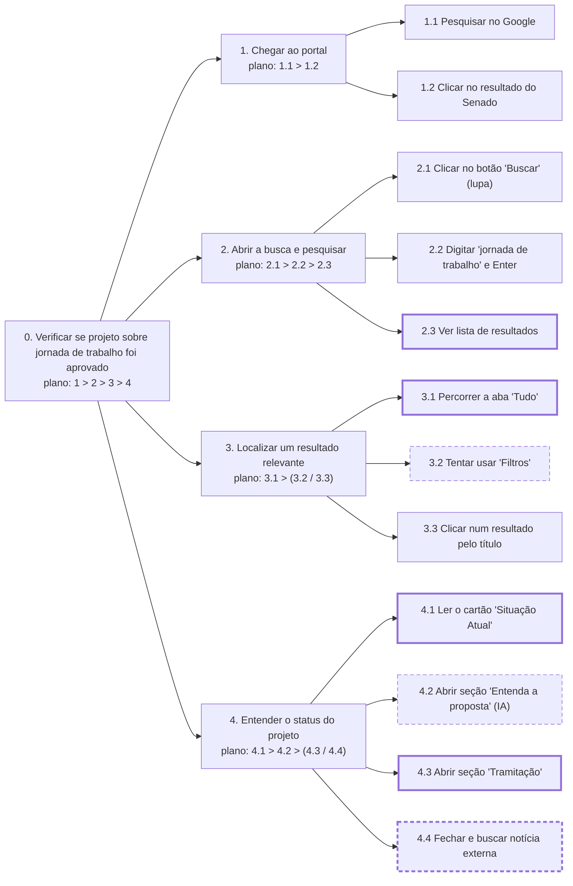
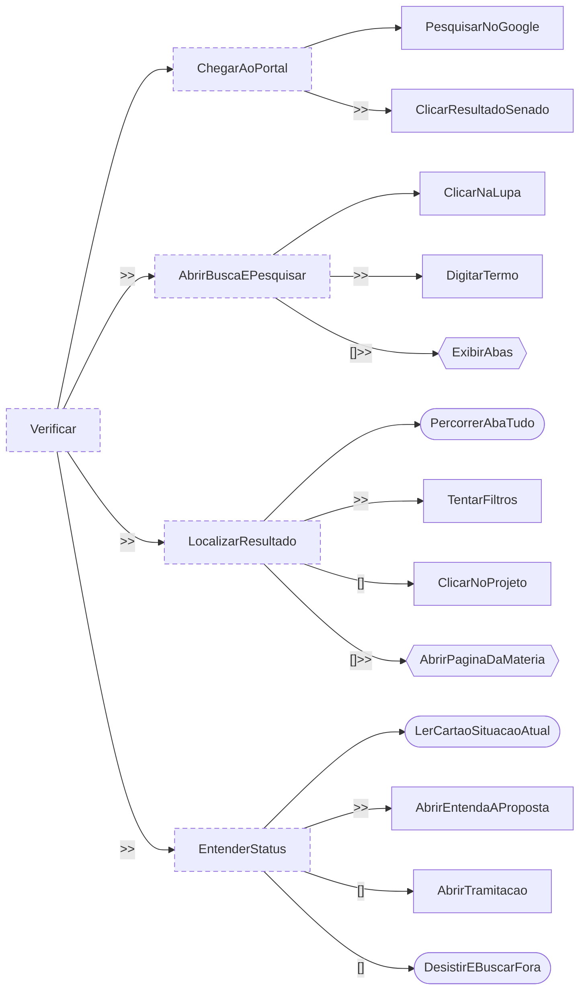

<span class="owner">Responsável: Bruno Ferreira Dornelas — Análise de tarefas</span>

# Análise de tarefas

## Tabela de contribuição

A Tabela 1 registra quem atuou neste artefato.

| Integrante | Contribuição | Artefato / atividade |
| --- | --- | --- |
| [Bruno Ferreira Dornelas](https://github.com/brunnf) | Definição da tarefa e dos objetivos da análise | [Tarefa analisada](analise-tarefas.md#tarefa-analisada) |
| [Bruno Ferreira Dornelas](https://github.com/brunnf) | HTA | [HTA](analise-tarefas.md#analise-hierarquica-de-tarefas-hta) |
| [Bruno Ferreira Dornelas](https://github.com/brunnf) | CTT | [CTT](analise-tarefas.md#arvore-de-tarefas-concorrentes-ctt) |

<p class="caption">Tabela 1 — Contribuição neste artefato.</p>
<p class="source">Fonte: elaboração do Grupo 06 (2026).</p>

## Introdução

Esta página modela a tarefa do [cenário](cenario.md) em duas técnicas: **Análise Hierárquica de Tarefas (HTA)** e **Árvore de Tarefas Concorrentes (CTT)**. As duas partem do perfil da [persona](persona.md) e do comportamento real do portal verificado na preparação da [sessão](entrevista-observacao.md). Quando se avalia um sistema existente, a análise de tarefas pode ser bem concreta e descrever o comportamento em detalhe (BARBOSA; SILVA, 2010, p. 191), que é o caso do Portal do Senado.

## Tarefa analisada

Diaper (2003 apud BARBOSA; SILVA, 2010, p. 195) recomenda começar definindo os objetivos da análise, qual evidência objetiva mostra que o objetivo foi atingido e quais são as consequências de não atingi-lo. A Tabela 2 registra essas definições.

| Campo | Registro |
| --- | --- |
| Objetivo do usuário | Saber se um projeto de lei sobre jornada de trabalho já foi aprovado e o que ele muda na prática |
| Usuário | [Mariana Costa](persona.md) |
| Sistema | Portal do Senado Federal, com foco na busca geral e na página de detalhes da matéria |
| Objetivo da análise | Identificar como o portal atual facilita ou dificulta que o cidadão leigo obtenha uma resposta sobre a vigência de uma lei, para embasar o reprojeto |
| Evidência de sucesso | Mariana sabe com clareza se o projeto foi aprovado ou não e entende o que muda para ela. No portal atual, essa evidência não foi obtida: ela saiu sem resposta conclusiva |
| Consequência da falha | Mariana recorre a portais jornalísticos externos e compartilha uma fonte não oficial; a informação pode estar desatualizada ou incorreta |
| Fonte dos dados | Perfil da participante levantado na entrevista e comportamento real do portal verificado pelo autor |

<p class="caption">Tabela 2 — Tarefa analisada e objetivos da análise.</p>
<p class="source">Fonte: elaboração do Grupo 06 (2026), com base em BARBOSA; SILVA (2010, p. 195).</p>

## Análise Hierárquica de Tarefas (HTA)

A HTA decompõe o objetivo principal em subobjetivos até chegar às **operações**, a unidade fundamental da técnica. Cada operação é descrita pelo que a dispara (*input*), pelas ações que a realizam e pela condição que indica sua conclusão (*feedback*). As relações entre os subobjetivos formam o **plano**, que pode ser uma sequência fixa, uma regra de seleção ou uma execução em paralelo (BARBOSA; SILVA, 2010, p. 193). A análise é apresentada em diagrama e em tabela, no formato da Figura 6.2 e da Tabela 6.3 do livro (BARBOSA; SILVA, 2010, p. 194–195). A Tabela 3 é a legenda da notação.

| Notação | Significado |
| --- | --- |
| `0`, `1`, `1.1`, `3.2.1` | Posição do objetivo na hierarquia; `0` é o objetivo principal |
| `plano: 1 > 2` | Plano em sequência: primeiro 1, depois 2 |
| `plano: 1 / 2` | Plano com regra de seleção: 1 ou 2, conforme a situação |
| `plano: 1 + 2` | Plano em paralelo: 1 e 2, em qualquer ordem ou ao mesmo tempo |
| `*` no plano | O trecho marcado se repete, para cada item da lista |
| Caixa com borda contínua | Passo observado ou verificado no portal |
| Caixa com borda tracejada | Passo relatado na entrevista ou esperado pelo perfil, não verificado diretamente |
| Caixa com borda grossa | Ponto em que há problema registrado na Tabela 4 |
| *input* · *feedback* | O que dispara a operação · o que indica que ela foi concluída |
| Problema · Recomendação | Dificuldade naquele ponto · mudança proposta para o reprojeto |

<p class="caption">Tabela 3 — Legenda da notação da HTA.</p>
<p class="source">Fonte: elaboração do Grupo 06 (2026), com base em BARBOSA; SILVA (2010, p. 193–195).</p>

A decomposição para quando a origem do problema já está identificada e já é possível propor uma correção (BARBOSA; SILVA, 2010, p. 195). Por isso o diagrama não desce ao clique e à tecla. A Figura 1 é o diagrama, com o plano de cada objetivo dentro da caixa, como na Figura 6.2 do livro. Para caber na página, a árvore está deitada: o objetivo principal fica à esquerda, e os subobjetivos, à direita. A Tabela 4 é o equivalente em tabela, no formato da Tabela 6.3: em cada linha, o objetivo, e na coluna ao lado o input, o feedback, o plano, o problema e a recomendação (p. 194–195).



<p class="caption">Figura 1 — HTA da consulta ao status de projeto de lei no Portal do Senado.</p>
<p class="source">Fonte: elaboração do Grupo 06 (2026), com base no comportamento real do portal e em BARBOSA; SILVA (2010, p. 194).</p>

| Objetivos / operações | Problemas e recomendações |
| --- | --- |
| 0. Verificar se projeto sobre jornada de trabalho foi aprovado `1 > 2 > 3 > 4` | input: mensagens no WhatsApp sobre o projeto. feedback: saber se a lei vale e o que muda. plano: chegar ao portal, buscar, localizar o projeto na lista e entender o status |
| 1. Chegar ao portal `1.1 > 1.2` | input: querer confirmar a informação na fonte oficial. feedback: página inicial do portal carregada. plano: pesquisar o Senado no Google e clicar no primeiro resultado institucional |
| 1.1 Pesquisar no Google | input: navegador aberto sem URL. feedback: lista de resultados no Google com o Senado em primeiro lugar. Verificado no portal |
| 1.2 Clicar no resultado do Senado | input: link do portal nos resultados do Google. feedback: página inicial (`senado.leg.br`) carregada. Verificado |
| 2. Abrir a busca e pesquisar `2.1 > 2.2 > 2.3` | input: página inicial aberta, campo de busca não visível. feedback: lista de resultados com abas carregada. plano: clicar na lupa para revelar o campo, digitar e ver os resultados |
| 2.1 Clicar no botão "Buscar" (lupa) | input: tela inicial sem campo de texto visível. feedback: overlay com o campo "Buscar" se expande no cabeçalho; instrução "Aperte o Enter para buscar ou Esc para fechar" aparece. Verificado. problema: o campo de busca não está exposto por padrão; exige um clique extra em quem não sabe que a lupa abre o campo. recomendação: exibir o campo de busca diretamente na página inicial |
| 2.2 Digitar "jornada de trabalho" e Enter | input: campo aberto. feedback: redireciona para `senado.leg.br/busca/?q=jornada+de+trabalho`. Verificado |
| 2.3 Ver lista de resultados | input: página de busca carregada. feedback: seis abas visíveis (Tudo, Notícias 5.736, Proposições 746, Senadores 16, Pronunciamentos 3.198, Legislação 1.142) e botões "Classificar por" e "Filtros". Verificado. problema: a aba padrão é "Tudo" e mistura notícias, proposições, pronunciamentos e legislação num único fluxo, sem separação visual de tipo. recomendação: destacar as proposições separadas das notícias na aba padrão |
| 3. Localizar um resultado relevante `3.1 > (3.2 / 3.3)` | input: lista da aba "Tudo". feedback: página do projeto aberta. plano: percorrer os resultados e então tentar filtrar ou clicar pelo título |
| 3.1 Percorrer a aba "Tudo" | input: lista com badges "Em tramitação" e códigos como "PL 5253/2026". feedback: item com título próximo do que se procura. Verificado. problema: os códigos (PL, PEC, PLP) não têm explicação; o cidadão não sabe o que cada sigla representa nem qual clicar. recomendação: incluir rótulo legível ao lado da sigla ("PL — Projeto de Lei") |
| 3.2 Tentar usar "Filtros" | input: botão "Filtros" visível. feedback: painel de filtros com campos como "fase da instrução" e "relator". Relatado pelo perfil; critérios verificados no portal. problema: os critérios de filtro exigem vocabulário regimental que o cidadão leigo não domina. recomendação: filtros em linguagem simples — "já aprovado", "em votação", "projeto de lei", "emenda" |
| 3.3 Clicar num resultado pelo título | input: título que parece corresponder ao assunto. feedback: página do projeto (`/web/atividade/materias/-/materia/...`) carregada. Verificado |
| 4. Entender o status do projeto `4.1 > 4.2 > (4.3 / 4.4)` | input: página da matéria aberta. feedback: resposta clara sobre aprovação. plano: ler o cartão de situação e então abrir os acordeões de explicação ou tramitação, ou desistir |
| 4.1 Ler o cartão "Situação Atual" | input: página carregada. feedback: badge "Em tramitação" (amarelo) + "Último estado: AGUARDANDO DESPACHO" + data. Verificado. problema: "Em tramitação" e "AGUARDANDO DESPACHO" são termos vagos; o usuário não sabe se o projeto está próximo da votação ou parado há meses. recomendação: substituir pelo estado legível no ciclo ("Na comissão — aguardando votação", "No plenário — pauta pendente") com uma barra de progresso das etapas |
| 4.2 Abrir seção "Entenda a proposta" (IA) | input: acordeão recolhido visível. feedback: texto em linguagem mais simples sobre o que o projeto propõe. Gerado por IA com aviso "revisão humana". Verificado. problema: descreve o texto inicial do projeto, não o estado atual; o usuário que espera saber se o projeto foi aprovado sai frustrado. recomendação: incluir na seção uma frase sobre o status atual ao lado do resumo do conteúdo |
| 4.3 Abrir seção "Tramitação" | input: acordeão "Tramitação" visível. feedback: tabela com código do órgão ("PLEN — Plenário do Senado Federal"), situação ("AGUARDANDO DESPACHO") e nota técnica ("Autuado o Projeto de Lei nº 5253/2026. O projeto vai à publicação."). Verificado. problema: o registro segue linguagem burocrática sem indicar onde o projeto está no ciclo total de aprovação. recomendação: linha do tempo visual com etapas rotuladas em linguagem cidadã |
| 4.4 Fechar e buscar notícia externa | input: não obter resposta conclusiva no portal. feedback: reportagem em portal jornalístico com resumo em linguagem comum. Relatado pelo perfil. problema: falha do canal oficial obriga o cidadão a sair do portal para encontrar a resposta. O link compartilhado não é a fonte primária |

<p class="caption">Tabela 4 — HTA da consulta ao status de projeto de lei, no formato da Tabela 6.3 do livro.</p>
<p class="source">Fonte: elaboração do Grupo 06 (2026), a partir do comportamento real do portal; formato de BARBOSA; SILVA (2010, p. 194–195).</p>

A Figura 1 e a Tabela 4 usam a numeração da Tabela 3. Os problemas se concentram em 4.1, 4.2 e 4.3: o portal apresenta o status do projeto em linguagem regimental sem indicar em que ponto do ciclo legislativo ele se encontra. É aí que o reprojeto tem mais efeito.

## Árvore de Tarefas Concorrentes (CTT)

A CTT também organiza as tarefas em hierarquia, mas distingue quem executa cada uma e explicita as relações temporais entre elas. Com isso, representa não só a análise da tarefa, mas também uma solução de interação (BARBOSA; SILVA, 2010, p. 203–205). A Tabela 5 é a legenda dos tipos de tarefa, e a Tabela 6, a dos operadores.

| Tipo de tarefa | Quem executa | Forma na Figura 3 |
| --- | --- | --- |
| Tarefa do usuário | O usuário, fora do sistema (por exemplo, decidir se o título de uma proposição é o que procura) | Caixa arredondada |
| Tarefa do sistema | O sistema, sem interagir com o usuário (por exemplo, devolver a lista de busca) | Hexágono |
| Tarefa interativa | Usuário e sistema em diálogo (por exemplo, digitar o termo e acionar a busca) | Retângulo |
| Tarefa abstrata | Nenhum dos dois diretamente: agrupa outras tarefas para organizar a decomposição | Retângulo tracejado |

<p class="caption">Tabela 5 — Tipos de tarefa da CTT.</p>
<p class="source">Fonte: elaboração do Grupo 06 (2026), com base em BARBOSA; SILVA (2010, p. 203).</p>

| Operador | Nome | Significado |
| :---: | --- | --- |
| `T1 >> T2` | Ativação | T2 só começa depois que T1 termina |
| `T1 []>> T2` | Ativação com passagem de informação | Além disso, T1 passa a T2 a informação que produziu |
| `T1 [] T2` | Escolha | Ao iniciar uma das tarefas, a outra fica desabilitada |
| `T1 \|\|\| T2` | Concorrência | As tarefas ocorrem em qualquer ordem ou ao mesmo tempo |
| `T1 \|[]\| T2` | Concorrência com comunicação | Além disso, as tarefas trocam informações |
| `T1 \|=\| T2` | Independência | Qualquer ordem, mas uma precisa terminar para a outra começar |
| `T1 [> T2` | Desativação | T1 é interrompida por completo por T2 |
| `T1 \|> T2` | Suspensão e retomada | T1 é interrompida por T2 e retomada de onde parou |
| `T*` | Iteração | T se repete; não está no livro, vem da notação original de Paternò (2000) |

<p class="caption">Tabela 6 — Operadores temporais da CTT.</p>
<p class="source">Fonte: elaboração do Grupo 06 (2026), com base em BARBOSA; SILVA (2010, p. 203–204) e PATERNÒ (2000).</p>

A Figura 2 escreve a mesma tarefa da HTA só com os operadores da Tabela 6. A decomposição é a mesma da Tabela 4, para que os dois modelos possam ser lidos lado a lado.

```text
Verificar =
    ChegarAoPortal >> AbrirBuscaEPesquisar >> LocalizarResultado >> EntenderStatus

ChegarAoPortal =
    PesquisarNoGoogle >> ClicarResultadoSenado

AbrirBuscaEPesquisar =
    ClicarNaLupa >> DigitarTermo []>> ExibirAbas

LocalizarResultado =
    PercorrerAbaTudo >> (TentarFiltros [] ClicarNoProjeto) []>> AbrirPaginaDaMateria

EntenderStatus =
    LerCartaoSituacaoAtual >> (AbrirEntendaAProposta [] AbrirTramitacao [] DesistirEBuscarFora)
```

<p class="caption">Figura 2 — CTT da consulta em notação textual.</p>
<p class="source">Fonte: elaboração do Grupo 06 (2026), com base no comportamento real do portal.</p>

A Tabela 7 diz o tipo de cada tarefa da Figura 2.

| Tarefa | Tipo | Quem executa |
| --- | --- | --- |
| Verificar, ChegarAoPortal, AbrirBuscaEPesquisar, LocalizarResultado, EntenderStatus | Abstrata | Agrupa as outras |
| PesquisarNoGoogle, ClicarResultadoSenado, ClicarNaLupa, DigitarTermo, ClicarNoProjeto, AbrirEntendaAProposta, AbrirTramitacao | Interativa | Ela age e o sistema responde |
| ExibirAbas, AbrirPaginaDaMateria | Do sistema | O portal devolve a lista de abas e carrega a página da matéria |
| PercorrerAbaTudo, LerCartaoSituacaoAtual | Do usuário | A persona lê e decide, sem acionar controles |
| TentarFiltros | Interativa | Ela abre o painel; o sistema exibe critérios regimentais |
| DesistirEBuscarFora | Do usuário | A persona, fora do portal, em buscador e jornal externo |

<p class="caption">Tabela 7 — Tipo de cada tarefa da CTT.</p>
<p class="source">Fonte: elaboração do Grupo 06 (2026), com base em BARBOSA; SILVA (2010, p. 203).</p>

`ClicarNaLupa >> DigitarTermo` capta o passo extra que o portal impõe antes de a persona começar a pesquisar. `PercorrerAbaTudo` é tarefa do usuário porque o portal não guia a leitura: ela percorre e decide o que parece relevante. `LerCartaoSituacaoAtual` é igualmente tarefa do usuário, porque o sistema exibe o cartão mas o significado de "AGUARDANDO DESPACHO" precisa ser interpretado por ela. `DesistirEBuscarFora` marca o ponto em que a tarefa no portal falha e a persona continua a busca fora do sistema.

A Figura 3 desenha a árvore, deitada para caber na página: a raiz fica à esquerda, e as filhas de cada tarefa, empilhadas à direita dela, na ordem de cima para baixo. Cada tarefa tem a forma do seu tipo, conforme a Tabela 5. O rótulo na ligação é o operador entre aquela tarefa e a irmã de cima; a primeira filha de cada tarefa não tem rótulo.



<p class="caption">Figura 3 — Árvore CTT da consulta ao Portal do Senado.</p>
<p class="source">Fonte: elaboração do Grupo 06 (2026), com base no comportamento real do portal; notação de BARBOSA; SILVA (2010, p. 203–204).</p>

## Agradecimentos

Esta página contou com o apoio de ferramenta de inteligência artificial generativa na estruturação, na redação preliminar e na formatação Markdown. A revisão do conteúdo, a verificação do comportamento real do portal e a conferência das referências no livro são do autor, que segue responsável pelo que está publicado.

## Histórico de versão

| Versão | Data | Descrição | Autor(es) | Revisor(es) |
| :---: | :---: | --- | --- | --- |
| `0.1` | 21/09/2026 | Tarefa analisada e legendas da HTA e da CTT | [Bruno Ferreira Dornelas](https://github.com/brunnf) | [Caio Breno de Souza Bezerra](https://github.com/CaioBezerra-Dev) |
| `1.0` | 26/09/2026 | HTA e CTT a partir do perfil da persona | [Bruno Ferreira Dornelas](https://github.com/brunnf) | [Caio Breno de Souza Bezerra](https://github.com/CaioBezerra-Dev) |

## Referências

[1] BARBOSA, Simone Diniz Junqueira; SILVA, Bruno Santana da. Interação humano-computador. Rio de Janeiro: Elsevier, 2010.

[2] PATERNÒ, Fabio. Model-based design and evaluation of interactive applications. London: Springer, 2000.
