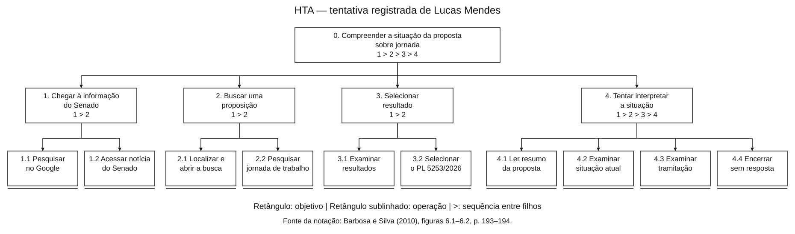
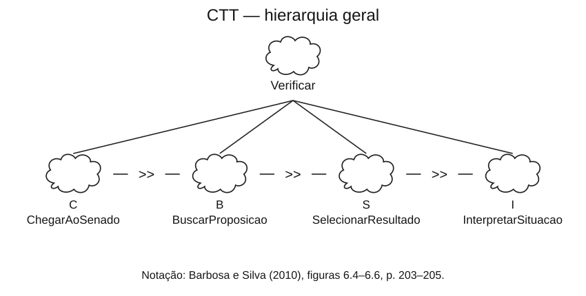
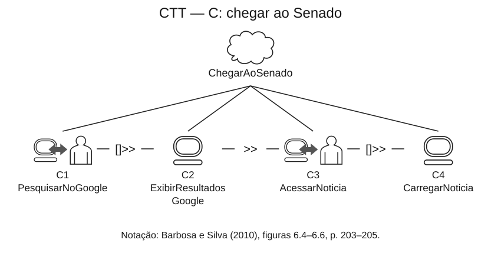
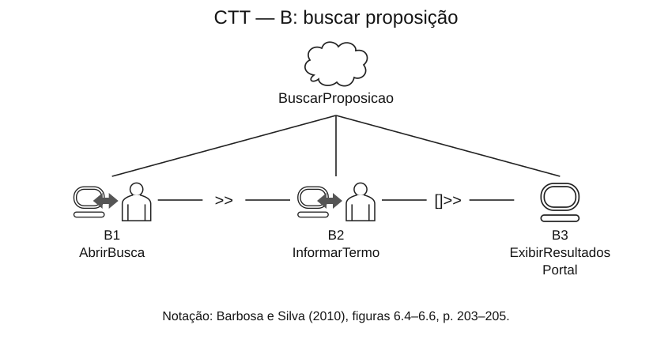
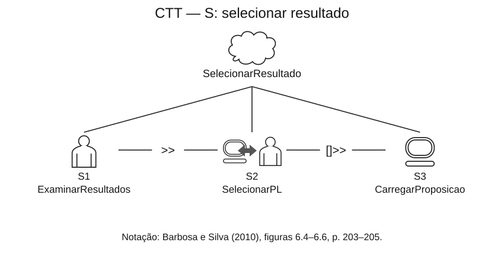
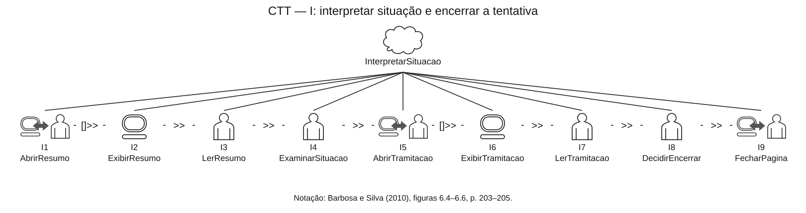

<span class="owner">Responsável: Bruno Ferreira Dornelas — Análise de tarefas</span>

# Análise de tarefas

## Tabela de contribuição

A Tabela 1 registra quem atuou neste artefato.

| Integrante | Contribuição | Artefato / atividade |
| --- | --- | --- |
| [Bruno Ferreira Dornelas](https://github.com/brunnf) | Definição da tarefa e dos objetivos da análise | [Tarefa analisada](analise-tarefas.md#tarefa-analisada) |
| [Bruno Ferreira Dornelas](https://github.com/brunnf) | HTA | [HTA](analise-tarefas.md#analise-hierarquica-de-tarefas-hta) |
| [Bruno Ferreira Dornelas](https://github.com/brunnf) | CTT | [CTT](analise-tarefas.md#arvore-de-tarefas-concorrentes-ctt) |
| ChatGPT (OpenAI GPT-4o) | Estruturação do texto, redação preliminar e formatação Markdown | [Agradecimentos](analise-tarefas.md#agradecimentos) |
| Codex (OpenAI) | Correções de consistência, rastreabilidade e diagramas | [Agradecimentos](#agradecimentos) |

<p class="caption">Tabela 1 — Contribuição neste artefato.</p>
<p class="source">Fonte: elaboração do Grupo 06 (2026).</p>

## Introdução

Esta página modela a tarefa do [cenário de Lucas Mendes](cenario.md), persona derivada de P1. A HTA e a CTT representam o percurso registrado na [Tabela 5 da sessão](entrevista-observacao.md#registro-da-observacao), realizada em 27/09/2026. A modelagem foi conferida com esse registro textual; esta revisão não representa uma nova sessão ou validação com o participante.

## Tarefa analisada

A Tabela 2 explicita objetivo, resultado e fonte da análise (BARBOSA; SILVA, 2010, p. 195).

| Campo | Registro |
| --- | --- |
| Objetivo do usuário | Compreender a situação da proposta sobre jornada 6×1 e seu possível impacto sobre familiares e colegas |
| Persona / participante de origem | [Lucas Mendes](persona.md) / P1 |
| Sistema | Senado Notícias, busca do portal e página de proposição; Google como ponto de entrada externo |
| Objetivo da análise | Identificar obstáculos à escolha da proposição correta e à interpretação de sua situação |
| Evidência de sucesso | Identificar a proposição pertinente e explicar sua situação sem confundir proposta, aprovação e vigência; P1 não alcançou essa condição |
| Resultado registrado | P1 escolheu o PL 5253/2026, não compreendeu a situação e encerrou a tentativa sem resposta. A correspondência desse PL com a PEC procurada não foi demonstrada |
| Alternativa relatada | Recorrer a notícia de outro veículo; compartilhamento externo não foi observado nesta tarefa |
| Fonte | Entrevista e Tabela 5 do registro da observação; não se atribuem a P1 caminhos apenas inspecionados pelo autor |

<p class="caption">Tabela 2 — Objetivo e limites da tarefa analisada.</p>
<p class="source">Fonte: sessão de P1 registrada pelo Grupo 06 (2026).</p>

## Análise Hierárquica de Tarefas (HTA)

A HTA organiza objetivos, subobjetivos, operações e planos. A referência é Barbosa e Silva (2010, p. 192–195). A árvore abaixo está orientada de cima para baixo. Os números indicam a hierarquia, e os planos indicam a sequência; as setas da árvore expressam decomposição, não fluxo temporal.

A notação segue a **Figura 6.1 (p. 193)** e o exemplo da **Figura 6.2 (p. 194)** de Barbosa e Silva: objetivos em retângulos, operações em retângulos com uma linha inferior e planos sequenciais indicados por `>`. Os números do plano referem-se aos filhos imediatos do objetivo: em 4, `1 > 2 > 3 > 4` corresponde a 4.1, 4.2, 4.3 e 4.4. A tabela de operações segue a **Tabela 6.3 (p. 194–195)**. O diagrama foi desenhado em SVG para conservar esses símbolos.

| Notação | Significado |
| --- | --- |
| `0`, `1`, `1.1` | Objetivo geral, subobjetivo e operação |
| `1 > 2 > 3 > 4` | Plano sequencial dos filhos imediatos do objetivo |
| Retângulo | Objetivo decomposto em subobjetivos |
| Retângulo com linha inferior | Operação: término da decomposição |
| Linha entre pai e filho | Decomposição hierárquica |
| *input* / *feedback* | Condição inicial e resposta percebida, inclusive quando insuficiente para atingir o objetivo |

<p class="caption">Tabela 3 — Legenda da representação da HTA.</p>
<p class="source">Fonte: BARBOSA; SILVA (2010, Figura 6.1, p. 193; Figura 6.2, p. 194).</p>

A origem dos passos e as dificuldades estão na Tabela 4. A tentativa registrada termina sem sucesso; executar as operações não significa alcançar o objetivo 0.

[](../../../assets/img/analise-tarefas/bruno/lucas-hta.svg)

<p class="caption">Figura 1 — HTA da tentativa registrada de P1.</p>
<p class="source">Fonte: Grupo 06, a partir da Tabela 5 da sessão; notação de BARBOSA; SILVA (2010, figuras 6.1–6.2, p. 193–194). Clique na imagem para ampliar.</p>

| Objetivo / operação | Input, feedback e origem | Problema / necessidade derivada |
| --- | --- | --- |
| 0. Compreender a situação | Input: dúvida sobre jornada 6×1. Feedback esperado: resposta compreensível sobre a proposição correta; não obtido | Distinguir documento escolhido, situação da proposta e eventual vigência da norma |
| 1. Chegar à informação do Senado | Plano 1.1 → 1.2 | A entrada real é pelo Senado Notícias |
| 1.1 Pesquisar no Google | Input: dúvida e endereço desconhecido. Ação: buscar “senado jornada de trabalho”. Feedback: resultados. Observação, passo 1 | Apoiar acesso por assunto |
| 1.2 Acessar notícia | Input: resultado institucional. Feedback: notícia do Senado aberta. Observação, passo 2 | Manter contexto na passagem da notícia para a proposição |
| 2. Buscar uma proposição | Plano 2.1 → 2.2 | Descoberta do mecanismo de busca |
| 2.1 Localizar e abrir busca | Input: notícia aberta. Feedback: campo de busca acessível. Observação, passo 3, com hesitação | Tornar a busca identificável |
| 2.2 Pesquisar assunto | Input: campo aberto. Ação: pesquisar “jornada de trabalho”. Feedback: lista de resultados. Observação, passo 4 | Apresentar resultados compreensíveis por tipo |
| 3. Selecionar resultado | Plano 3.1 → 3.2 | Dificuldade de reconhecer a proposição pertinente |
| 3.1 Examinar resultados | Input: lista. Feedback: candidato julgado relevante. Observação, passo 4, com hesitação | Explicar os tipos de documento e distinguir notícia de proposição |
| 3.2 Selecionar PL | Input: resultado escolhido. Feedback: página do PL 5253/2026. Observação, passo 5 | Seleção observada não comprova correspondência à PEC desejada |
| 4. Tentar interpretar situação | Plano 4.1 → 4.2 → 4.3 → 4.4, conforme a tentativa registrada | A sequência termina em abandono |
| 4.1 Ler resumo | Input: página da proposição. Feedback: conteúdo da proposta, sem resposta sobre seu estado atual. Observação, passo 6 | Distinguir conteúdo e situação atual |
| 4.2 Examinar situação atual | Input: busca por situação. Feedback: “AGUARDANDO DESPACHO”, não compreendido. Observação, passo 7 | Explicar o significado do estado em linguagem acessível |
| 4.3 Examinar tramitação | Input: dúvida persistente. Feedback: histórico não compreendido. Observação, passo 8 | Tornar o histórico interpretável para iniciantes |
| 4.4 Encerrar sem resposta | Input: informação insuficiente para o participante. Feedback: fim da tentativa. Observação, passo 9 | Registrar a falha sem pressupor que a notícia externa foi acessada |

<p class="caption">Tabela 4 — Operações, evidências e necessidades da HTA.</p>
<p class="source">Fonte: registro da observação de P1. As necessidades são interpretações de design, ainda não avaliadas.</p>

## Árvore de Tarefas Concorrentes (CTT)

A CTT distingue tarefas abstratas, do usuário, interativas e do sistema, relacionando-as temporalmente (BARBOSA; SILVA, 2010, p. 203–205). A modelagem cobre a mesma tentativa da HTA. Respostas de carregamento do sistema são explicitadas para representar a interação; não constituem medições adicionais.

A **Figura 6.4 (p. 203)** fundamenta os quatro tipos de tarefa e seus símbolos: pessoa, computador, pessoa conectada ao computador e nuvem. A **Figura 6.5 (p. 204)** define as relações temporais; a **Figura 6.6 (p. 205)** exemplifica sua disposição entre tarefas irmãs. Os símbolos foram redesenhados em SVG conforme essas figuras, com os operadores nas ligações horizontais. As ligações do pai aos filhos representam decomposição hierárquica.

| Tipo / símbolo do livro | Significado |
| --- | --- |
| Abstrata / nuvem | Agrupa subtarefas |
| Usuário / pessoa | Leitura, interpretação ou decisão |
| Interativa / pessoa conectada ao computador | Ação do usuário sobre a interface |
| Sistema / computador | Resposta da aplicação |

<p class="caption">Tabela 5 — Tipos de tarefa e símbolos da CTT.</p>
<p class="source">Fonte: BARBOSA; SILVA (2010, Figura 6.4, p. 203).</p>

| Operador | Significado |
| --- | --- |
| `T1 >> T2` | T2 é habilitada após o término de T1 |
| `T1 []>> T2` | Habilitação com passagem de informação de T1 para T2 |

<p class="caption">Tabela 6 — Operadores utilizados nesta CTT.</p>
<p class="source">Fonte: BARBOSA; SILVA (2010, p. 203–204).</p>

```text
Verificar = ChegarAoSenado >> BuscarProposicao >> SelecionarResultado >> InterpretarSituacao
ChegarAoSenado = PesquisarNoGoogle []>> ExibirResultadosGoogle >> AcessarNoticia []>> CarregarNoticia
BuscarProposicao = AbrirBusca >> InformarTermo []>> ExibirResultadosPortal
SelecionarResultado = ExaminarResultados >> SelecionarPL []>> CarregarProposicao
InterpretarSituacao = AbrirResumo []>> ExibirResumo >> LerResumo >> ExaminarSituacao >> AbrirTramitacao []>> ExibirTramitacao >> LerTramitacao >> DecidirEncerrar >> FecharPagina
```

<p class="caption">Figura 2 — CTT textual da tentativa de P1.</p>
<p class="source">Fonte: elaboração a partir do registro da sessão.</p>

| Tarefas | Tipo | Correspondência na HTA |
| --- | --- | --- |
| Verificar, ChegarAoSenado, BuscarProposicao, SelecionarResultado, InterpretarSituacao | Abstrata | 0, 1, 2, 3 e 4 |
| PesquisarNoGoogle, AcessarNoticia | Interativa | 1.1 e 1.2 |
| AbrirBusca, InformarTermo | Interativa | 2.1 e 2.2 |
| ExaminarResultados | Usuário | 3.1 |
| SelecionarPL | Interativa | 3.2 |
| AbrirResumo, AbrirTramitacao, FecharPagina | Interativa | 4.1, 4.3 e 4.4 |
| LerResumo, ExaminarSituacao, LerTramitacao, DecidirEncerrar | Usuário | 4.1, 4.2, 4.3 e 4.4 |
| ExibirResultadosGoogle, CarregarNoticia, ExibirResultadosPortal, CarregarProposicao, ExibirResumo, ExibirTramitacao | Sistema | Respostas às operações correspondentes |

<p class="caption">Tabela 7 — Tipos das tarefas e correspondência com a HTA.</p>
<p class="source">Fonte: elaboração do Grupo 06 a partir da sessão.</p>

A Figura 3 apresenta a CTT em uma visão geral e quatro detalhamentos. C, B, S e I identificam as mesmas tarefas abstratas nas diferentes imagens; a divisão permite ler os rótulos sem alterar a árvore. Os identificadores C1–I9 correspondem à expressão textual da Figura 2. As relações temporais estão entre tarefas irmãs, como no livro. A sequência descreve a tentativa registrada, sem excluir outros percursos possíveis no portal. Clique nas imagens para ampliar.

[](../../../assets/img/analise-tarefas/bruno/lucas-ctt-geral.svg)

<p class="caption">Figura 3a — Hierarquia geral.</p>

[](../../../assets/img/analise-tarefas/bruno/lucas-ctt-chegar.svg)

<p class="caption">Figura 3b — Chegar ao Senado (C).</p>

[](../../../assets/img/analise-tarefas/bruno/lucas-ctt-buscar.svg)

<p class="caption">Figura 3c — Buscar proposição (B).</p>

[](../../../assets/img/analise-tarefas/bruno/lucas-ctt-selecionar.svg)

<p class="caption">Figura 3d — Selecionar resultado (S).</p>

[](../../../assets/img/analise-tarefas/bruno/lucas-ctt-interpretar.svg)

<p class="caption">Figura 3e — Interpretar situação (I).</p>

<p class="source">Fonte: tarefas da sessão de P1; símbolos e relações de BARBOSA; SILVA (2010, figuras 6.4–6.6, p. 203–205), redesenhados em SVG.</p>

## Agradecimentos

Esta página contou com o apoio do ChatGPT (OpenAI GPT-4o) na estruturação, na redação preliminar e na formatação Markdown. A revisão do conteúdo, a verificação do comportamento real do portal e a conferência das referências no livro são do autor, que segue responsável pelo que está publicado.


## Histórico de versão

| Versão | Data | Descrição | Autor(es) | Revisor(es) |
| :---: | :---: | --- | --- | --- |
| `0.1` | 21/09/2026 | Tarefa analisada e legendas da HTA e da CTT | [Bruno Ferreira Dornelas](https://github.com/brunnf) | [Caio Breno de Souza Bezerra](https://github.com/CaioBezerra-Dev) |
| `1.0` | 26/09/2026 | HTA e CTT a partir do perfil da persona | [Bruno Ferreira Dornelas](https://github.com/brunnf) | [Caio Breno de Souza Bezerra](https://github.com/CaioBezerra-Dev) |
| `1.1` | 03/10/2026 | Nomeia a ferramenta de IA nos agradecimentos e na tabela de contribuição | [Caio Breno de Souza Bezerra](https://github.com/CaioBezerra-Dev) | [Luís Henrique Luna de Arruda](https://github.com/Donnk61) |
| `1.2` | 05/10/2026 | Alinha HTA e CTT à sequência registrada de P1, explicita origem das operações e convenções gráficas | [Bruno Ferreira Dornelas](https://github.com/brunnf) | [Caio Breno de Souza Bezerra](https://github.com/CaioBezerra-Dev) |
| `1.3` | 05/10/2026 | Substitui diagramas adaptados por SVGs com símbolos de HTA e CTT apresentados no livro e atualiza legendas e referências | [Bruno Ferreira Dornelas](https://github.com/brunnf) | [Caio Breno de Souza Bezerra](https://github.com/CaioBezerra-Dev) |


## Referências

[1] BARBOSA, Simone Diniz Junqueira; SILVA, Bruno Santana da. Interação humano-computador. Rio de Janeiro: Elsevier, 2010.

[2] PATERNÒ, Fabio. Model-based design and evaluation of interactive applications. London: Springer, 2000.
