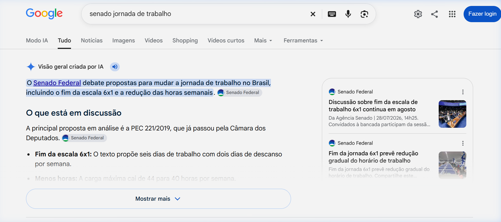
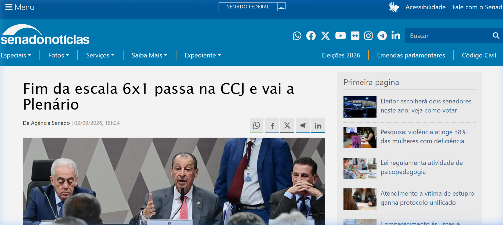
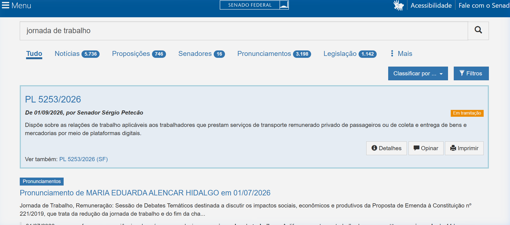
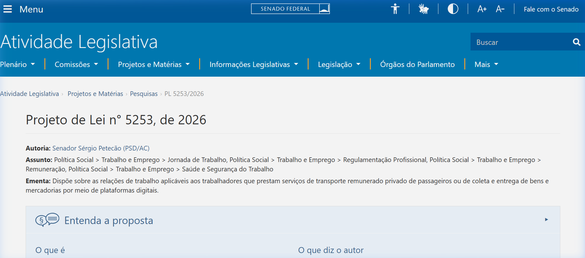
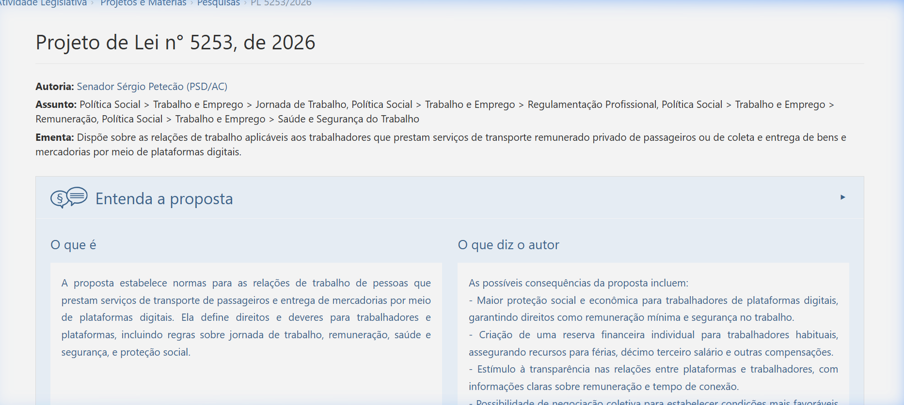
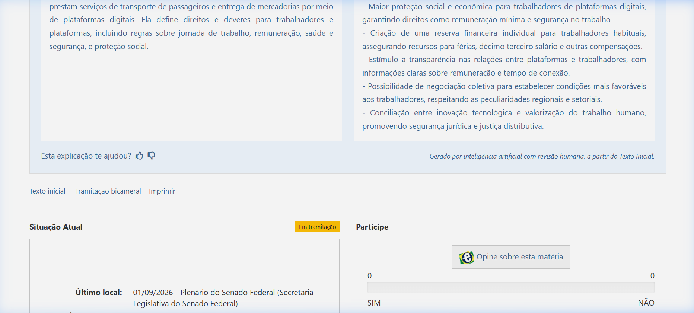
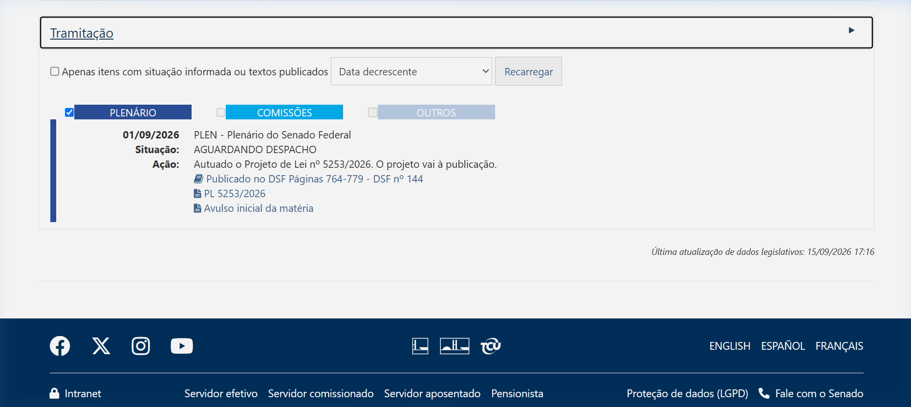

Responsável: Bruno Ferreira Dornelas — Entrevista e observação

# Entrevista e observação

## Tabela de contribuição

A Tabela 1 registra quem atuou neste artefato.

| Integrante | Contribuição | Artefato / atividade |
| --- | --- | --- |
| [Bruno Ferreira Dornelas](https://github.com/brunnf) | Recrutamento e caracterização do participante | [Participante](entrevista-observacao.md#participante) |
| [Bruno Ferreira Dornelas](https://github.com/brunnf) | Planejamento da sessão | [Planejamento](entrevista-observacao.md#planejamento-da-sessao) |
| [Bruno Ferreira Dornelas](https://github.com/brunnf) | Roteiro da entrevista | [Roteiro](entrevista-observacao.md#roteiro-da-entrevista) |
| [Bruno Ferreira Dornelas](https://github.com/brunnf) | Protocolo de observação | [Observação](entrevista-observacao.md#protocolo-de-observacao) |
| [Bruno Ferreira Dornelas](https://github.com/brunnf) | Síntese da entrevista e registro da observação | [Resultados](entrevista-observacao.md#resultados) |
| [Bruno Ferreira Dornelas](https://github.com/brunnf) | Atributos do participante para o perfil do usuário | [Atributos](entrevista-observacao.md#atributos-para-o-perfil-do-usuario) |
| [Bruno Ferreira Dornelas](https://github.com/brunnf) | Publicação das gravações da entrevista e da observação | [Gravações](entrevista-observacao.md#gravacoes) |
| ChatGPT (OpenAI GPT-4o) | Estruturação do texto, redação preliminar e formatação Markdown | [Agradecimentos](entrevista-observacao.md#agradecimentos) |

Tabela 1 — Contribuição neste artefato.

Fonte: elaboração do Grupo 06 (2026).

## Introdução

Esta página documenta a sessão de coleta de dados conduzida por Bruno Ferreira com uma pessoa usuária do Portal do Senado Federal. A sessão aplica as duas [técnicas de coleta](../../tecnicas-coleta.md) adotadas pelo grupo, a entrevista semiestruturada e a observação da tarefa, e segue os [aspectos éticos](../../etica.md) definidos para a etapa. Os dados coletados alimentam a [persona](persona.md), o [cenário](cenario.md) e a [análise de tarefas](analise-tarefas.md) desta seção, além do [perfil do usuário](../../perfil-usuario.md) do grupo.

## Participante

A Tabela 2 caracteriza o participante sem identificá-lo.

| Campo | Registro |
| --- | --- |
| Perfil de usuário | Cidadão leigo — acessa o portal esporadicamente para buscar informações sobre projetos de lei que afetam seu cotidiano ou o de pessoas próximas. O perfil previsto se confirmou na sessão |
| Descrição | 22 anos, homem, caixa de supermercado (turno tarde/noite), graduação em Ciências Econômicas em andamento (turno manhã) |
| Tarefa de interesse | Verificar a situação atual da PEC da jornada 6×1 e entender o que a proposta significa, motivado pelo impacto sobre seu núcleo familiar e colegas de trabalho |
| Recrutamento | Por conveniência, na rede de contatos do entrevistador |
| Data, local e duração | 27/09/2026, presencialmente. Entrevista: ~18 min; observação: ~5 min |

Tabela 2 — Caracterização do participante.

Fonte: elaboração do Grupo 06 (2026).

Nome e cargo exatos não são divulgados, porque qualquer um deles permitiria identificar o participante (BARBOSA; SILVA, 2010, p. 140).

## Planejamento da sessão

Definir os objetivos é o primeiro passo de uma coleta de dados, porque são eles que determinam o que coletar e com qual técnica (BARBOSA; SILVA, 2010, p. 133). Os objetivos desta sessão são:

1. levantar os atributos do participante para o perfil do usuário do grupo;
2. entender por que, quando e como ele acessa o Portal do Senado;
3. observar a tarefa real no portal, para embasar o cenário e a análise de tarefas;
4. identificar dificuldades, contornos e expectativas em relação ao portal.

A Tabela 3 mostra a estrutura da sessão, o que cada parte produz e o tempo previsto.

| Parte | Atividade | Duração prevista | Duração real | Alimenta |
| :---: | --- | :---: | :---: | --- |
| — | Abertura: TCLE e permissão de gravação | 5 min | — | Aspectos éticos |
| 1 | Entrevista semiestruturada | 20 min | ~18 min | Perfil, persona e cenário |
| 2 | Observação da tarefa, com relato em voz alta | 15 min | ~5 min | Cenário, HTA e CTT |
| 3 | Validação da persona com o participante | 10 min | — | Persona |

Tabela 3 — Estrutura da sessão.

Fonte: elaboração do Grupo 06 (2026).

A sessão foi presencial, com o participante usando o dispositivo e o navegador habituais. A sessão foi gravada em vídeo, com autorização, e as gravações estão em [Gravações](entrevista-observacao.md#gravacoes).

## Cuidados éticos

- O TCLE é apresentado antes da sessão, e o participante e o entrevistador ficam cada um com uma via assinada (BARBOSA; SILVA, 2010, p. 141).
- A permissão para gravar é pedida **antes** de a gravação começar (BARBOSA; SILVA, 2010, p. 140).
- O TCLE descreve a gravação em vídeo, a publicação como não listado no YouTube e nesta página, e o risco de a voz ser reconhecida, e dá ao participante a opção de recusar a publicação.
- Nenhuma informação interna ou sigilosa do trabalho do participante é coletada.
- O participante pode pular perguntas, pedir pausa ou encerrar a sessão a qualquer momento, sem prejuízo.
- O participante vê como seus dados foram usados antes da publicação, na validação da persona (BARBOSA; SILVA, 2010, p. 140).

## Roteiro da entrevista

A entrevista é **semiestruturada**: o roteiro traz perguntas abertas em ordem lógica, e o entrevistador pode aprofundar respostas e mudar a ordem dos tópicos, sem perder o foco nos objetivos (BARBOSA; SILVA, 2010, p. 146). A Tabela 4 apresenta as perguntas e o atributo que cada uma investiga.

| # | Bloco | Pergunta | Atributo investigado |
| :---: | --- | --- | --- |
| 1 | Sobre você | Qual é a sua faixa de idade e a sua formação? | Dados demográficos; educação |
| 2 | Sobre você | O que você faz no trabalho, de forma geral? Há quanto tempo? | Experiência no cargo |
| 3 | Sobre você | Em que tipo de empresa você trabalha? Qual o tamanho? | Informações sobre a empresa |
| 4 | Sobre você | De 1 a 5, quanto você se vira sozinho com computador e sites? | Experiência com computadores |
| 5 | Sobre você | Quando aparece algo novo no computador, como você prefere aprender? | Atitudes; estilo de aprendizado |
| 6 | Site do Senado | Quando foi a última vez que você entrou no site do Senado? Para quê? | Experiência com o produto |
| 7 | Site do Senado | Com que frequência você usa o site? Como costuma chegar a ele? | Frequência de uso; tecnologia disponível |
| 8 | Site do Senado | O que você acha do site? O que mais gosta e o que menos gosta? | Atitudes; opinião sobre o produto |
| 9 | Site do Senado | Quando aparece uma sigla que você não conhece (PEC, PL, MPV…), o que você faz? | Conhecimento do domínio; jargão |
| 10 | Contexto | O que te levou a buscar sobre a PEC 6×1? Como você ficou sabendo? | Motivação; objetivos |
| 11 | Contexto | O que você esperava encontrar no site do Senado quando foi buscar? | Objetivos; expectativas |
| 12 | Contexto | Conseguiu encontrar o que procurava? Me conta o que você fez no site. | Tarefas; incidente crítico |
| 13 | Contexto | O que foi fácil? O que foi difícil ou te frustrou? | Problemas; atitudes |
| 14 | Contexto | Se você não achasse o que buscava, o que faria? Já desistiu do site alguma vez? | Problemas e contornos |
| 15 | Fechamento | Se pudesse mudar uma coisa no site, o que seria? | Necessidades e expectativas |

Tabela 4 — Roteiro da entrevista semiestruturada.

Fonte: elaboração do Grupo 06 (2026), com base em BARBOSA; SILVA (2010, p. 134–135, 146–148).

As perguntas evitam induzir respostas: o roteiro usa formas neutras, não pressupõe opinião nem leva o entrevistado a dizer o que acha que o entrevistador quer ouvir (BARBOSA; SILVA, 2010, p. 147).

## Protocolo de observação

Depois da entrevista, o participante executa a tarefa real no portal enquanto o entrevistador observa. A investigação contextual parte da ideia de que boa parte do trabalho não é bem descrita por quem o pratica, e por isso é preciso ver o trabalho acontecer (BARBOSA; SILVA, 2010, p. 166).

- **Preparação:** o participante usa o dispositivo e o navegador habituais e começa de uma aba em branco.
- **Instrução:** *"Imagine que você quer verificar o que está acontecendo com a PEC da jornada 6×1 — se foi aprovada, onde está na tramitação, o que muda na prática. Faça do jeito que faria normalmente e vá falando em voz alta o que está pensando. Eu não vou ajudar, só observar e anotar."*
- **Postura do observador:** não ajuda nem aponta caminhos. Se ele perguntar algo, a resposta é *"Como você faria se eu não estivesse aqui?"*; se ficar em silêncio, a pergunta é *"O que você está pensando agora?"*.
- **Encerramento:** quando o participante declara que encontrou o que buscava, ou em cerca de 10 minutos.
- **Registro:** para cada passo, o que ele fez, em que tela, o que disse, se hesitou, errou ou voltou, e o tempo.
- **Depois da tarefa:** *"O que foi mais fácil? E o mais difícil?"* e *"É assim que você faria normalmente?"*.

Cada passo registrado vira uma operação da HTA e uma tarefa da CTT na [análise de tarefas](analise-tarefas.md).

## Resultados

A sessão aconteceu em 27/09/2026, presencialmente. A entrevista durou cerca de 18 minutos e a observação, cerca de 5. O participante usou o computador pessoal. A permissão para gravar foi pedida e dada antes de a gravação começar.

### Gravações

Categoria no YouTube: **não listado**. Data: 27/09/2026. O trecho em que o participante diz o nome foi retirado.

- Entrevista: https://www.youtube.com/watch?v=Yxcm3ENSHMA

??? note "Vídeo 1 — Entrevista semiestruturada"

    

      <iframe
        loading="lazy"
        style="position: absolute; top: 0; left: 0; width: 100%; height: 100%; border: 0;"
        src="https://www.youtube-nocookie.com/embed/Yxcm3ENSHMA"
        title="Entrevista semiestruturada da sessão de coleta"
        allow="accelerometer; autoplay; clipboard-write; encrypted-media; gyroscope; picture-in-picture; web-share"
        referrerpolicy="strict-origin-when-cross-origin"
        allowfullscreen>
      </iframe>
    

    
Vídeo 1 — Entrevista semiestruturada.

    
Fonte: sessão de 27/09/2026.

### Síntese da entrevista

Ele se avalia em 4, numa escala de 1 a 5, com computador e sites. Usa computador no dia a dia para estudar, redes sociais e pesquisas. Quando aparece algo novo, tenta sozinho primeiro; se não funcionar, procura um vídeo rápido no YouTube. Sigla desconhecida vai para o Google.

A última visita ao portal foi cerca de três meses antes, motivada pela discussão sobre a PEC da jornada 6×1 que circulava no WhatsApp da família. Colegas de trabalho e familiares trabalham em regime que seria afetado pela proposta; ele quis confirmar na fonte oficial antes de opinar no grupo. Não digitou o endereço do Senado; pesquisou no Google com o termo “senado jornada de trabalho” e o primeiro resultado institucional foi uma matéria do Senado Notícias, não a página inicial do portal. A partir da matéria, usou a lupa do cabeçalho para buscar a proposição.

Ao usar a busca interna, recebeu uma lista misturada de notícias, proposições e pronunciamentos. Não sabia diferenciar PL de PEC. Clicou num resultado que parecia o certo (PL 5253/2026), viu o badge "Em tramitação" e o estado "AGUARDANDO DESPACHO" (01/09/2026) e não entendeu o que significava. Tentou a seção "Entenda a proposta" mas percebeu que descrevia o texto original, não o estado atual. Saiu do site e enviou para o grupo um link de matéria jornalística que explicava em linguagem simples.

Gosta da aparência visual do portal, que considera profissional. O que mudaria: um resumo em linguagem comum logo abaixo do título do projeto — "esse projeto foi aprovado" ou "ainda está sendo votado" — sem exigir leitura da tabela de tramitação.

### Registro da observação

A instrução foi verificar a situação da PEC da jornada 6×1, em voz alta, sem ajuda. A Tabela 5 registra os passos, e as capturas correspondentes estão na seção [Capturas da observação](#capturas-da-observacao) abaixo.

| # | O que ele fez | Onde | O que ele disse | Hesitou, errou ou voltou? | Captura |
| :---: | --- | --- | --- | --- | :---: |
| 1 | Abriu o navegador e pesquisou "senado jornada de trabalho" no Google | Google | "Vou pesquisar no Google, não sei o endereço de cabeça" | Não | Figura 1 |
| 2 | Clicou no primeiro resultado do senado.leg.br — uma matéria do Senado Notícias, não a homepage | Google | — | Não | Figura 2 |
| 3 | Localizou a lupa no cabeçalho e a clicou para expandir o campo de busca | Senado Notícias | "Não tem campo aberto... ah, tem a lupa aqui em cima" | Hesitou alguns segundos | Figura 3 |
| 4 | Digitou "jornada de trabalho" e pressionou Enter; recebeu lista misturada de tipos | Página de resultados | "Tem muita coisa aqui... não sei se é notícia ou o projeto de lei" | Percorreu sem clicar por ~20 segundos | Figura 4 |
| 5 | Clicou no PL 5253/2026 | Lista de resultados | "Esse aqui parece ser o certo" | Não | Figura 5 |
| 6 | Abriu a caixa "Entenda a proposta" gerada por IA | Página da proposição | "Ah, tem um resumo aqui, ótimo". Ficou confuso porque o resumo descreve o texto original, não o estado atual | Parou relendo o resumo | Figura 6 |
| 7 | Localizou o cartão "Situação Atual" | Página da proposição | "Aguardando despacho... o que é isso? Não entendo se está quase sendo votado ou vai ficar parado" | Buscou ajuda com os olhos; retomou sem receber | Figura 7 |
| 8 | Abriu a seção "Tramitação" | Página da proposição | "Vou tentar aqui... também não entendo. Só tem código e notas técnicas" | Não | Figura 8 |
| 9 | Fechou a aba e encerrou a busca | — | "Não consegui saber se a lei já foi aprovada. Ia mandar um link de notícia pro grupo" | Tarefa encerrada sem resposta | — |

Tabela 5 — Registro da observação.

Fonte: elaboração do Grupo 06 (2026), a partir da sessão de 27/09/2026.

### Capturas da observação

As Figuras 1 a 8 reproduzem o percurso registrado na Tabela 5, na mesma ordem dos passos.

??? note "Figura 1 — Google: resultados para 'senado jornada de trabalho'."

    

    
Figura 1 — Google: resultados para "senado jornada de trabalho".

    
Fonte: captura da sessão de observação, 27/09/2026.

??? note "Figura 2 — Senado Noticias: materia sobre a escala 6x1."

    

    
Figura 2 — Senado Noticias: materia sobre a escala 6x1.

    
Fonte: captura da sessão de observação, 27/09/2026.

??? note "Figura 3 — Campo de busca interno ativado pela lupa do cabecalho."

    

    
Figura 3 — Campo de busca interno ativado pela lupa do cabecalho.

    
Fonte: captura da sessão de observação, 27/09/2026.

??? note "Figura 4 — Resultados da busca interna: lista misturada por tipo de conteudo."

    

    
Figura 4 — Resultados da busca interna: lista misturada por tipo de conteudo.

    
Fonte: captura da sessão de observação, 27/09/2026.

??? note "Figura 5 — Pagina do PL 5253/2026: titulo e ementa."

    

    
Figura 5 — Pagina do PL 5253/2026: titulo e ementa.

    
Fonte: captura da sessão de observação, 27/09/2026.

??? note "Figura 6 — Caixa 'Entenda a proposta' aberta: resume o texto original, nao o estado atual."

    

    
Figura 6 — Caixa "Entenda a proposta" aberta: resume o texto original, nao o estado atual.

    
Fonte: captura da sessão de observação, 27/09/2026.

??? note "Figura 7 — Cartao 'Situacao Atual': 'AGUARDANDO DESPACHO' sem contextualizacao para o leigo."

    

    
Figura 7 — Cartao "Situacao Atual": "AGUARDANDO DESPACHO" sem contextualizacao para o leigo.

    
Fonte: captura da sessão de observação, 27/09/2026.

??? note "Figura 8 — Secao 'Tramitacao': codigos tecnicos sem contexto para o cidadao leigo."

    

    
Figura 8 — Secao "Tramitacao": codigos tecnicos sem contexto para o cidadao leigo.

    
Fonte: captura da sessão de observação, 27/09/2026.

### Limitações da coleta

- O participante tem relação pessoal próxima com o entrevistador, o que aumenta o risco de respostas dadas para agradar. Para reduzir esse efeito, o roteiro usa perguntas abertas e neutras, o entrevistador reforça que **quem está sendo avaliado é o site, e não o participante** (BARBOSA; SILVA, 2010, p. 141), e a observação da tarefa real serve de contraponto ao que for relatado na entrevista (BARBOSA; SILVA, 2010, p. 149).
- Os dados vêm de um só participante. A persona e a análise de tarefas herdam as particularidades dele (BARBOSA; SILVA, 2010, p. 178).
- A sessão foi presencial mas não no ambiente de trabalho habitual do participante.

### Atributos para o perfil do usuário

A Tabela 6 organiza o que a sessão revelou segundo os tipos de dados de Hackos e Redish e de Courage e Baxter, citados por Barbosa e Silva (2010, p. 134–135), e segundo os grupos de atributos do perfil (p. 175). Serve de insumo para o [perfil do usuário](../../perfil-usuario.md) do grupo.

| Atributo | Participante | Origem |
| --- | --- | --- |
| Dados demográficos | Homem, 22 anos | Pergunta 1 |
| Status socioeconômico | Classe média baixa (inferida); caixa de supermercado, setor privado | Não coletado diretamente; inferência pelo cargo |
| Experiência no cargo | Caixa de supermercado (turno tarde/noite) | Pergunta 2 |
| Informações sobre a empresa | Supermercado, setor privado | Pergunta 3 |
| Educação | Graduação em andamento, Ciências Econômicas (turno manhã) | Pergunta 1 |
| Experiência com computadores | Autoavaliação 4, numa escala de 1 a 5 | Pergunta 4 |
| Experiência com o produto | Uso esporádico; última visita cerca de 3 meses antes, para buscar informações sobre a PEC 6×1 | Pergunta 6 |
| Tecnologia disponível | Computador pessoal/notebook para estudos; smartphone pessoal | Observação |
| Treinamento e aprendizado | Explora sozinho; se travar, procura vídeo rápido no YouTube | Pergunta 5 |
| Atitudes e valores | Gosta da aparência visual do portal; não gosta da sobrecarga na página inicial e dos status opacos de tramitação | Pergunta 8 |
| Conhecimento do domínio | Leigo em legislação e processo legislativo; busca informações que afetam seu círculo de convivência | Perguntas 9 e 10 |
| Objetivos | Entender a situação e o impacto da PEC 6×1 para colegas de trabalho e familiares afetados pela proposta | Perguntas 10 e 11 |
| Tarefas | Pesquisar termos do cotidiano no portal, interpretar o status da tramitação, decidir se a fonte é suficiente ou recorrer a portal jornalístico | Pergunta 12; observação |
| Gravidade dos erros | Média: informação incorreta circula no grupo de família; o efeito é social, não operacional | Pergunta 14 |
| Idiomas e jargões | Sem jargão legislativo; siglas desconhecidas vão para o Google | Pergunta 9 |
| **Grupo: idade** | Jovem adulto | — |
| **Grupo: experiência** | Iniciante no portal; uso esporádico e motivado por impacto pessoal | — |
| **Grupo: atitude** | Pragmático: desiste rápido quando o portal não entrega resposta direta e recorre a fonte externa | — |
| **Grupo: tarefa primária** | Verificar aprovação e situação de projeto de lei de interesse cotidiano | — |

Tabela 6 — Atributos do participante para o perfil do usuário.

Fonte: elaboração do Grupo 06 (2026), a partir da sessão de 27/09/2026; categorias de BARBOSA; SILVA (2010, p. 134–135, 175).

A [persona](persona.md), o [cenário](cenario.md) e a [análise de tarefas](analise-tarefas.md) usam este registro.

## Agradecimentos

Esta página contou com o apoio do ChatGPT (OpenAI GPT-4o) na estruturação, na redação preliminar e na formatação Markdown. A revisão do conteúdo, a conferência das referências no livro e a coleta de dados com o participante são do autor, que segue responsável pelo que está publicado.

## Histórico de versão

| Versão | Data | Descrição | Autor(es) | Revisor(es) |
| :---: | :---: | --- | --- | --- |
| `0.1` | 26/09/2026 | Caracterização do participante, planejamento da sessão, roteiro da entrevista e protocolo de observação | [Bruno Ferreira Dornelas](https://github.com/brunnf) | [Caio Breno de Souza Bezerra](https://github.com/CaioBezerra-Dev) |
| `1.0` | 27/09/2026 | Resultados da sessão: síntese da entrevista, registro da observação com capturas, atributos para o perfil do usuário | [Bruno Ferreira Dornelas](https://github.com/brunnf) | [Caio Breno de Souza Bezerra](https://github.com/CaioBezerra-Dev) |
| `1.1` | 27/09/2026 | Inclusão do link e incorporação da gravação da entrevista (YouTube) e atualização dos dados do participante | [Bruno Ferreira Dornelas](https://github.com/brunnf) | [Caio Breno de Souza Bezerra](https://github.com/CaioBezerra-Dev) |
| `1.2` | 03/10/2026 | Nomeia a ferramenta de IA nos agradecimentos e na tabela de contribuição | [Caio Breno de Souza Bezerra](https://github.com/CaioBezerra-Dev) | [Heitor Pinheiro Gonçalves das Chagas](https://github.com/Heitorovski01) |

## Referências

[1] BARBOSA, Simone Diniz Junqueira; SILVA, Bruno Santana da. Interação humano-computador. Rio de Janeiro: Elsevier, 2010.

[2] SENADO FEDERAL. Portal do Senado Federal. Disponível em: https://www12.senado.leg.br/. Acesso em: 27 set. 2026.
