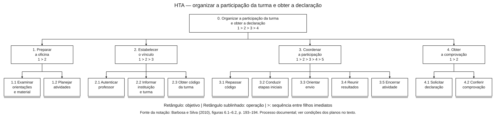
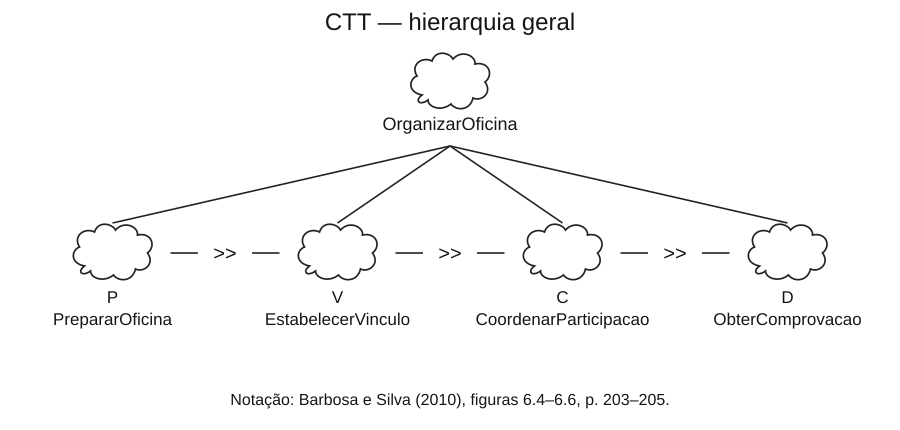
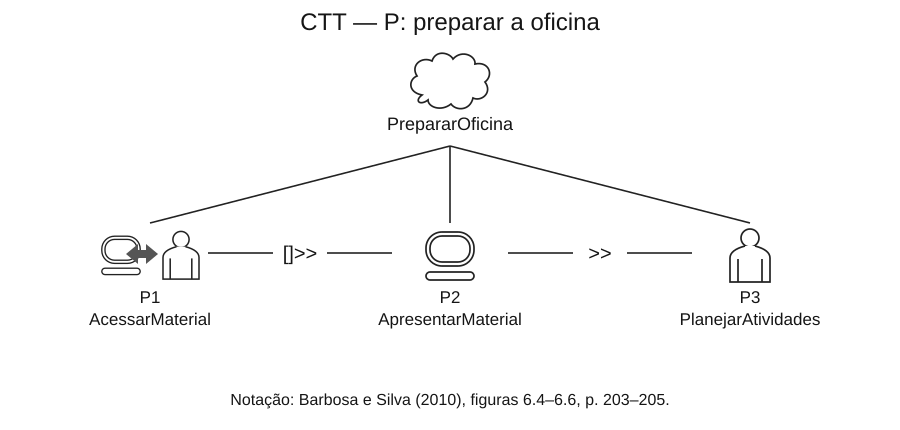
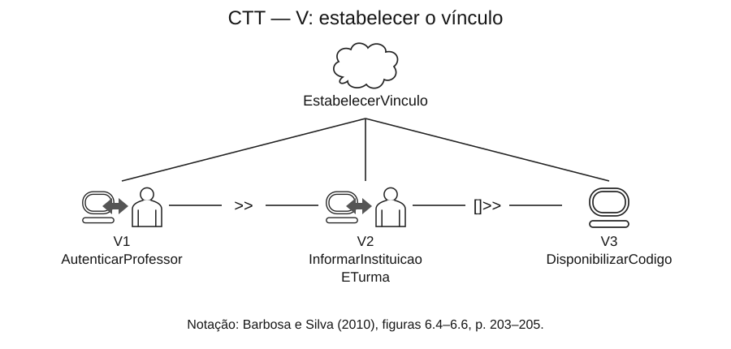
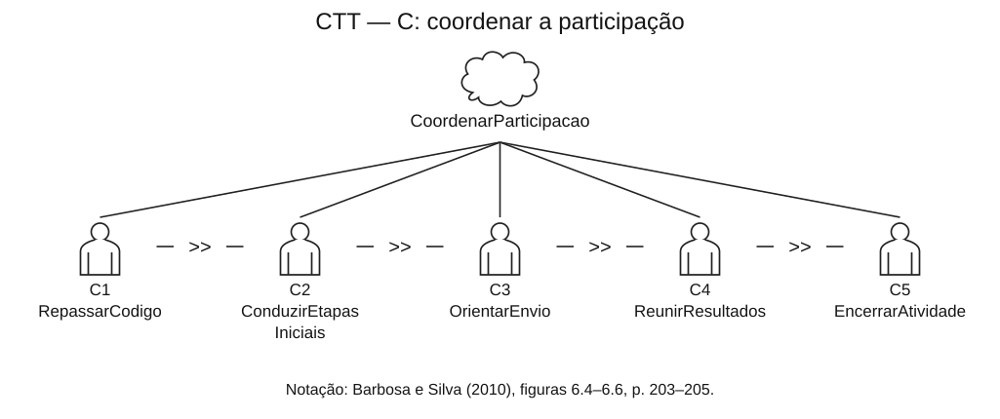
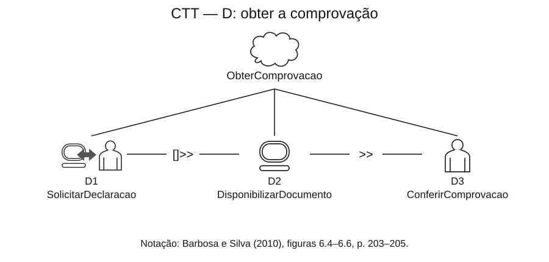

<span class="owner">Responsável: Bruno Ferreira Dornelas — Análise de tarefas</span>

# Análise de tarefas — Oficina Legislativa

## Tabela de contribuição

A Tabela 1 registra as contribuições para este artefato.

| Integrante | Contribuição | Artefato / atividade |
| --- | --- | --- |
| [Bruno Ferreira Dornelas](https://github.com/brunnf) | Delimitação da tarefa, operações e planos | [HTA](#analise-hierarquica-de-tarefas-hta) |
| [Bruno Ferreira Dornelas](https://github.com/brunnf) | Modelagem temporal e rastreabilidade | [CTT](#arvore-de-tarefas-concorrentes-ctt) |
| Codex (OpenAI) | Organização, redação e desenho dos diagramas | [Agradecimentos](#agradecimentos) |

<p class="caption">Tabela 1 — Contribuição neste artefato.</p>
<p class="source">Fonte: elaboração do Grupo 06 (2026).</p>

## Introdução

A análise detalha o trabalho de [Rafael Almeida](persona.md) no [cenário da oficina](cenario.md), a partir do [perfil Professor](perfil-usuario.md). A base é o processo prescrito nos documentos oficiais, registrado nas evidências [E01–E09](analise-documental.md#evidencias-extraidas). Não houve observação de professor ou execução da emissão autenticada.

A HTA admite analisar o que as pessoas fazem ou o que se recomenda que façam (BARBOSA; SILVA, 2010, p. 192). Aqui, os modelos organizam um percurso previsto, com decisões analíticas explicitadas. A decomposição não representa telas verificadas nem prova que a interface atual permita concluir todas as operações sem dificuldades.

## Tarefa analisada

A Tabela 2 delimita o objetivo e as fronteiras da análise.

| Campo | Registro |
| --- | --- |
| Objetivo | Organizar a participação da turma e obter a declaração da oficina |
| Persona e origem | Rafael Almeida; papel docente documentado, sem participante entrevistado |
| Motivação | Viabilizar a atividade educativa e comprovar sua realização |
| Sistema | Oficina Legislativa na Escola, no e-Cidadania |
| Fora do sistema | Planejamento pedagógico, aulas, orientação e comunicação dos resultados pelos alunos |
| Condições de partida | Professor responsável por uma turma, informações institucionais disponíveis e possibilidade de autenticação própria conforme os termos do serviço |
| Dependências externas | Alunos enviam suas ideias com o código da turma; recebem o resultado e o comunicam ao professor. O professor não assume essas identidades nem a moderação do Senado |
| Resultado esperado | Declaração coerente com a oficina realizada; correspondência dos dados é critério de sucesso adotado na análise |
| Objetivo da análise | Identificar dependências, riscos de vinculação e informações necessárias à comprovação |
| Limite | Campos, mensagens, critérios completos de emissão e formato do documento autenticado não verificados |

<p class="caption">Tabela 2 — Objetivo, condições e limites da tarefa.</p>
<p class="source">Fonte: E01–E09 e decisões de modelagem do Grupo 06; organização baseada em BARBOSA; SILVA (2010, p. 193–195).</p>

## Análise Hierárquica de Tarefas (HTA)

A notação segue as **figuras 6.1 e 6.2, p. 193–194**, de Barbosa e Silva (2010): objetivos em retângulos, operações em retângulos com linha inferior e decomposição de cima para baixo. Os planos utilizam `>` para sequência. Os números de cada plano designam os filhos imediatos: no objetivo 2, `1 > 2 > 3` significa 2.1, 2.2 e 2.3. As setas hierárquicas representam decomposição, não passagem do tempo.

A Figura 1 apresenta a árvore. O detalhamento de entrada, ação e condição de atingimento está na Tabela 4, conforme a **Tabela 6.3, p. 194–195**, do livro. As operações são unidades do trabalho; não equivalem necessariamente a um clique.

[](../../../../assets/img/analise-tarefas/bruno/perfil-2/rafael-hta.svg)

<p class="caption">Figura 1 — HTA do trabalho previsto para o professor.</p>
<p class="source">Fonte: Grupo 06, a partir de E01–E09; notação de BARBOSA; SILVA (2010, figuras 6.1–6.2, p. 193–194), redesenhada em SVG. Clique para ampliar.</p>

A Tabela 3 explicita os planos e as condições que limitam seu avanço.

| Objetivo | Plano | Condição de execução |
| --- | --- | --- |
| 0. Organizar a participação e obter a declaração | `1 > 2 > 3 > 4` | Percurso escolhido para o cenário; não é a única organização pedagógica possível |
| 1. Preparar a oficina | `1 > 2` | Examinar orientações e planejar atividades antes da execução |
| 2. Estabelecer o vínculo | `1 > 2 > 3` | Utilizar identidade própria; prosseguir com instituição, turma e código disponíveis |
| 3. Coordenar a participação | `1 > 2 > 3 > 4 > 5` | Orientar o uso do código antes do envio pelos alunos; reunir os retornos antes do encerramento |
| 4. Obter a comprovação | `1 > 2` | Conferir somente após obter o documento; nenhuma emissão foi executada nesta pesquisa |

<p class="caption">Tabela 3 — Planos de execução da HTA.</p>
<p class="source">Fonte: organização analítica do Grupo 06 sobre o fluxo documental F01–F06.</p>

Se o código estiver ausente ou incorreto antes do envio, a orientação deve ser retomada em 3.3. Se uma ideia já tiver sido publicada sem código, não se presume uma função para incluí-lo posteriormente (E03). Sem os resultados necessários, o objetivo 3 permanece incompleto. Se o documento não estiver disponível ou apresentar divergências, o objetivo 4 não é considerado atingido; o fluxo de correção exige investigação adicional.

| Operação / ação | Entrada (*input*) | Condição de atingimento (*feedback*) | Fonte e ponto a investigar |
| --- | --- | --- | --- |
| 1.1 Examinar orientações e material | Responsabilidade pela oficina e materiais públicos | Orientações consideradas no planejamento | E07–E08; compreensão não avaliada |
| 1.2 Planejar atividades | Orientações e contexto da turma | Organização pedagógica definida | E07; trabalho fora do portal, sem agenda interna presumida |
| 2.1 Autenticar professor | Acesso ao serviço e identidade própria | Acesso autenticado autorizado | E06, E09; diálogo tratado como unidade, sem inventar telas |
| 2.2 Informar instituição e turma | Acesso docente e dados pertinentes | Instituição e turma registradas | E02; campos e correções atuais não inspecionados |
| 2.3 Obter código da turma | Turma registrada | Código disponibilizado ao professor | E02; reconhecer a turma correspondente |
| 3.1 Repassar código | Código da turma | Alunos recebem a informação | E02–E03; comunicação fora do portal |
| 3.2 Conduzir etapas iniciais | Planejamento e participação dos alunos | Elaboração e discussão das ideias realizadas | E07; atividade pedagógica, não funcionalidade do portal |
| 3.3 Orientar envio | Ideias preparadas e código conhecido | Alunos orientados sobre autoria, vínculo e consequências da omissão | E03, E06; envio é ação dos alunos, fora da árvore do professor |
| 3.4 Reunir resultados | Alunos submetem ideias e recebem retornos | Professor conhece os resultados comunicados pelos alunos | E04; não representa painel docente de aprovação |
| 3.5 Encerrar atividade | Retornos necessários disponíveis | Atividade final conduzida com a turma | E04, E07; tempo de espera não medido |
| 4.1 Solicitar declaração | Oficina realizada e acesso docente | Documento disponibilizado pelo serviço | E05, E09; resultado previsto, emissão não executada |
| 4.2 Conferir comprovação | Documento disponível e informações da oficina | Correspondência entre documento e atividade verificada | Critério analítico do grupo sobre E05; sem supor tela de conferência ou fórmula de carga horária |

<p class="caption">Tabela 4 — Operações, condições e rastreabilidade.</p>
<p class="source">Fonte: evidências E02–E09 da análise documental; estrutura de BARBOSA; SILVA (2010, p. 193–195). As condições representam o resultado esperado, não observações realizadas.</p>

## Árvore de Tarefas Concorrentes (CTT)

A CTT cobre o mesmo objetivo e explicita os tipos de tarefa. Os símbolos seguem a **Figura 6.4, p. 203**; as relações temporais, a **Figura 6.5, p. 204**; e a organização gráfica, o exemplo da **Figura 6.6, p. 205**, de Barbosa e Silva (2010). As linhas do pai aos filhos representam decomposição. Os operadores aparecem entre tarefas irmãs.

A Tabela 5 constitui a legenda dos diagramas.

| Símbolo / operador | Significado neste modelo |
| --- | --- |
| Nuvem | Tarefa abstrata: composição de subtarefas |
| Pessoa | Tarefa do usuário realizada fora do sistema, incluindo planejamento, comunicação e avaliação mental |
| Pessoa conectada ao computador | Tarefa interativa: diálogo entre professor e sistema |
| Computador | Tarefa do sistema: processamento e disponibilização do resultado |
| `>>` | Ativação: a tarefa seguinte começa após terminar a anterior |
| `[]>>` | Ativação com passagem da informação produzida pela tarefa anterior |

<p class="caption">Tabela 5 — Tipos de tarefa e relações da CTT.</p>
<p class="source">Fonte: BARBOSA; SILVA (2010, p. 203–205).</p>

A Figura 2 apresenta a expressão textual para conferir a correspondência com os diagramas. P, V, C e D são as quatro tarefas abstratas detalhadas. Cada igualdade identifica uma decomposição; a linha de C continua na linha seguinte.

```text
OrganizarOficina = P >> V >> C >> D
P = P1 AcessarMaterial []>> P2 ApresentarMaterial >> P3 PlanejarAtividades
V = V1 AutenticarProfessor >> V2 InformarInstituicaoETurma []>> V3 DisponibilizarCodigo
C = C1 RepassarCodigo >> C2 ConduzirEtapasIniciais >> C3 OrientarEnvio
    >> C4 ReunirResultados >> C5 EncerrarAtividade
D = D1 SolicitarDeclaracao []>> D2 DisponibilizarDocumento >> D3 ConferirComprovacao
```

<p class="caption">Figura 2 — Expressão textual da CTT.</p>
<p class="source">Fonte: Grupo 06; operadores de BARBOSA; SILVA (2010, p. 203–204).</p>

As passagens de informação indicadas são o material solicitado (P1–P2), os dados de instituição e turma (V2–V3) e a solicitação de comprovação do professor (D1–D2). Os detalhes internos de autenticação e emissão permanecem fora do modelo. Disponibilizar o documento representa o resultado descrito pelo serviço, sem afirmar como o sistema o processa internamente.

A Figura 3 divide a mesma árvore em uma visão geral e quatro expansões, para preservar a legibilidade. Não são cinco modelos independentes. Clique nas imagens para ampliar.

[](../../../../assets/img/analise-tarefas/bruno/perfil-2/rafael-ctt-geral.svg)

<p class="caption">Figura 3a — Hierarquia geral.</p>

[](../../../../assets/img/analise-tarefas/bruno/perfil-2/rafael-ctt-preparar.svg)

<p class="caption">Figura 3b — Preparar a oficina (P).</p>

[](../../../../assets/img/analise-tarefas/bruno/perfil-2/rafael-ctt-vincular.svg)

<p class="caption">Figura 3c — Estabelecer o vínculo (V).</p>

[](../../../../assets/img/analise-tarefas/bruno/perfil-2/rafael-ctt-coordenar.svg)

<p class="caption">Figura 3d — Coordenar a participação (C).</p>

[](../../../../assets/img/analise-tarefas/bruno/perfil-2/rafael-ctt-comprovar.svg)

<p class="caption">Figura 3e — Obter a comprovação (D).</p>
<p class="source">Fonte das figuras 3a–3e: Grupo 06, a partir de E01–E09; símbolos de BARBOSA; SILVA (2010, figuras 6.4–6.6, p. 203–205), redesenhados em SVG.</p>

A Tabela 6 vincula a CTT às operações da HTA. Respostas do sistema foram explicitadas para distinguir interação e processamento; não acrescentam observações à pesquisa.

| CTT | Tipo | Correspondência HTA / evidência |
| --- | --- | --- |
| P1 AcessarMaterial | Interativa | 1.1 / E07 |
| P2 ApresentarMaterial | Sistema | 1.1 / E07 |
| P3 PlanejarAtividades | Usuário | 1.2 / E07 |
| V1 AutenticarProfessor | Interativa | 2.1 / E06, E09 |
| V2 InformarInstituicaoETurma | Interativa | 2.2 / E02 |
| V3 DisponibilizarCodigo | Sistema | 2.3 / E02 |
| C1 RepassarCodigo | Usuário | 3.1 / E02–E03 |
| C2 ConduzirEtapasIniciais | Usuário | 3.2 / E07 |
| C3 OrientarEnvio | Usuário | 3.3 / E03, E06 |
| C4 ReunirResultados | Usuário | 3.4 / E04 |
| C5 EncerrarAtividade | Usuário | 3.5 / E04, E07 |
| D1 SolicitarDeclaracao | Interativa | 4.1 / E05, E09 |
| D2 DisponibilizarDocumento | Sistema | 4.1 / E05; resultado esperado |
| D3 ConferirComprovacao | Usuário | 4.2 / critério analítico sobre E05 |

<p class="caption">Tabela 6 — Correspondência entre CTT, HTA e fontes.</p>
<p class="source">Fonte: elaboração do Grupo 06 a partir da Tabela 4.</p>

O trabalho dos alunos e a análise das ideias pelo Senado são dependências externas da tarefa do professor. C4 só se completa quando os retornos necessários forem comunicados; não se presume uma resposta imediata após C3. O modelo não expressa duração nem paralelismo entre os estudantes. O percurso sequencial organiza o cenário escolhido, sem afirmar que o serviço imponha toda essa ordem como bloqueio técnico.

## Resultados e verificações necessárias

A análise identifica três necessidades: compreender o vínculo entre turma e ideias antes do envio; conhecer a responsabilidade de cada ator; e reconhecer se a comprovação corresponde à atividade realizada. São necessidades derivadas do processo, ainda não avaliadas com professores.

As próximas verificações devem confrontar os modelos com o trabalho efetivo e com a área autenticada: condições para emissão, tratamento de divergências e efeito das ideias arquivadas. Até essa verificação, os modelos sustentam a discussão de requisitos, mas não permitem afirmar que houve sucesso de uso, medir dificuldade ou descrever telas não inspecionadas. Os documentos e localizadores permanecem acessíveis na [análise documental](analise-documental.md#fontes-consultadas).

## Agradecimentos

Este documento contou com apoio do Codex (OpenAI) na organização, redação e diagramação. A responsabilidade pelo conteúdo é do autor.

## Histórico de versão

| Versão | Data | Descrição | Autor(es) | Revisor(es) |
| :---: | :---: | --- | --- | --- |
| `1.0` | 05/10/2026 | Modela a tarefa docente em HTA e CTT com símbolos do livro, planos, operações e rastreabilidade documental | [Bruno Ferreira Dornelas](https://github.com/brunnf) | [Caio Breno de Souza Bezerra](https://github.com/CaioBezerra-Dev) |
| `1.1` | 05/10/2026 | Adota Professor como nome do perfil e referência textual, mantendo a Oficina Legislativa como recorte investigado | [Bruno Ferreira Dornelas](https://github.com/brunnf) | [Caio Breno de Souza Bezerra](https://github.com/CaioBezerra-Dev) |


## Referências

[1] BARBOSA, Simone Diniz Junqueira; SILVA, Bruno Santana da. *Interação humano-computador*. Rio de Janeiro: Elsevier, 2010. p. 191–195, 203–205.

[2] GRUPO 06. [Análise documental — Professor](analise-documental.md#fontes-consultadas). Fontes oficiais D01–D06, consultadas em 5 out. 2026.
