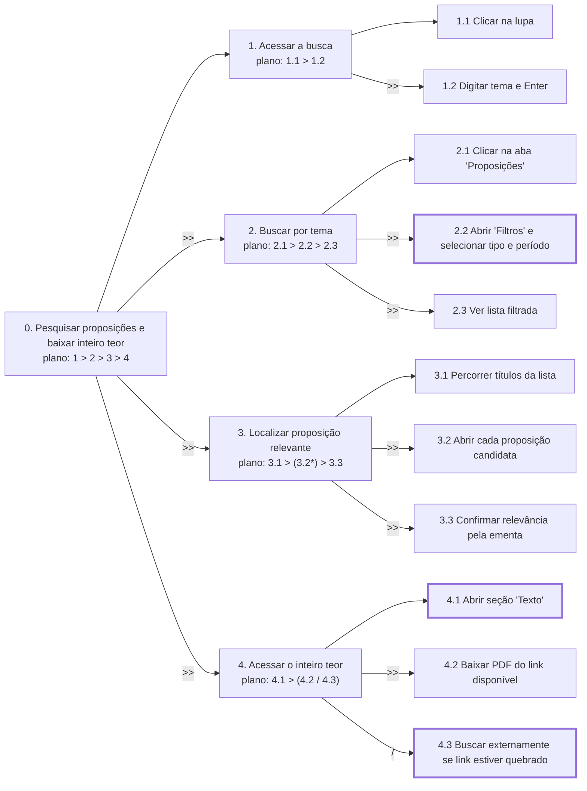

<span class="owner">Responsável: Bruno Ferreira Dornelas — Análise de tarefas 2</span>

# Análise de tarefas

## Tabela de contribuição

A Tabela 1 registra quem atuou neste artefato.

| Integrante | Contribuição | Artefato / atividade |
| --- | --- | --- |
| [Bruno Ferreira Dornelas](https://github.com/brunnf) | HTA e CTT do perfil estudante/pesquisador | [HTA](analise-tarefas.md#analise-hierarquica-de-tarefas-hta) |
| ChatGPT (OpenAI GPT-4o) | Estruturação do texto, redação preliminar e formatação Markdown | [Agradecimentos](analise-tarefas.md#agradecimentos) |

<p class="caption">Tabela 1 — Contribuição neste artefato.</p>
<p class="source">Fonte: elaboração do Grupo 06 (2026).</p>

## Introdução

Esta página modela a tarefa do [cenário](cenario.md) em duas técnicas: **Análise Hierárquica de Tarefas (HTA)** e **Árvore de Tarefas Concorrentes (CTT)**. As duas partem do perfil elicitado por [análise documental e de similares](perfil-usuario.md) e do comportamento descrito no cenário. A análise é menos detalhada que a do Perfil 1 porque os dados vêm de fontes indiretas (BARBOSA; SILVA, 2010, p. 191).

## Tarefa analisada

| Campo | Registro |
| --- | --- |
| Objetivo do usuário | Encontrar proposições sobre segurança pública urbana, filtrar por tipo e período, e baixar o inteiro teor para o TCC |
| Usuário | [Lucas Mendes](persona.md) |
| Sistema | Portal do Senado Federal — busca de matérias e página de detalhes da proposição |
| Evidência de sucesso | Lucas tem os PDFs do inteiro teor das proposições relevantes salvos e com a referência bibliográfica correta |
| Consequência da falha | Links quebrados e ausência de indicação de versão forçam buscas manuais externas; referências incompletas no TCC |

<p class="caption">Tabela 2 — Tarefa analisada.</p>
<p class="source">Fonte: elaboração do Grupo 06 (2026).</p>

## Análise Hierárquica de Tarefas (HTA)

A Tabela 3 é a legenda da notação.

| Notação | Significado |
| --- | --- |
| `0`, `1`, `1.1` | Posição na hierarquia; `0` é o objetivo principal |
| `plano: 1 > 2` | Sequência |
| `plano: 1 / 2` | Seleção: 1 ou 2 conforme a situação |
| `plano: 1*` | Iteração: repete para cada item |
| Caixa grossa | Ponto com problema registrado na tabela |

<p class="caption">Tabela 3 — Legenda da HTA.</p>
<p class="source">Fonte: elaboração do Grupo 06 (2026), com base em BARBOSA; SILVA (2010, p. 193–195).</p>



<p class="caption">Figura 1 — HTA da pesquisa de proposições e acesso ao inteiro teor.</p>
<p class="source">Fonte: elaboração do Grupo 06 (2026), com base em BARBOSA; SILVA (2010, p. 194).</p>

| Objetivos / operações | Problemas e recomendações |
| --- | --- |
| 0. Pesquisar proposições e baixar inteiro teor `1 > 2 > 3 > 4` | input: demanda da orientadora. feedback: PDFs salvos com referência correta |
| 1. Acessar a busca `1.1 > 1.2` | input: portal aberto. feedback: lista de resultados carregada |
| 1.1 Clicar na lupa | feedback: campo de busca se expande. Comportamento inferido da análise de similares |
| 1.2 Digitar tema e Enter | feedback: página de resultados com abas |
| 2. Buscar por tema `2.1 > 2.2 > 2.3` | input: lista geral de resultados. feedback: lista filtrada por tipo e período |
| 2.1 Clicar na aba "Proposições" | feedback: lista restrita a matérias legislativas |
| 2.2 Abrir "Filtros" e selecionar tipo e período | feedback: painel com campos "Tipo", "Período", "Situação". problema: as siglas no campo "Tipo" (PDL, PLS, MPV) não têm rótulo explicativo; o pesquisador que não as domina não sabe o que marcar. recomendação: exibir o nome completo ao lado da sigla e agrupar por categoria (propostas legislativas, medidas provisórias etc.) |
| 2.3 Ver lista filtrada | feedback: proposições do período e tipo selecionados em ordem indefinida |
| 3. Localizar proposição relevante `3.1 > 3.2* > 3.3` | input: lista filtrada. feedback: proposição relevante aberta |
| 3.1 Percorrer títulos da lista | feedback: candidatos identificados pelo título e ementa resumida |
| 3.2 Abrir cada proposição candidata | feedback: página da proposição com ficha e situação. Repete para cada candidato |
| 3.3 Confirmar relevância pela ementa | feedback: decisão de incluir ou descartar |
| 4. Acessar o inteiro teor `4.1 > (4.2 / 4.3)` | input: proposição aberta. feedback: PDF salvo |
| 4.1 Abrir seção "Texto" | feedback: lista de links (Texto original, Texto substitutivo, Redação final). problema: não há indicação de data nem de número de emenda nos links; o usuário não sabe qual versão é a mais recente. recomendação: exibir data de cada versão e indicar qual é a vigente |
| 4.2 Baixar PDF do link disponível | feedback: PDF abre ou faz download. Situação normal |
| 4.3 Buscar externamente se link estiver quebrado | problema: links quebrados ou que apontam para o Diário do Senado sem ancoragem forçam o pesquisador a sair do portal. recomendação: validar links periodicamente; oferecer acesso alternativo direto ao Diário |

<p class="caption">Tabela 4 — HTA no formato da Tabela 6.3 do livro.</p>
<p class="source">Fonte: elaboração do Grupo 06 (2026), a partir de análise documental e de similares; formato de BARBOSA; SILVA (2010, p. 194–195).</p>

## Árvore de Tarefas Concorrentes (CTT)

```text
PesquisarEBaixar =
    AcessarBusca >> BuscarPorTema >> LocalizarProposicao >> AcessarInteiroTeor

AcessarBusca =
    ClicarNaLupa >> DigitarTema []>> ExibirAbas

BuscarPorTema =
    ClicarAbaProposicoes >> AbrirFiltros []>> SelecionarTipoEPeriodo []>> ExibirListaFiltrada

LocalizarProposicao =
    PercorrerTitulos >> AbrirProposicaoCandidata* []>> ConfirmarRelevancia

AcessarInteiroTeor =
    AbrirSecaoTexto >> (BaixarPDF [] BuscarExternamenteSeLinkQuebrado)
```

<p class="caption">Figura 2 — CTT em notação textual.</p>
<p class="source">Fonte: elaboração do Grupo 06 (2026).</p>

| Tarefa | Tipo |
| --- | --- |
| PesquisarEBaixar, AcessarBusca, BuscarPorTema, LocalizarProposicao, AcessarInteiroTeor | Abstrata |
| ClicarNaLupa, DigitarTema, ClicarAbaProposicoes, AbrirFiltros, SelecionarTipoEPeriodo, AbrirProposicaoCandidata, ConfirmarRelevancia, AbrirSecaoTexto, BaixarPDF | Interativa |
| ExibirAbas, ExibirListaFiltrada | Do sistema |
| PercorrerTitulos | Do usuário |
| BuscarExternamenteSeLinkQuebrado | Do usuário (fora do portal) |

<p class="caption">Tabela 5 — Tipos de tarefa da CTT.</p>
<p class="source">Fonte: elaboração do Grupo 06 (2026), com base em BARBOSA; SILVA (2010, p. 203).</p>

## Agradecimentos

Esta página contou com o apoio do ChatGPT (OpenAI GPT-4o) na estruturação, na redação preliminar e na formatação Markdown. A revisão do conteúdo e a fundamentação metodológica são do autor, que segue responsável pelo que está publicado.

## Histórico de versão

| Versão | Data | Descrição | Autor(es) | Revisor(es) |
| :---: | :---: | --- | --- | --- |
| `1.0` | 26/09/2026 | HTA e CTT do perfil estudante/pesquisador | [Bruno Ferreira Dornelas](https://github.com/brunnf) | [Caio Breno de Souza Bezerra](https://github.com/CaioBezerra-Dev) |
| `1.1` | 03/10/2026 | Nomeia a ferramenta de IA nos agradecimentos e na tabela de contribuição | [Caio Breno de Souza Bezerra](https://github.com/CaioBezerra-Dev) | [Israel Soares de Paiva](https://github.com/IsraelSoares-25) |

## Referências

[1] BARBOSA, Simone Diniz Junqueira; SILVA, Bruno Santana da. Interação humano-computador. Rio de Janeiro: Elsevier, 2010.

[2] PATERNÒ, Fabio. Model-based design and evaluation of interactive applications. London: Springer, 2000.
