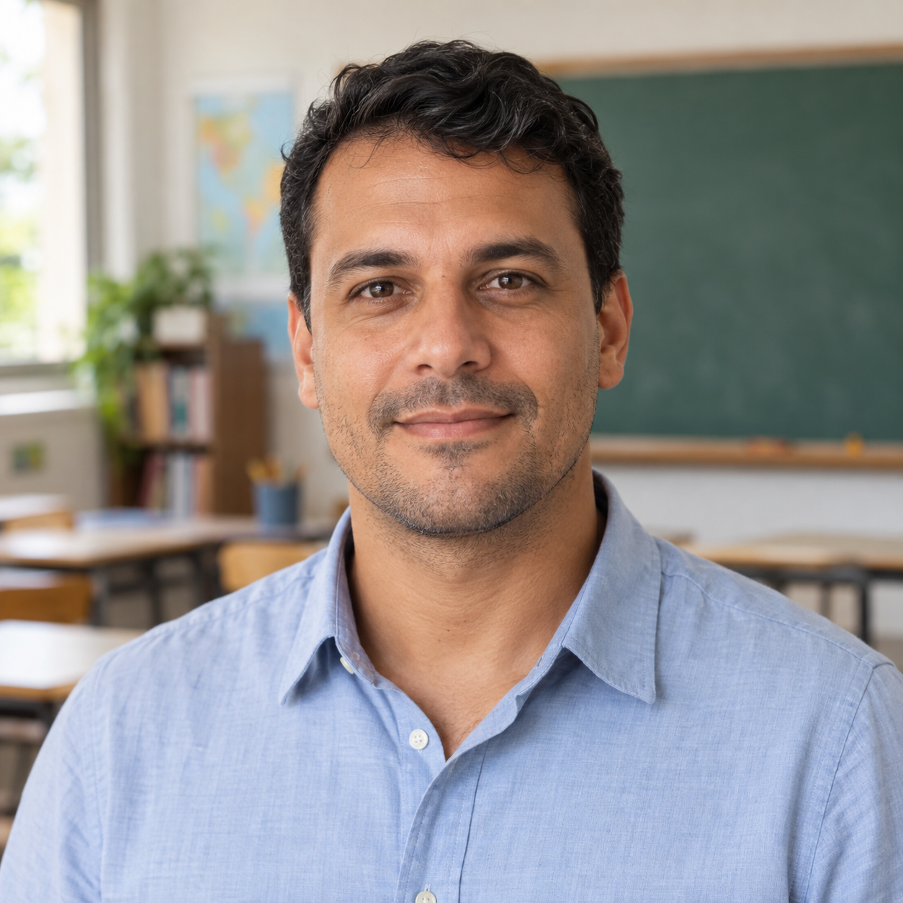

Responsável: Bruno Ferreira Dornelas — Persona

# Persona — Rafael Almeida

## Tabela de contribuição

A Tabela 1 registra as contribuições para este artefato.

| Integrante | Contribuição | Artefato / atividade |
| --- | --- | --- |
| [Bruno Ferreira Dornelas](https://github.com/brunnf) | Construção da persona e definição dos objetivos | [Descrição](#descricao-da-persona) · [Objetivos](#objetivos) |
| [Bruno Ferreira Dornelas](https://github.com/brunnf) | Rastreabilidade dos oito elementos | [Elementos](#elementos) |
| Codex (OpenAI) | Organização, redação e geração do retrato fictício | [Agradecimentos](#agradecimentos) |

Tabela 1 — Contribuição neste artefato.

Fonte: elaboração do Grupo 06 (2026).

## Introdução

Rafael Almeida representa o [perfil Professor](perfil-usuario.md). Seu cenário particulariza esse papel na condução de uma Oficina Legislativa na Escola. Sua construção utiliza as evidências E01–E09 da [análise documental](analise-documental.md#evidencias-extraidas), não uma entrevista. Ele é o ator do [cenário](cenario.md) e da [análise de tarefas](analise-tarefas.md).

## Descrição da persona

Barbosa e Silva (2010, p. 176–177) apresentam personas como personagens específicos, derivados da investigação dos usuários, e distinguem os detalhes pessoais fictícios das características sustentadas pela pesquisa. Aqui, nome, idade de **38 anos** e retrato são escolhas de caracterização: não descrevem um participante nem estabelecem a faixa etária do perfil docente. As responsabilidades profissionais vêm dos documentos; não se atribuem renda, titulação, tempo de docência ou nível de habilidade digital sem evidência.

A Figura 1 apresenta a identidade visual da persona.

??? note "Figura 1 — Retrato fictício de Rafael Almeida."

    

      
      

        
Professor da educação básica

        
Rafael Almeida

        
38 anos · responsável por uma Oficina Legislativa na Escola

      

    

    
Figura 1 — Retrato fictício de Rafael Almeida.

    
Fonte: imagem gerada com image_gen (OpenAI), 2026. Nome, idade e aparência são fictícios.

Rafael conduz uma atividade educativa em que os estudantes elaboram e discutem propostas. Seu trabalho envolve preparar a participação da turma, explicar a associação das ideias à oficina e reunir os retornos necessários para concluir a atividade. Os alunos continuam responsáveis pelo envio de suas próprias ideias e pela comunicação dos resultados recebidos (E01–E04, E07).

Sua responsabilidade no e-Cidadania vai além de acessar conteúdo. Ele precisa manter coerência entre instituição, turma e participação dos estudantes para obter a comprovação da oficina (E02, E03, E05). O material oficial fornece orientação para o trabalho, mas sua existência não demonstra que Rafael prefira aprender por manuais ou seja especialista em legislação (E07).

Para o cenário, Rafael utiliza um computador, um dos recursos previstos pelo programa (E08). Trata-se de uma condição escolhida para a narrativa, sem estabelecer que todos os professores tenham esse equipamento ou utilizem o mesmo contexto de acesso.

## Objetivos

A distinção entre objetivos pessoais e práticos segue Barbosa e Silva (2010, p. 180–183). Os objetivos pessoais abaixo são formulações de design apoiadas nas consequências do processo; não são falas coletadas de um professor.

**Objetivos pessoais:**

- ter segurança de que sua orientação não prejudica o reconhecimento da participação dos alunos;
- evitar retrabalho decorrente de uma associação incorreta entre turma e ideias;
- compreender o que depende dele, dos estudantes e do serviço do Senado.

**Objetivos práticos:**

- viabilizar uma experiência educativa de participação legislativa para a turma;
- preservar a associação correta das contribuições à oficina;
- obter uma comprovação coerente com a atividade realizada.

Registrar uma turma ou solicitar uma declaração são meios para esses objetivos. Seu detalhamento fica no cenário e nos modelos de tarefas.

## Elementos

A Tabela 2 organiza os oito elementos apresentados por Courage e Baxter, conforme Barbosa e Silva (2010, p. 177).

| Elemento | Descrição | Origem |
| --- | --- | --- |
| Identidade | Rafael Almeida, 38 anos, professor da educação básica. Nome, idade e retrato fictícios; papel docente sustentado pelas fontes | Escolhas de caracterização; [E01](analise-documental.md#e01) |
| Status | Persona primária para o recorte da Oficina Legislativa: seus objetivos de coordenação e comprovação não são atendidos por uma solução centrada apenas em consulta ou voto individual | Decisão de design; [relação com os demais perfis](perfil-usuario.md#relacao-com-os-demais-perfis) |
| Objetivos | Viabilizar a atividade educativa, manter a vinculação das participações e comprovar sua realização | [E01](analise-documental.md#e01), [E03](analise-documental.md#e03), [E05](analise-documental.md#e05) |
| Habilidades | Responsabilidade pedagógica por orientar a turma e conduzir a atividade. O programa oferece apoio; titulação, proficiência digital e experiência prévia com o portal não foram estabelecidas | [E01](analise-documental.md#e01), [E07](analise-documental.md#e07) |
| Tarefas | Preparar, coordenar e comprovar uma oficina. A vinculação é crítica para a comprovação. O modelo organiza o trabalho por oficina; frequência real e duração das interações não medidas | [F01–F06](analise-documental.md#fluxo-documentado-e-fronteiras-do-sistema) |
| Relacionamentos | Alunos autores das ideias, instituição de ensino e serviço do Senado. O retorno sobre as ideias chega aos alunos, que o comunicam ao professor | [E01](analise-documental.md#e01), [E03–E04](analise-documental.md#e03) |
| Requisitos | Reconhecer os vínculos entre os registros, compreender consequências de erros e distinguir responsabilidades. São necessidades derivadas, não requisitos já avaliados | [Necessidades do perfil](perfil-usuario.md#tarefa-e-necessidades-para-o-projeto) |
| Expectativas | Organizar a comprovação por instituição e turma, considerando as participações vinculadas. É uma expectativa de design baseada no resultado descrito pelo programa, não uma crença individual coletada | [E02](analise-documental.md#e02), [E05](analise-documental.md#e05) |

Tabela 2 — Elementos da persona e origem das informações.

Fonte: elaboração do Grupo 06 a partir da análise documental; elementos de BARBOSA; SILVA (2010, p. 177).

A prioridade desta persona amplia o elenco para cobrir um objetivo profissional distinto. Ela não significa que professores usem o portal regularmente: essa classificação de frequência depende de dados ainda não disponíveis (BARBOSA; SILVA, 2010, p. 136, 179–180).

## Fundamentação e validação

A conferência documental relaciona os elementos às fontes e explicita as escolhas fictícias. Não houve validação com professor, entrevista, observação ou emissão de declaração. A revisão do artefato não equivale à validação empírica da persona. Não são utilizadas citações inventadas como se fossem depoimentos.

O retrato foi gerado pela ferramenta integrada image_gen. O pedido descreveu um professor brasileiro fictício de 38 anos, em retrato de busto, camisa azul-clara e sala de aula desfocada, sem texto ou identificação institucional. A imagem funciona apenas como apoio à identificação do personagem.

## Agradecimentos

Este documento contou com apoio do Codex (OpenAI) na organização e redação e do image_gen (OpenAI) na imagem. A responsabilidade pelo conteúdo é do autor.

## Histórico de versão

| Versão | Data | Descrição | Autor(es) | Revisor(es) |
| :---: | :---: | --- | --- | --- |
| `1.0` | 05/10/2026 | Cria Rafael Almeida com os oito elementos, objetivos e rastreabilidade documental | [Bruno Ferreira Dornelas](https://github.com/brunnf) | [Caio Breno de Souza Bezerra](https://github.com/CaioBezerra-Dev) |
| `1.1` | 05/10/2026 | Adota Professor como nome do perfil e referência textual, mantendo a Oficina Legislativa como recorte investigado | [Bruno Ferreira Dornelas](https://github.com/brunnf) | [Caio Breno de Souza Bezerra](https://github.com/CaioBezerra-Dev) |

## Referências

[1] BARBOSA, Simone Diniz Junqueira; SILVA, Bruno Santana da. *Interação humano-computador*. Rio de Janeiro: Elsevier, 2010. p. 136, 176–183.

[2] GRUPO 06. [Análise documental — Professor](analise-documental.md#fontes-consultadas). Fontes oficiais D01–D06, consultadas em 5 out. 2026.
