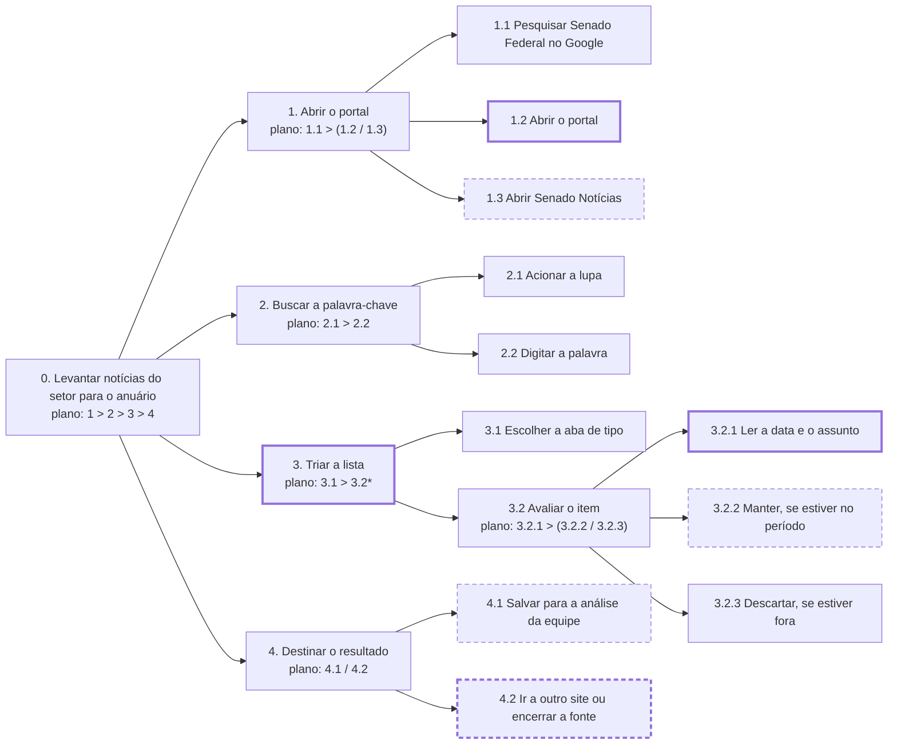
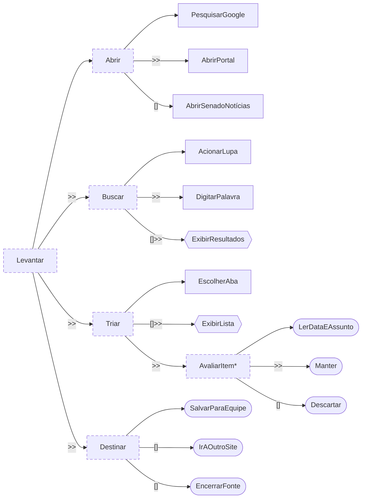

<span class="owner">Responsável: Caio Breno de Souza Bezerra — Análise de tarefas</span>

# Análise de tarefas

## Tabela de contribuição

A Tabela 1 registra quem atuou neste artefato.

| Integrante | Contribuição | Artefato / atividade |
| --- | --- | --- |
| [Caio Breno de Souza Bezerra](https://github.com/CaioBezerra-Dev) | Definição da tarefa e dos objetivos da análise | [Tarefa analisada](analise-tarefas.md#tarefa-analisada) |
| [Caio Breno de Souza Bezerra](https://github.com/CaioBezerra-Dev) | HTA | [HTA](analise-tarefas.md#analise-hierarquica-de-tarefas-hta) |
| [Caio Breno de Souza Bezerra](https://github.com/CaioBezerra-Dev) | CTT | [CTT](analise-tarefas.md#arvore-de-tarefas-concorrentes-ctt) |

<p class="caption">Tabela 1 — Contribuição neste artefato.</p>
<p class="source">Fonte: elaboração do Grupo 06 (2026).</p>

## Introdução

Esta página modela a tarefa do [cenário](cenario.md) em duas técnicas: **Análise Hierárquica de Tarefas (HTA)** e **Árvore de Tarefas Concorrentes (CTT)**. As duas partem da [observação](entrevista-observacao.md#protocolo-de-observacao) da tarefa real no portal e são complementadas pela entrevista. Quando se avalia um sistema existente, a análise de tarefas pode ser bem concreta e descrever o comportamento em detalhe (BARBOSA; SILVA, 2010, p. 191), que é o caso do Portal do Senado.

## Tarefa analisada

Diaper (2003 apud BARBOSA; SILVA, 2010, p. 195) recomenda começar definindo os objetivos da análise, qual evidência objetiva mostra que o objetivo foi atingido e quais são as consequências de não atingi-lo. A Tabela 2 registra essas definições.

| Campo | Registro |
| --- | --- |
| Objetivo do usuário | Separar, no período do anuário, notícias do setor que valham ser salvas para a análise da equipe |
| Usuário | [Renata Moreira](persona.md) |
| Sistema | Portal do Senado Federal, com foco na busca e nas abas de resultado |
| Objetivo da análise | Identificar como o portal atual facilita ou dificulta esse levantamento, para embasar o reprojeto |
| Evidência de sucesso | Itens do período reconhecidos e, no trabalho, salvos para aprovação. Na sessão, a evidência observada foi a lista triada no olho, sem salvamento |
| Consequência da falha | Notícia importante que escapa costuma chegar por outro site ou por rede social. A triagem manual aumenta a chance de deixá-la passar |
| Fonte dos dados | Observação da tarefa e entrevista de 24/09/2026 |

<p class="caption">Tabela 2 — Tarefa analisada e objetivos da análise.</p>
<p class="source">Fonte: elaboração do Grupo 06 (2026), com base em BARBOSA; SILVA (2010, p. 195).</p>

## Análise Hierárquica de Tarefas (HTA)

A HTA decompõe o objetivo principal em subobjetivos até chegar às **operações**, a unidade fundamental da técnica. Cada operação é descrita pelo que a dispara (*input*), pelas ações que a realizam e pela condição que indica sua conclusão (*feedback*). As relações entre os subobjetivos formam o **plano**, que pode ser uma sequência fixa, uma regra de seleção ou uma execução em paralelo (BARBOSA; SILVA, 2010, p. 193). A análise é apresentada em diagrama e em tabela, no formato da Figura 6.2 e da Tabela 6.3 do livro (BARBOSA; SILVA, 2010, p. 194–195). A Tabela 3 é a legenda da notação.

| Notação | Significado |
| --- | --- |
| `0`, `1`, `1.1`, `3.2.1` | Posição do objetivo na hierarquia; `0` é o objetivo principal |
| `plano: 1 > 2` | Plano em sequência: primeiro 1, depois 2 |
| `plano: 1 / 2` | Plano com regra de seleção: 1 ou 2, conforme a situação |
| `plano: 1 + 2` | Plano em paralelo: 1 e 2, em qualquer ordem ou ao mesmo tempo |
| `*` no plano | O trecho marcado se repete, para cada item da lista |
| Caixa com borda contínua | Passo observado na sessão |
| Caixa com borda tracejada | Passo relatado na entrevista, não observado |
| Caixa com borda grossa | Ponto em que há problema registrado na Tabela 4 |
| *input* · *feedback* | O que dispara a operação · o que indica que ela foi concluída |
| Problema · Recomendação | Dificuldade observada naquele ponto · mudança proposta para o reprojeto |

<p class="caption">Tabela 3 — Legenda da notação da HTA.</p>
<p class="source">Fonte: elaboração do Grupo 06 (2026), com base em BARBOSA; SILVA (2010, p. 193–195).</p>

A decomposição para quando a origem do problema já está identificada e já é possível propor uma correção (BARBOSA; SILVA, 2010, p. 195). Por isso o diagrama não desce ao clique e à tecla. A Figura 1 é o diagrama, com o plano de cada objetivo dentro da caixa, como na Figura 6.2 do livro. Para caber na página, a árvore está deitada: o objetivo principal fica à esquerda, e os subobjetivos, à direita. A Tabela 4 é o equivalente em tabela, no formato da Tabela 6.3: em cada linha, o objetivo, e na coluna ao lado o input, o feedback, o plano, o problema e a recomendação (p. 194–195). Os subobjetivos de um mesmo pai não se sobrepõem e, juntos, cobrem o pai (p. 196): em 3.2, por exemplo, cada item lido termina mantido ou descartado.



<p class="caption">Figura 1 — HTA do levantamento de notícias para o anuário.</p>
<p class="source">Fonte: elaboração do Grupo 06 (2026), a partir da sessão de 24/09/2026.</p>

| Objetivos / operações | Problemas e recomendações |
| --- | --- |
| 0. Levantar notícias do setor para o anuário `1 > 2 > 3 > 4` | input: semana em que a fonte da vez é o Senado. feedback: período da fonte percorrido, com item salvo ou com a fonte encerrada. plano: abrir o portal, buscar a palavra, triar a lista e então destinar o resultado |
| 1. Abrir o portal `1.1 > (1.2 / 1.3)` | input: precisa consultar o Senado. feedback: portal ou Senado Notícias aberto. plano: pesquisar no Google e então abrir o portal, quando a busca é por palavra, ou Senado Notícias, quando quer o conjunto das notícias |
| 1.1 Pesquisar “Senado Federal” no Google | input: aba em branco. feedback: lista do buscador. Observado |
| 1.2 Abrir o portal | input: primeiro resultado do buscador. feedback: página inicial do portal. Observado. problema: a página inicial mostra muitos assuntos que não são da tarefa (relatado na entrevista). recomendação: acesso direto às notícias e à busca no topo da página inicial |
| 1.3 Abrir Senado Notícias | input: segundo resultado do buscador ou o menu do portal. feedback: página de notícias aberta. Relatado, não usado na sessão |
| 2. Buscar a palavra-chave `2.1 > 2.2` | input: portal aberto. feedback: resultados da palavra em abas. plano: acionar a lupa e digitar a palavra |
| 2.1 Acionar a lupa | input: portal aberto. feedback: campo de busca visível. Observado |
| 2.2 Digitar a palavra | input: campo de busca. Na sessão, “drone”. feedback: abas Tudo, Notícias, Proposições, Pronunciamentos, Legislação e Vídeos. Observado. Ela chamou esta chegada de fácil |
| 3. Triar a lista `3.1 > 3.2*` | input: resultados na tela. feedback: itens do período separados dos antigos. plano: escolher a aba e então avaliar item por item, até o fim da lista. problema: a lista não vem em ordem de data, e a triagem precisa passar por todos os itens. recomendação: ordem padrão da mais nova para a mais antiga |
| 3.1 Escolher a aba de tipo | input: abas visíveis. Na sessão, Legislação e depois Notícias. feedback: uma aba ativa. Observado |
| 3.2 Avaliar o item `3.2.1 > (3.2.2 / 3.2.3)` | input: item visível. feedback: item mantido ou descartado. plano: ler a data e o assunto e então manter ou descartar |
| 3.2.1 Ler a data e o assunto | input: item visível. feedback: data e assunto reconhecidos. Observado. problema: item de 05/07/2013 entre itens de 2026; “Classificar por” e “Filtros” estavam na tela e não foram usados. recomendação: a ordem cronológica não pode depender de a pessoa descobrir o controle; a data deve aparecer em destaque em cada item |
| 3.2.2 Manter, se estiver no período | input: data dentro do período e assunto do setor. feedback: item separado para salvar. Relatado; na sessão, nenhum item foi mantido |
| 3.2.3 Descartar, se estiver fora | input: data fora do período. feedback: item deixado de lado. Observado, como triagem visual |
| 4. Destinar o resultado `4.1 / 4.2` | input: triagem feita. feedback: item encaminhado ou fonte encerrada. plano: salvar, se sobrou item no período, ou ir a outro site, se não sobrou. Não observado; veio da entrevista |
| 4.1 Salvar para a análise da equipe | input: item mantido. feedback: notícia salva, ainda fora do anuário. A aprovação e a edição são feitas por outras pessoas do órgão, fora do portal. Onde ela salva não foi observado |
| 4.2 Ir a outro site ou encerrar a fonte | input: nenhum item no período. feedback: busca nesta fonte encerrada. problema: não há sinal do portal de que o período se esgotou; o critério de parada é dela. recomendação: filtro de período junto da lista e contagem de resultados no período, para que ela saiba quando terminou |

<p class="caption">Tabela 4 — HTA do levantamento, no formato da Tabela 6.3 do livro.</p>
<p class="source">Fonte: elaboração do Grupo 06 (2026), a partir da sessão de 24/09/2026; formato de BARBOSA; SILVA (2010, p. 194–195).</p>

A Figura 1 e a Tabela 4 usam a numeração da Tabela 3, e a ligação entre as caixas é “faz parte de”. Os problemas se concentram em 3.2.1 e 4.2: a lista obriga a ler a data de cada item e não diz quando o período acabou. É ali que o reprojeto tem mais efeito.

## Árvore de Tarefas Concorrentes (CTT)

A CTT também organiza as tarefas em hierarquia, mas distingue quem executa cada uma e explicita as relações temporais entre elas. Com isso, representa não só a análise da tarefa, mas também uma solução de interação (BARBOSA; SILVA, 2010, p. 203–205). A Tabela 5 é a legenda dos tipos de tarefa, e a Tabela 6, a dos operadores.

| Tipo de tarefa | Quem executa | Forma na Figura 3 |
| --- | --- | --- |
| Tarefa do usuário | O usuário, fora do sistema (por exemplo, decidir se uma notícia é relevante) | Caixa arredondada |
| Tarefa do sistema | O sistema, sem interagir com o usuário (por exemplo, exibir os resultados da busca) | Hexágono |
| Tarefa interativa | Usuário e sistema em diálogo (por exemplo, digitar um termo e acionar a busca) | Retângulo |
| Tarefa abstrata | Nenhum dos dois diretamente: agrupa outras tarefas para organizar a decomposição | Retângulo tracejado |

<p class="caption">Tabela 5 — Tipos de tarefa da CTT.</p>
<p class="source">Fonte: elaboração do Grupo 06 (2026), com base em BARBOSA; SILVA (2010, p. 203).</p>

| Operador | Nome | Significado |
| :---: | --- | --- |
| `T1 >> T2` | Ativação | T2 só começa depois que T1 termina |
| `T1 []>> T2` | Ativação com passagem de informação | Além disso, T1 passa a T2 a informação que produziu |
| `T1 [] T2` | Escolha | Ao iniciar uma das tarefas, a outra fica desabilitada |
| `T1 ||| T2` | Concorrência | As tarefas ocorrem em qualquer ordem ou ao mesmo tempo |
| `T1 |[]| T2` | Concorrência com comunicação | Além disso, as tarefas trocam informações |
| `T1 |=| T2` | Independência | Qualquer ordem, mas uma precisa terminar para a outra começar |
| `T1 [> T2` | Desativação | T1 é interrompida por completo por T2 |
| `T1 |> T2` | Suspensão e retomada | T1 é interrompida por T2 e retomada de onde parou |
| `T*` | Iteração | T se repete; não está no livro, vem da notação original de Paternò (2000) |

<p class="caption">Tabela 6 — Operadores temporais da CTT.</p>
<p class="source">Fonte: elaboração do Grupo 06 (2026), com base em BARBOSA; SILVA (2010, p. 203–204) e PATERNÒ (2000).</p>

A Figura 2 escreve a mesma tarefa da HTA só com os operadores da Tabela 6. A decomposição é a mesma da Tabela 4, para que os dois modelos possam ser lidos lado a lado.

```text
Levantar =
    Abrir >> Buscar >> Triar >> Destinar

Abrir =
    PesquisarGoogle >> (AbrirPortal [] AbrirSenadoNotícias)

Buscar =
    AcionarLupa >> DigitarPalavra []>> ExibirResultados

Triar =
    EscolherAba []>> ExibirLista >> AvaliarItem*

AvaliarItem =
    LerDataEAssunto >> (Manter [] Descartar)

Destinar =
    SalvarParaEquipe [] IrAOutroSite [] EncerrarFonte
```

<p class="caption">Figura 2 — CTT do levantamento em notação textual.</p>
<p class="source">Fonte: elaboração do Grupo 06 (2026), a partir da sessão de 24/09/2026.</p>

A Tabela 7 diz o tipo de cada tarefa da Figura 2.

| Tarefa | Tipo | Quem executa |
| --- | --- | --- |
| Levantar, Abrir, Buscar, Triar, AvaliarItem, Destinar | Abstrata | Agrupa as outras |
| PesquisarGoogle, AbrirPortal, AbrirSenadoNotícias, AcionarLupa, DigitarPalavra, EscolherAba | Interativa | Ela age e o buscador ou o portal responde |
| ExibirResultados, ExibirLista | Do sistema | O portal devolve as abas e a lista da aba escolhida |
| LerDataEAssunto, Manter, Descartar | Do usuário | A participante, ao ler e decidir, sem agir no portal |
| SalvarParaEquipe, IrAOutroSite, EncerrarFonte | Do usuário | A participante, fora do portal |

<p class="caption">Tabela 7 — Tipo de cada tarefa da CTT.</p>
<p class="source">Fonte: elaboração do Grupo 06 (2026), com base em BARBOSA; SILVA (2010, p. 203).</p>

`PesquisarGoogle` vem antes da escolha entre o portal e Senado Notícias, como em 1.1 da HTA. `DigitarPalavra []>> ExibirResultados` e `EscolherAba []>> ExibirLista` passam informação ao portal: a palavra e a aba escolhida. `AvaliarItem*` é a triagem item por item, e `Manter [] Descartar` é a decisão dela sobre a data. `SalvarParaEquipe` é tarefa do usuário porque acontece fora do portal. A análise e a aprovação da equipe são feitas por outras pessoas e ficam fora deste modelo, que descreve só a tarefa de Renata.

A Figura 3 desenha a árvore, deitada para caber na página: a raiz fica à esquerda, e as filhas de cada tarefa, empilhadas à direita dela, na ordem de cima para baixo. Cada tarefa tem a forma do seu tipo, conforme a Tabela 5. O rótulo na ligação é o operador entre aquela tarefa e a irmã de cima; a primeira filha de cada tarefa não tem rótulo. A escolha `[]` liga só as duas irmãs vizinhas, como na Figura 2.



<p class="caption">Figura 3 — Árvore CTT do levantamento de notícias para o anuário.</p>
<p class="source">Fonte: elaboração do Grupo 06 (2026), a partir da sessão de 24/09/2026; notação de BARBOSA; SILVA (2010, p. 203–204).</p>

## Agradecimentos

Esta página contou com o apoio de ferramenta de inteligência artificial generativa na estruturação, na redação preliminar, na transcrição do áudio da sessão e na formatação Markdown. A revisão do conteúdo, a conferência das referências no livro e a coleta de dados que sustenta os modelos são do autor, que segue responsável pelo que está publicado.

## Histórico de versão

| Versão | Data | Descrição | Autor(es) | Revisor(es) |
| :---: | :---: | --- | --- | --- |
| `0.1` | 21/09/2026 | Tarefa analisada e legendas da HTA e da CTT | [Caio Breno de Souza Bezerra](https://github.com/CaioBezerra-Dev) | A definir |
| `0.2` | 24/09/2026 | HTA e CTT a partir da observação e da entrevista | [Caio Breno de Souza Bezerra](https://github.com/CaioBezerra-Dev) | A definir |
| `0.3` | 24/09/2026 | Tabela da HTA no formato da Tabela 6.3 do livro | [Caio Breno de Souza Bezerra](https://github.com/CaioBezerra-Dev) | A definir |
| `0.4` | 25/09/2026 | Planos no diagrama da HTA, triagem decomposta item a item, novas recomendações, CTT coerente com a HTA e desenhada como árvore, tabelas renumeradas | [Caio Breno de Souza Bezerra](https://github.com/CaioBezerra-Dev) | A definir |

## Referências

[1] BARBOSA, Simone Diniz Junqueira; SILVA, Bruno Santana da. Interação humano-computador. Rio de Janeiro: Elsevier, 2010.

[2] PATERNÒ, Fabio. Model-based design and evaluation of interactive applications. London: Springer, 2000.
