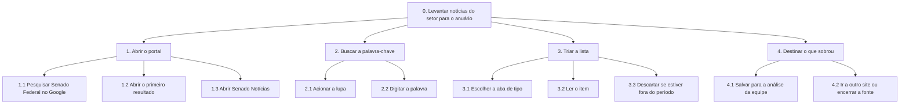
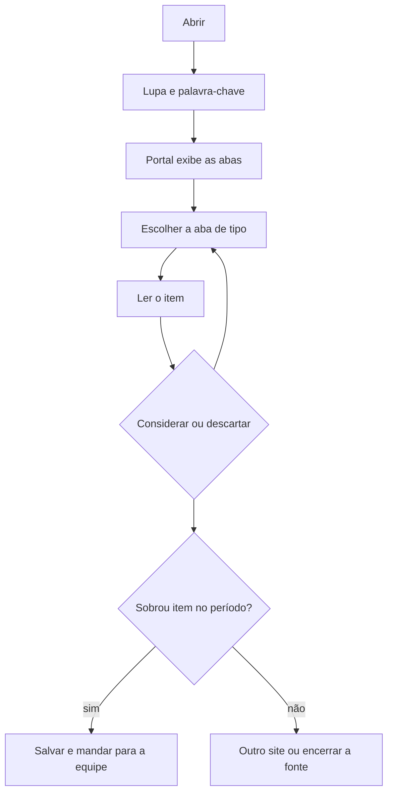

<span class="owner">Responsável: Caio Breno de Souza Bezerra — Análise de tarefas</span>

# Análise de tarefas

## Tabela de contribuição

A Tabela 1 registra quem atuou neste artefato.

| Integrante | Contribuição | Artefato / atividade |
| --- | --- | --- |
| [Caio Breno de Souza Bezerra](https://github.com/CaioBezerra-Dev) | Definição da tarefa e dos objetivos da análise | [Tarefa analisada](analise-tarefas.md#tarefa-analisada) |
| [Caio Breno de Souza Bezerra](https://github.com/CaioBezerra-Dev) | HTA | [HTA](analise-tarefas.md#analise-hierarquica-de-tarefas-hta) |
| [Caio Breno de Souza Bezerra](https://github.com/CaioBezerra-Dev) | CTT | [CTT](analise-tarefas.md#arvore-de-tarefas-concorrentes-ctt) |

<p class="caption">Tabela 1 — Contribuição neste artefato.</p>
<p class="source">Fonte: elaboração do Grupo 06 (2026).</p>

## Introdução

Esta página modela a tarefa do [cenário](cenario.md) em duas técnicas: **Análise Hierárquica de Tarefas (HTA)** e **Árvore de Tarefas Concorrentes (CTT)**. As duas partem da [observação](entrevista-observacao.md#protocolo-de-observacao) da tarefa real no portal e são complementadas pela entrevista. Quando se avalia um sistema existente, a análise de tarefas pode ser bem concreta e descrever o comportamento em detalhe (BARBOSA; SILVA, 2010, p. 191), que é o caso do Portal do Senado.

## Tarefa analisada

Diaper (2003 apud BARBOSA; SILVA, 2010, p. 195) recomenda começar definindo os objetivos da análise, qual evidência objetiva mostra que o objetivo foi atingido e quais são as consequências de não atingi-lo. A Tabela 2 registra essas definições.

| Campo | Registro |
| --- | --- |
| Objetivo do usuário | Separar, no período do anuário, notícias do setor que valham ser salvas para a análise da equipe |
| Usuário | [Renata Moreira](persona.md) |
| Sistema | Portal do Senado Federal, com foco na busca e nas abas de resultado |
| Objetivo da análise | Identificar como o portal atual facilita ou dificulta esse levantamento, para embasar o reprojeto |
| Evidência de sucesso | Itens do período reconhecidos e, no trabalho, salvos para aprovação. Na sessão, a evidência observada foi a lista triada no olho, sem salvamento |
| Consequência da falha | Notícia importante que escapa costuma chegar por outro site ou por rede social. A triagem manual aumenta a chance de deixá-la passar |
| Fonte dos dados | Observação da tarefa e entrevista de 24/09/2026 |

<p class="caption">Tabela 2 — Tarefa analisada e objetivos da análise.</p>
<p class="source">Fonte: elaboração do Grupo 06 (2026), com base em BARBOSA; SILVA (2010, p. 195).</p>

## Análise Hierárquica de Tarefas (HTA)

A HTA decompõe o objetivo principal em subobjetivos até chegar às **operações**, a unidade fundamental da técnica. Cada operação é descrita pelo que a dispara (*input*), pelas ações que a realizam e pela condição que indica sua conclusão (*feedback*). As relações entre os subobjetivos formam o **plano**, que pode ser uma sequência fixa, uma regra de seleção ou uma execução em paralelo (BARBOSA; SILVA, 2010, p. 193). A análise é apresentada em diagrama e em tabela, no formato da Tabela 6.3 do livro (BARBOSA; SILVA, 2010, p. 194–195). A Tabela 3 é a legenda da notação.

| Notação | Significado |
| --- | --- |
| `0`, `1`, `1.1`, `1.1.1` | Posição do objetivo na hierarquia; `0` é o objetivo principal |
| `1 > 2` | Plano em sequência: primeiro 1, depois 2 |
| `1 / 2` | Plano com regra de seleção: 1 ou 2, conforme a situação |
| `1 + 2` | Plano em paralelo: 1 e 2, em qualquer ordem ou ao mesmo tempo |
| *input* · *feedback* | O que dispara a operação · o que indica que ela foi concluída |
| Problema · Recomendação | Dificuldade observada naquele ponto · mudança proposta para o reprojeto |

<p class="caption">Tabela 3 — Legenda da notação da HTA.</p>
<p class="source">Fonte: elaboração do Grupo 06 (2026), com base em BARBOSA; SILVA (2010, p. 193–195).</p>

A decomposição para quando a origem do problema já está identificada: a ordem da lista (BARBOSA; SILVA, 2010, p. 195). Por isso o diagrama não desce ao clique e à tecla. A Figura 1 é o diagrama. A Tabela 6 é o equivalente, no formato da Tabela 6.3 do livro: em cada linha, o objetivo, e na coluna ao lado o input, o feedback, o plano, o problema e a recomendação (p. 194–195). Passo que só foi relatado na entrevista está marcado. Os subobjetivos de um mesmo pai não se sobrepõem e, juntos, cobrem o pai.



<p class="caption">Figura 1 — HTA do levantamento de notícias para o anuário.</p>
<p class="source">Fonte: elaboração do Grupo 06 (2026).</p>

| Objetivos / operações | Problemas e recomendações |
| --- | --- |
| 0. Levantar notícias do setor para o anuário `1 > 2 > 3 > 4` | input: semana em que a fonte da vez é o Senado. feedback: período da fonte visto, com item salvo ou com a busca encerrada. plano: abrir o portal, buscar a palavra, triar a lista e então destinar o que sobrou |
| 1. Abrir o portal `1.1 > (1.2 / 1.3)` | input: precisa consultar o Senado. feedback: portal ou Senado Notícias aberto. plano: pesquisar no Google e abrir o primeiro resultado, ou abrir Senado Notícias |
| 1.1 Pesquisar “Senado Federal” no Google | input: aba em branco. feedback: lista do buscador. Observado |
| 1.2 Abrir o primeiro resultado | input: primeiro link. feedback: portal aberto. Plano habitual, usado na sessão |
| 1.3 Abrir Senado Notícias | input: segundo link. feedback: página de notícias aberta. Plano alternativo, relatado e não usado quando a busca é por palavra |
| 2. Buscar a palavra-chave `2.1 > 2.2` | input: portal aberto. feedback: resultados da palavra em abas. plano: acionar a lupa e digitar a palavra |
| 2.1 Acionar a lupa | input: portal aberto. feedback: campo de busca visível |
| 2.2 Digitar a palavra | input: campo de busca. Na sessão, “drone”. feedback: abas Tudo, Notícias, Proposições, Pronunciamentos, Legislação e Vídeos. Ela chamou esta chegada de fácil |
| 3. Triar a lista `3.1 > 3.2 > 3.3` | input: resultados na tela. feedback: itens do período separados dos antigos. plano: escolher a aba e, para cada item, ler e descartar se estiver fora do período. problema: a lista não vem em ordem. recomendação: ordem padrão da mais nova para a mais antiga |
| 3.1 Escolher a aba de tipo | input: abas visíveis. Na sessão, Legislação e depois Notícias. feedback: uma aba ativa. problema: em Legislação, a palavra pega norma em que o termo só aparece de passagem |
| 3.2 Ler o item | input: item visível. feedback: data e assunto reconhecidos |
| 3.3 Descartar se estiver fora do período | input: data do item. feedback: item antigo deixado de lado. problema: item de 05/07/2013 entre itens de 2026. “Classificar por” e “Filtros” estavam na tela e não foram usados. recomendação: a ordem cronológica não pode depender de a pessoa descobrir o controle |
| 4. Destinar o que sobrou `4.1 / 4.2` | input: triagem feita. feedback: item encaminhado ou fonte encerrada. plano: salvar para a equipe ou ir a outro site. Não observado. Veio da entrevista |
| 4.1 Salvar para a análise da equipe | input: item no período. feedback: notícia salva, ainda fora do anuário. A edição só ocorre depois da aprovação. O portal não participa dessa etapa |
| 4.2 Ir a outro site ou encerrar a fonte | input: nenhum item no período. feedback: busca nesta fonte encerrada. problema: não há sinal do portal de que o período se esgotou |

<p class="caption">Tabela 6 — HTA do levantamento, no formato da Tabela 6.3 do livro.</p>
<p class="source">Fonte: elaboração do Grupo 06 (2026), a partir da sessão; formato de BARBOSA; SILVA (2010, p. 194–195).</p>

A Figura 1 usa a numeração da Tabela 3. A ligação é “faz parte de”. O plano de cada pai está na Tabela 6: `>` é sequência e `/` é escolha.

## Árvore de Tarefas Concorrentes (CTT)

A CTT também organiza as tarefas em hierarquia, mas distingue quem executa cada uma e explicita as relações temporais entre elas. Com isso, representa não só a análise da tarefa, mas também uma solução de interação (BARBOSA; SILVA, 2010, p. 203–205). A Tabela 4 é a legenda dos tipos de tarefa, e a Tabela 5, a dos operadores.

| Tipo de tarefa | Quem executa |
| --- | --- |
| Tarefa do usuário | O usuário, fora do sistema (por exemplo, decidir se uma notícia é relevante) |
| Tarefa do sistema | O sistema, sem interagir com o usuário (por exemplo, exibir os resultados da busca) |
| Tarefa interativa | Usuário e sistema em diálogo (por exemplo, digitar um termo e acionar a busca) |
| Tarefa abstrata | Nenhum dos dois diretamente: agrupa outras tarefas para organizar a decomposição |

<p class="caption">Tabela 4 — Tipos de tarefa da CTT.</p>
<p class="source">Fonte: elaboração do Grupo 06 (2026), com base em BARBOSA; SILVA (2010, p. 203).</p>

| Operador | Nome | Significado |
| :---: | --- | --- |
| `T1 >> T2` | Ativação | T2 só começa depois que T1 termina |
| `T1 []>> T2` | Ativação com passagem de informação | Além disso, T1 passa a T2 a informação que produziu |
| `T1 [] T2` | Escolha | Ao iniciar uma das tarefas, a outra fica desabilitada |
| `T1 ||| T2` | Concorrência | As tarefas ocorrem em qualquer ordem ou ao mesmo tempo |
| `T1 |[]| T2` | Concorrência com comunicação | Além disso, as tarefas trocam informações |
| `T1 |=| T2` | Independência | Qualquer ordem, mas uma precisa terminar para a outra começar |
| `T1 [> T2` | Desativação | T1 é interrompida por completo por T2 |
| `T1 |> T2` | Suspensão e retomada | T1 é interrompida por T2 e retomada de onde parou |

<p class="caption">Tabela 5 — Operadores temporais da CTT.</p>
<p class="source">Fonte: elaboração do Grupo 06 (2026), com base em BARBOSA; SILVA (2010, p. 203–204).</p>

A mesma tarefa, só com os operadores da Tabela 5. A repetição da triagem, item por item, está dita no plano: a sequência `Ler >> (Considerar [] Descartar)` recomeça enquanto houver item na aba. A destinação não foi executada na observação.

```text
Levantar =
    Abrir >> Buscar >> Triar >> Destinar

Abrir =
    (PesquisarGoogle >> Portal)
    []
    SenadoNotícias

Buscar =
    AcionarLupa >> DigitarPalavra []>> ExibirResultados

Triar =
    EscolherAba >> LerItem >> (Considerar [] Descartar)

Destinar =
    (Salvar >> AnáliseDaEquipe)
    []
    (OutroSite [] Encerrar)
```

| Tarefa | Tipo | Quem executa |
| --- | --- | --- |
| Levantar, Abrir, Buscar, Triar, Destinar | Abstrata | Agrupa as outras |
| PesquisarGoogle, Considerar, Descartar, AnáliseDaEquipe, OutroSite, Encerrar | Do usuário | A participante, fora do diálogo com o portal |
| ExibirResultados | Do sistema | O portal devolve as abas e a lista |
| Portal, SenadoNotícias, AcionarLupa, DigitarPalavra, EscolherAba, LerItem, Salvar | Interativa | Ela age e o portal responde |

<p class="caption">Tabela 7 — Tipo de cada tarefa da CTT.</p>
<p class="source">Fonte: elaboração do Grupo 06 (2026), com base em BARBOSA; SILVA (2010, p. 203).</p>

`Abrir` é uma escolha: na sessão valeu o portal, pelo Google. `DigitarPalavra []>> ExibirResultados` passa a palavra para o portal. `Considerar [] Descartar` é a decisão dela sobre a data, e escolher uma desliga a outra para aquele item. `Destinar` também é escolha: ou a notícia segue para a equipe, ou a fonte é abandonada.

A Figura 2 desenha essa ordem. O retângulo tracejado é tarefa abstrata; o retângulo simples, interativa; o losango, escolha.



<p class="caption">Figura 2 — Ordem temporal da CTT.</p>
<p class="source">Fonte: elaboração do Grupo 06 (2026).</p>

## Agradecimentos

Esta página contou com o apoio de ferramenta de inteligência artificial generativa na estruturação, na redação preliminar, na transcrição do áudio da sessão e na formatação Markdown. A revisão do conteúdo, a conferência das referências no livro e a coleta de dados que sustenta os modelos são do autor, que segue responsável pelo que está publicado.

## Histórico de versão

| Versão | Data | Descrição | Autor(es) | Revisor(es) |
| :---: | :---: | --- | --- | --- |
| `0.1` | 21/09/2026 | Tarefa analisada e legendas da HTA e da CTT | [Caio Breno de Souza Bezerra](https://github.com/CaioBezerra-Dev) | A definir |
| `0.2` | 24/09/2026 | HTA e CTT a partir da observação e da entrevista | [Caio Breno de Souza Bezerra](https://github.com/CaioBezerra-Dev) | A definir |
| `0.3` | 24/09/2026 | Tabela da HTA no formato da Tabela 6.3 do livro | [Caio Breno de Souza Bezerra](https://github.com/CaioBezerra-Dev) | A definir |

## Referências

[1] BARBOSA, Simone Diniz Junqueira; SILVA, Bruno Santana da. Interação humano-computador. Rio de Janeiro: Elsevier, 2010.
