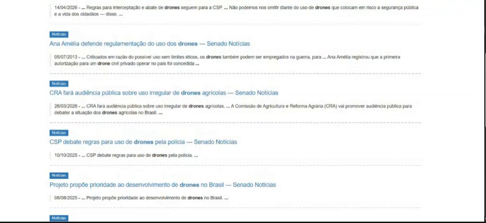

Responsável: Caio Breno de Souza Bezerra — Entrevista e observação

# Entrevista e observação

## Tabela de contribuição

A Tabela 1 registra quem atuou neste artefato.

| Integrante | Contribuição | Artefato / atividade |
| --- | --- | --- |
| [Caio Breno de Souza Bezerra](https://github.com/CaioBezerra-Dev) | Recrutamento e caracterização da participante | [Participante](entrevista-observacao.md#participante) |
| [Caio Breno de Souza Bezerra](https://github.com/CaioBezerra-Dev) | Planejamento da sessão | [Planejamento](entrevista-observacao.md#planejamento-da-sessao) |
| [Caio Breno de Souza Bezerra](https://github.com/CaioBezerra-Dev) | Roteiro da entrevista | [Roteiro](entrevista-observacao.md#roteiro-da-entrevista) |
| [Caio Breno de Souza Bezerra](https://github.com/CaioBezerra-Dev) | Protocolo de observação | [Observação](entrevista-observacao.md#protocolo-de-observacao) |
| [Caio Breno de Souza Bezerra](https://github.com/CaioBezerra-Dev) | Síntese da entrevista e registro da observação | [Resultados](entrevista-observacao.md#resultados) |
| [Caio Breno de Souza Bezerra](https://github.com/CaioBezerra-Dev) | Publicação das gravações da entrevista e da observação | [Gravações](entrevista-observacao.md#gravacoes) |

Tabela 1 — Contribuição neste artefato.

Fonte: elaboração do Grupo 06 (2026).

## Introdução

Esta página documenta a sessão de coleta de dados conduzida por Caio Breno com uma pessoa usuária do Portal do Senado Federal. A sessão aplica as duas [técnicas de coleta](../../tecnicas-coleta.md) adotadas pelo grupo, a entrevista semiestruturada e a observação da tarefa, e segue os [aspectos éticos](../../etica.md) definidos para a etapa. Os dados coletados alimentam a [persona](persona.md), o [cenário](cenario.md) e a [análise de tarefas](analise-tarefas.md) desta seção, além do [perfil do usuário](../../perfil-usuario.md) do grupo.

## Participante

A Tabela 2 caracteriza a participante sem identificá-la.

| Campo | Registro |
| --- | --- |
| Perfil de usuário | Estagiária que compila notícias do setor para um anuário. O rótulo prévio, cidadão com consulta pontual, não se confirmou: o uso é recorrente e faz parte do trabalho |
| Descrição | 24 anos, estudante de engenharia na área espacial, estagiária há cerca de seis meses. Com outros estagiários, reúne notícias da área espacial e das forças armadas |
| Tarefa de interesse | Levantar, no período do anuário, notícias e normas do setor no portal, salvar as relevantes e submetê-las à aprovação de outras pessoas do órgão |
| Recrutamento | Por conveniência, na rede de contatos do entrevistador. Há relação pessoal próxima, registrada como limitação nesta página |
| Data, local e duração | 24/09/2026, por videochamada. Entrevista de cerca de 9 minutos e observação de cerca de 3 minutos, no computador pessoal |

Tabela 2 — Caracterização da participante.

Fonte: elaboração do Grupo 06 (2026).

Nome, órgão e cargo exato não são divulgados, porque qualquer um deles permitiria identificar a pessoa (BARBOSA; SILVA, 2010, p. 140).

**Limitação conhecida.** A participante tem relação pessoal próxima com o entrevistador, o que aumenta o risco de respostas dadas para agradar. Para reduzir esse efeito, o roteiro usa perguntas abertas e neutras, o entrevistador reforça que **quem está sendo avaliado é o site, e não a participante** (BARBOSA; SILVA, 2010, p. 141), e a observação da tarefa real serve de contraponto ao que for relatado na entrevista (BARBOSA; SILVA, 2010, p. 149).

## Planejamento da sessão

Definir os objetivos é o primeiro passo de uma coleta de dados, porque são eles que determinam o que coletar e com qual técnica (BARBOSA; SILVA, 2010, p. 133). Os objetivos desta sessão são:

1. levantar os atributos da participante para o perfil do usuário do grupo;
2. entender por que, quando e como ela procura notícias no Portal do Senado;
3. observar a tarefa real no portal, para embasar o cenário e a análise de tarefas;
4. identificar dificuldades, contornos e expectativas em relação ao portal.

A Tabela 3 mostra a estrutura da sessão e o que cada parte produz.

| Parte | Atividade | Duração | Alimenta |
| :---: | --- | :---: | --- |
| — | Abertura: TCLE e permissão de gravação | 5 min | Aspectos éticos |
| 1 | Entrevista semiestruturada | 20 min | Perfil, persona e cenário |
| 2 | Observação da tarefa no ambiente da participante | 15 min | Cenário, HTA e CTT |
| 3 | Validação da persona com a participante | 10 min | Persona |

Tabela 3 — Estrutura da sessão.

Fonte: elaboração do Grupo 06 (2026).

A validação da persona fica por último para não influenciar as respostas nem o modo como a tarefa é executada. A sessão foi gravada em vídeo, com autorização. As duas gravações estão em [Resultados](entrevista-observacao.md#resultados), porque o quadro da etapa marca a coleta como item a gravar e a publicar no site. A participante usa o computador e o navegador que costuma usar no dia a dia.

## Cuidados éticos

- O TCLE é lido e assinado em duas vias antes do início, e uma via fica com a participante (BARBOSA; SILVA, 2010, p. 141).
- A permissão para gravar o áudio é pedida **antes** de ligar o gravador e confirmada logo no início da gravação (BARBOSA; SILVA, 2010, p. 140).
- Nenhuma informação interna ou sigilosa do trabalho da participante é coletada.
- A gravação da entrevista e a da observação ficam nesta página, no YouTube, na categoria não listado. A legenda com o nome da participante foi coberta. Nome, órgão e cargo exato continuam fora do texto.
- A participante pode pular perguntas, pedir pausa ou encerrar a sessão a qualquer momento, sem prejuízo.
- A participante vê como seus dados foram usados antes da publicação, na validação da persona (BARBOSA; SILVA, 2010, p. 140).

## Roteiro da entrevista

A entrevista é **semiestruturada**: o roteiro traz perguntas abertas em ordem lógica, e o entrevistador pode aprofundar respostas e mudar a ordem dos tópicos, sem perder o foco nos objetivos (BARBOSA; SILVA, 2010, p. 146). A Tabela 4 apresenta as perguntas e o atributo que cada uma investiga, segundo a lista de Hackos e Redish e de Courage e Baxter citada por Barbosa e Silva (2010, p. 134–135).

| # | Bloco | Pergunta | Atributo investigado |
| :---: | --- | --- | --- |
| 1 | Sobre você | Qual é a sua faixa de idade e a sua formação? | Dados demográficos; educação |
| 2 | Sobre você | O que você faz no trabalho, de forma geral? Há quanto tempo? | Experiência no cargo |
| 3 | Sobre você | Onde o anuário entra nas suas atividades? Quem mais participa dele? | Tarefas; relacionamentos |
| 4 | Sobre você | De 1 a 5, quanto você se vira sozinha com computador e sites? | Experiência com computadores |
| 5 | Sobre você | Quando aparece um site ou sistema novo, como você reage? Como prefere aprender? | Atitudes; estilo de aprendizado |
| 6 | Site do Senado | Quando foi a última vez que você entrou no site do Senado? Para quê? | Experiência com o produto |
| 7 | Site do Senado | Com que frequência você usa o site? Como costuma chegar a ele? | Frequência de uso; tecnologia |
| 8 | Site do Senado | O que você acha do site? O que mais gosta e o que menos gosta? | Atitudes; opinião sobre o produto |
| 9 | Site do Senado | Quando aparece uma sigla que você não conhece numa notícia, o que você faz? | Conhecimento do domínio; jargão |
| 10 | Anuário | Como funciona o anuário? O que ele reúne, para quem é, de quanto em quanto tempo sai? | Objetivos |
| 11 | Anuário | Que tipo de notícia do Senado interessa para o anuário? | Tarefas |
| 12 | Anuário | Pense na última vez que você buscou notícias do setor no site do Senado: como começou e como terminou? | Tarefa (incidente crítico) |
| 13 | Anuário | Que palavras você usa para buscar? | Idiomas e jargões |
| 14 | Anuário | Como você sabe que já encontrou tudo o que precisava? | Critério de sucesso da tarefa |
| 15 | Anuário | O que você faz com a notícia depois de encontrá-la? | Tarefas; ferramentas |
| 16 | Anuário | Já deixou de achar algo ou desistiu? O que fez então? | Problemas e contornos |
| 17 | Anuário | Se uma notícia importante ficar de fora, o que acontece? | Gravidade dos erros |
| 18 | Fechamento | Se pudesse mudar uma coisa no site para esse trabalho, o que seria? | Necessidades e expectativas |

Tabela 4 — Roteiro da entrevista semiestruturada.

Fonte: elaboração do Grupo 06 (2026), com base em BARBOSA; SILVA (2010, p. 134–135, 146–148).

As perguntas evitam induzir respostas: o roteiro usa "o que você acha de…", e não "você gosta de…" ou "por que tal coisa é ruim", formas que pressupõem a resposta ou levam o entrevistado a dizer o que acha que o entrevistador quer ouvir (BARBOSA; SILVA, 2010, p. 147).

## Protocolo de observação

Depois da entrevista, a participante executa a tarefa real no portal enquanto o entrevistador observa. A investigação contextual parte da ideia de que boa parte do trabalho não é bem descrita por quem o pratica, e por isso é preciso ver o trabalho acontecer. Nela, o entrevistador atua como aprendiz, e o usuário, como mestre que ensina fazendo e comentando o que faz (BARBOSA; SILVA, 2010, p. 166).

- **Preparação:** a participante usa o computador e o navegador habituais e começa de uma aba em branco, como começaria sozinha.
- **Instrução:** *"Imagine que você vai começar hoje o levantamento das notícias do Senado sobre o setor aeroespacial deste ano para o anuário. Faça do jeito que você faz normalmente e vá falando em voz alta o que está pensando. Eu não vou ajudar, só observar e anotar."*
- **Postura do observador:** não ajuda nem aponta caminhos. Se ela perguntar algo, a resposta é *"Como você faria se eu não estivesse aqui?"*; se ficar em silêncio, a pergunta é *"O que você está pensando agora?"*.
- **Encerramento:** depois de duas ou três notícias registradas, ou em cerca de 10 minutos.
- **Registro:** para cada passo, o que ela fez, em que tela, o que disse, se hesitou, errou ou voltou, e o horário. Também se anotam o ponto de entrada (buscador, endereço ou favorito), os termos digitados, o uso de filtros e onde as notícias foram registradas.
- **Depois da tarefa:** *"O que foi mais fácil? E o mais difícil?"* e *"É assim que você faz normalmente?"*.

Cada passo registrado vira uma operação da HTA e uma tarefa da CTT na [análise de tarefas](analise-tarefas.md).

## Resultados

A sessão aconteceu em 24/09/2026, por videochamada. A entrevista durou cerca de 9 minutos e a observação, cerca de 3. A participante usou o computador pessoal; no trabalho, usa o computador do órgão. As gravações estão abaixo. No arquivo da entrevista, a gravação já está em curso quando a participante é informada. O pedido de permissão anterior ao gravador, previsto no protocolo, não aparece nesse arquivo. Se ele ocorreu antes do corte, precisa constar do registro do TCLE.

### Gravações

Categoria no YouTube: **não listado**. Data: 24/09/2026. A legenda com o nome da participante foi coberta.

- Entrevista: [https://youtu.be/bxmG_hs1soQ](https://youtu.be/bxmG_hs1soQ)
- Observação: [https://youtu.be/c9ibBrYnL_Y](https://youtu.be/c9ibBrYnL_Y)

  <iframe
    style="position: absolute; top: 0; left: 0; width: 100%; height: 100%; border: 0;"
    src="https://www.youtube-nocookie.com/embed/bxmG_hs1soQ"
    title="Entrevista semiestruturada da sessão de coleta"
    allow="accelerometer; autoplay; clipboard-write; encrypted-media; gyroscope; picture-in-picture; web-share"
    referrerpolicy="strict-origin-when-cross-origin"
    allowfullscreen>
  </iframe>

Vídeo 1 — Entrevista semiestruturada.

Fonte: sessão de 24/09/2026.

  <iframe
    style="position: absolute; top: 0; left: 0; width: 100%; height: 100%; border: 0;"
    src="https://www.youtube-nocookie.com/embed/c9ibBrYnL_Y"
    title="Observação da tarefa no Portal do Senado"
    allow="accelerometer; autoplay; clipboard-write; encrypted-media; gyroscope; picture-in-picture; web-share"
    referrerpolicy="strict-origin-when-cross-origin"
    allowfullscreen>
  </iframe>

Vídeo 2 — Observação da tarefa, com relato em voz alta.

Fonte: sessão de 24/09/2026.

### Síntese da entrevista

Ela se avalia em 4, numa escala de 1 a 5, com computador e sites. Em site novo, explora sozinha. Em aplicativo, software ou sistema, aprende com vídeo ou com uma ferramenta de inteligência artificial. Sigla desconhecida vai para o Google.

A última visita ao portal que ela lembrou foi cerca de duas semanas antes, para notícias do setor. A equipe pesquisa ao longo de todos os meses e alterna o site de semana em semana. Ela entra pelo Google. O anuário é um compilado anual das notícias mais relevantes da área espacial e das forças armadas, público no site do órgão, para quem se interessa pelo tema. No Senado, o que interessa são as legislações que saem no setor e as inclinações que o setor está tomando.

Há dois caminhos. Para o conjunto das notícias, o menu leva a Senado Notícias. Para um tema, a lupa recebe a palavra-chave. As palavras são do próprio setor: aeroespacial, aeronáutico, drone, foguete, avião, caça, jato e nomes de empresas. Ela não tem como confirmar que achou tudo: define um período e deixa de lado o que é antigo demais. A notícia encontrada é salva e não entra direto no anuário. Passa por análise e aprovação de outras pessoas do órgão e, se for relevante, é editada. Se o período não rende, ela busca em outro site ou encerra. Notícia importante que escapa costuma chegar por outro veículo ou por rede social.

Ela gosta do visual do portal e das opções de acessibilidade na entrada. Mudaria duas coisas. A abertura mostra assunto demais, e ela quer um menu direto com os links de que precisa. A lista de resultados vem amontoada, “sem ordem nem cronológica nem de tema”, e ela quer das notícias mais recentes para as mais antigas.

### Registro da observação

A instrução foi fazer o levantamento do ano, em voz alta, sem ajuda. A Tabela 5 registra os passos. Os tempos são os da gravação.

| # | O que ela fez | Onde | O que ela disse | Hesitou, errou ou voltou? | Tempo |
| :---: | --- | --- | --- | --- | :---: |
| 1 | Pesquisou “Senado Federal” | Google | O primeiro link é o caminho de sempre. Senado Notícias aparece em seguida, mas não é o que ela costuma abrir | Não | 0:33 |
| 2 | Abriu o primeiro resultado | Portal do Senado | — | Não | 0:53 |
| 3 | Acionou a lupa e digitou “drone”, como exemplo do dia | Busca do portal | Escolhe a palavra-chave do dia | Não | 1:00 |
| 4 | Mostrou as abas Tudo, Notícias, Proposições, Pronunciamentos, Legislação e Vídeos | Resultados de “drone” | Dá para filtrar por tipo | Não | 1:10 |
| 5 | Abriu Legislação e viu normas de 2026 | Resultados, aba Legislação | — | Não | 1:18 |
| 6 | Passou para Notícias e percorreu a lista | Resultados, aba Notícias | A lista não está em ordem cronológica: itens de 2026 e, no meio, um de 2013 | Apontou a ordem como falha. Não usou “Classificar por” nem filtro de data, embora os dois estivessem na tela | 1:32 |
| 7 | Encerrou sem salvar notícia | Mesma lista | Chegar às notícias é fácil. O difícil é a ordem das publicações. Hoje só mudou o computador | A tarefa parou na triagem visual | 1:57 |

Tabela 5 — Registro da observação.

Fonte: elaboração do Grupo 06 (2026), a partir da sessão de 24/09/2026.

A Figura 1 mostra o trecho em que a ordem deixa de ser cronológica. A captura foi recortada para ficar só a lista do portal.

<figure markdown="span">
  
  <figcaption>Figura 1 — Trecho da busca por “drone”, na aba Notícias, durante a observação.</figcaption>
</figure>

Fonte: SENADO FEDERAL (2026), captura da sessão de observação.

Na Figura 1, o item de 05/07/2013 aparece entre um item de 14/04/2026 e outro de 26/03/2026. Abaixo vêm 10/10/2025 e 08/08/2025. É a falha que ela trata no olho.

### Limitações da coleta

- A relação pessoal próxima permanece, como já registrado nesta página. A observação confirma o caminho que ela descreveu: Google, primeiro resultado, lupa, aba de tipo e triagem visual.
- A sessão foi remota e no computador pessoal, não no ambiente de trabalho.
- A observação durou cerca de 3 minutos e parou antes de salvar notícia. Salvar, aprovar e editar o anuário vêm da entrevista, não da observação.
- O controle “Classificar por” estava visível e não foi usado. Não dá para afirmar que ela o procurou e não achou. O que ela fez foi filtrar a data no olho.

A [persona](persona.md), o [cenário](cenario.md) e a [análise de tarefas](analise-tarefas.md) usam este registro. A participante validou a persona no mesmo dia, sem pedir correção. O registro está em [Validação](persona.md#validacao-com-a-participante).

## Agradecimentos

Esta página contou com o apoio de ferramenta de inteligência artificial generativa na estruturação, na redação preliminar, na transcrição do áudio da sessão e na formatação Markdown. A revisão do conteúdo, a conferência das referências no livro e a coleta de dados com a participante são do autor, que segue responsável pelo que está publicado.

## Histórico de versão

| Versão | Data | Descrição | Autor(es) | Revisor(es) |
| :---: | :---: | --- | --- | --- |
| `0.1` | 21/09/2026 | Caracterização da participante, planejamento da sessão, roteiro da entrevista e protocolo de observação | [Caio Breno de Souza Bezerra](https://github.com/CaioBezerra-Dev) | A definir |
| `0.2` | 24/09/2026 | Resultados da entrevista e da observação, com correção do perfil prévio | [Caio Breno de Souza Bezerra](https://github.com/CaioBezerra-Dev) | A definir |
| `0.3` | 24/09/2026 | Gravações da entrevista e da observação publicadas na página | [Caio Breno de Souza Bezerra](https://github.com/CaioBezerra-Dev) | A definir |
| `0.4` | 24/09/2026 | Aponta a validação da persona, feita no mesmo dia | [Caio Breno de Souza Bezerra](https://github.com/CaioBezerra-Dev) | A definir |
| `0.5` | 24/09/2026 | Gravações da entrevista e da observação no YouTube, não listadas | [Caio Breno de Souza Bezerra](https://github.com/CaioBezerra-Dev) | A definir |

## Referências

[1] BARBOSA, Simone Diniz Junqueira; SILVA, Bruno Santana da. Interação humano-computador. Rio de Janeiro: Elsevier, 2010.

[2] SENADO FEDERAL. Portal do Senado Federal. Disponível em: https://www12.senado.leg.br/. Acesso em: 24 set. 2026.
