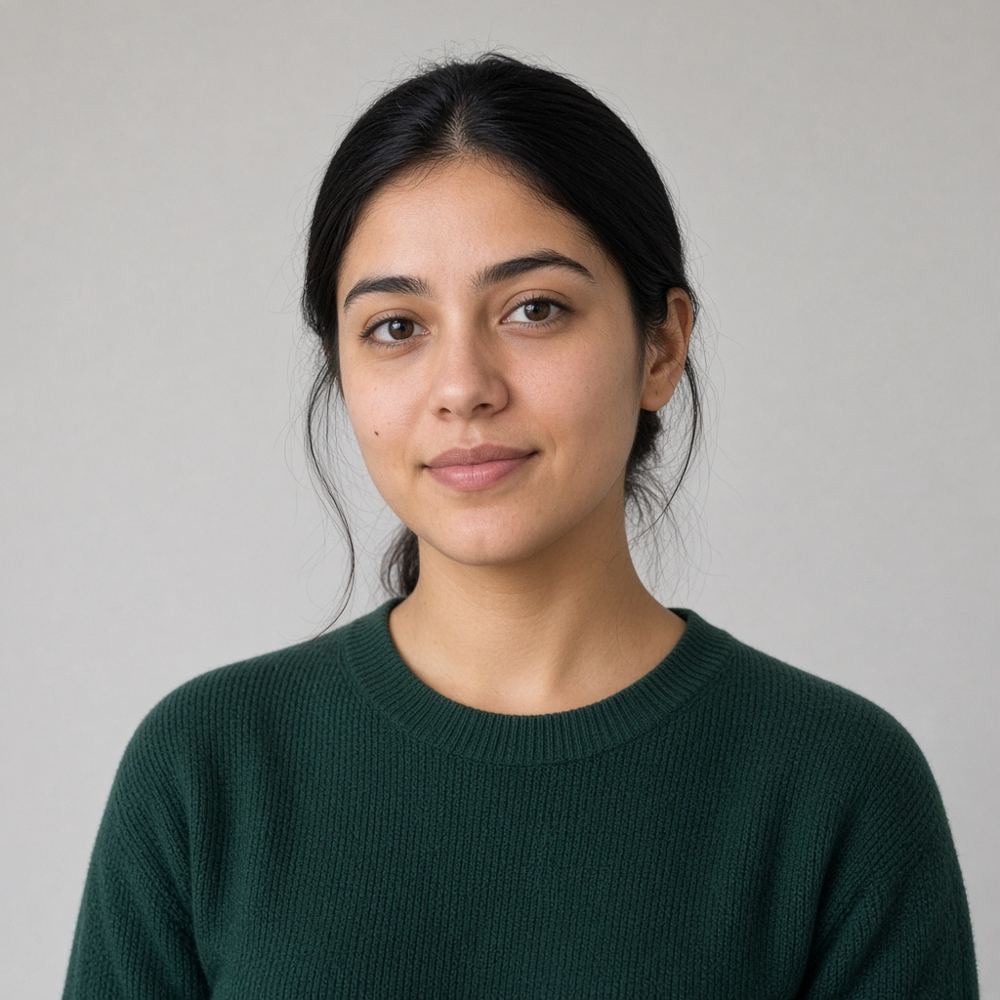

Responsável: Caio Breno de Souza Bezerra — Persona

# Persona

## Tabela de contribuição

A Tabela 1 registra quem atuou neste artefato.

| Integrante | Contribuição | Artefato / atividade |
| --- | --- | --- |
| [Caio Breno de Souza Bezerra](https://github.com/CaioBezerra-Dev) | Construção da persona | [Persona](persona.md#descricao-da-persona) |
| [Caio Breno de Souza Bezerra](https://github.com/CaioBezerra-Dev) | Objetivos pessoais e práticos | [Objetivos](persona.md#objetivos) |
| [Caio Breno de Souza Bezerra](https://github.com/CaioBezerra-Dev) | Validação com a participante | [Validação](persona.md#validacao-com-a-participante) |

Tabela 1 — Contribuição neste artefato.

Fonte: elaboração do Grupo 06 (2026).

## Introdução

Renata Moreira representa quem acompanha notícias e normas do setor aeroespacial no Portal do Senado para alimentar um anuário. O rótulo prévio era cidadão com consulta pontual. A [sessão](entrevista-observacao.md#resultados) mostrou outra coisa: o uso é recorrente, faz parte do estágio e a participante já conhece o caminho da busca. Em 24/09/2026 ela leu esta versão e aprovou: disse que as características estão de acordo com a rotina do estágio. A persona é o ator do [cenário](cenario.md), e o conjunto das personas do grupo está no [elenco](../../elenco-personas.md).

## Descrição da persona

Uma persona é um personagem fictício que representa um usuário típico, não a pessoa entrevistada (BARBOSA; SILVA, 2010, p. 176). O livro pede nome, idade e foto para ela ficar concreta, e manda deixar o passo a passo da tarefa para o [cenário](cenario.md) (p. 177). Só o nome e o retrato são inventados. O restante é o tipo que a [sessão](entrevista-observacao.md#resultados) revelou, escrito como no Exemplo 6.2 (p. 178), e não a transcrição do que ela disse naquele dia. A Figura 1 é o retrato fictício da persona.

  
  

    
Estagiária

    
Renata Moreira

    
24 anos · engenharia na área espacial · cerca de seis meses de estágio

  

Figura 1 — Retrato fictício de Renata Moreira.

Fonte: retrato gerado por inteligência artificial para esta persona (2026). Não é a participante.

Renata Moreira tem 24 anos e cursa engenharia na área espacial. Estagia há pouco tempo num órgão público, junto com outros estagiários. Parte do trabalho do grupo é acompanhar, ao longo do ano, o que sai sobre a área espacial e as forças armadas, e separar o que entra num anuário anual. O anuário fica público, para quem se interessa pelo tema. A equipe não usa uma fonte só: alterna os sites de semana em semana e guarda o que for mais relevante.

Renata não publica sozinha. O que ela separa ainda passa pela análise de outras pessoas do órgão e, se for aprovado, é editado para o anuário. Notícia importante que escapa costuma reaparecer em outro veículo. No computador ela se vira bem. Diante de um site novo, entra e explora. Diante de um sistema novo, prefere um vídeo ou uma explicação pronta a pedir ajuda na hora. Sigla que não conhece, ela busca por fora.

No portal do Senado, o hábito é chegar por um buscador, abrir o portal e pesquisar uma palavra do setor: o tema, um equipamento, uma empresa. Quando quer o noticiário inteiro, e não um assunto, ela sabe que existe um atalho direto para as notícias, mas não é o caminho do dia a dia. Gosta do visual e das opções de acessibilidade. O que atrapalha é a entrada, cheia de assuntos que não são o dela, e a lista de resultados, que mistura data e tema. Ela marca um período, descarta no olho o que é antigo e segue, sem ter como saber se achou tudo. Se o período não rende, muda de site ou encerra aquela fonte.

## Objetivos

Os objetivos não são as tarefas. A tarefa muda com o portal; o objetivo permanece (BARBOSA; SILVA, 2010, p. 180). Objetivos pessoais são simples e universais, como não perder tempo e não cometer erros; objetivos práticos fazem a ponte entre o que a organização quer e o que a pessoa quer (p. 180–181). A separação abaixo é a do Exemplo 6.3 (p. 182–183).

Objetivos pessoais:

- não perder tempo com o que não é do anuário;
- não deixar passar uma notícia relevante;
- entregar à equipe um levantamento em que ela possa confiar.

Objetivos práticos:

- manter o anuário completo com as notícias e normas do ano sobre a área espacial e as forças armadas;
- acompanhar as leis que saem sobre o setor e as inclinações que o setor está tomando;
- encaminhar para a análise da equipe, a cada rodada, o que cada fonte trouxe de relevante.

Buscar por palavra-chave, ler a lista e salvar a notícia são meios, não fins: tratá-los como objetivos seria cair nos falsos objetivos de que fala Cooper (BARBOSA; SILVA, 2010, p. 182). Esses passos ficam no [cenário](cenario.md) e na [análise de tarefas](analise-tarefas.md).

## Elementos

A Tabela 2 organiza os oito elementos de Courage e Baxter (2005 apud BARBOSA; SILVA, 2010, p. 177) e diz de que parte da sessão veio cada um.

| Elemento | Descrição | Origem |
| --- | --- | --- |
| Identidade | Renata Moreira, 24 anos, estudante de engenharia na área espacial. Nome e retrato inventados; a idade representa a faixa de quem está no início da carreira | Sessão, sintetizada |
| Status | Secundária, como proposta a confirmar no [elenco](../../elenco-personas.md). Uma persona primária precisa de uma interface que não serviria a nenhuma outra (p. 179–180). O que Renata mais precisa, a lista em ordem de data e o acesso direto às notícias, tende a ser atendido por uma interface feita para quem procura notícias no portal. O que é só dela é saber quando o período acabou | Proposta do autor |
| Objetivos | Os das listas acima: fins estáveis, não os cliques de uma busca | Sessão, sintetizada |
| Habilidades | Confortável com sites; aprende sistema novo com vídeo ou explicação. Conhece a busca do portal o bastante para a tarefa, sem ser especialista em tramitação | Sessão, sintetizada |
| Tarefas | Em linhas gerais: levantar notícias e normas do setor no período do anuário, descartar o que é antigo e encaminhar o que segue para aprovação. Frequência: ao longo de todo o ano, com a fonte mudando de semana em semana; o Senado é uma das fontes. Importância: média a alta, porque o anuário depende do levantamento, mas notícia perdida costuma chegar por outro veículo. Duração: não medida; na observação, ir do buscador até a lista de notícias levou cerca de um minuto. O detalhe de uma busca está no cenário | Sessão, sintetizada |
| Relacionamentos | Outros estagiários; quem aprova a notícia no órgão; leitores do anuário | Sessão, sintetizada |
| Requisitos | Atalho até o que precisa: “gostaria de um menu direto com os links que preciso”. Resultados em ordem de data e de tema: “não é difícil ignorar as antigas, mas seria muito mais simples”. Um jeito de saber que o período acabou. Guardar a notícia sem publicá-la ainda | Sessão, sintetizada; citações da entrevista |
| Expectativas | A busca por palavra leva ao tema e separa notícia, proposição e norma. A lista deveria vir da mais nova para a mais antiga | Sessão, sintetizada |

Tabela 2 — Elementos da persona.

Fonte: elaboração do Grupo 06 (2026), com base em BARBOSA; SILVA (2010, p. 177) e na sessão de 24/09/2026.

## Validação com a participante

Em 24/09/2026 a participante ouviu a descrição e os objetivos, lidos a partir desta página. Não pediu correção. Disse que todas as características estão de acordo, que a rotina da persona é basicamente o que ela faz no estágio, que as informações estão certas, e aprovou a persona. A aprovação vale para o tipo de usuário que faz esse trabalho, não para a persona ser ela: só o nome e o retrato são inventados (BARBOSA; SILVA, 2010, p. 177).

A validação foi mais curta do que o roteiro previa. A descrição foi lida de uma vez, sem a revisão linha a linha e sem a pergunta sobre o que poderia identificá-la. Como a participante é próxima do entrevistador, a aprovação sem correções pode ser, em parte, a resposta que ela achou que o entrevistador queria ouvir (BARBOSA; SILVA, 2010, p. 147). Por isso a persona se apoia também no que foi observado, e não só na aprovação.

O Vídeo 1 registra a validação. Categoria no YouTube: **não listado**. Link: [https://youtu.be/-_NGav1nuwM](https://youtu.be/-_NGav1nuwM). Data: 24/09/2026. A legenda com o nome da participante foi coberta.

??? note "Vídeo 1 — Validação da persona com a participante"

    

      <iframe
        loading="lazy"
        style="position: absolute; top: 0; left: 0; width: 100%; height: 100%; border: 0;"
        src="https://www.youtube-nocookie.com/embed/-_NGav1nuwM"
        title="Validação da persona Renata Moreira"
        allow="accelerometer; autoplay; clipboard-write; encrypted-media; gyroscope; picture-in-picture; web-share"
        referrerpolicy="strict-origin-when-cross-origin"
        allowfullscreen>
      </iframe>
    

    
Vídeo 1 — Validação da persona com a participante.

    
Fonte: sessão de 24/09/2026.

A Tabela 3 registra o resultado.

| Data | Confirmado pela participante | Corrigido a pedido da participante | Versão final aprovada |
| :---: | --- | --- | :---: |
| 24/09/2026 | Características de acordo com a rotina do estágio. Informações certas. | Nada | Sim |

Tabela 3 — Registro da validação da persona.

Fonte: elaboração do Grupo 06 (2026), a partir da validação de 24/09/2026.

## Agradecimentos

Esta página contou com o apoio de ferramenta de inteligência artificial generativa na estruturação, na redação preliminar, na transcrição das gravações, na formatação Markdown e na geração do retrato fictício da Figura 1. A revisão do conteúdo, a coleta e a validação com a participante são do autor, que segue responsável pelo que está publicado.

## Histórico de versão

| Versão | Data | Descrição | Autor(es) | Revisor(es) |
| :---: | :---: | --- | --- | --- |
| `0.1` | 21/09/2026 | Estrutura da persona e plano de validação | [Caio Breno de Souza Bezerra](https://github.com/CaioBezerra-Dev) | A definir |
| `0.2` | 24/09/2026 | Persona Renata Moreira preenchida com a sessão, ainda sem o ok da participante | [Caio Breno de Souza Bezerra](https://github.com/CaioBezerra-Dev) | A definir |
| `0.3` | 24/09/2026 | Retrato fictício e redação no formato dos Exemplos 6.2 e 6.3 | [Caio Breno de Souza Bezerra](https://github.com/CaioBezerra-Dev) | A definir |
| `0.4` | 24/09/2026 | Narrativa generalizada: a persona deixa de repetir o episódio da sessão | [Caio Breno de Souza Bezerra](https://github.com/CaioBezerra-Dev) | A definir |
| `1.0` | 24/09/2026 | Validação registrada: a participante aprovou a persona sem correções | [Caio Breno de Souza Bezerra](https://github.com/CaioBezerra-Dev) | A definir |
| `1.1` | 24/09/2026 | Vídeo da validação no YouTube, não listado | [Caio Breno de Souza Bezerra](https://github.com/CaioBezerra-Dev) | A definir |
| `1.2` | 24/09/2026 | Recoloca o retrato no cartão e tira a frase de destaque | [Caio Breno de Souza Bezerra](https://github.com/CaioBezerra-Dev) | A definir |
| `1.3` | 25/09/2026 | Objetivos sem falsos objetivos, status proposto, frequência e duração da tarefa, citações nos requisitos, limitação da validação e origem do retrato | [Caio Breno de Souza Bezerra](https://github.com/CaioBezerra-Dev) | A definir |

## Referências

[1] BARBOSA, Simone Diniz Junqueira; SILVA, Bruno Santana da. Interação humano-computador. Rio de Janeiro: Elsevier, 2010.

[2] COURAGE, Catherine; BAXTER, Kathy. Understanding your users. San Francisco: Morgan Kaufmann, 2005.
