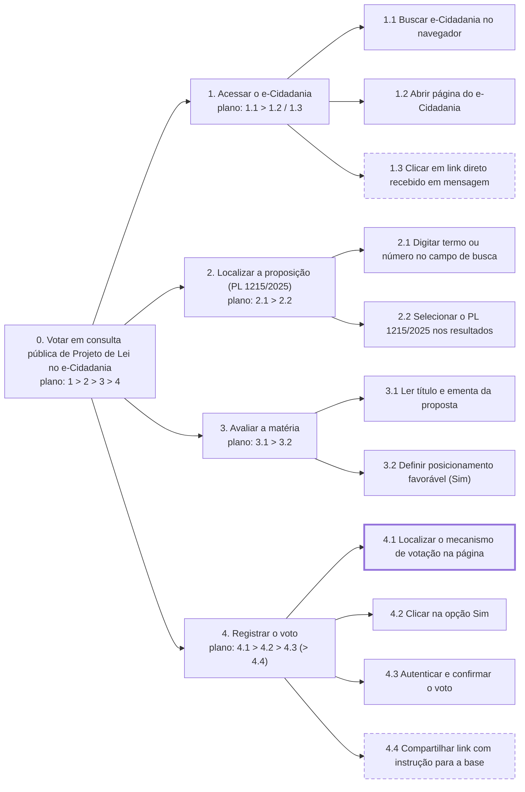
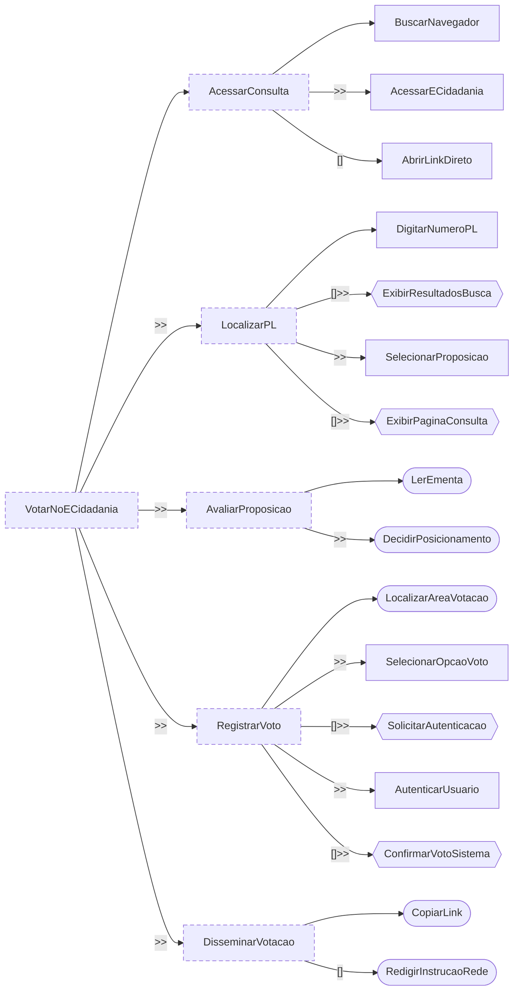

<span class="owner">Responsável: Heitor Pinheiro Gonçalves das Chagas — Análise de tarefas</span>

# Análise de tarefas

## Tabela de contribuição

A Tabela 1 registra quem atuou neste artefato.

| Integrante | Contribuição | Artefato / atividade |
| --- | --- | --- |
| [Heitor Pinheiro Gonçalves das Chagas](https://github.com/Heitorovski01) | Definição da tarefa e dos objetivos da análise | [Tarefa analisada](analise-tarefas.md#tarefa-analisada) |
| [Heitor Pinheiro Gonçalves das Chagas](https://github.com/Heitorovski01) | Análise Hierárquica de Tarefas (HTA) | [HTA](analise-tarefas.md#analise-hierarquica-de-tarefas-hta) |
| [Heitor Pinheiro Gonçalves das Chagas](https://github.com/Heitorovski01) | Árvore de Tarefas Concorrentes (CTT) | [CTT](analise-tarefas.md#arvore-de-tarefas-concorrentes-ctt) |

<p class="caption">Tabela 1 — Contribuição neste artefato.</p>
<p class="source">Fonte: elaboração do Grupo 06 (2026).</p>

## Introdução

Esta página modela a tarefa central do [cenário](cenario.md) utilizando duas técnicas consagradas de IHC: a **Análise Hierárquica de Tarefas (HTA)** e a **Árvore de Tarefas Concorrentes (CTT)**. Ambas as representações derivam diretamente dos dados empíricos coletados durante a [sessão de observação da tarefa e entrevista](entrevista-observacao.md#protocolo-de-observacao) realizada com a participante P3 em 27/09/2026. Quando se analisa um sistema em funcionamento, a análise de tarefas descreve detalhadamente o comportamento observável e as operações mentais da pessoa usuária (BARBOSA; SILVA, 2010, p. 191), permitindo identificar com precisão as falhas de usabilidade da interface atual do módulo e-Cidadania.

## Tarefa analisada

Conforme orienta Diaper (2003 apud BARBOSA; SILVA, 2010, p. 195), a análise deve explicitar com clareza os objetivos do usuário e da avaliação, as evidências de sucesso e as consequências de eventuais falhas. A Tabela 2 sintetiza essas definições.

| Campo | Registro |
| --- | --- |
| Objetivo do usuário | Localizar a consulta pública do Projeto de Lei nº 1215/2025 e registrar o voto favorável ("Sim") no e-Cidadania para fortalecer pauta de interesse social |
| Usuário | [Letícia Oliveira](persona.md), secretária técnica de movimento social e estudante |
| Sistema | Portal do Senado Federal, com ênfase no módulo e-Cidadania (Consultas Públicas) |
| Objetivo da análise | Mapear o fluxo da tarefa, evidenciando as barreiras na localização da área de votação (CTA) e os impactos do desempenho da página |
| Evidência de sucesso | Voto "Sim" registrado no sistema com emissão do feedback de confirmação na tela. Na sessão, a participante encontrou a ementa com rapidez, mas enfrentou hesitação e atraso até encontrar o mecanismo de voto |
| Consequência da falha | Frustração do usuário, abandono da consulta pública sem votar e perda de engajamento popular nas deliberações legislativas |
| Fonte dos dados | Observação da tarefa com relato em voz alta e entrevista de 27/09/2026 |

<p class="caption">Tabela 2 — Tarefa analisada e objetivos da análise.</p>
<p class="source">Fonte: elaboração do Grupo 06 (2026), com base em Barbosa e Silva (2010, p. 195).</p>

## Análise Hierárquica de Tarefas (HTA)

A HTA decompõe o objetivo principal em subobjetivos até o nível das **operações**. Cada operação é caracterizada pelo seu disparador (*input*), pelas ações executadas e pela condição de término (*feedback*). A articulação entre os subobjetivos constitui o **plano**, que define as regras de ordenação (sequência, seleção ou paralelismo) (BARBOSA; SILVA, 2010, p. 193). A Tabela 3 resume a legenda das notações utilizadas no diagrama e nas tabelas da HTA.

| Notação | Significado |
| --- | --- |
| `0`, `1`, `1.1`, `4.1` | Posição hierárquica do objetivo; `0` indica o objetivo global |
| `plano: 1 > 2` | Sequência fixa: o passo 1 antecede obrigatoriamente o passo 2 |
| `plano: 1 / 2` | Regra de seleção: executa 1 ou 2, conforme as condições do contexto |
| `plano: 1 + 2` | Paralelismo: os passos podem ocorrer simultaneamente ou em ordem livre |
| Caixa com borda contínua | Passo observado diretamente durante a sessão de teste |
| Caixa com borda tracejada | Passo relatado na entrevista (hábito rotineiro não executado na gravação) |
| Caixa com borda grossa | Ponto crítico em que foi detectado problema de usabilidade |
| *input* · *feedback* | Disparador da operação · indicador perceptível de sua conclusão |
| Problema · Recomendação | Barreira de usabilidade identificada · diretriz de melhoria para o reprojeto |

<p class="caption">Tabela 3 — Legenda da notação da HTA.</p>
<p class="source">Fonte: elaboração do Grupo 06 (2026), com base em Barbosa e Silva (2010, p. 193–195).</p>

A Figura 1 ilustra o diagrama da HTA em árvore horizontal para facilitar a visualização hierárquica na página. A Tabela 4 apresenta a especificação tabular correspondente no formato da Tabela 6.3 de Barbosa e Silva (2010, p. 194–195).



<p class="caption">Figura 1 — Diagrama HTA da votação em consulta pública no e-Cidadania.</p>
<p class="source">Fonte: elaboração do Grupo 06 (2026), com base na sessão com a participante P3.</p>

A Tabela 4 detalha cada subobjetivo e operação, explicitando os problemas observados e as recomendações de design.

| Objetivos / operações | Problemas e recomendações |
| --- | --- |
| 0. Votar em consulta pública de Projeto de Lei no e-Cidadania `1 > 2 > 3 > 4` | **input:** Convocação do movimento social ou interesse cívico em apoiar a agricultura familiar. **feedback:** Comprovante na tela de voto registrado com sucesso. **plano:** Acessar o e-Cidadania, localizar a matéria, avaliar a ementa e registrar o voto. |
| 1. Acessar o e-Cidadania `1.1 > 1.2 / 1.3` | **input:** Necessidade de acessar a consulta pública. **feedback:** Tela inicial do portal e-Cidadania ou página da matéria aberta. **plano:** Pesquisar no navegador e abrir o portal, ou clicar no link direto recebido por mensagem. |
| 1.1 Buscar "e-Cidadania Senado" no navegador | **input:** Aba do navegador aberta. **feedback:** Lista de resultados do buscador. Observado. |
| 1.2 Abrir página do e-Cidadania | **input:** Link oficial do e-Cidadania na busca. **feedback:** Página principal do e-Cidadania carregada. Observado. |
| 1.3 Clicar em link direto recebido em mensagem | **input:** Mensagem recebida no WhatsApp/Telegram com link da matéria. **feedback:** Página da consulta pública aberta diretamente. Relatado como rotina frequente, não observado na sessão. |
| 2. Localizar a proposição (PL 1215/2025) `2.1 > 2.2` | **input:** Campo de busca visível no e-Cidadania. **feedback:** Página da consulta pública do PL 1215/2025 aberta. **plano:** Digitar o número ou tema no campo e selecionar o resultado correspondente. |
| 2.1 Digitar termo ou número no campo de busca | **input:** Barra de busca do e-Cidadania. Na sessão, "PL 1215/2025". **feedback:** Lista de proposições correspondentes exibida. Observado: a participante achou fácil encontrar a matéria pelo campo de busca. |
| 2.2 Selecionar o PL 1215/2025 nos resultados | **input:** Card ou link do PL 1215/2025 na lista. **feedback:** Página de detalhamento da consulta pública carregada. Observado. |
| 3. Avaliar a matéria `3.1 > 3.2` | **input:** Página da consulta pública carregada. **feedback:** Decisão de voto favorável confirmada internamente. **plano:** Ler a ementa e confirmar alinhamento com a pauta. |
| 3.1 Ler título e ementa da proposta | **input:** Cabeçalho e texto de resumo do projeto na tela. **feedback:** Compreensão do teor (aquisição de alimentos e crédito rural). Observado: boa legibilidade e rapidez de leitura. |
| 3.2 Definir posicionamento favorável ("Sim") | **input:** Ementa lida. **feedback:** Intenção de voto estabelecida. Observado. |
| 4. Registrar o voto `4.1 > 4.2 > 4.3 (> 4.4)` | **input:** Intenção de votar "Sim". **feedback:** Voto computado e comprovante emitido. **plano:** Encontrar a área de voto, selecionar "Sim", autenticar-se e, opcionalmente, repassar o link com orientações. |
| 4.1 Localizar o mecanismo de votação na página | **input:** Tela da proposição aberta. **feedback:** Botões "Sim" e "Não" localizados na tela. Observado. **Problema:** A área de votação (CTA) não possui destaque visual imediato; fica posicionada abaixo de blocos institucionais e gráficos de votação parcial, forçando a usuária a rolar a tela repetidas vezes e procurar ativamente onde clicar para votar. **Recomendação:** Inserir botões de ação ("Votar a Favor" / "Votar Contra") em destaque (*above the fold*), fixos ou logo abaixo da ementa principal. |
| 4.2 Clicar na opção "Sim" | **input:** Botão "Sim" visível. **feedback:** Opção marcada e tela/modal de login solicitada. Observado. |
| 4.3 Autenticar e confirmar o voto | **input:** Modal de login (gov.br ou rede social). **feedback:** Mensagem de confirmação de voto computado. Observado. |
| 4.4 Compartilhar link com instrução para a base | **input:** Consulta concluída. **feedback:** Mensagem enviada nos grupos alertando onde fica o botão de voto. Relatado na entrevista como necessidade compensatória diante da dificuldade da interface. |

<p class="caption">Tabela 4 — HTA da votação em consulta pública, no formato da Tabela 6.3 do livro.</p>
<p class="source">Fonte: elaboração do Grupo 06 (2026), a partir da sessão de 27/09/2026; formato de Barbosa e Silva (2010, p. 194–195).</p>

## Árvore de Tarefas Concorrentes (CTT)

A Árvore de Tarefas Concorrentes (CTT) complementa a HTA ao classificar a natureza de cada tarefa quanto ao seu executor (usuário, sistema ou interação mútua) e ao formalizar os operadores temporais entre elas, apoiando tanto a análise diagnóstica quanto a especificação de novas soluções de diálogo (BARBOSA; SILVA, 2010, p. 203–205; PATERNÒ, 2000). A Tabela 5 descreve os quatro tipos de tarefas, e a Tabela 6 apresenta os operadores temporais da técnica.

| Tipo de tarefa | Quem executa | Representação gráfica |
| --- | --- | --- |
| Tarefa do usuário | O usuário, em atividade cognitiva ou física externa ao sistema | Caixa com cantos arredondados |
| Tarefa do sistema | O sistema computacional, processando ou exibindo dados de modo autônomo | Hexágono |
| Tarefa interativa | Interação mútua entre usuário e sistema por diálogo na interface | Retângulo |
| Tarefa abstrata | Nível intermediário de agrupamento e decomposição hierárquica | Retângulo com borda tracejada |

<p class="caption">Tabela 5 — Tipos de tarefa da CTT.</p>
<p class="source">Fonte: elaboração do Grupo 06 (2026), com base em Barbosa e Silva (2010, p. 203).</p>

| Operador | Nome | Significado |
| :---: | --- | --- |
| `T1 >> T2` | Ativação sequencial | T2 só pode ser iniciada após a conclusão bem-sucedida de T1 |
| `T1 []>> T2` | Ativação com passagem de informação | T2 é ativada após T1, recebendo o dado ou parâmetro gerado por T1 |
| `T1 [] T2` | Escolha | A execução de uma das tarefas desabilita mutuamente a outra |
| `T1 ||| T2` | Concorrência | As tarefas podem ser realizadas concomitantemente ou em qualquer ordem |
| `T1 [> T2` | Desativação | T1 é interrompida imediatamente com o início de T2 |

<p class="caption">Tabela 6 — Operadores temporais da CTT.</p>
<p class="source">Fonte: elaboração do Grupo 06 (2026), com base em Barbosa e Silva (2010, p. 203–204) e Paternò (2000).</p>

A Figura 2 formaliza a CTT em notação textual estruturada, mantendo estrita correspondência hierárquica com a decomposição da HTA.

```text
VotarNoECidadania =
    AcessarConsulta >> LocalizarPL >> AvaliarProposicao >> RegistrarVoto >> DisseminarVotacao

AcessarConsulta =
    (BuscarNavegador >> AcessarECidadania) [] AbrirLinkDireto

LocalizarPL =
    DigitarNumeroPL []>> ExibirResultadosBusca >> SelecionarProposicao []>> ExibirPaginaConsulta

AvaliarProposicao =
    LerEmenta >> DecidirPosicionamento

RegistrarVoto =
    LocalizarAreaVotacao >> SelecionarOpcaoVoto []>> SolicitarAutenticacao >> AutenticarUsuario []>> ConfirmarVotoSistema

DisseminarVotacao =
    CopiarLink [] RedigirInstrucaoRede
```

<p class="caption">Figura 2 — CTT da votação em consulta pública em notação textual.</p>
<p class="source">Fonte: elaboração do Grupo 06 (2026), a partir da sessão empírica de 27/09/2026.</p>

A Tabela 7 discrimina a classificação de cada tarefa presente na árvore CTT.

| Tarefa | Tipo | Quem executa |
| --- | --- | --- |
| VotarNoECidadania, AcessarConsulta, LocalizarPL, AvaliarProposicao, RegistrarVoto, DisseminarVotacao | Abstrata | Agrupamento estrutural da decomposição |
| BuscarNavegador, AcessarECidadania, AbrirLinkDireto, DigitarNumeroPL, SelecionarProposicao, SelecionarOpcaoVoto, AutenticarUsuario | Interativa | Usuária atua diretamente nos controles e o sistema responde |
| ExibirResultadosBusca, ExibirPaginaConsulta, SolicitarAutenticacao, ConfirmarVotoSistema | Do sistema | O portal processa a requisição e atualiza o estado da interface |
| LerEmenta, DecidirPosicionamento, LocalizarAreaVotacao | Do usuário | Atividade cognitiva de leitura, decisão e varredura visual |
| CopiarLink, RedigirInstrucaoRede | Do usuário | Ações operacionais executadas fora do ambiente do portal (WhatsApp/redes) |

<p class="caption">Tabela 7 — Tipo de cada tarefa da CTT.</p>
<p class="source">Fonte: elaboração do Grupo 06 (2026), com base em Barbosa e Silva (2010, p. 203).</p>

A Figura 3 apresenta o diagrama da Árvore de Tarefas Concorrentes (CTT), com tarefas organizadas hierarquicamente e conectadas pelos operadores temporais definidos.



<p class="caption">Figura 3 — Diagrama CTT da tarefa de votação em consulta pública no e-Cidadania.</p>
<p class="source">Fonte: elaboração do Grupo 06 (2026), a partir da sessão empírica de 27/09/2026; notação de Barbosa e Silva (2010, p. 203–204).</p>

## Agradecimentos

Esta página contou com o auxílio de ferramenta de inteligência artificial generativa na estruturação dos modelos, na redação preliminar e na formatação dos diagramas Mermaid e tabelas em Markdown. A coleta empírica, a identificação dos problemas na sessão de teste e a validação das análises são do autor, que permanece responsável pela publicação.

## Histórico de versão

| Versão | Data | Descrição | Autor(es) | Revisor(es) |
| :---: | --- | --- | --- | --- |
| `0.1` | 27/09/2026 | Estruturação inicial da análise de tarefas e definição das legendas | [Heitor Pinheiro Gonçalves das Chagas](https://github.com/Heitorovski01) | [Caio Breno de Souza Bezerra](https://github.com/CaioBezerra-Dev) |
| `1.0` | 27/09/2026 | Elaboração completa da HTA e da CTT a partir da observação empírica com o PL 1215/2025 | [Heitor Pinheiro Gonçalves das Chagas](https://github.com/Heitorovski01) | [Caio Breno de Souza Bezerra](https://github.com/CaioBezerra-Dev) |

## Referências

[1] BARBOSA, Simone Diniz Junqueira; SILVA, Bruno Santana da. Interação humano-computador. Rio de Janeiro: Elsevier, 2010.

[2] DIAPER, Dan. Understanding tasks for HCI: The task-oriented approach. In: DIAPER, Dan; STANTON, Neville (Ed.). The handbook of task analysis for human-computer interaction. Mahwah, NJ: Lawrence Erlbaum Associates, 2003.

[3] PATERNÒ, Fabio. Model-based design and evaluation of interactive applications. London: Springer, 2000.

[4] SENADO FEDERAL. Portal e-Cidadania. Disponível em: https://www12.senado.leg.br/ecidadania. Acesso em: 27 set. 2026.
