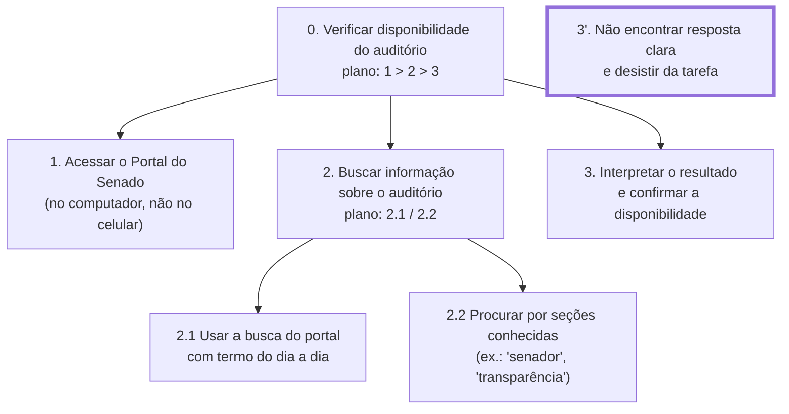
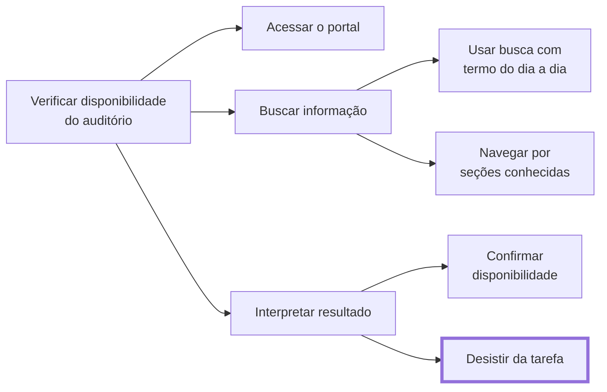

<span class="owner">Responsável: Israel Soares — Análise de tarefas</span>

# Análise de tarefas

## Tabela de contribuição

A Tabela 1 registra quem atuou neste artefato.

| Integrante | Contribuição | Artefato / atividade |
| --- | --- | --- |
| [Israel Soares](https://github.com/IsraelSoares-25) | Definição da tarefa e dos objetivos da análise | [Tarefa analisada](analise-tarefas.md#tarefa-analisada) |
| [Israel Soares](https://github.com/IsraelSoares-25) | HTA | [HTA](analise-tarefas.md#analise-hierarquica-de-tarefas-hta) |
| [Israel Soares](https://github.com/IsraelSoares-25) | CTT | [CTT](analise-tarefas.md#arvore-de-tarefas-concorrentes-ctt) |

<p class="caption">Tabela 1 — Contribuição neste artefato.</p>
<p class="source">Fonte: elaboração do autor (2026).</p>

## Introdução

Esta página modela a tarefa do [cenário](cenario.md#narrativa): Marta Oliveira tentando verificar, no Portal do Senado Federal, se o auditório está disponível para uso — tarefa que ela não conclui. A modelagem usa duas técnicas: a Análise Hierárquica de Tarefas (HTA), que decompõe o objetivo em passos, e a Árvore de Tarefas Concorrentes (CTT), que descreve a ordem e a relação temporal entre esses passos.

## Tarefa analisada

A Tabela 2 registra os objetivos da análise.

| Campo | Registro |
| --- | --- |
| Objetivo do usuário | Confirmar se o auditório do Senado está disponível para uso numa data específica |
| Usuário | Marta Oliveira, servidora pública com pouca familiaridade técnica com sites institucionais |
| Sistema | Portal do Senado Federal (busca e seções institucionais) |
| Objetivo da análise | Entender em que passo a tarefa falha e por que a usuária desiste antes de concluir |
| Evidência de sucesso | A usuária encontra uma resposta clara sobre a disponibilidade do auditório |
| Consequência da falha | A usuária desiste da tarefa e recorre a um canal fora do site (ex.: perguntar a alguém, ligar) |
| Fonte dos dados | Entrevista e observação com a participante da persona Marta Oliveira |

<p class="caption">Tabela 2 — Tarefa analisada e objetivos da análise.</p>
<p class="source">Fonte: elaboração do autor (2026), com base em BARBOSA; SILVA (2010, p. 195).</p>

## Análise Hierárquica de Tarefas (HTA)

A HTA decompõe o objetivo em operações (o que a usuária faz) e planos (em que ordem ou condição cada operação ocorre).

A Tabela 3 é a legenda da notação.

| Notação | Significado |
| --- | --- |
| `0`, `1`, `1.1`, `3.2.1` | Posição do objetivo na hierarquia; `0` é o objetivo principal |
| `plano: 1 > 2` | Plano em sequência: primeiro 1, depois 2 |
| `plano: 1 / 2` | Plano com regra de seleção: 1 ou 2, conforme a situação |
| `plano: 1 + 2` | Plano em paralelo: 1 e 2, em qualquer ordem ou ao mesmo tempo |
| Caixa com borda contínua | Passo observado na sessão |
| Caixa com borda tracejada | Passo relatado na entrevista, não observado diretamente |
| Caixa com borda grossa | Ponto em que há problema registrado na tabela de operações |
| *input* · *feedback* | O que dispara a operação · o que indica que ela foi concluída |
| Problema · Recomendação | Dificuldade observada naquele ponto · mudança proposta para o reprojeto |

<p class="caption">Tabela 3 — Legenda da notação da HTA.</p>
<p class="source">Fonte: elaboração do autor (2026), com base em BARBOSA; SILVA (2010, p. 193–195).</p>



<p class="caption">Figura 1 — HTA da tarefa analisada.</p>
<p class="source">Fonte: elaboração do autor (2026).</p>

A Tabela 4 é o equivalente em tabela do diagrama.

| Objetivos / operações | Problemas e recomendações |
| --- | --- |
| **1. Acessar o Portal do Senado.** *input*: necessidade de resolver a tarefa administrativa. *feedback*: página inicial carregada. Passo observado: trocou o celular pelo computador para essa tarefa | Sem problema registrado neste passo |
| **2. Buscar informação sobre o auditório**, por busca (2.1) ou por seções conhecidas (2.2). *input*: página inicial carregada. *feedback*: lista de resultados ou seção aberta. Passo relatado e parcialmente observado | Problema: os termos que a usuária conhece (linguagem do dia a dia) não coincidem com o vocabulário técnico do portal. Recomendação: a busca reconhecer sinônimos e termos coloquiais, ou sugerir a seção certa a partir deles |
| **3. Interpretar o resultado e confirmar a disponibilidade.** *input*: resultado da busca. *feedback*: confirmação de que o auditório está livre ou ocupado | Problema (borda grossa): a busca "tem uma deficiência" e não devolve uma resposta clara; a usuária não tem como saber se o termo usado é o errado ou se a informação simplesmente não está ali. Resultado: desiste da tarefa. Recomendação: indicar quando uma busca não encontrou nada relevante e sugerir termos alternativos ou um caminho direto (ex.: uma seção de "reserva de espaços") |

<p class="caption">Tabela 4 — Operações da HTA, com input, feedback, plano, problema e recomendação.</p>
<p class="source">Fonte: elaboração do autor (2026).</p>

## Árvore de Tarefas Concorrentes (CTT)

A CTT descreve a mesma tarefa da HTA, mas com notação temporal — útil para mostrar que a escolha entre buscar (2.1) e navegar por seções (2.2) é uma alternativa, e não uma sequência fixa.

A Tabela 5 lista os operadores temporais usados.

| Operador | Nome | Significado |
| :---: | --- | --- |
| `T1 >> T2` | Ativação | T2 só começa depois que T1 termina |
| `T1 []>> T2` | Ativação com passagem de informação | Além disso, T1 passa a T2 a informação que produziu |
| `T1 [] T2` | Escolha | Ao iniciar uma das tarefas, a outra fica desabilitada |
| `T1 [> T2` | Desativação | T1 é interrompida por completo por T2 |

<p class="caption">Tabela 5 — Operadores temporais da CTT usados nesta análise.</p>
<p class="source">Fonte: elaboração do autor (2026), com base em BARBOSA; SILVA (2010, p. 203–204) e PATERNÒ (2000).</p>

Notação textual da CTT:

```text
VerificarDisponibilidadeAuditorio =
    AcessarPortal
    []>> BuscarInformacao
    []>> InterpretarResultado

BuscarInformacao =
    UsarBuscaComTermoDoDiaADia [] NavegarPorSecoesConhecidas

InterpretarResultado =
    ConfirmarDisponibilidade [> DesistirDaTarefa
```

<p class="caption">Figura 2 — CTT da tarefa em notação textual.</p>
<p class="source">Fonte: elaboração do autor (2026).</p>

A Tabela 6 diz o tipo de cada tarefa.

| Tarefa | Tipo | Quem executa |
| --- | --- | --- |
| Acessar o portal | Interação | Usuária |
| Usar a busca com termo do dia a dia | Interação | Usuária |
| Navegar por seções conhecidas | Interação | Usuária |
| Interpretar resultado | Cognitiva | Usuária |
| Confirmar disponibilidade | Cognitiva | Usuária |
| Desistir da tarefa | Cognitiva | Usuária |

<p class="caption">Tabela 6 — Tipo de cada tarefa da CTT.</p>
<p class="source">Fonte: elaboração do autor (2026), com base em BARBOSA; SILVA (2010, p. 203).</p>



<p class="caption">Figura 3 — Árvore CTT da tarefa.</p>
<p class="source">Fonte: elaboração do autor (2026).</p>

## Teste de usabilidade
 
O Vídeo 4 registra o teste de usabilidade que embasa a tarefa modelada acima: a tentativa da participante de verificar a lei de mals tratos aos animais no Portal do Senado. Categoria no YouTube: a definir. Link: [https://youtu.be/1C8-P9m7bwg](https://youtu.be/1C8-P9m7bwg). Data: a definir.
 
??? note "Vídeo 4 — Teste de usabilidade da tarefa analisada"
 
    <div style="position: relative; width: 100%; padding-bottom: 56.25%; margin: 1.5rem 0; height: 0; overflow: hidden; border-radius: 0.8rem; box-shadow: 0 8px 24px rgba(10, 35, 66, 0.12);">
      <iframe
        loading="lazy"
        style="position: absolute; top: 0; left: 0; width: 100%; height: 100%; border: 0;"
        src="https://www.youtube-nocookie.com/embed/1C8-P9m7bwg"
        title="Teste de usabilidade — tarefa de Marta Oliveira"
        allow="accelerometer; autoplay; clipboard-write; encrypted-media; gyroscope; picture-in-picture; web-share"
        referrerpolicy="strict-origin-when-cross-origin"
        allowfullscreen>
      </iframe>
    </div>
 
    <p class="caption">Vídeo 4 — Teste de usabilidade da tarefa analisada.</p>
    <p class="source">Fonte: elaboração do autor (2026).</p>

## Agradecimentos

Esta página contou com o apoio de ferramenta de inteligência artificial generativa na formatação Markdown e na redação preliminar do conteúdo. A revisão do conteúdo e a responsabilidade pelo que está publicado são do autor.

## Histórico de versão

| Versão | Data | Descrição | Autor(es) | Revisor(es) |
| :---: | :---: | --- | --- | --- |
| `0.1` | | Estrutura inicial do artefato | [Israel Soares](https://github.com/IsraelSoares-25) | A definir |
| `0.2` | 27/09/2026 | HTA e CTT preenchidas com a tarefa da persona Marta Oliveira | [Israel Soares](https://github.com/IsraelSoares-25) | A definir |

## Referências

[1] BARBOSA, Simone Diniz Junqueira; SILVA, Bruno Santana da. Interação humano-computador. Rio de Janeiro: Elsevier, 2010.

[2] PATERNÒ, Fabio. Model-based design and evaluation of interactive applications. London: Springer, 2000.
