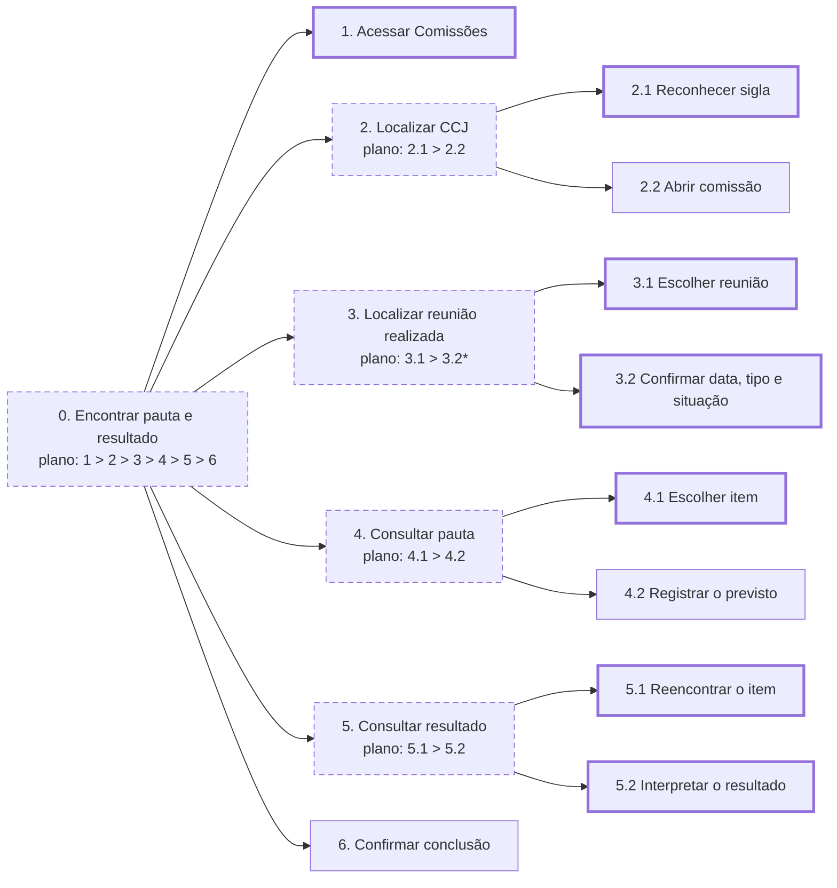
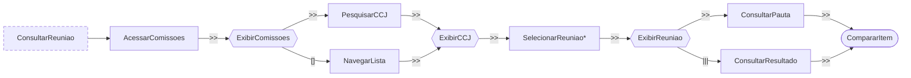

<span class="owner">Responsável: Luís Henrique Luna de Arruda — Análise de tarefas</span>

# Análise de tarefas

## Tabela de contribuição

| Integrante | Contribuição | Artefato / atividade |
| --- | --- | --- |
| [Luís Henrique Luna de Arruda](https://github.com/Donnk61) | Definição da tarefa e HTA preliminar | [HTA](analise-tarefas.md#analise-hierarquica-de-tarefas-hta) |
| [Luís Henrique Luna de Arruda](https://github.com/Donnk61) | CTT preliminar | [CTT](analise-tarefas.md#arvore-de-tarefas-concorrentes-ctt) |

<p class="caption">Tabela 1 — Contribuição neste artefato.</p>
<p class="source">Fonte: elaboração do Grupo 06 (2026).</p>

## Introdução

Esta página modela a tarefa “encontrar a pauta e o resultado de uma reunião realizada da CCJ” em duas técnicas: **Análise Hierárquica de Tarefas (HTA)** e **Árvore de Tarefas Concorrentes (CTT)**. Os modelos foram preparados antes da sessão, apresentados à participante e, segundo o entrevistador, aprovados sem correções. O relato posterior da observação já permite identificar o caminho geral; a transcrição será usada para conferir retornos, sequência de telas e falas.

!!! warning "Validação pendente de conferência"

    A participante confirmou a HTA e a CTT, conforme relato do entrevistador. Como a transcrição ainda não foi incorporada, a aprovação e os passos observados permanecem identificados como relato, e não como citação direta.

## Tarefa analisada

| Campo | Registro |
| --- | --- |
| Objetivo do usuário | Relacionar o estudo sobre comissões a uma reunião real, consultando a pauta e o resultado de um item |
| Usuário | [Marina Alves](persona.md) |
| Sistema | Portal do Senado Federal, área de Comissões e página de reuniões |
| Objetivo da análise | Identificar como o portal apoia ou dificulta a localização e a comparação entre pauta e resultado |
| Evidência de sucesso | Reunião realizada identificada; data e tipo reconhecidos; pauta e resultado do mesmo item localizados e explicados |
| Consequência da falha | A participante não consegue relacionar o conteúdo teórico a um caso real ou não tem segurança de que consultou a reunião/item corretos |
| Fonte atual dos dados | Planejamento, estrutura do portal e relato do entrevistador sobre a observação; conferência final aguarda transcrição |

<p class="caption">Tabela 2 — Definição preliminar da tarefa analisada.</p>
<p class="source">Fonte: elaboração do Grupo 06 (2026).</p>

## Análise Hierárquica de Tarefas (HTA)

A HTA decompõe o objetivo em tarefas e subtarefas, ligadas por planos de ordem, escolha e retorno. A Tabela 3 apresenta a legenda.

| Notação | Significado |
| --- | --- |
| `0`, `1`, `2.1` | Posição na hierarquia; `0` é o objetivo principal |
| `1 > 2` | Sequência: 1 antes de 2 |
| `1 / 2` | Seleção entre alternativas |
| `*` | Repetição ou retorno |
| Caixa tracejada | Agrupamento/objetivo abstrato |
| Caixa grossa | Ponto a verificar na transcrição |

<p class="caption">Tabela 3 — Legenda da HTA preliminar.</p>
<p class="source">Fonte: elaboração do Grupo 06 (2026), com base em BARBOSA; SILVA (2010, p. 193–196).</p>



<p class="caption">Figura 1 — HTA preliminar da consulta à pauta e ao resultado de reunião da CCJ.</p>
<p class="source">Fonte: elaboração do Grupo 06 (2026).</p>

| ID | Objetivo/operação | Condição ou observação preliminar |
| --- | --- | --- |
| 0 | Encontrar pauta e resultado `1 > 2 > 3 > 4 > 5 > 6` | Objetivo geral |
| 1 | Acessar a área de Comissões | Explorar os menus laterais; a participante abriu opções incorretas antes de encontrar o caminho |
| 2 | Localizar a CCJ `2.1 > 2.2` | Navegar pelos menus e pela lista; a participante não utilizou a busca |
| 2.1 | Reconhecer a sigla CCJ | Confirmar o nome completo |
| 2.2 | Abrir a página da comissão | Verificar que é a comissão correta |
| 3 | Localizar reunião realizada `3.1 > 3.2*` | Maior dificuldade relatada; houve exploração de diferentes áreas e links antes da página correta |
| 3.1 | Escolher uma reunião | Usar data, tipo e situação |
| 3.2 | Confirmar os dados | Data, horário, tipo e situação |
| 4 | Consultar pauta `4.1 > 4.2` | Considerada clara depois que a página da reunião foi localizada |
| 4.1 | Escolher um item | Ler identificação e ementa |
| 4.2 | Registrar o previsto | Assunto, relatoria e situação anterior à reunião |
| 5 | Consultar resultado `5.1 > 5.2` | Item e resultado da votação foram localizados sem dificuldade relevante relatada nessa página |
| 5.1 | Encontrar o mesmo item | Comparar pela identificação da matéria |
| 5.2 | Interpretar o resultado | Por exemplo: aprovado, adiado ou vista concedida |
| 6 | Confirmar conclusão | Tarefa concluída integralmente, sem ajuda, em aproximadamente 12–15 minutos |

<p class="caption">Tabela 4 — Decomposição da HTA preliminar.</p>
<p class="source">Fonte: elaboração do Grupo 06 (2026).</p>

## Árvore de Tarefas Concorrentes (CTT)

A CTT representa as relações temporais e diferencia tarefas da usuária, do sistema, interativas e abstratas. A notação abaixo preserva o modelo preliminar.

```text
ConsultarReuniao =
    AcessarComissoes >> ExibirComissoes >>
    (PesquisarCCJ [] NavegarLista) >> ExibirCCJ >>
    SelecionarReuniao* >> ExibirReuniao >>
    (ConsultarPauta ||| ConsultarResultado) >> CompararItem
```

<p class="caption">Figura 2 — CTT preliminar em notação textual.</p>
<p class="source">Fonte: elaboração do Grupo 06 (2026).</p>

| Operador | Significado |
| :---: | --- |
| `>>` | Ativação: a tarefa seguinte começa depois da anterior |
| `[]` | Escolha entre alternativas |
| `|||` | Concorrência/independência: qualquer ordem ou alternância |
| `*` | Iteração |

<p class="caption">Tabela 5 — Operadores usados na CTT.</p>
<p class="source">Fonte: elaboração do Grupo 06 (2026), com base em BARBOSA; SILVA (2010, p. 203–205) e PATERNÒ (2000).</p>

| ID | Agente | Tarefa | Tipo |
| --- | --- | --- | --- |
| U1 | Usuária | Acessar a área de Comissões | Interativa |
| S1 | Sistema | Exibir agenda, busca e lista de comissões | Sistema |
| U2 | Usuária | Pesquisar por CCJ | Interativa; alternativa prevista, mas não utilizada na sessão |
| U3 | Usuária | Navegar pelos menus e pela lista de comissões | Interativa; caminho utilizado |
| S2 | Sistema | Exibir a página da CCJ | Sistema |
| U4 | Usuária | Selecionar reunião realizada | Interativa e iterativa |
| S3 | Sistema | Exibir dados e itens da reunião | Sistema |
| U5 | Usuária | Consultar a pauta de um item | Interativa |
| U6 | Usuária | Consultar o resultado do mesmo item | Interativa |
| U7 | Usuária | Comparar previsão e resultado | Cognitiva |

<p class="caption">Tabela 6 — Tarefas da CTT preliminar.</p>
<p class="source">Fonte: elaboração do Grupo 06 (2026).</p>



<p class="caption">Figura 3 — Árvore CTT preliminar da consulta à reunião.</p>
<p class="source">Fonte: elaboração do Grupo 06 (2026).</p>

## Validação pós-observação

A Tabela 7 registra o que já pode ser respondido pelo relato do entrevistador.

| Questão de validação | Registro atual |
| --- | --- |
| A participante usou busca ou menus? | Usou somente os menus e links; não realizou pesquisa |
| Houve repetição ou retorno? | Sim. Abriu áreas incorretas e retornou para continuar a exploração |
| Onde ocorreu a principal dificuldade? | Na localização do caminho até as reuniões da CCJ |
| Houve ajuda do entrevistador? | Não |
| A tarefa foi concluída? | Sim, integralmente, em aproximadamente 12–15 minutos |
| Como foi a página da reunião? | Depois de localizada, data, pauta, item e resultado foram considerados claros |
| A participante validou os modelos? | Segundo o entrevistador, a HTA e a CTT foram apresentadas e confirmadas sem correções |
| O que ainda depende da transcrição? | Ordem exata entre pauta e resultado, páginas abertas, número de retornos, falas e formulação da validação |

<p class="caption">Tabela 7 — Validação preliminar da HTA e da CTT.</p>
<p class="source">Fonte: relato do entrevistador sobre a sessão de 27/09/2026.</p>

## Agradecimentos

Esta página contou com apoio de ferramenta de inteligência artificial generativa na transposição dos modelos preliminares para Mermaid e Markdown. A revisão dos modelos a partir da transcrição e a responsabilidade pelo conteúdo são do autor.

## Histórico de versão

| Versão | Data | Descrição | Autor(es) | Revisor(es) |
| :---: | :---: | --- | --- | --- |
| `0.1` | 27/09/2026 | HTA e CTT preliminares, com marcação da validação pendente | [Luís Henrique Luna de Arruda](https://github.com/Donnk61) | [Caio Breno de Souza Bezerra](https://github.com/CaioBezerra-Dev) — revisão pendente |
| `0.2` | 27/09/2026 | Incorpora o caminho observado e a validação dos modelos relatada pelo entrevistador | [Luís Henrique Luna de Arruda](https://github.com/Donnk61) | [Caio Breno de Souza Bezerra](https://github.com/CaioBezerra-Dev) — revisão pendente |

## Referências

[1] BARBOSA, Simone Diniz Junqueira; SILVA, Bruno Santana da. *Interação humano-computador*. Rio de Janeiro: Elsevier, 2010.

[2] PATERNÒ, Fabio. *Model-based design and evaluation of interactive applications*. London: Springer, 2000.

[3] SENADO FEDERAL. Portal do Senado Federal: comissões. Disponível em: https://legis.senado.leg.br/atividade/comissoes/. Acesso em: 27 set. 2026.
