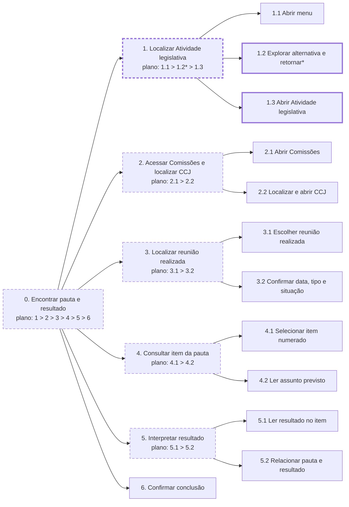

<span class="owner">Responsável: Luís Henrique Luna de Arruda — Análise de tarefas</span>

# Análise de tarefas

## Tabela de contribuição

| Integrante | Contribuição | Artefato / atividade |
| --- | --- | --- |
| [Luís Henrique Luna de Arruda](https://github.com/Donnk61) | Definição da tarefa e HTA | [HTA](analise-tarefas.md#analise-hierarquica-de-tarefas-hta) |
| [Luís Henrique Luna de Arruda](https://github.com/Donnk61) | Modelagem em CTT | [CTT](analise-tarefas.md#arvore-de-tarefas-concorrentes-ctt) |
| Google Gemini | Transcrição, diagramas e formatação Markdown | [Agradecimentos](analise-tarefas.md#agradecimentos) |

<p class="caption">Tabela 1 — Contribuição neste artefato.</p>
<p class="source">Fonte: elaboração do Grupo 06 (2026).</p>

## Introdução

Esta página modela a tarefa “encontrar a pauta e o resultado de uma reunião realizada da CCJ” em duas técnicas: **Análise Hierárquica de Tarefas (HTA)** e **Árvore de Tarefas Concorrentes (CTT)**. Os modelos iniciais foram preparados antes da sessão e agora incorporam o percurso registrado na transcrição: exploração de caminhos incorretos, retorno, descoberta de Atividade legislativa e conclusão na página da reunião.

!!! note "Validação informada"

    Segundo o entrevistador, a participante confirmou a HTA e a CTT sem correções. Essa validação não aparece no arquivo transcrito; por isso, os modelos se apoiam principalmente no comportamento registrado durante a tarefa.

## Tarefa analisada

| Campo | Registro |
| --- | --- |
| Objetivo do usuário | Relacionar o estudo sobre comissões a uma reunião real, consultando a pauta e o resultado de um item |
| Usuário | [Marina Alves](persona.md) |
| Sistema | Portal do Senado Federal, área de Comissões e página de reuniões |
| Objetivo da análise | Identificar como o portal apoia ou dificulta a localização e a comparação entre pauta e resultado |
| Evidência de sucesso | Reunião realizada identificada; data e tipo reconhecidos; pauta e resultado do mesmo item localizados e explicados |
| Consequência da falha | A participante não consegue relacionar o conteúdo teórico a um caso real ou não tem segurança de que consultou a reunião/item corretos |
| Fonte dos dados | Transcrição da sessão de 27/09/2026, planejamento da tarefa e estrutura observada do portal |

<p class="caption">Tabela 2 — Definição preliminar da tarefa analisada.</p>
<p class="source">Fonte: elaboração do Grupo 06 (2026).</p>

## Análise Hierárquica de Tarefas (HTA)

A HTA decompõe o objetivo em tarefas e subtarefas, ligadas por planos de ordem, escolha e retorno. A Tabela 3 apresenta a legenda.

| Notação | Significado |
| --- | --- |
| `0`, `1`, `2.1` | Posição na hierarquia; `0` é o objetivo principal |
| `1 > 2` | Sequência: 1 antes de 2 |
| `1 / 2` | Seleção entre alternativas |
| `*` | Repetição ou retorno |
| Caixa tracejada | Agrupamento/objetivo abstrato |
| Caixa grossa | Operação em que ocorreu a principal dificuldade observada |

<p class="caption">Tabela 3 — Legenda da HTA.</p>
<p class="source">Fonte: elaboração do Grupo 06 (2026), com base em BARBOSA; SILVA (2010, p. 193–196).</p>



<p class="caption">Figura 1 — HTA da consulta à pauta e ao resultado de reunião da CCJ.</p>
<p class="source">Fonte: elaboração do Grupo 06 (2026), com base na sessão de 27/09/2026.</p>

| ID | Objetivo/operação | Evidência da sessão |
| --- | --- | --- |
| 0 | Encontrar pauta e resultado `1 > 2 > 3 > 4 > 5 > 6` | Objetivo geral |
| 1 | Localizar Atividade legislativa `1.1 > 1.2* > 1.3` | Principal dificuldade: entrada escondida em menu pequeno |
| 1.1 | Abrir o menu do portal | A participante disse que não pensaria em abri-lo |
| 1.2 | Explorar alternativa e retornar `*` | Passou por Especiais, Grandes Coberturas, notícia, tramitação, multimídia, datas e eventos |
| 1.3 | Abrir Atividade legislativa | Encontrada após vários retornos, por volta de 13:54 |
| 2 | Acessar Comissões e localizar CCJ `2.1 > 2.2` | Caminho bem-sucedido; sem uso da busca global |
| 2.1 | Abrir Comissões | Opção disponível dentro de Atividade legislativa |
| 2.2 | Localizar e abrir CCJ | Seleção da Comissão de Constituição, Justiça e Cidadania |
| 3 | Localizar reunião realizada `3.1 > 3.2` | Passo considerado fácil após entrar na comissão |
| 3.1 | Escolher uma reunião realizada | 13ª reunião extraordinária, 02/09/2026, 9h |
| 3.2 | Confirmar os dados | Data, horário, tipo e situação |
| 4 | Consultar item da pauta `4.1 > 4.2` | Itens numerados e claramente apresentados |
| 4.1 | Selecionar item numerado | Item sobre alteração da Lei nº 9.605/1998 |
| 4.2 | Ler assunto previsto | Aumento da pena por maus-tratos a animais |
| 5 | Interpretar resultado `5.1 > 5.2` | Resultado aparece dentro do próprio item |
| 5.1 | Ler resultado | Substitutivo definitivamente adotado, sem emendas apresentadas |
| 5.2 | Relacionar pauta e resultado | Correspondência confirmada pela numeração e organização do item |
| 6 | Confirmar conclusão | Tarefa concluída integralmente em aproximadamente 8min10s |

<p class="caption">Tabela 4 — Decomposição da HTA.</p>
<p class="source">Fonte: elaboração do Grupo 06 (2026), com base na transcrição da sessão.</p>

## Árvore de Tarefas Concorrentes (CTT)

A CTT representa as relações temporais e diferencia tarefas da usuária, do sistema, interativas e abstratas. A iteração representa as tentativas e retornos observados antes de a participante encontrar Atividade legislativa.

```text
ConsultarReuniao =
    (ExplorarAlternativa >> Voltar)* >>
    AbrirAtividadeLegislativa >> AbrirComissoes >>
    LocalizarCCJ >> ExibirCCJ >>
    SelecionarReuniao >> ExibirReuniao >>
    SelecionarItem >> LerPauta >> LerResultado >> ConfirmarCorrespondencia
```

<p class="caption">Figura 2 — CTT da tarefa observada em notação textual.</p>
<p class="source">Fonte: elaboração do Grupo 06 (2026), com base na sessão de 27/09/2026.</p>

| Operador | Significado |
| :---: | --- |
| `>>` | Ativação: a tarefa seguinte começa depois da anterior |
| `[]` | Escolha entre alternativas |
| `|||` | Concorrência/independência: qualquer ordem ou alternância |
| `*` | Iteração |

<p class="caption">Tabela 5 — Operadores usados na CTT.</p>
<p class="source">Fonte: elaboração do Grupo 06 (2026), com base em BARBOSA; SILVA (2010, p. 203–205) e PATERNÒ (2000).</p>

| ID | Agente | Tarefa | Tipo |
| --- | --- | --- | --- |
| U1 | Usuária | Explorar uma alternativa de navegação | Interativa e iterativa |
| S1 | Sistema | Exibir conteúdo que não corresponde claramente a uma reunião | Sistema |
| U2 | Usuária | Voltar e tentar outra opção | Interativa e iterativa |
| U3 | Usuária | Abrir Atividade legislativa e Comissões | Interativa |
| U4 | Usuária | Localizar e selecionar CCJ | Interativa |
| S2 | Sistema | Exibir a página da CCJ e suas reuniões | Sistema |
| U5 | Usuária | Selecionar reunião realizada | Interativa |
| S3 | Sistema | Exibir data, tipo, situação e itens da reunião | Sistema |
| U6 | Usuária | Selecionar um item e ler a pauta | Interativa |
| U7 | Usuária | Ler o resultado no mesmo item | Interativa |
| U8 | Usuária | Confirmar a correspondência entre pauta e resultado | Cognitiva |

```mermaid
flowchart LR
    T0["ConsultarReuniao"]
    U1["ExplorarAlternativa*"]
    S1{{"ExibirConteudo"}}
    U2["Voltar*"]
    U3["AbrirAtividadeLegislativa"]
    U4["AbrirComissoes / LocalizarCCJ"]
    S2{{"ExibirCCJ"}}
    U5["SelecionarReuniao"]
    S3{{"ExibirReuniao"}}
    U6["SelecionarItem / LerPauta"]
    U7["LerResultado"]
    U8(["ConfirmarCorrespondencia"])
    T0 --> U1
    U1 -->|">>"| S1
    S1 -->|">>"| U2
    U2 -->|"*"| U1
    U2 -->|">>"| U3
    U3 -->|">>"| U4
    U4 -->|">>"| S2
    S2 -->|">>"| U5
    U5 -->|">>"| S3
    S3 -->|">>"| U6
    U6 -->|">>"| U7
    U7 -->|">>"| U8
    classDef abstrata stroke-dasharray: 6 4
    class T0 abstrata
```

<p class="caption">Tabela 6 — Tarefas da CTT.</p>
<p class="source">Fonte: elaboração do Grupo 06 (2026), com base na transcrição da sessão.</p>



<p class="caption">Figura 3 — Árvore CTT da consulta à reunião.</p>
<p class="source">Fonte: elaboração do Grupo 06 (2026), com base na sessão de 27/09/2026.</p>

## Validação pós-observação

A Tabela 7 confronta os modelos com a transcrição.

| Questão de validação | Registro atual |
| --- | --- |
| A participante usou busca ou menus? | Navegou por menus, links e listas; no debriefing esclareceu que não usou a busca global |
| Houve repetição ou retorno? | Sim. Passou por Especiais, Grandes Coberturas, notícia, tramitação, multimídia, datas e eventos antes de voltar e encontrar Atividade legislativa |
| Onde ocorreu a principal dificuldade? | Na descoberta do pequeno menu e da entrada de Atividade legislativa que leva às comissões |
| Houve ajuda do entrevistador? | Houve lembretes para verbalizar e repetição dos critérios, sem indicação do caminho correto |
| A tarefa foi concluída? | Sim, integralmente, em aproximadamente 8min10s de navegação e explicação |
| Como foi a página da reunião? | Depois de localizada, data, tipo, itens, pauta e resultado foram considerados claros e acessíveis |
| A participante validou os modelos? | Segundo o entrevistador, HTA e CTT foram confirmadas sem correções; a validação não consta no arquivo transcrito |
| Qual incerteza permanece? | O número do projeto consultado e alguns trechos da transcrição automática precisam de conferência por escuta |

<p class="caption">Tabela 7 — Validação da HTA e da CTT com a observação.</p>
<p class="source">Fonte: transcrição da sessão e relato do entrevistador sobre a validação de 27/09/2026.</p>

## Agradecimentos

Esta página contou com apoio do Google Gemini na análise da transcrição, na modelagem em Mermaid e na formatação Markdown. A coleta e a responsabilidade pelo conteúdo são do autor.

## Histórico de versão

| Versão | Data | Descrição | Autor(es) | Revisor(es) |
| :---: | :---: | --- | --- | --- |
| `0.1` | 27/09/2026 | HTA e CTT preliminares, com marcação da validação pendente | [Luís Henrique Luna de Arruda](https://github.com/Donnk61) | [Bruno Ferreira Dornelas](https://github.com/brunnf) |
| `0.2` | 27/09/2026 | Incorpora o caminho observado e a validação dos modelos relatada pelo entrevistador | [Luís Henrique Luna de Arruda](https://github.com/Donnk61) | [Heitor Pinheiro Gonçalves das Chagas](https://github.com/Heitorovski01) |
| `1.0` | 27/09/2026 | Reestrutura HTA e CTT com o percurso, as iterações, os tempos e o resultado da transcrição | [Luís Henrique Luna de Arruda](https://github.com/Donnk61) | [Israel Soares de Paiva](https://github.com/IsraelSoares-25) |
| `1.1` | 03/10/2026 | Nomeia a ferramenta de IA nos agradecimentos e na tabela de contribuição | [Caio Breno de Souza Bezerra](https://github.com/CaioBezerra-Dev) | [Luís Henrique Luna de Arruda](https://github.com/Donnk61) |

## Referências

[1] BARBOSA, Simone Diniz Junqueira; SILVA, Bruno Santana da. *Interação humano-computador*. Rio de Janeiro: Elsevier, 2010.

[2] PATERNÒ, Fabio. *Model-based design and evaluation of interactive applications*. London: Springer, 2000.

[3] SENADO FEDERAL. Portal do Senado Federal: comissões. Disponível em: https://legis.senado.leg.br/atividade/comissoes/. Acesso em: 27 set. 2026.
