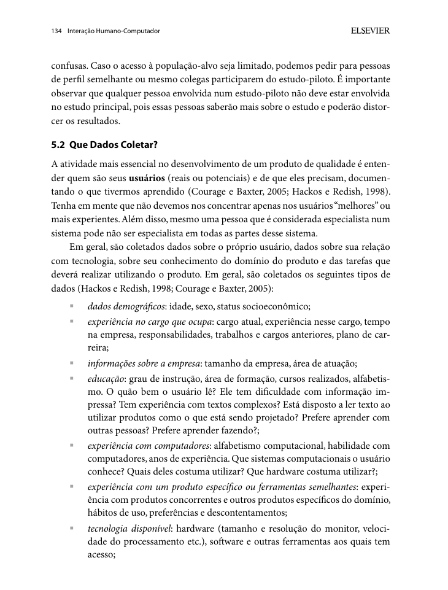
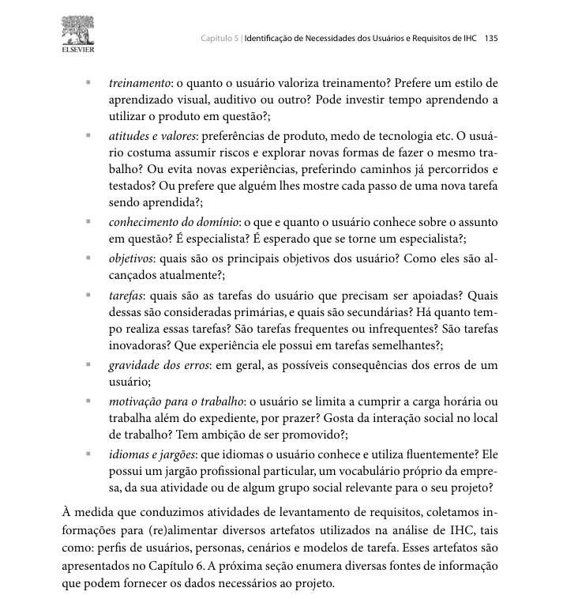
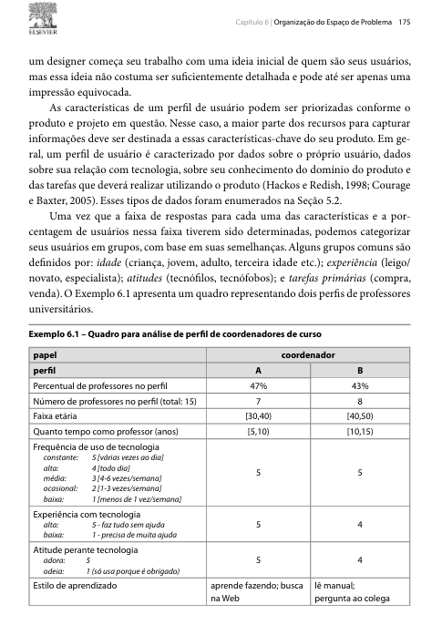

Responsável: Bruno Ferreira Dornelas — Perfil do usuário · Autor do item: Bruno Ferreira Dornelas

# Perfil do usuário

## Tabela de contribuição

A Tabela 1 registra quem atuou neste artefato.

| Integrante | Contribuição | Artefato / atividade |
| --- | --- | --- |
| [Bruno Ferreira Dornelas](https://github.com/brunnf) | Item de conteúdo sobre perfil do usuário | [Item de conteúdo](perfil-usuario.md#item-de-conteudo-da-disciplina) |
| [Bruno Ferreira Dornelas](https://github.com/brunnf) | Planejamento da elicitação | [Planejamento](perfil-usuario.md#planejamento-da-elicitacao) |
| [Bruno Ferreira Dornelas](https://github.com/brunnf) | Consolidação do perfil do grupo | [Perfil consolidado](perfil-usuario.md#perfil-consolidado) |
| [Caio Breno de Souza Bezerra](https://github.com/CaioBezerra-Dev) | Atributos da participante P2 (Caio) | [Sessão Caio](individual/caio/entrevista-observacao.md#atributos-para-o-perfil-do-usuario) |
| [Heitor Pinheiro Gonçalves das Chagas](https://github.com/Heitorovski01) | Atributos da participante P3 (Heitor) | [Sessão Heitor](individual/heitor/entrevista-observacao.md#atributos-para-o-perfil-do-usuario) |
| [Israel Soares de Paiva](https://github.com/IsraelSoares-25) | Atributos da participante P4 (Israel) | [Sessão Israel](individual/israel/entrevista-observacao.md#atributos-para-o-perfil-do-usuario) |
| [Luís Henrique Luna de Arruda](https://github.com/Donnk61) | Planejamento e dados confirmados da participante P5 | [Sessão Luís](individual/luis/entrevista-observacao.md#atributos-para-o-perfil-do-usuario) |

Tabela 1 — Contribuição neste artefato.

Fonte: elaboração do Grupo 06 (2026).

## Introdução

Esta página consolida o perfil do usuário do Portal do Senado Federal levantado pelo Grupo 06. O perfil é construído a partir das sessões individuais de entrevista e observação realizadas por cada integrante, que aplicam as duas [técnicas de coleta](tecnicas-coleta.md) adotadas pelo grupo. Os dados coletados alimentam o [elenco de personas](elenco-personas.md), os [cenários](cenarios.md) e a [análise de tarefas](analise-tarefas.md).

## Item de conteúdo da disciplina

**Autor do item:** Bruno Ferreira Dornelas

O perfil de usuário é uma descrição detalhada das características dos usuários cujos objetivos devem ser apoiados pelo sistema. Segundo Barbosa e Silva (2010, p. 174), "devemos identificar as características de interesse (faixa etária, experiência, escolaridade etc.) e conduzir um estudo para coletar os dados dos usuários". Esses dados são agrupados em perfis de usuários, com os quais o grau de semelhança entre os indivíduos pode ser medido.

Hackos e Redish (1998 apud BARBOSA; SILVA, 2010, p. 134–135) propõem que os dados de usuário incluam: **dados demográficos, experiência no cargo, informações sobre a empresa, educação, experiência com computadores, experiência com o produto, tecnologia disponível, treinamento, atitudes e valores, conhecimento do domínio, objetivos, tarefas, gravidade dos erros e idiomas e jargões.** As Figuras 1 e 2 reproduzem esse trecho.

<figure markdown="span">
  
  <figcaption>Figura 1 — Tipos de dados para o perfil do usuário segundo Hackos e Redish (1998), p. 134.</figcaption>
</figure>

Fonte: BARBOSA; SILVA (2010, p. 134).

<figure markdown="span">
  
  <figcaption>Figura 2 — Tipos de dados para o perfil do usuário segundo Hackos e Redish (1998), p. 135.</figcaption>
</figure>

Fonte: BARBOSA; SILVA (2010, p. 135).

Courage e Baxter (2005 apud BARBOSA; SILVA, 2010, p. 175) agrupam os atributos do perfil em quatro categorias: **idade, experiência, atitudes e tarefas primárias.** As últimas quatro linhas da Tabela 3 seguem esses grupos. A Figura 3 reproduz esse trecho.

<figure markdown="span">
  
  <figcaption>Figura 3 — Grupos de atributos do perfil do usuário segundo Courage e Baxter (2005).</figcaption>
</figure>

Fonte: BARBOSA; SILVA (2010, p. 175).

## Planejamento da elicitação

Para construir o perfil do usuário por mais de uma técnica de coleta de dados (BARBOSA; SILVA, 2010, p. 134), o grupo adotou, em cada sessão individual, duas técnicas combinadas na mesma visita:

- **Técnica 1 — Entrevista semiestruturada:** levanta os atributos do perfil, objetivos, hábitos e opiniões do usuário em relação ao portal (BARBOSA; SILVA, 2010, p. 145–149).
- **Técnica 2 — Observação da tarefa com relato em voz alta:** o participante realiza uma tarefa real no portal enquanto o entrevistador observa e anota; fornece os passos concretos da HTA e da CTT (BARBOSA; SILVA, 2010, p. 164–166).

A Tabela 2 registra as sessões realizadas pelo grupo.

| Integrante | Participante | Perfil previsto | Data | Situação |
| --- | --- | --- | :---: | :---: |
| [Bruno Ferreira Dornelas](https://github.com/brunnf) | P1 — Bruno | Cidadão leigo | 27/09/2026 | ✅ Concluída |
| [Bruno Ferreira Dornelas](https://github.com/brunnf) | — (análise documental e de similares) | Estudante/pesquisador | 26/09/2026 | ✅ Concluída |
| [Caio Breno de Souza Bezerra](https://github.com/CaioBezerra-Dev) | P2 — Caio | Estagiária / cidadã com consulta recorrente | 24/09/2026 | ✅ Concluída |
| [Heitor Pinheiro Gonçalves das Chagas](https://github.com/Heitorovski01) | P3 — Heitor | Participante / Militante de movimento social | 27/09/2026 | ✅ Concluída |
| [Israel Soares de Paiva](https://github.com/IsraelSoares-25) | P4 — Israel | Servidora pública, tarefa administrativa pontual | 29/07/2026 | ✅ Concluída |
| [Luís Henrique Luna de Arruda](https://github.com/Donnk61) | P5 — Luís | Engenheira química formada e estudante para concursos | 27/09/2026 | 🟡 Dados preliminares incorporados; transcrição pendente |

Tabela 2 — Sessões de coleta do grupo.

Fonte: elaboração do Grupo 06 (2026).

## Perfil consolidado

O perfil consolidado reúne os dados coletados nas sessões individuais, organizados segundo os atributos de Hackos e Redish e os grupos de Courage e Baxter. A Tabela 3 apresenta os dados disponíveis até o momento. A coluna P5 usa o relato preliminar do entrevistador e será conferida na transcrição.

| Atributo | P1 — Bruno (Cidadão leigo) | P2 — Caio (Estagiária/recorrente) | P3 — Heitor | P4 — Israel | P5 — Luís (Estudante/concurseira) |
| --- | --- | --- | --- | --- | --- |
| Dados demográficos | Mulher, 22 anos | Mulher, 24 anos | Mulher, 21 anos | Mulher, 47 anos | Mulher, 24 anos |
| Status socioeconômico | Classe média (inferida); auxiliar administrativo, empresa de tecnologia, setor privado | Classe média (inferida); estagiária em órgão público federal | — | Classe média (inferida); servidora pública | — |
| Experiência no cargo | Auxiliar administrativo em empresa de tecnologia | Estagiária há ~6 meses em órgão público | Secretária técnica há ~9 meses em organização camponesa / movimento social | Servidora pública | Estuda para concursos há aproximadamente um ano |
| Informações sobre a empresa | Empresa de tecnologia, setor privado | Órgão público federal | Movimento social e articulação comunitária (CLOC / Via Campesina) | — | Não se aplica à ocupação atual informada |
| Educação | Graduação em andamento, Administração | Graduação em andamento, engenharia espacial | Graduação em andamento, Geografia | — | Graduação concluída em Engenharia Química |
| Experiência com computadores | Autoavaliação 3 em escala de 1 a 5 | Alta — autoavaliação 4 em escala de 1 a 5 | Média a alta — uso constante de smartphone e ferramentas básicas no computador | Baixa familiaridade com sites institucionais | Intermediária, segundo autoavaliação; usou computador com Microsoft Edge |
| Experiência com o produto | Esporádica; última visita ~3 meses antes (PEC 6×1) | Recorrente e de trabalho; última visita ~2 semanas antes | Esporádica; acessa sob demanda/campanhas de votação no e-Cidadania | Uma visita pontual; não concluiu a tarefa do auditório | Uso ocasional, por demanda, para consultas relacionadas aos estudos |
| Tecnologia disponível | Computador desktop no trabalho; smartphone pessoal | Computador do órgão no trabalho; pessoal na sessão | Smartphone pessoal (acesso principal) e computador pessoal/notebook | Celular no dia a dia; computador na tarefa observada | Computador com Microsoft Edge na sessão |
| Treinamento e aprendizado | Explora sozinha; se travar, procura vídeo rápido no YouTube | Explora sozinha; usa vídeo ou IA para sistemas novos | Autodidata; não lê manuais; prefere resumos rápidos e diretos | Quando trava, busca ajuda ou informação por fora | Aguardando transcrição |
| Atitudes e valores | Gosta da aparência visual do portal; não gosta dos status opacos de tramitação | Gosta do visual e das opções de acessibilidade | Pragmática e engajada; apoia interfaces intuitivas; critica baixa divulgação | Desiste se a busca não responde em linguagem simples | Explora os menus, retorna de páginas incorretas e persiste até concluir sem ajuda |
| Conhecimento do domínio | Leiga em legislação; busca informações que afetam seu círculo de convivência | Especialista no setor aeroespacial; leiga em legislação | Intermediário em processo legislativo; especialista em pautas do campo e reforma agrária | Leiga em processo legislativo; usa termos do dia a dia | Conhecia pauta e resultado de reunião, mas não conhecia CCJ nem comissões |
| Objetivos | Entender a situação e o impacto da PEC 6×1 para familiares e amigos afetados | Reunir notícias do setor para o anuário anual | Votar em matérias de relevância para a agricultura familiar e direitos coletivos | Confirmar se o auditório está livre e acompanhar leis de interesse | Passar em concurso relacionado à Engenharia Química, considerando oportunidades no Senado, e usar fontes oficiais nos estudos |
| Tarefas | Pesquisar termos do cotidiano, interpretar status de tramitação, recorrer a portal jornalístico quando o portal não entrega resposta direta | Levantar notícias por palavra-chave, descartar antigas e salvar para aprovação | Buscar projeto (PL 1215/2025), avaliar ementa e votar no e-Cidadania | Verificar a disponibilidade do auditório | Encontrar reunião realizada da CCJ e consultar data, pauta, item e resultado da votação |
| Gravidade dos erros | Média: informação incorreta circula no grupo de família; efeito social, não operacional | Baixa a média: notícia perdida costuma chegar por outro veículo | Média a alta: voto divergente desvirtua posicionamento do coletivo | Alta para ela: a tarefa fica sem resposta e ela sai do site | Entradas incorretas aumentam o tempo de navegação, mas não impediram a conclusão observada |
| Idiomas e jargões | Sem jargão legislativo; siglas desconhecidas vão para o Google | Vocabulário do setor aeroespacial; sigla desconhecida vai para o Google | Jargões de movimentos sociais ("soberania alimentar") e termos legislativos | Sem jargão legislativo; busca "senador" e "transparência" | Não conhecia “CCJ” e “comissão”; compreendia “pauta” e “resultado de reunião” |
| **Grupo: idade** | Jovem adulta | Jovem adulta | Jovem adulta (21 anos) | 47 anos | Jovem adulta, 24 anos |
| **Grupo: experiência** | Iniciante no portal; uso esporádico e motivado por impacto pessoal | Usuária frequente; sem uso dos controles de ordenação | Pontual / sob demanda de trabalho | Iniciante no portal; uma tentativa sem conclusão | Usuária ocasional do portal, com acesso por demanda |
| **Grupo: atitude** | Pragmática: desiste rápido quando o portal não entrega resposta direta e recorre a fonte externa | Tecnófila: explora sozinha e recorre a vídeo ou IA | Autodidata, pragmática e pró-participação popular | Desiste e busca ajuda fora do site | Exploratória e persistente; concluiu sem ajuda |
| **Grupo: tarefa primária** | Verificar aprovação e situação de projeto de lei de interesse cotidiano | Levantar notícias do setor por tema e período | Votar em consultas públicas de relevância socioambiental | Verificar a disponibilidade do auditório | Consultar pauta e resultado de reunião realizada da CCJ |

Tabela 3 — Perfil consolidado do usuário do Portal do Senado Federal.

Fonte: elaboração do Grupo 06 (2026), com base nas sessões individuais; categorias de BARBOSA; SILVA (2010, p. 134–135, 175).

P1, P2, P3 e P4 estão completos; os detalhes estão em [Atributos para o perfil do usuário — P1](individual/bruno/entrevista-observacao.md#atributos-para-o-perfil-do-usuario), [Atributos para o perfil do usuário — P2](individual/caio/entrevista-observacao.md#atributos-para-o-perfil-do-usuario), [Atributos para o perfil do usuário — P3](individual/heitor/entrevista-observacao.md#atributos-para-o-perfil-do-usuario) e [Atributos para o perfil do usuário — P4](individual/israel/entrevista-observacao.md#atributos-para-o-perfil-do-usuario). Em P5, os dados preliminares foram incorporados a partir do relato do entrevistador e serão conferidos na [transcrição](individual/luis/entrevista-observacao.md#resultados).

## Agradecimentos

Esta página contou com o apoio de ferramenta de inteligência artificial generativa na estruturação, na redação preliminar e na formatação Markdown. A revisão do conteúdo, o planejamento da elicitação e a consolidação dos dados das sessões são do autor, que segue responsável pelo que está publicado.

## Histórico de versão

| Versão | Data | Descrição | Autor(es) | Revisor(es) |
| :---: | --- | --- | --- | --- |
| `0.1` | 26/09/2026 | Estrutura, item de conteúdo, planejamento da elicitação e perfil com dados | [Bruno Ferreira Dornelas](https://github.com/brunnf) | [Caio Breno de Souza Bezerra](https://github.com/CaioBezerra-Dev) |
| `0.2` | 27/09/2026 | Inclui os dados da sessão do Israel na coluna P4 | [Caio Breno de Souza Bezerra](https://github.com/CaioBezerra-Dev) | A definir |
| `0.3` | 27/09/2026 | Atualiza dados da sessão de P1 (Bruno), inclui status socioeconômico e consolida com P4 | [Bruno Ferreira Dornelas](https://github.com/brunnf) | [Caio Breno de Souza Bezerra](https://github.com/CaioBezerra-Dev) |
| `0.4` | 27/09/2026 | Inclui os dados da sessão do Heitor na coluna P3 | [Heitor Pinheiro Gonçalves das Chagas](https://github.com/Heitorovski01) | A definir |
| `0.5` | 27/09/2026 | Consolida os dados preliminares de P5 informados pelo entrevistador | [Luís Henrique Luna de Arruda](https://github.com/Donnk61) | [Caio Breno de Souza Bezerra](https://github.com/CaioBezerra-Dev) — revisão pendente |

## Referências

[1] BARBOSA, Simone Diniz Junqueira; SILVA, Bruno Santana da. Interação humano-computador. Rio de Janeiro: Elsevier, 2010.

[2] HACKOS, JoAnn T.; REDISH, Janice C. User and task analysis for interface design. New York: John Wiley & Sons, 1998.

[3] COURAGE, Catherine; BAXTER, Kathy. Understanding your users. San Francisco: Morgan Kaufmann, 2005.
