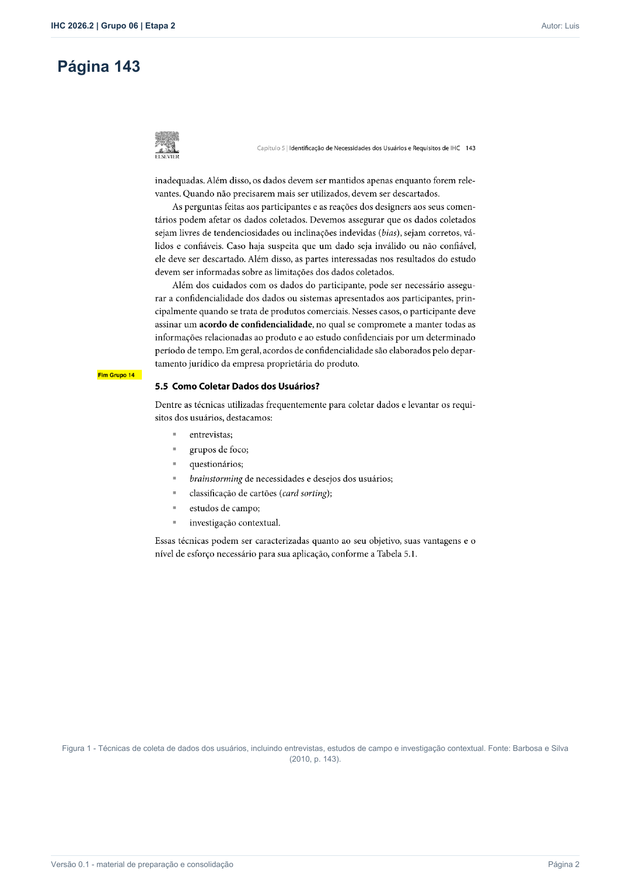
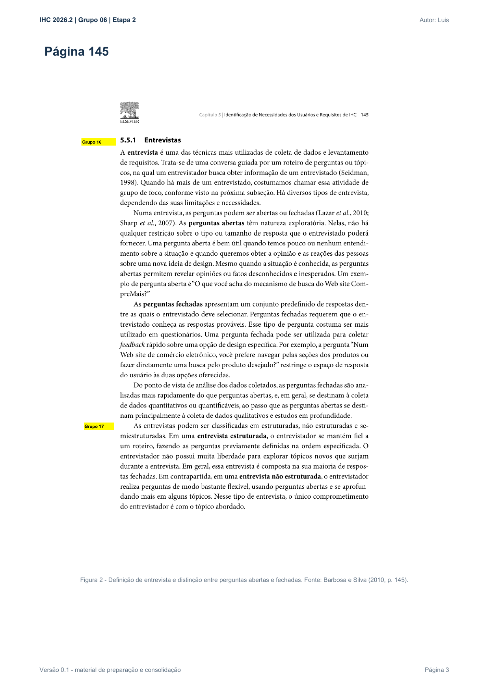
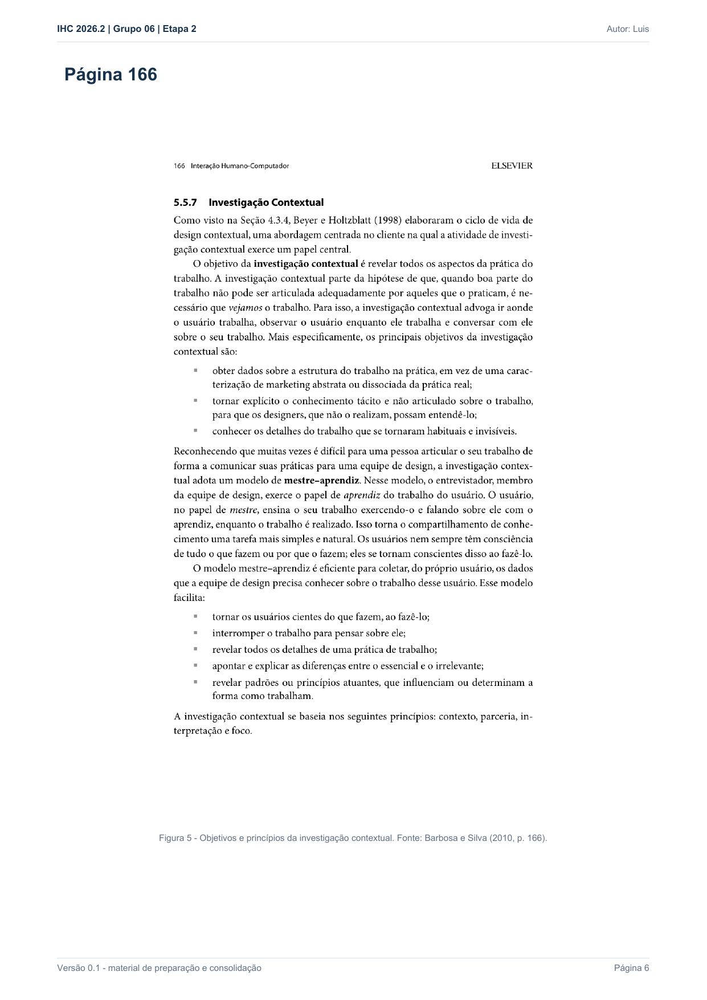

Responsável: Luís Henrique Luna de Arruda — Técnicas de coleta · Autor do item: Luís Henrique Luna de Arruda

# Técnicas de coleta

## Tabela de contribuição

| Integrante | Contribuição | Artefato / atividade |
| --- | --- | --- |
| [Luís Henrique Luna de Arruda](https://github.com/Donnk61) | Fundamentação da entrevista semiestruturada | [Entrevista](tecnicas-coleta.md#entrevista-semiestruturada) |
| [Luís Henrique Luna de Arruda](https://github.com/Donnk61) | Fundamentação da observação inspirada na investigação contextual | [Observação](tecnicas-coleta.md#observacao-da-tarefa-e-investigacao-contextual) |
| [Luís Henrique Luna de Arruda](https://github.com/Donnk61) | Organização das evidências bibliográficas | [Apêndice](tecnicas-coleta.md#apendice-a-evidencias-bibliograficas) |

Tabela 1 — Contribuição neste artefato.

Fonte: elaboração do Grupo 06 (2026).

## Introdução

Para definir o perfil dos usuários do Portal do Senado Federal, o Grupo 06 combina duas técnicas: **entrevista semiestruturada** e **observação da tarefa com relato em voz alta, inspirada na investigação contextual**. A entrevista levanta características, objetivos e opiniões; a observação registra como a pessoa realmente age diante do portal. A análise conjunta reduz a dependência exclusiva do relato e fornece evidências para o perfil, as personas, os cenários, a HTA e a CTT.

Barbosa e Silva (2010, p. 143) incluem entrevistas, estudos de campo e investigação contextual entre as técnicas de coleta de dados dos usuários. A **Figura 1** reproduz a lista utilizada pelo grupo ([Apêndice A](tecnicas-coleta.md#apendice-a-evidencias-bibliograficas)).

## Item de conteúdo da disciplina

**Autor do item:** Luís Henrique Luna de Arruda

### Entrevista semiestruturada

A entrevista é uma conversa guiada por perguntas ou tópicos para obter informações de uma pessoa. Na entrevista semiestruturada, o entrevistador utiliza um roteiro previamente definido, mas pode formular perguntas adicionais e explorar tópicos que surgem durante a conversa. Perguntas abertas favorecem respostas detalhadas e podem revelar opiniões ou fatos que o pesquisador não havia previsto (BARBOSA; SILVA, 2010, p. 145). A **Figura 2** apresenta o trecho de referência ([Apêndice A](tecnicas-coleta.md#apendice-a-evidencias-bibliograficas)).

Nas sessões do grupo, essa técnica investiga dados demográficos não identificadores, formação, experiência digital, familiaridade com fontes oficiais, experiência com o Portal do Senado, objetivos, estratégias, expectativas, dificuldades percebidas e gravidade dos erros. As perguntas devem ser neutras e permitir aprofundamento sem sugerir a resposta.

### Observação da tarefa e investigação contextual

O estudo de campo busca compreender o comportamento da pessoa no contexto em que uma atividade ocorre. A investigação contextual aprofunda a observação ao combinar a execução da tarefa com conversa sobre o trabalho, em uma relação mestre-aprendiz: a pessoa demonstra sua prática, e o pesquisador observa e pergunta sem assumir que já conhece o processo (BARBOSA; SILVA, 2010, p. 164–166). A **Figura 3** reúne o trecho sobre objetivos e princípios da investigação contextual ([Apêndice A](tecnicas-coleta.md#apendice-a-evidencias-bibliograficas)).

As sessões do grupo não são classificadas automaticamente como estudos de campo completos, pois nem todas ocorrem no ambiente habitual de trabalho. Por isso, o grupo adota a denominação mais precisa **observação da tarefa com relato em voz alta, inspirada na investigação contextual**. Durante a tarefa, o pesquisador registra o caminho, os termos de busca, as decisões, hesitações, erros, retornos, pedidos de ajuda, tempo e critério de sucesso.

### Aplicação conjunta

As técnicas são aplicadas na mesma sessão, mas produzem evidências diferentes:

| Técnica | Principal evidência | Artefatos alimentados |
| --- | --- | --- |
| Entrevista semiestruturada | Respostas sobre perfil, objetivos, experiência, opiniões e expectativas | Perfil do usuário, persona e cenário |
| Observação da tarefa | Ações, caminhos, falas em contexto, hesitações, retornos, tempo e resultado | Cenário, HTA e CTT |

Tabela 2 — Funções complementares das técnicas de coleta.

Fonte: elaboração do Grupo 06 (2026).

Na sessão de Luís Henrique, realizada presencialmente em 27/09/2026, a entrevista ocupou aproximadamente os sete primeiros minutos. A participante utilizou um computador com Microsoft Edge e concluiu, em cerca de 12–15 minutos, a localização de uma reunião realizada da CCJ, sua pauta, um item e o resultado da votação. Segundo o entrevistador, ela explorou menus e links, entrou em áreas incorretas, não utilizou a busca e não recebeu ajuda. O restante da sessão, encerrada às 16:06, incluiu perguntas finais e a validação da persona, do cenário, da HTA e da CTT. O percurso detalhado será conferido na transcrição e está registrado na [página individual](individual/luis/entrevista-observacao.md).

## Cuidados metodológicos e éticos

- apresentar o TCLE e esclarecer dúvidas antes da coleta;
- pedir autorização antes de qualquer gravação de voz ou tela;
- informar que a interface está sendo avaliada, e não a participante;
- evitar perguntas indutivas e ajuda prematura;
- registrar separadamente fala, comportamento observado e interpretação do pesquisador;
- marcar toda ajuda oferecida durante a tarefa;
- anonimizar dados pessoais e não publicar gravações sem autorização específica;
- distinguir o roteiro planejado do que efetivamente ocorreu.

Na sessão de Luís, o entrevistador relata que a participante autorizou a captação de voz, tela e imagem, inclusive com confirmação registrada no início do vídeo. O TCLE recebido, entretanto, autoriza áudio e declara que não haveria vídeo ou imagem. A gravação não será publicada, e a divergência documental deve ser regularizada por termo complementar ou nova autorização específica.

## Agradecimentos

Esta página contou com apoio de ferramenta de inteligência artificial generativa na consolidação do material preparatório e na formatação Markdown. A seleção das evidências, a condução da coleta e a conferência das citações são de responsabilidade do autor.

## Histórico de versão

| Versão | Data | Descrição | Autor(es) | Revisor(es) |
| :---: | :---: | --- | --- | --- |
| `0.1` | 27/09/2026 | Fundamentação das duas técnicas, aplicação conjunta e evidências bibliográficas | [Luís Henrique Luna de Arruda](https://github.com/Donnk61) | [Caio Breno de Souza Bezerra](https://github.com/CaioBezerra-Dev) — revisão pendente |
| `0.2` | 27/09/2026 | Atualiza a aplicação das técnicas com os resultados relatados da sessão | [Luís Henrique Luna de Arruda](https://github.com/Donnk61) | [Caio Breno de Souza Bezerra](https://github.com/CaioBezerra-Dev) — revisão pendente |

## Referências

[1] BARBOSA, Simone Diniz Junqueira; SILVA, Bruno Santana da. *Interação humano-computador*. Rio de Janeiro: Elsevier, 2010.

## Apêndice A — Evidências bibliográficas

As três imagens citadas ficam reunidas em blocos recolhidos, conforme o padrão do grupo para artefatos com três ou mais figuras.

??? note "Figura 1 — Técnicas de coleta de dados dos usuários"

    <figure markdown="span">
      
      <figcaption>Figura 1 — Técnicas de coleta de dados dos usuários.</figcaption>
    </figure>
    
Fonte: BARBOSA; SILVA (2010, p. 143).

??? note "Figura 2 — Entrevistas e perguntas abertas, fechadas e semiestruturadas"

    <figure markdown="span">
      
      <figcaption>Figura 2 — Entrevista e entrevista semiestruturada.</figcaption>
    </figure>
    
Fonte: BARBOSA; SILVA (2010, p. 145).

??? note "Figura 3 — Objetivos e princípios da investigação contextual"

    <figure markdown="span">
      
      <figcaption>Figura 3 — Objetivos e princípios da investigação contextual.</figcaption>
    </figure>
    
Fonte: BARBOSA; SILVA (2010, p. 166).

