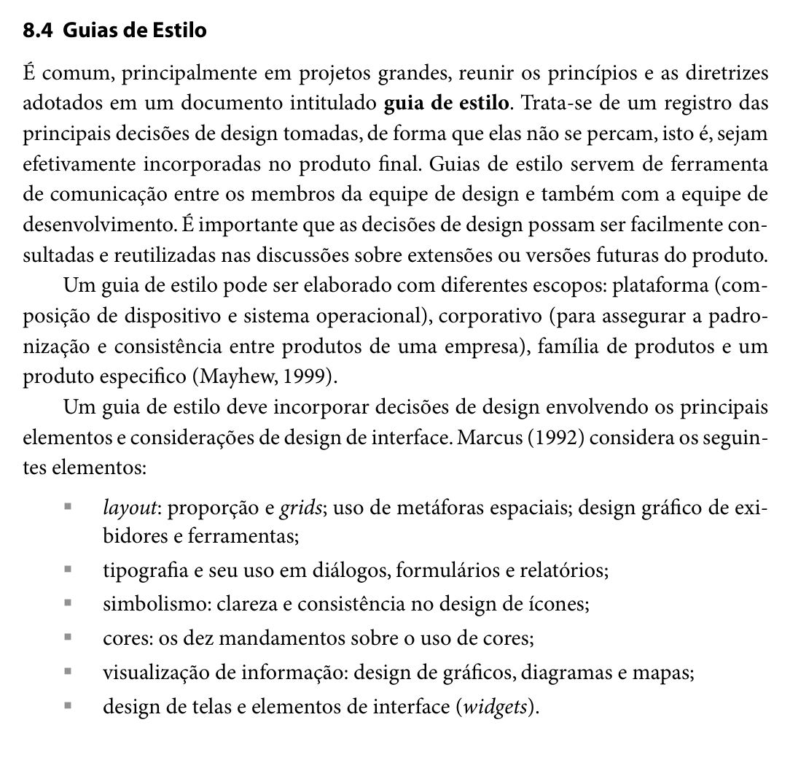

Responsável: Heitor Pinheiro Gonçalves das Chagas — Guia de estilo · Autor dos itens: Heitor Pinheiro Gonçalves das Chagas

# Guia de estilo

## Tabela de contribuição

A Tabela 1 registra quem atuou neste artefato.

| Integrante | Contribuição | Artefato / atividade |
| --- | --- | --- |
| [Caio Breno de Souza Bezerra](https://github.com/CaioBezerra-Dev) | Abertura inicial da página com o esqueleto do artefato | [Estrutura](guia-de-estilo.md#estrutura) |
| [Heitor Pinheiro Gonçalves das Chagas](https://github.com/Heitorovski01) | Fundamentação bibliográfica dos itens 15 e 16, obtenção dos trechos do livro e estruturação do guia | [Itens de conteúdo](guia-de-estilo.md#itens-de-conteudo-da-disciplina) |

Tabela 1 — Contribuição neste artefato.

Fonte: elaboração do Grupo 06 (2026).

## Introdução

Este documento apresenta o **Guia de Estilo** do Portal do Senado Federal, correspondente aos itens oficiais **15, 16 e 17** da Entrega 3 da disciplina de Interação Humano-Computador [1]. 

No modelo de ciclo de vida de Engenharia de Usabilidade proposto por Mayhew (1999), adotado pelo Grupo 06 em seu [Processo de Design](../entrega-1/processo-design.md), a fase de **Análise de Requisitos** tem como um de seus principais produtos a elaboração do guia de estilo. Esse documento sintetiza e operacionaliza as diretrizes, princípios de IHC e metas de usabilidade derivados da análise de tarefas, do perfil de usuário e das possibilidades e limitações técnicas da [plataforma](plataforma.md), garantindo que as decisões de design sejam mantidas e reflitam no produto final de forma consistente (BARBOSA; SILVA, 2010, p. 109–110, 282).

---

## Itens de conteúdo da disciplina

### O que é um Guia de Estilo (Item 15)

**Autor do item:** [Heitor Pinheiro Gonçalves das Chagas](https://github.com/Heitorovski01)

Segundo Barbosa e Silva (2010, p. 282), é prática comum, sobretudo em projetos de grande escala, reunir os princípios e as diretrizes adotados em um documento formal intitulado **guia de estilo**. Esse documento atua como o registro central das principais decisões de design concebidas pela equipe, impedindo que se dispersem ao longo do ciclo de vida e assegurando que sejam fielmente incorporadas à interface final. 

Além disso, os autores destacam que os guias de estilo desempenham um papel fundamental como ferramenta de comunicação entre os designers de interação, desenvolvedores e mantenedores do sistema, permitindo que soluções consolidadas sejam consultadas e reaproveitadas em extensões e versões futuras. 

Conforme apontado por Mayhew (1999), um guia de estilo pode abranger quatro escopos: de *plataforma* (sistema operacional e hardware), *corporativo* (padronização entre produtos de uma mesma instituição), *família de produtos* ou de um *produto específico* — escopo este adotado neste projeto, focado nas particularidades do Portal do Senado Federal.

A Figura 1 reproduz o trecho da literatura (Seção 8.4, p. 282) que fundamenta a definição e a importância do guia de estilo.

??? note "Figura 1 — Definição e escopo de Guias de Estilo na literatura de IHC"

    <figure markdown="span">
      
      <figcaption>Figura 1 — Definição e escopo de Guias de Estilo na literatura de IHC.</figcaption>
    </figure>
    
Fonte: BARBOSA; SILVA (2010, p. 282), recorte do livro.

---

### Estrutura do Guia de Estilo (Item 16)

**Autor do item:** [Heitor Pinheiro Gonçalves das Chagas](https://github.com/Heitorovski01)

Para garantir abrangência e rigor técnico, Barbosa e Silva (2010, p. 283) sintetizam a estrutura clássica proposta por Marcus (1992) e Mayhew (1999) para a composição de guias de estilo. Essa estrutura organiza as decisões de design em seis seções fundamentais:

1. **Introdução:** define o objetivo do guia, sua organização interna, o público-alvo (programadores, gerentes, equipe de suporte), diretrizes de uso tanto na produção quanto na manutenção e procedimentos para mantê-lo atualizado;
2. **Resultados de análise:** registra a descrição do ambiente de trabalho do usuário (condições físicas, contextuais e técnicas de uso identificadas no perfil do usuário e na plataforma);
3. **Elementos de interface:** padroniza a disposição espacial e grid de tela, comportamento de janelas e modais, tipografia institucional, símbolos não tipográficos (ícones e marcas), paleta de cores e animações/transições;
4. **Elementos de interação:** especifica os estilos de interação suportados (menus, busca, links), a justificativa da seleção dos estilos predominantes e aceleradores (teclas de atalho e acessibilidade);
5. **Elementos de ação:** padroniza os mecanismos de preenchimento de campos em formulários, elementos de seleção (dropdowns, checkboxes, rádios) e mecanismos de ativação (botões e acionadores);
6. **Vocabulário e padrões:** estabelece a terminologia oficial e compreensível para os termos de domínio, os tipos de telas para as tarefas comuns e as sequências de diálogos (mensagens de confirmação, avisos de erro e feedback).

Adicionalmente, Mayhew (1999) recomenda explicitar o *design rationale* (a justificativa de cada decisão), assegurando o rastreamento direto entre os problemas levantados nas etapas anteriores e os elementos de interface projetados.

A Figura 2 ilustra o trecho da literatura (Seção 8.4, p. 283) que estabelece essa divisão estrutural.

??? note "Figura 2 — Estrutura de Guia de Estilo segundo Marcus (1992) e Mayhew (1999)"

    <figure markdown="span">
      
      <figcaption>Figura 2 — Estrutura de Guia de Estilo segundo Marcus (1992) e Mayhew (1999).</figcaption>
    </figure>
    
Fonte: BARBOSA; SILVA (2010, p. 283), recorte do livro.

---

## Estrutura

A seguir, apresentam-se as decisões de design do Portal do Senado Federal organizadas segundo os seis eixos normativos da literatura (MARCUS, 1992; MAYHEW, 1999; BARBOSA; SILVA, 2010).

---

### 1. Introdução

#### 1.1 Objetivo do guia de estilo
O objetivo deste Guia de Estilo é estabelecer os padrões de interface, diretrizes de usabilidade e convenções de interação para o Portal do Senado Federal. Este documento serve como referência técnica e projetual para a equipe do Grupo 06 durante a elaboração dos protótipos de baixa e alta fidelidade (Etapas 4 a 7), garantindo que as metas de usabilidade definidas na fase de Análise de Requisitos sejam mantidas e que o sistema ofereça uma experiência de uso consistente, acessível e transparente ao cidadão.

#### 1.2 Organização e conteúdo do guia de estilo
O guia está estruturado em conformidade com as diretrizes consolidadas de IHC, dividindo-se em:
* **Resultados de análise:** contextualização do ambiente físico, técnico e cognitivo do usuário;
* **Elementos de interface:** normas de grid, janelas, tipografia, iconografia, paleta cromática e animações;
* **Elementos de interação:** estilos de diálogo homem-máquina, critérios de seleção e atalhos de acessibilidade;
* **Elementos de ação:** padrões para preenchimento de formulários, seleção de itens e acionamento de botões;
* **Vocabulário e padrões:** glossário legislativo acessível, padrões estruturais de telas e sequências de feedback;
* **Correspondência com o site avaliado:** demonstração da aderência das decisões à interface real do Senado Federal.

#### 1.3 Público-alvo
Este guia destina-se aos seguintes públicos:
* **Designers de Interação e Avaliadores (Grupo 06):** responsáveis por conceber protótipos e inspecionar conformidades;
* **Desenvolvedores Front-end:** responsáveis pela codificação e implementação fiel dos componentes visuais;
* **Analistas e Mantenedores de Sistemas (Prodasen):** equipe técnica responsável pela sustentação de portais públicos legislativos;
* **Gestores e Conteudistas:** responsáveis pela publicação de notícias, pautas e documentos oficiais.

#### 1.4 Como utilizar o guia
* **Em produção (projeto e desenvolvimento):** deve ser consultado obrigatoriamente antes da criação de qualquer novo fluxo, componente ou tela, servindo como especificação normativa para escolha de cores, tamanhos de fonte, espaçamentos e mensagens de erro;
* **Em manutenção e avaliação:** serve como checklist de referência durante avaliações heurísticas, testes de usabilidade e auditorias de acessibilidade, orientando correções rápidas de divergências visuais e comportamentais.

#### 1.5 Como manter o guia
O guia deve ser revisado de forma iterativa ao final de cada ciclo de avaliação com usuários (Etapas 5 e 7). Quaisquer modificações em decisões de design devem ser registradas no histórico de versão do documento, acompanhadas de seu respectivo *design rationale* (a justificativa da alteração embasada nos dados observados nas avaliações).

---

### 2. Resultados de análise

#### 2.1 Descrição do ambiente de trabalho do usuário
Com base no [Perfil do Usuário](../entrega-2/perfil-usuario.md) consolidado na Etapa 2 e na análise das [Características da Plataforma](plataforma.md), identificou-se que o público do Portal do Senado Federal é diversificado (estudantes, professores, jornalistas, advogados e cidadãos em geral). O ambiente de trabalho típico caracteriza-se por:

* **Dispositivos e Resoluções:** uso híbrido entre computadores desktop (monitores Full HD 1920×1080 em escritórios ou domicílios) e smartphones (telas de 5 a 6,7 polegadas em trânsito). O layout precisa assegurar legibilidade sem depender de zoom horizontal;
* **Condições de Iluminação:** variações desde ambientes de escritório bem iluminados até locais externos com reflexos solares ou uso noturno em baixa luminosidade, justificando a presença indispensável de um modo de **Alto Contraste**;
* **Carga Cognitiva e Tarefas:** a leitura de documentos legislativos (projetos de lei, emendas e relatórios) exige concentração prolongada. A interface deve minimizar elementos visuais concorrentes ou poluídos, priorizando áreas de descanso visual e tipografia confortável;
* **Conectividade:** o acesso ocorre tanto por conexões de alta velocidade quanto por redes móveis 4G/5G oscilantes, exigindo carregamento leve de ativos visuais e respostas imediatas em consultas.

---

### 3. Elementos de interface

#### 3.1 Disposição espacial e grid
* **Grid Geral:** sistema de grid responsivo de 12 colunas, com margens laterais de 24px e calhas (*gutters*) de 24px no desktop (largura máxima centralizada de 1200px);
* **Adaptação Mobile:** no modo responsivo (largura < 768px), o grid colapsa para coluna única com margens laterais de 16px, mantendo o conteúdo perfeitamente alinhado verticalmente;
* **Alinhamento e Densidade:** o conteúdo textual principal deve manter largura de leitura confortável (entre 60 e 80 caracteres por linha), evitando linhas excessivamente longas em telas ultrawide.

#### 3.2 Janelas e modais
* **Comportamento de Modais:** caixas de diálogo modais devem ser reservadas para ações que demandam foco imediato ou confirmação explícita (ex.: participar de consulta pública do e-Cidadania ou detalhes rápidos de votação);
* **Camada de Sobreposição (*Overlay*):** fundo escurecido semitransparente (`rgba(0, 0, 0, 0.5)`) para destacar o modal e inibir interações acidentais na página de fundo;
* **Mecanismos de Saída:** fechamento facilitado mediante clique no botão "X" no canto superior direito, clique na área de máscara externa ou pressão da tecla `Esc`.

#### 3.3 Tipografia
A tipografia adota fontes sem serifa modernas, de alta legibilidade em telas de diferentes densidades de pixels (compatíveis com o Design System do Governo Federal e o padrão web do Senado). A Tabela 2 define a escala tipográfica padrão.

| Nível / Uso | Família Tipográfica | Tamanho | Peso | Altura da Linha (*Line-height*) |
| :--- | :--- | :---: | :---: | :---: |
| **Título de Página (H1)** | *Open Sans* / *Roboto*, sans-serif | 32px | 700 (Bold) | 1.25 |
| **Título de Seção (H2)** | *Open Sans* / *Roboto*, sans-serif | 24px | 600 (Semi-bold) | 1.3 |
| **Subtítulo / Módulos (H3)** | *Open Sans* / *Roboto*, sans-serif | 20px | 600 (Semi-bold) | 1.35 |
| **Títulos Menores (H4-H6)** | *Open Sans* / *Roboto*, sans-serif | 18px | 500 (Medium) | 1.4 |
| **Texto Corrido / Parágrafos** | *Open Sans* / *Roboto*, sans-serif | 16px | 400 (Regular) | 1.5 |
| **Legendas e Metadados** | *Open Sans* / *Roboto*, sans-serif | 14px | 400 (Regular) | 1.4 |
| **Textos Auxiliares e Rodapés** | *Open Sans* / *Roboto*, sans-serif | 12px | 400 (Regular) | 1.3 |

Tabela 2 — Escala tipográfica padronizada para o projeto.

Fonte: elaboração do Grupo 06 (2026), adaptada dos padrões do Senado Federal.

#### 3.4 Símbolos não tipográficos (Ícones)
* **Estilo Visual:** traço limpo (*outline*), bidimensional, com espessura uniforme de 2px e proporção quadrada (base de 24×24px);
* **Iconografia Essencial:**
  - *Lupa:* acionamento da barra de pesquisa e filtros;
  - *Símbolo Oficial do Senado:* marca institucional das cúpulas do Congresso Nacional;
  - *Acessibilidade:* ícone internacional de contraste (círculo meio a meio) e ícone oficial do VLibras (mãos);
  - *Documento / PDF:* sinalização de matérias na íntegra disponíveis para download;
  - *Calendário:* indicação de datas de sessões e tramitações.

#### 3.5 Cores
A paleta cromática preserva a sobriedade institucional da Casa Legislativa, combinando tons de azul clássico, destaques em amarelo e alto nível de contraste conforme as diretrizes WCAG 2.1 (nível AA mínimo de contraste 4.5:1 para texto normal). A Tabela 3 detalha a paleta oficial.

| Categoria | Nome | Hexadecimal | Uso no Sistema | Razão de Contraste |
| :--- | :--- | :---: | :--- | :---: |
| **Primária** | Azul Senado Profundo | `#002B49` | Cabeçalho principal, rodapé institucional e botões primários | > 12:1 contra branco |
| **Secundária** | Azul Institucional Médio | `#004B87` | Hiperlinks no texto, títulos secundários e elementos de destaque | > 7:1 contra branco |
| **Destaque** | Amarelo Legislativo | `#FFCC00` | Detalhes da marca, etiquetas de urgência e foco visual | > 8:1 contra azul `#002B49` |
| **Superfície** | Branco Neve | `#FFFFFF` | Fundo de cartões de notícias e área de leitura principal | — |
| **Fundo Neutro** | Cinza Gelo | `#F4F6F8` | Fundo geral da página e áreas de agrupamento de blocos | — |
| **Borda / Divisor** | Cinza Linha | `#DCDFE3` | Linhas delimitadoras de tabelas e separadores de seções | — |
| **Texto Principal** | Preto Grafite | `#1A1A1A` | Títulos e corpo de texto corrido | 16.1:1 contra branco |
| **Texto Suave** | Cinza Chumbo | `#555555` | Datas, nomes de relatores e metadados secundários | 7.0:1 contra branco |
| **Semântica (Sucesso)** | Verde Aprovação | `#1E7E34` | Matérias aprovadas ou sanções presidenciais | > 4.5:1 |
| **Semântica (Alerta)** | Âmbar Atenção | `#D39E00` | Projetos com prazo regimental próximo ou emendas | > 4.5:1 |
| **Semântica (Erro)** | Vermelho Rejeição | `#BD2130` | Matérias arquivadas, vetadas ou mensagens de erro | > 4.5:1 |
| **Alto Contraste** | Preto Puro | `#000000` | Fundo integral ativado pelo botão de acessibilidade | 21:1 |
| **Alto Contraste** | Amarelo Cítrico | `#FFFF00` | Texto e bordas ativados no modo alto contraste | 19.5:1 contra preto |

Tabela 3 — Paleta de cores padronizada do projeto.

Fonte: elaboração do Grupo 06 (2026), baseada na identidade visual do Senado Federal.

#### 3.6 Animações
* **Duração e Suavidade:** todas as transições de interface (abertura de menus, alternância de abas e expansão de sanfonas) devem ser sutis, com duração limitada entre **150ms e 250ms**, em conformidade com a recomendação de Barbosa e Silva (2010, p. 282);
* **Acessibilidade:** suporte à preferência de sistema `prefers-reduced-motion: reduce`, desativando transições para usuários que sofrem de sensibilidade ao movimento ou labirintite.

---

### 4. Elementos de interação

#### 4.1 Estilos de interação
O portal baseia-se em três estilos principais de interação:
1. **Navegação por Menus Hierárquicos (Megamenu):** menu superior estruturado em temas macro (*Atividade Legislativa*, *Senadores*, *Notícias*, *Orçamento*, *Transparência*), permitindo que o usuário explore o portal por categorias;
2. **Busca Direta por Linguagem Natural e Código:** barra de pesquisa universal no cabeçalho, permitindo pesquisar tanto pelo número da matéria (ex.: `PL 1234/2026`) quanto pelo nome do senador ou assunto;
3. **Links e Ações Contextuais:** hiperlinks explícitos no corpo das matérias que interconectam projetos correlatos, perfis dos autores e relatórios em PDF.

#### 4.2 Seleção de um estilo
A combinação de **busca direta** e **menus temáticos estruturados** foi selecionada porque o levantamento da Etapa 2 revelou dois padrões claros de usuários:
* O usuário que sabe exatamente o que procura (pesquisa pelo número da matéria ou nome de um parlamentar) e necessita de acesso imediato;
* O cidadão comum que busca entender temas gerais (ex.: saúde, educação, inteligência artificial) e precisa de uma navegação exploratória guiada por categorias intuitivas.

#### 4.3 Aceleradores (Teclas de atalho)
Para garantir eficiência e inclusão digital conforme as diretrizes do Modelo de Acessibilidade em Governo Eletrônico (eMAG), o sistema disponibiliza aceleradores universais acessíveis via combinação de teclas:
* `Alt + 1`: salta diretamente para o início do conteúdo principal;
* `Alt + 2`: salta para o menu de navegação primário;
* `Alt + 3`: foca imediatamente no campo de busca do cabeçalho;
* `Alt + 4`: salta para o rodapé institucional;
* `Alt + C`: alterna o modo de Alto Contraste.

*(Em navegadores baseados em macOS, utiliza-se a combinação `Control + Option + [tecla]`)*.

---

### 5. Elementos de ação

#### 5.1 Preenchimento de campos
* **Rótulos (*Labels*):** sempre posicionados acima do campo, visíveis permanentemente (evitando que o texto de exemplo substitua o rótulo);
* **Indicação de Foco:** borda de 2px em Azul Institucional com leve sombra de destaque (`box-shadow: 0 0 0 3px rgba(0, 75, 135, 0.25)`), permitindo que navegantes via teclado identifiquem com clareza o campo ativo;
* **Validação e Ajuda:** mensagens de erro descritivas exibidas imediatamente abaixo do campo com ícone de alerta vermelho, informando exatamente como sanar o preenchimento inadequado.

#### 5.2 Seleção
* **Caixas de Seleção (*Checkboxes*):** empregadas nos filtros de pesquisa de tramitação (ex.: marcar tipos de proposições: `[x] PL`, `[ ] PEC`, `[x] MPV`), permitindo seleções múltiplas e independentes;
* **Botões de Rádio (*Radio Buttons*):** utilizados para seleções mutuamente exclusivas (ex.: participação cívica no e-Cidadania: `( ) A Favor` ou `( ) Contra`);
* **Menus Suspensos (*Dropdowns*):** utilizados para selecionar anos legislativos ou comissões temáticas quando as opções ultrapassam 5 alternativas, poupando espaço de tela.

#### 5.3 Ativação
Os botões seguem uma hierarquia visual de três níveis, detalhada na Tabela 4:

| Tipo | Estilo Visual | Uso Principal | Comportamento de *Hover* |
| :--- | :--- | :--- | :--- |
| **Botão Primário** | Fundo sólido Azul Senado (`#002B49`), texto branco, cantos arredondados (4px) | Ação principal da tela (ex.: "Pesquisar", "Votar em Consulta Pública", "Enviar Proposta") | Clareia o fundo para `#004B87` e cursor muda para ponteiro |
| **Botão Secundário** | Fundo transparente, borda de 2px em Azul Senado, texto azul | Ações complementares (ex.: "Limpar Filtros", "Voltar à Pesquisa", "Ver Histórico") | Preenche o fundo com tom suave `rgba(0, 43, 73, 0.08)` |
| **Botão Terciário (Link)** | Sem borda e sem fundo, texto sublinhado no hover | Ações de suporte ou cancelamento (ex.: "Cancelar", "Mais Detalhes") | Adiciona sublinhado e muda cor para azul escuro |

Tabela 4 — Padrões de botões e mecanismos de ativação.

Fonte: elaboração do Grupo 06 (2026).

---

### 6. Vocabulário e padrões

#### 6.1 Terminologia
Para assegurar o princípio de *correspondência com as expectativas do usuário* e mitigar barreiras terminológicas levantadas na Etapa 2, o portal adota equivalências amigáveis entre o jargão regimental e a linguagem cidadã (Tabela 5).

| Termo Técnico Regimental | Linguagem Cidadã Recomendada no Guia | Significado Operacional |
| :--- | :--- | :--- |
| **Proposição / Matéria** | Projeto de Lei / Proposta em Análise | Qualquer texto de lei, emenda ou proposta que tramita no Senado |
| **Tramitação** | Andamento / Histórico do Projeto | Caminho percorrido pelo projeto (comissões, relatórios e votações) |
| **Relator** | Senador Responsável pelo Parecer | Parlamentar encarregado de analisar a matéria e emitir o voto/relatório |
| **Parecer** | Relatório / Voto do Relator | Parecer formal opinando pela aprovação ou rejeição da matéria |
| **Mesa Diretora** | Direção dos Trabalhos do Senado | Grupo de parlamentares que conduz as votações e sessões no Plenário |
| **Ordem do Dia** | Pauta de Votação do Dia | Lista oficial de matérias que serão votadas na sessão plenária da data |
| **Avulso** | Documento Oficial / Texto Integral | Publicação impressa ou em PDF da íntegra de uma proposição ou relatório |

Tabela 5 — Vocabulário padronizado: correspondência entre jargão regimental e linguagem do usuário.

Fonte: elaboração do Grupo 06 (2026).

#### 6.2 Tipos de tela para tarefas comuns
1. **Tela Inicial (*Homepage*):** estrutura dividida em: Barra Institucional de Acessibilidade, Cabeçalho com Busca Rápida, Megamenu Temático, Carrossel de Pautas do Dia, Painel de Votações em Destaque e Acesso Rápido a Serviços Cidadãos;
2. **Tela de Resultados de Busca:** layout com duas colunas — coluna esquerda contendo filtros facetados (autor, ano, comissão, situação) e coluna direita contendo listagem paginada dos resultados com resumo, tags de situação e número da lei em destaque;
3. **Ficha Detalhada da Matéria Legislativa:** tela focada na leitura e acompanhamento, estruturada com: cabeçalho com número do projeto, autor e ementa resumida; barra de progresso visual da tramitação (Início → Comissões → Plenário → Sanção); aba de textos para download e botão de participação popular via e-Cidadania.

#### 6.3 Sequências de diálogos e feedback
* **Carregamento Assíncrono:** ao executar uma busca ou aplicar filtros, exibir indicador de progresso giratório discreto (*spinner*) e esqueleto visual (*skeleton screens*) dos blocos que estão sendo carregados;
* **Resultados Inexistentes:** quando uma busca não retornar documentos, nunca exibir tela em branco. Deve-se apresentar mensagem amigável: *"Não encontramos nenhum projeto com os termos digitados. Dica: tente buscar apenas pelo número da matéria ou utilize palavras-chave mais genéricas"*, acompanhada de botão para limpar filtros;
* **Confirmação de Ações Reversíveis e Irreversíveis:** ao votar em uma consulta pública ou enviar uma mensagem à Ouvidoria, exibir caixa modal de resumo da manifestação antes da gravação definitiva, solicitando a confirmação explícita do cidadão.

---

## Correspondência com o site avaliado

O Guia de Estilo formulado neste artefato atende estritamente ao **Item 17** da avaliação da disciplina, estabelecendo correspondência direta com as características reais observadas no [Portal do Senado Federal](https://www12.senado.leg.br/):

1. **Identidade Visual e Cores:** os tons adotados (Azul Senado `#002B49` e Amarelo `#FFCC00`) reproduzem fielmente as cores das cúpulas e da marca oficial do Senado Federal registradas na [Identidade Visual](plataforma.md);
2. **Acessibilidade e Alto Contraste:** o padrão de teclas de atalho (`Alt + 1`, `Alt + 2`, `Alt + 3`) e a paleta em preto e amarelo correspondem rigorosamente aos mecanismos já implementados na barra superior do portal real, mantendo total conformidade com o eMAG;
3. **Fluxos Legislativos Reais:** os componentes de busca, filtros facetados e a ficha detalhada de proposições foram concebidos a partir do percurso cognitivo observado nas sessões de entrevista e observação da Etapa 2, preservando os termos oficiais necessários à precisão jurídica, porém simplificando sua apresentação para o cidadão comum.

---

## Agradecimentos

A equipe agradece o apoio da ferramenta de inteligência artificial generativa ChatGPT (OpenAI GPT-4o) na organização do texto, na estruturação dos tópicos e na formatação Markdown deste artefato. A fundamentação teórica, a seleção dos trechos bibliográficos, as decisões de design e a revisão técnica foram feitas integralmente pelos integrantes, que seguem responsáveis pelo conteúdo.

---

## Histórico de versão

| Versão | Data | Descrição | Autor(es) | Revisor(es) |
| :---: | :---: | --- | --- | --- |
| `0.1` | 03/10/2026 | Abertura da página, sem o conteúdo dos itens 15, 16 e 17 | [Caio Breno de Souza Bezerra](https://github.com/CaioBezerra-Dev) | [Bruno Ferreira Dornelas](https://github.com/brunnf) |
| `1.0` | 05/10/2026 | Implementação da fundamentação teórica dos itens 15 e 16 com inclusão dos recortes bibliográficos (Figuras 1 e 2) | [Heitor Pinheiro Gonçalves das Chagas](https://github.com/Heitorovski01) | [Caio Breno de Souza Bezerra](https://github.com/CaioBezerra-Dev) |
| `1.1` | 05/10/2026 | Preenchimento completo das 6 seções estruturais do guia e detalhamento da correspondência com o site avaliado (Item 17) | [Heitor Pinheiro Gonçalves das Chagas](https://github.com/Heitorovski01) | [Bruno Ferreira Dornelas](https://github.com/brunnf) |

---

## Bibliografia

[1] SALES, André Barros de. Plano de Ensino FIHC 022026 — Turma 01. Brasília: FCTE/UnB, 2026.

[2] BARBOSA, Simone Diniz Junqueira; SILVA, Bruno Santana da. *Interação humano-computador*. Rio de Janeiro: Elsevier, 2010.

[3] MARCUS, Aaron. *Graphic Design for Electronic Displays*. New York: ACM Press, 1992.

[4] MAYHEW, Deborah J. *The Usability Engineering Lifecycle: A Practitioner's Handbook for User Interface Design*. San Francisco: Morgan Kaufmann, 1999.

[5] SENADO FEDERAL. *Portal do Senado Federal*. Disponível em: <https://www12.senado.leg.br/>. Acesso em: 3 out. 2026.

[6] GOVERNO DIGITAL. *Design System do Governo Federal*. Disponível em: <https://www.gov.br/ds/>. Acesso em: 5 out. 2026.

