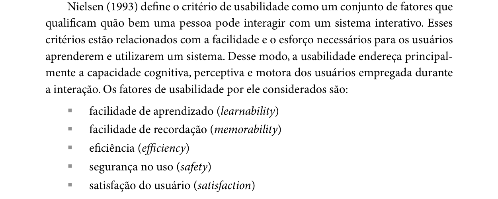
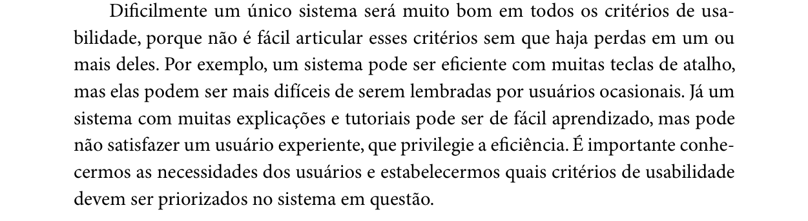
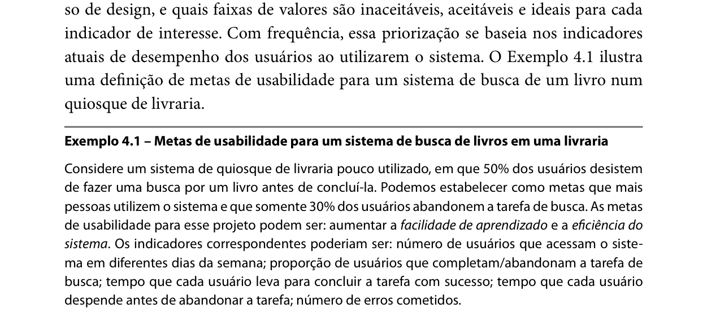

Responsável: Bruno Ferreira Dornelas — Metas de usabilidade · Autor do item: Bruno Ferreira Dornelas

# Metas de usabilidade

## Tabela de contribuição

A Tabela 1 registra quem atuou neste artefato.

| Integrante | Contribuição | Artefato / atividade |
| --- | --- | --- |
| [Caio Breno de Souza Bezerra](https://github.com/CaioBezerra-Dev) | Abertura da página, sem o conteúdo dos itens | [O que a lista pede](metas-usabilidade.md#o-que-a-lista-pede) |
| [Bruno Ferreira Dornelas](https://github.com/brunnf) | Item de conteúdo sobre metas de usabilidade (item 13) | [Item de conteúdo](metas-usabilidade.md#item-de-conteudo-da-disciplina) |
| [Bruno Ferreira Dornelas](https://github.com/brunnf) | Metas do projeto, indicadores e faixas de valores (item 13) | [Metas que o projeto deve alcançar](metas-usabilidade.md#metas-que-o-projeto-deve-alcancar) |
| [Bruno Ferreira Dornelas](https://github.com/brunnf) | Razão da seleção das metas (item 14) | [Razão da seleção](metas-usabilidade.md#razao-da-selecao) |
| [Bruno Ferreira Dornelas](https://github.com/brunnf) | Relação das metas com evidências, princípios e plataforma | [Rastreabilidade das metas](#rastreabilidade-com-os-principios-e-a-plataforma) |
| Claude Opus 5.5 (Anthropic), no Antigravity | Localização dos trechos no livro, recorte das figuras e redação preliminar | [Agradecimentos](metas-usabilidade.md#agradecimentos) |
| Codex (OpenAI) | Conferência bibliográfica, revisão dos indicadores e rastreabilidade com os perfis e tarefas | [Metas](#metas-que-o-projeto-deve-alcancar) · [Justificativas](#razao-da-selecao) |

Tabela 1 — Contribuição neste artefato.

Fonte: elaboração do Grupo 06 (2026).

## Introdução

Esta página reúne os itens 13 e 14 da Apresentação 3, ambos de Bruno Ferreira Dornelas. No ciclo de Mayhew, as metas de usabilidade são definidas a partir do perfil, da análise de tarefas, das características da plataforma e dos princípios gerais (BARBOSA; SILVA, 2010, p. 109). O recorte vigente é o [escopo da investigação](../entrega-2/perfil-usuario.md#escopo-atual-da-investigacao), com quatro perfis: os dois agrupamentos de cidadão, o usuário de levantamento profissional de notícias e o Professor. A plataforma já registrada está em [Características da plataforma](plataforma.md).

## O que a lista pede

O item 13 pede as metas de usabilidade que devem ser alcançadas no projeto, com referência bibliográfica, foto do trecho e o nome do autor do item. O item 14 pede a razão da seleção dessas metas (SALES, 2026). A fonte adotada é Barbosa e Silva (2010): os fatores de usabilidade de Nielsen, no capítulo 2, e a definição de metas na engenharia de usabilidade, no capítulo 4.

**Autor do item:** Bruno Ferreira Dornelas

## Item de conteúdo da disciplina

Barbosa e Silva (2010, p. 29) apresentam a usabilidade, segundo Nielsen (1993), como um conjunto de fatores que qualificam quão bem uma pessoa interage com um sistema: **facilidade de aprendizado**, **facilidade de recordação**, **eficiência**, **segurança no uso** e **satisfação do usuário** (Figura 1). Os autores definem cada fator nas páginas 29 a 31:

- **facilidade de aprendizado:** tempo e esforço para a pessoa aprender a usar o sistema com determinado nível de competência (p. 29);
- **facilidade de recordação:** esforço cognitivo para lembrar como interagir com a interface, conforme aprendido antes. É "especialmente importante quando existem operações ou sistemas com baixa frequência de uso" (p. 30);
- **eficiência:** tempo necessário para concluir uma atividade com apoio computacional, importante para manter a produtividade depois do aprendizado (p. 30–31);
- **segurança no uso:** proteção contra condições desfavoráveis, obtida de duas formas, evitando problemas e ajudando a pessoa a se recuperar deles (p. 31);
- **satisfação do usuário:** avaliação subjetiva do efeito do uso sobre as emoções e os sentimentos da pessoa (p. 31).

Os autores alertam que dificilmente um sistema será muito bom em todos os fatores ao mesmo tempo, e que é preciso conhecer as necessidades dos usuários para estabelecer quais deles serão priorizados (BARBOSA; SILVA, 2010, p. 32). A Figura 2 reproduz esse trecho.

Na engenharia de usabilidade, definir as metas é escolher os fatores de qualidade de uso priorizados no projeto, como serão avaliados e quais faixas de valores são **inaceitáveis, aceitáveis e ideais** para cada indicador. Com frequência, essa priorização parte dos indicadores atuais de desempenho dos usuários (BARBOSA; SILVA, 2010, p. 105–106). O Exemplo 4.1 do livro usa a taxa de abandono da busca, o tempo até concluir e o número de erros como indicadores. As Figuras 3 e 4 reproduzem esse trecho. As tabelas seguintes adotam esse formato. Os valores do Exemplo 4.1 pertencem ao exemplo da livraria e não são transferidos para o Senado. Os recortes das figuras 1–4 estão no [Apêndice A](#apendice-a-trechos-do-livro).

## Situação atual do portal

A Tabela 2 reúne as evidências disponíveis. A base combina sessões com tarefas diferentes, relatos e um levantamento documental; não permite calcular uma taxa única de conclusão, aprendizado ou abandono do portal. A [conferência da Etapa 2](../entrega-2/perfil-usuario.md#conferencia-dos-artefatos) registra esses limites.

| Origem / persona | Atividade investigada | Evidência disponível | Implicação para as metas |
| --- | --- | --- | --- |
| [P1 — Lucas](../entrega-2/individual/bruno/entrevista-observacao.md#registro-da-observacao) | Compreender a situação da proposta sobre jornada | Encerrou sem resposta; selecionou um PL cuja correspondência à PEC procurada não foi demonstrada | Apoiar descoberta do percurso e compreensão correta, sem confundir proposta, aprovação e vigência |
| [P2 — Renata](../entrega-2/individual/caio/analise-tarefas.md#tarefa-analisada) | Selecionar notícias para anuário | Triagem realizada; salvamento e aprovação fora do portal apenas relatados. Ordenação estava disponível e não foi utilizada | Medir seleção correta e esforço de triagem; não declarar função inexistente nem falha por ausência de salvamento na sessão |
| [P3 — Letícia](../entrega-2/individual/heitor/entrevista-observacao.md#registro-da-observacao) | Registrar posicionamento em consulta pública | Conclusão com dificuldade para localizar a participação e transição pelo gov.br | Aprendizado, prevenção de escolha divergente e recuperação do contexto |
| [P4 — Marta](../entrega-2/individual/israel/entrevista-observacao.md#limitacoes-da-coleta) | Obter informação sobre auditório | Tentativa relatada sem resposta; sequência reconstruída e data divergente; reserva não confirmada | Investigar encontrabilidade da informação sem prometer agendamento; não usar este registro para calcular tempo ou taxa de sucesso observados |
| [P5 — Marina](../entrega-2/individual/luis/analise-tarefas.md#tarefa-analisada) | Localizar reunião da CCJ, pauta e resultado | Concluiu em aproximadamente 8min10s com desvios e quase desistência | Aprendizado e eficiência; duração de um caso não é limite de todas as tarefas |
| [Documentos — Rafael / Professor](../entrega-2/individual/bruno/perfil-2/analise-documental.md#evidencias-extraidas) | Coordenar participação da turma e obter declaração | E02–E05 descrevem código, associação, retorno dos alunos e declaração; emissão autenticada não executada | Prevenir erro de vinculação e apoiar compreensão das responsabilidades; sem desempenho atual medido |

Tabela 2 — Evidências de partida e alcance das conclusões.

Fonte: registros individuais e análise documental do Grupo 06; síntese interpretativa para seleção das metas.

Não houve teste de recordação após intervalo, medida uniforme de satisfação ou comparação controlada de eficiência. Primeiro contato com a tarefa, com o portal e com o protótipo são condições diferentes e serão registradas separadamente. A amostra de cinco participantes não representa a composição do público do Senado.

## Metas que o projeto deve alcançar

O projeto mantém os cinco fatores apresentados por Barbosa e Silva (2010, p. 29–32). A prioridade de design passa a ser: **1 — segurança no uso; 2 — facilidade de aprendizado; 3 — facilidade de recordação; 4 — eficiência; 5 — satisfação**. A ordem orienta decisões em conflito; todos os fatores devem ser avaliados no recorte aplicável. A justificativa de cada prioridade está na Tabela 6.

A **eficácia**, definida na apresentação da ISO 9241-11 pelo livro (p. 29), é registrada como condição transversal M0: alcançar o objetivo corretamente. Ela não é acrescentada como sexto fator de Nielsen, nem tratada como sinônimo de facilidade de aprendizado. Concluir uma tarefa uma vez não mede, por si só, o esforço para aprender a realizá-la.

**Origem dos valores:** as faixas da Tabela 3 são decisões iniciais de projeto, propostas pelo grupo para a próxima avaliação. Não são números prescritos pelo livro, resultados já alcançados ou estimativas estatísticas da população. Adota-se 80% como patamar operacional inicial para conclusão autônoma e recuperação, 100% como ideal e tolerância zero para resultado crítico incorreto. Para eficiência, propõe-se redução ideal de pelo menos 20%; para satisfação, média mínima de 3,5/5. Esses valores deverão ser calibrados em piloto e fixados antes da avaliação principal, com justificativa e versão registradas; não devem ser relaxados depois apenas para acomodar resultados ruins.

A Tabela 3 define indicadores distintos e faixas sem sobreposição. As unidades de análise, as tarefas e as condições de medição são detalhadas nas tabelas 4 e 5.

| ID / prioridade | Meta e indicador | Inaceitável | Aceitável | Ideal |
| --- | --- | --- | --- | --- |
| M0 / transversal — eficácia | Percentual de participantes que atingem corretamente o objetivo, sem ajuda do avaliador, por tarefa e condição de teste | Menos de 80% | De 80% a menos de 100% | 100% |
| M1 / 2 — aprendizado | Percentual de participantes sem experiência prévia na tarefa que atingem o nível de competência definido na Tabela 4 em até duas tentativas equivalentes, sem ajuda do avaliador | Menos de 80% | De 80% a menos de 100% | 100% |
| M2 / 1 — segurança: prevenção | Número de resultados críticos incorretos efetivados no teste, conforme definições da Tabela 4 | Um ou mais | Zero; tentativas equivocadas são detectadas e corrigidas antes da conclusão | Zero, sem tentativas de ação crítica equivocada |
| M3 / 1 — segurança: recuperação | Percentual que resolve o incidente preparado, retoma o contexto correto e conclui sem ajuda, sem perda crítica | Menos de 80% ou qualquer resultado crítico incorreto | De 80% a menos de 100%, sem resultado crítico incorreto | 100%, sem resultado crítico incorreto |
| M4 / 3 — recordação | Percentual que, após 7 dias (tolerância de 1 dia), volta a concluir tarefa equivalente sem ajuda ou novo treinamento; inclui apenas quem demonstrou competência na primeira sessão | Menos de 80% | De 80% a menos de 100% | 100% |
| M5 / 4 — eficiência | Razão R entre a mediana do tempo ativo no protótipo e a mediana no sistema atual, por tarefa, com usuários familiarizados e execuções corretas comparáveis | R maior que 1 | R maior que 0,80 e menor ou igual a 1 | R menor ou igual a 0,80 |
| M6 / 5 — satisfação | Média das respostas pós-tarefa a “Quão satisfeito(a) você ficou com a experiência de realizar esta tarefa?”, de 1 (muito insatisfeito) a 5 (muito satisfeito) | Média menor que 3,5 | Média de 3,5 a menos de 4,5 | Média de 4,5 a 5 |

Tabela 3 — Metas propostas, indicadores e faixas de aceitação.

Fonte: decisões do Grupo 06, fundamentadas nos fatores de BARBOSA; SILVA (2010, p. 29–32) e no método de definição de indicadores e faixas (p. 105–106).

Em M2, a faixa aceitável cobre zero resultados críticos com alguma tentativa equivocada corrigida; a ideal cobre zero resultados e zero tentativas equivocadas. A ausência de erros em um teste pequeno não garante ausência de risco em produção. Se não houver execução válida para um indicador, seu estado é **não avaliado**, e não aceitável ou ideal. Nenhuma falha crítica pode ser compensada por rapidez ou satisfação elevada.

### Regras de medição

A Tabela 4 torna os indicadores reproduzíveis. Recursos de ajuda existentes na interface podem ser utilizados; intervenções do avaliador para indicar o caminho ou a resposta contam como ajuda e retiram a conclusão do numerador de autonomia. Ajustes de acessibilidade combinados antes da tarefa não são ajuda operacional.

| Indicador | Procedimento e registro |
| --- | --- |
| M0 — conclusão correta | Antes da sessão, preparar gabarito e resultado esperado para cada tarefa da Tabela 5. Contar conclusões corretas e sem ajuda sobre todas as execuções válidas daquela tarefa, incluindo falhas e abandonos. Relatar contagem e percentual, sem somar tarefas diferentes |
| M1 — aprendizado | Nível de competência: atingir o critério da Tabela 5 sem orientação operacional e sem erro crítico. Oferecer até duas tentativas equivalentes com conteúdos distintos e sem treinamento entre elas. Registrar em qual tentativa a competência foi atingida, tempo ativo e ajuda utilizada. O resultado é aprendizagem inicial, não prova de domínio duradouro |
| M2 — erro crítico | Em T1, concluir incorretamente a identidade ou situação da proposição, inclusive equiparar aprovação a vigência; em T3, efetivar voto diferente da intenção indicada no exercício; em T6, concluir associação com turma errada ou aceitar declaração incompatível com os dados de referência. Registrar também tentativas corrigidas antes da conclusão. Aplicar T6 apenas nos segmentos e regras confirmados/modelados explicitamente |
| M3 — incidente e recuperação | No protótipo, preparar um incidente igual para cada participante da mesma tarefa: retorno da autenticação em T3 ou código de turma incorreto detectável antes do envio em T6. Verificar identificação do contexto, correção e continuidade. Não simular como disponível a inclusão de código após publicação: E03 documenta que isso não é permitido |
| M4 — retorno | Selecionar quem atingiu competência; usar tarefa equivalente, mesma versão e dispositivo após 7 ± 1 dias, sem instruções do primeiro encontro. Registrar uso intermediário. Ausências ou uso intermediário que comprometa a comparação devem ser informados separadamente; não são falha de memória. Sem participantes elegíveis ou retorno, não avaliar |
| M5 — tempo ativo | Iniciar ao apresentar o objetivo com a tela inicial definida; encerrar quando o participante declara conclusão, conferida pelo gabarito. Excluir apenas espera técnica externa e interrupções previstas no protocolo, registrando também tempo total. Familiarizar nas duas condições e alternar a ordem sistema atual/protótipo com dados equivalentes. Exigir sucesso comparável e publicar falhas/abandonos separadamente; tempo de abandono não conta como execução rápida |
| M6 — satisfação | Aplicar a pergunta após cada tarefa, inclusive falhas e abandonos, antes da discussão com o avaliador. Registrar notas individuais, média, distribuição e motivos. A escala é uma medida simples do projeto, não um instrumento padronizado validado. Falas de frustração complementam a análise qualitativa, sem exigir ausência de críticas |

Tabela 4 — Definições operacionais dos indicadores.

Fonte: protocolo proposto pelo Grupo 06 para operacionalizar as metas; conceitos de BARBOSA; SILVA (2010, p. 29–32, 105–106).

Para M5, a comparação depende de execuções válidas nas duas condições. Os 8min10s de P5 não são uma linha de base para outros participantes ou tarefas. Sem uma linha de base comparável, especialmente no Professor, registrar tempos descritivos e manter a meta comparativa não avaliada. Ganho de tempo não caracteriza melhoria se ocorrer com redução da conclusão correta ou aumento dos erros.

O piloto deve definir o limite de duração de cada tarefa e o tratamento das interrupções, antes da avaliação principal. Os limites não serão iguais por pressuposto para leitura, votação e trabalho docente. Resultados serão separados por tarefa, perfil, experiência prévia e dispositivo; contagens pequenas são indícios formativos, não estimativas de prevalência. O número de participantes por condição será documentado no plano de avaliação.

### Tarefas e critérios de conclusão

A Tabela 5 conecta as metas aos cenários e modelos existentes. As ações críticas serão simuladas em protótipo, com dados fictícios; não é necessário registrar votos reais ou publicar ideias para medir as metas.

| ID / perfil e fonte | Recorte e critério de conclusão | Indicadores e limites |
| --- | --- | --- |
| T1 — Cidadão com demanda ocasional / [Lucas](../entrega-2/individual/bruno/analise-tarefas.md) | Identificar a proposição pertinente ao objetivo fornecido e explicar sua situação conforme o gabarito, distinguindo proposta, aprovação e vigência | M0, M1, M2, M4, M5 e M6. Conteúdo de referência datado; não pressupor que o PL escolhido por P1 corresponde à PEC pretendida |
| T2 — Levantamento profissional de notícias / [Renata](../entrega-2/individual/caio/analise-tarefas.md) | Em conjunto controlado de notícias, selecionar todos os itens pertinentes ao tema e período pedidos, sem incluir itens fora dos critérios | M0, M1, M4, M5 e M6. Termina na seleção; não exigir salvamento, aprovação ou edição dentro do portal |
| T3 — Participação cívica / [Letícia](../entrega-2/individual/heitor/analise-tarefas.md) | Localizar a consulta, identificar a matéria e concluir voto simulado conforme a intenção indicada; no incidente, retomar o contexto após autenticação simulada | M0–M6. Credenciais reais e alteração do gov.br ficam fora do teste; avaliar o tratamento da transição pelo protótipo |
| T4 — Cidadão com demanda ocasional / [Marta](../entrega-2/individual/israel/analise-tarefas.md) | Buscar informação oficial pertinente à demanda de auditório. O gabarito depende de confirmar previamente qual informação ou canal existe | M0, M1, M4, M5 e M6 somente após definir objeto verificável. Até lá, exploração qualitativa; não exigir agenda ou reserva cuja existência não foi confirmada |
| T5 — Cidadão com demanda ocasional / [Marina](../entrega-2/individual/luis/analise-tarefas.md) | Localizar a reunião especificada, sua pauta e o resultado do item correto | M0, M1, M4, M5 e M6. Utilizar reunião equivalente, sem fornecer o caminho; comparar tempos apenas com condições compatíveis |
| T6 — [Professor / Rafael](../entrega-2/individual/bruno/perfil-2/analise-tarefas.md) | Em segmentos separados, identificar instituição/turma/código e orientar a vinculação; com dados fictícios de oficina concluída, solicitar e conferir a comprovação prevista | M0–M6 apenas nos segmentos representados. Fundamentar em E02–E05 e explicitar decisões do protótipo; regras e campos autenticados ainda não confirmados. M5 depende de linha de base futura |

Tabela 5 — Rastreabilidade das tarefas e critérios de sucesso.

Fonte: cenários e análises de tarefas da Etapa 2; critérios de avaliação formulados pelo Grupo 06.

A oficina não será cronometrada como se aulas, elaboração de ideias, avaliação pelo Senado e retorno dos alunos fossem uma sessão de navegação. Os estados intermediários de T6 serão fornecidos pelo protocolo. Resultados de um segmento não demonstram sucesso do processo completo. Avaliação de T6 com pessoas que não exercem o papel docente poderá servir ao piloto, mas não será apresentada como validação do perfil Professor.

Os testes em computador e celular devem corresponder aos contextos escolhidos para cada perfil e ser registrados separadamente. Não se exige que toda pessoa execute todas as tarefas nos dois dispositivos. Interface responsiva não precisa apresentar menus idênticos, mas deve permitir alcançar objetivos equivalentes no contexto avaliado.

## Razão da seleção

Barbosa e Silva (2010, p. 32) orientam a priorização segundo as necessidades dos usuários e os conflitos entre critérios. A Tabela 6 relaciona cada escolha às evidências atuais; o maior número de participantes em um agrupamento não prova que ele seja predominante no público do portal.

| Prioridade / fator | Justificativa no projeto | Evidência e limite |
| --- | --- | --- |
| 1 — Segurança no uso | Prevenir consequências de uma escolha, associação ou interpretação equivocada; permitir recuperação quando possível, antes de concluir ações críticas | P1 não compreendeu o estado da matéria; P3 exige voto coerente com a intenção. No Professor, [E03](../entrega-2/individual/bruno/perfil-2/analise-documental.md#e03) documenta consequências da omissão do código. Não houve voto incorreto observado nem erro docente observado; são riscos que justificam prevenção |
| 2 — Facilidade de aprendizado | Permitir descobrir como realizar a atividade sem depender de orientação do avaliador; medir o esforço até a competência inicial | P1 e P5 têm pouca familiaridade com o portal; P3 teve dificuldade para localizar a participação. O Professor tem processo com dependências entre atores, mas não tem proficiência digital medida. Não se presume que todos rejeitem manuais |
| 3 — Facilidade de recordação | Apoiar a retomada de atividades pouco frequentes sem novo treinamento, conforme o livro (p. 30) | P1 relata acesso espaçado, P3 acessa sob demanda e P5 tem poucos contatos. A frequência do Professor não foi determinada; sua inclusão em M4 testa uma hipótese relevante para retorno entre etapas, não comprova hábito periódico |
| 4 — Eficiência | Reduzir esforço e tempo após familiarização, mantendo correção e autonomia | P2 enfrenta triagem por período; P5 fez desvios antes de concluir. No Professor, medir apenas segmentos de interação. Não transformar duração de aulas ou espera por retorno em ineficiência da interface |
| 5 — Satisfação | Avaliar diretamente a experiência percebida, inclusive quando a tarefa falha; identificar incômodo que medidas de tempo não mostram | P1/P2 elogiam aspectos visuais; P4/P5 registram dificuldades. Esses relatos não equivalem a nota pós-tarefa, não representam todos os perfis e não permitem reduzir satisfação à aparência |

Tabela 6 — Justificativas das prioridades e ligação com as evidências.

Fonte: perfis, sessões e análise documental da Etapa 2; fatores e conflitos de BARBOSA; SILVA (2010, p. 29–32).

### Por que esta ordem

A inclusão do Professor evidencia um risco documental cuja prevenção precisa ocorrer antes da publicação: a omissão do código não pode ser resolvida pela inclusão posterior (E03). Junto da coerência do voto e da interpretação da proposição, isso coloca segurança antes do ganho de tempo. Essa decisão não afirma que professores já cometeram esse erro.

Aprendizado vem em seguida porque descobrir o percurso e compreender as informações são condições para agir com autonomia. Recordação atende aos acessos ocasionais já registrados; eficiência recebe atenção especial no levantamento profissional de notícias e nas atividades repetidas. Satisfação permanece uma medida própria: velocidade e conclusão correta não garantem uma experiência satisfatória.

A ordem global admite ênfase por tarefa: T2 demanda atenção à eficiência; T3 e T6 exigem prevenção e recuperação de erros. Isso não dispensa os demais critérios. Confirmações excessivas podem aumentar tempo; atalhos pouco claros podem prejudicar aprendizado e recordação. O teste deve verificar essas trocas, como orienta o livro (p. 32), sem considerar que menos cliques seja sempre melhor.

Filtros, ordenação, mensagens, confirmação e preservação de contexto são **possíveis soluções de design**, a discutir nos [princípios gerais](principios-gerais.md) e no [guia de estilo](guia-de-estilo.md). Uma meta descreve o resultado para a pessoa; não exige antecipadamente um componente ou comprova uma função inexistente. A [plataforma](plataforma.md) condiciona a implementação, especialmente nas transições entre serviços e na autenticação externa.

### Rastreabilidade com os princípios e a plataforma

No ciclo de Mayhew, perfil, tarefas, características da plataforma e princípios gerais alimentam a definição das metas (BARBOSA; SILVA, 2010, p. 109–110). A Tabela 7 explicita essa relação para os indicadores M0–M6, usando as evidências da Tabela 2 e as tarefas da Tabela 5. As condições técnicas se apoiam na inspeção registrada em [Características da plataforma](plataforma.md#como-a-plataforma-foi-examinada); as relações com princípios são justificativas de projeto, não resultados de avaliação.

| Meta | Evidência e tarefa | Princípios relacionados | Condição da plataforma e consequência para a avaliação |
| --- | --- | --- | --- |
| **M0 — Eficácia** | P1 encerrou sem compreender a situação da proposição (T1); P5 encontrou pauta e resultado após desvios (T5) | [Visibilidade e reconhecimento](principios-gerais.md#6-visibilidade-e-reconhecimento) e [conteúdo relevante e expressão adequada](principios-gerais.md#7-conteudo-relevante-e-expressao-adequada): tornar identidade, situação e resultado compreensíveis | O portal se distribui por [vários endereços](plataforma.md#limitacoes). Verificar a conclusão correta do percurso, inclusive quando ele cruza serviços, sem considerar a simples chegada a uma página como sucesso |
| **M1 — Aprendizado** | P1/P5 têm pouca familiaridade com o portal; P3 teve dificuldade para localizar a participação (T1, T3 e T5) | [Correspondência com as expectativas](principios-gerais.md#1-correspondencia-com-as-expectativas-dos-usuarios), [simplicidade nas estruturas das tarefas](principios-gerais.md#2-simplicidade-nas-estruturas-das-tarefas) e conteúdo relevante: facilitar descoberta e compreensão do percurso | A plataforma oferece [busca e texto em português](plataforma.md#possibilidades). Esses recursos podem apoiar a descoberta; medir autonomia sem fornecer o caminho e registrar a experiência prévia na tarefa e no navegador |
| **M2 — Segurança: prevenção** | P1 não compreendeu o estado da matéria; T3 requer voto coerente com a intenção; [E03 do Professor](../entrega-2/individual/bruno/perfil-2/analise-documental.md#e03) registra a impossibilidade de incluir o código após publicação (T6) | Visibilidade e reconhecimento e [antecipação das necessidades](principios-gerais.md#5-antecipacao-das-necessidades-do-usuario) apoiam a conferência antes da ação. A prevenção também exige tratar a relação com **projeto para erros**, atualmente não priorizado no documento de princípios | O voto depende de e-Cidadania e autenticação externa; a inspeção da página inicial não confirma regras das áreas autenticadas. Usar voto simulado e dados fictícios de turma; verificar o resultado crítico somente nos segmentos e regras representados |
| **M3 — Segurança: recuperação** | A transição de autenticação aparece em P3; o código de turma de T6 gera um risco documental, sem erro docente observado | [Equilíbrio entre controle e liberdade](principios-gerais.md#3-equilibrio-entre-controle-e-liberdade-do-usuario) e visibilidade e reconhecimento apoiam a retomada. **Projeto para erros** complementaria a recuperação, mas não está entre os princípios adotados | A [autenticação por serviço externo](plataforma.md#limitacoes) limita a intervenção do grupo. No protótipo, avaliar o retorno ao contexto de T3 e a correção do código antes do envio em T6; não exigir mudanças no gov.br nem inclusão de código após publicação |
| **M4 — Recordação** | P1, P3 e P5 relatam acessos espaçados ou sob demanda (T1, T3 e T5); para T6, a frequência ainda não foi determinada | [Consistência e padronização](principios-gerais.md#4-consistencia-e-padronizacao) e visibilidade e reconhecimento: apoiar a retomada do percurso | A navegação atravessa páginas e serviços distintos. No retorno após o intervalo, manter condições de aparelho e acesso comparáveis, registrar mudanças e verificar se a pessoa retoma a tarefa sem novo treinamento |
| **M5 — Eficiência** | P2 realiza triagem de notícias (T2); P5 fez desvios antes de concluir (T5). Em T6, medir apenas segmentos de interação | Simplicidade nas estruturas das tarefas e antecipação das necessidades podem reduzir desvios. A **promoção da eficiência do usuário** permanece não priorizada nos princípios, embora M5 seja uma meta do projeto | O uso é [conectado e pode envolver recursos externos](plataforma.md#limitacoes). Registrar tempo ativo e total, separar esperas técnicas e comparar execuções corretas em condições compatíveis; a duração da sessão de P5 não serve como referência para todas as tarefas |
| **M6 — Satisfação** | P1/P2 elogiam aspectos visuais e P4/P5 relatam dificuldades; não há medida uniforme pós-tarefa (T1–T6, conforme aplicabilidade) | Correspondência com as expectativas, controle e liberdade e conteúdo relevante orientam decisões que podem afetar a experiência; o atendimento aos princípios não substitui a resposta do usuário | O perfil registra aparelhos diferentes e a página inicial oferece [contraste, zoom e Libras](plataforma.md#possibilidades). Registrar aparelho e recursos utilizados ao coletar a satisfação, inclusive após falhas; a presença desses controles não comprova acessibilidade nem satisfação |

Tabela 7 — Relação entre metas, evidências, princípios e características da plataforma.

Fonte: elaboração do Grupo 06 (2026), com base nos artefatos vinculados e na integração dos insumos da análise de requisitos descrita por BARBOSA; SILVA (2010, p. 109–110).

A seleção vigente de [princípios não priorizados](principios-gerais.md#principios-nao-priorizados) deixa de fora projeto para erros e promoção da eficiência. A Tabela 7 registra essa divergência com M2, M3 e M5 para orientar o alinhamento coletivo; não declara esses princípios como já adotados. As metas continuam justificadas pelas tarefas e evidências apresentadas, e a relação parcial com os princípios selecionados não resolve essa diferença entre os artefatos.

Esta relação orienta a aplicação das metas no [guia de estilo](guia-de-estilo.md): cada decisão de interface deve apontar para a necessidade e o resultado que pretende apoiar. A inspeção da plataforma não comparou navegadores nem percorreu telas estreitas; condições de teste e comportamento responsivo precisam ser verificados antes de generalizar os resultados.

### Relação com outros critérios de qualidade

O livro distingue acessibilidade e comunicabilidade dos fatores de usabilidade (p. 28–32 e seções seguintes). Isso não as torna dispensáveis: barreiras de acesso ou de compreensão podem impedir o resultado das metas. O protocolo deve registrar recursos de acesso, barreiras e contexto; a presença de contraste, zoom ou Libras não comprova acessibilidade do percurso completo. Esses critérios continuam articulados aos princípios e ao guia de estilo, sem alegar conformidade por meio desta tabela de metas.

Eficácia permanece explicitamente medida em M0. Recordação não tem resultado sem retorno após intervalo; eficiência não tem resultado comparativo sem linha de base válida; e a revisão documental do Professor não substitui avaliação com docentes. Essa separação mantém as metas verificáveis e evita apresentar expectativa como evidência.

## Agradecimentos

Este documento contou com apoio de ferramentas de inteligência artificial na organização e redação. A responsabilidade pelo conteúdo é do autor.

## Histórico de versão

| Versão | Data | Descrição | Autor(es) | Revisor(es) |
| :---: | :---: | --- | --- | --- |
| `0.1` | 03/10/2026 | Abertura da página, sem o conteúdo dos itens 13 e 14 | [Caio Breno de Souza Bezerra](https://github.com/CaioBezerra-Dev) | [Bruno Ferreira Dornelas](https://github.com/brunnf) |
| `1.0` | 04/10/2026 | Item de conteúdo, metas com indicadores e faixas (item 13) e razão da seleção (item 14) | [Bruno Ferreira Dornelas](https://github.com/brunnf) | [Caio Breno de Souza Bezerra](https://github.com/CaioBezerra-Dev) |
| `1.1` | 05/10/2026 | Revê metas e justificativas conforme o livro e os quatro perfis; distingue eficácia, evidências, indicadores, faixas propostas e protocolo de avaliação | [Bruno Ferreira Dornelas](https://github.com/brunnf) | [Caio Breno de Souza Bezerra](https://github.com/CaioBezerra-Dev) |
| `1.2` | 06/10/2026 | Relaciona M0–M6 às evidências, tarefas, princípios e condições da plataforma, explicitando as divergências entre os artefatos | [Bruno Ferreira Dornelas](https://github.com/brunnf) | [Caio Breno de Souza Bezerra](https://github.com/CaioBezerra-Dev) |

## Referências

[1] BARBOSA, Simone Diniz Junqueira; SILVA, Bruno Santana da. Interação humano-computador. Rio de Janeiro: Elsevier, 2010.

[2] NIELSEN, Jakob. Usability engineering. Boston: Academic Press, 1993.

[3] SALES, André Barros de. Plano de Ensino FIHC 022026 — Turma 01. Brasília: FCTE/UnB, 2026.

## Apêndice A — Trechos do livro

As figuras 1–4 fundamentam os fatores, a priorização e a definição de indicadores e faixas citados no item de conteúdo.

??? note "Figura 1 — Fatores de usabilidade de Nielsen"

    <figure markdown="span">
      
      <figcaption>Figura 1 — Fatores de usabilidade de Nielsen.</figcaption>
    </figure>
    
Fonte: BARBOSA; SILVA (2010, p. 29).

??? note "Figura 2 — Priorização dos critérios de usabilidade"

    <figure markdown="span">
      
      <figcaption>Figura 2 — Priorização dos critérios de usabilidade.</figcaption>
    </figure>
    
Fonte: BARBOSA; SILVA (2010, p. 32).

??? note "Figura 3 — Definição das metas de usabilidade (início)"

    <figure markdown="span">
      
      <figcaption>Figura 3 — Definição das metas de usabilidade (início).</figcaption>
    </figure>
    
Fonte: BARBOSA; SILVA (2010, p. 105).

??? note "Figura 4 — Definição das metas de usabilidade e Exemplo 4.1"

    <figure markdown="span">
      
      <figcaption>Figura 4 — Definição das metas de usabilidade e Exemplo 4.1.</figcaption>
    </figure>
    
Fonte: BARBOSA; SILVA (2010, p. 106).

