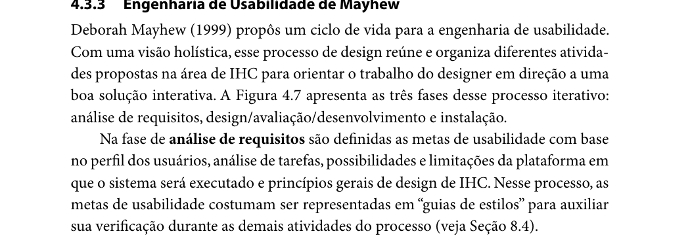
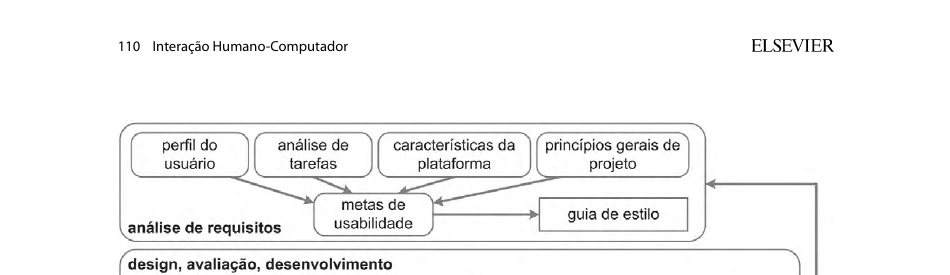

Responsável: Caio Breno de Souza Bezerra — Características da plataforma · Autor do item: Caio Breno de Souza Bezerra

# Características da plataforma

## Tabela de contribuição

A Tabela 1 registra quem atuou neste artefato.

| Integrante | Contribuição | Artefato / atividade |
| --- | --- | --- |
| [Caio Breno de Souza Bezerra](https://github.com/CaioBezerra-Dev) | Item de conteúdo sobre a plataforma na análise de requisitos | [Item de conteúdo](plataforma.md#item-de-conteudo-da-disciplina) |
| [Caio Breno de Souza Bezerra](https://github.com/CaioBezerra-Dev) | Inspeção da página inicial e registro das possibilidades e limitações | [Identificação](plataforma.md#identificacao) |
| Grok (xAI) | Organização do texto e formatação Markdown | [Agradecimentos](plataforma.md#agradecimentos) |

Tabela 1 — Contribuição neste artefato.

Fonte: elaboração do Grupo 06 (2026).

## Introdução

Esta página registra as características da plataforma do Portal do Senado Federal. No ciclo de engenharia de usabilidade de Mayhew, adotado pelo grupo no [processo de design](../entrega-1/processo-design.md), a fase de análise de requisitos define as metas de usabilidade com base no perfil dos usuários, na análise de tarefas, nas possibilidades e limitações da plataforma em que o sistema será executado e nos princípios gerais de design de IHC (BARBOSA; SILVA, 2010, p. 109). O perfil e a análise de tarefas estão na Etapa 2. Os princípios, as metas e o guia de estilo desta etapa estão no [índice da Etapa 3](index.md), cada um com o autor indicado na lista de verificação (SALES, 2026).

## Item de conteúdo da disciplina

**Autor do item:** Caio Breno de Souza Bezerra

Barbosa e Silva (2010, p. 109) descrevem a fase de análise de requisitos da engenharia de usabilidade de Mayhew. Nessa fase, as metas de usabilidade são definidas a partir de quatro insumos: o perfil dos usuários, a análise de tarefas, as possibilidades e limitações da plataforma em que o sistema será executado e os princípios gerais de design de IHC. As metas costumam ser representadas no guia de estilo, para serem conferidas nas fases seguintes. A Figura 1 reproduz esse trecho.

A Figura 2 recorta a fase de análise de requisitos da Figura 4.7 do mesmo livro. A caixa **características da plataforma** fica ao lado do perfil do usuário, da análise de tarefas e dos princípios gerais de projeto. As quatro alimentam as metas de usabilidade, e o conjunto segue para o guia de estilo (BARBOSA; SILVA, 2010, p. 110).

O livro nomeia o artefato e diz o que ele alimenta. O registro pedido é o do ambiente em que o sistema roda: o que esse ambiente permite e o que ele limita. O sistema do projeto já está no ar. A plataforma descrita aqui é a do [Portal do Senado Federal](https://www12.senado.leg.br/), no recorte que o grupo reprojeta.

??? note "Figura 1 — Análise de requisitos na engenharia de usabilidade de Mayhew"

    <figure markdown="span">
      
      <figcaption>Figura 1 — Análise de requisitos na engenharia de usabilidade de Mayhew.</figcaption>
    </figure>
    
Fonte: BARBOSA; SILVA (2010, p. 109).

??? note "Figura 2 — Características da plataforma na fase de análise de requisitos"

    <figure markdown="span">
      
      <figcaption>Figura 2 — Características da plataforma na fase de análise de requisitos.</figcaption>
    </figure>
    
Fonte: BARBOSA; SILVA (2010, p. 110).

## Como a plataforma foi examinada

A inspeção ocorreu em 03/10/2026. Foi lida a resposta pública de <https://www12.senado.leg.br/> (SENADO FEDERAL, 2026): cabeçalhos HTTP e o HTML da página inicial, que o servidor entrega em `/hpsenado`. O mesmo endereço foi pedido de novo com um agente de celular, para ver se a resposta mudava de lugar. A tecnologia que as pessoas já usam veio do [perfil consolidado](../entrega-2/perfil-usuario.md), das sessões da Etapa 2. Esta inspeção não percorreu a página numa tela estreita e não comparou navegadores.

## Identificação

A Tabela 2 identifica a plataforma em que o portal roda e em que as pessoas das sessões já chegaram até ele.

| Campo | O que se observou |
| --- | --- |
| Nome | Portal do Senado Federal |
| Endereço | <https://www12.senado.leg.br/>, que abre `/hpsenado` |
| Forma de uso | Página web em HTTPS, no navegador. A resposta vem com `content-type: text/html` e `content-language: pt-br` |
| Largura da tela | O HTML declara `viewport` com `width=device-width`. O pedido com agente de celular recebeu o mesmo endereço, com resposta 200 |
| Software que entrega a página | Zope e Python, no cabeçalho `x-powered-by`. Os arquivos da interface estão em caminhos `++plone++` |
| Servidor | nginx |
| Controles já presentes na página inicial | Ligação para a página de acessibilidade do portal, Libras (VLibras), alternar contraste, aumentar zoom e diminuir zoom |
| Busca | Ligação de busca para `@@search`, no próprio sítio |
| Aparelhos no perfil | Computador pessoal, computador do órgão e smartphone. Numa sessão, o navegador nomeado é o Microsoft Edge ([perfil](../entrega-2/perfil-usuario.md#perfil-consolidado)) |

Tabela 2 — Identificação da plataforma do projeto.

Fonte: inspeção do Portal do Senado Federal em 03/10/2026; perfil do Grupo 06 (2026).

A Tabela 2 separa o que a página declara hoje do que as sessões já mostraram sobre o aparelho de cada pessoa. O reprojeto permanece nesse ambiente: um site aberto no navegador, em português, nos computadores e no celular que o perfil já registrou.

## Possibilidades

Possibilidade, aqui, é o que esse ambiente já permite e com o que o reprojeto pode contar (BARBOSA; SILVA, 2010, p. 109). A Tabela 3 lista as possibilidades usadas daqui para a frente.

| Possibilidade | Evidência | O que o projeto pode contar |
| --- | --- | --- |
| Uso pelo navegador, sem instalar programa | A página inicial é HTML em HTTPS. Nas sessões, a tarefa foi feita no computador, pelo navegador. O perfil também registra smartphone no dia a dia de parte das pessoas | O protótipo de papel e o de alta fidelidade representam esse site, no navegador |
| A página anuncia a largura do aparelho | `viewport` com `width=device-width`; o agente de celular recebeu o mesmo endereço | A interface tem de caber no computador e no celular. O perfil já tem quem usa o smartphone como aparelho principal |
| Acessibilidade na própria página | Botões de contraste, aumentar zoom, diminuir zoom, Libras e a ligação para a página de acessibilidade do portal | Contraste, zoom e Libras já são parte da plataforma. Metas e guia de estilo partem dessa página, que já os oferece |
| Texto em português | `content-language: pt-br` | O texto da interface segue em português |
| Busca no próprio sítio | Ligação `@@search` na página inicial | A busca é recurso do portal. As tarefas que dependem de achar matéria, senador ou reunião podem contar com ela |

Tabela 3 — Possibilidades da plataforma.

Fonte: inspeção do Portal do Senado Federal em 03/10/2026; BARBOSA; SILVA (2010, p. 109).

## Limitações

Limitação é o que esse ambiente impõe ao reprojeto (BARBOSA; SILVA, 2010, p. 109). A Tabela 4 registra o que a inspeção e a Etapa 2 já mostram.

| Limitação | Evidência | Consequência para o projeto |
| --- | --- | --- |
| O portal se reparte em vários endereços | Na página inicial há ligações para `www12.senado.leg.br` (notícias, e-Cidadania, transparência, institucional), `www25.senado.leg.br` (senadores, atividade, legislação), `legis.senado.leg.br` (comissões e diários) e `www.congressonacional.leg.br` | Uma tarefa pode sair da página inicial e cair em outro sítio, com outra navegação. A avaliação do [site escolhido](../entrega-1/site-escolhido.md#problemas-que-o-grupo-leva-adiante) já tinha registrado essa dispersão |
| Participar leva a outro fluxo | A página inicial liga para <https://www12.senado.leg.br/ecidadania/> e para o login do e-Cidadania. No [perfil](../entrega-2/perfil-usuario.md#perfis-de-usuario-identificados), o voto passa por autenticação no Gov.br | A plataforma da tarefa de votar inclui o e-Cidadania e o Gov.br. O caminho deixa de ser uma única janela |
| A base de software está dada | A resposta identifica Zope/Python e caminhos do Plone | O grupo reprojeta a interação sobre a base Plone/Zope que já entrega a página |
| Os aparelhos das pessoas são diferentes | Notebook pessoal, computador do órgão e smartphone no perfil. O único navegador nomeado numa sessão é o Microsoft Edge ([perfil](../entrega-2/perfil-usuario.md#perfil-consolidado)) | A plataforma tem de servir a computador e a celular. A inspeção de 03/10 não percorreu a tela estreita nem outros navegadores |
| Há recurso de terceiro na página | A página inicial carrega o Google Analytics. A política de segurança da resposta também autoriza VLibras, YouTube e reCAPTCHA | Parte do que a pessoa recebe vem de fora do HTML do Senado. Página pesada pesa no notebook modesto já descrito na persona de Letícia Oliveira |
| O uso observado depende de rede | As sessões e esta inspeção ocorreram online, em HTTPS | O recorte deste artefato é o uso conectado |

Tabela 4 — Limitações da plataforma.

Fonte: inspeção do Portal do Senado Federal em 03/10/2026; elaboração do Grupo 06 (2026).

A Tabela 4 deixa três limites que as próximas páginas desta etapa herdam. O acesso é pelo navegador: a página inicial inspecionada não aponta loja de aplicativos. Uma tarefa pode cruzar endereços: notícia, senador, comissão e voto podem estar em sítios diferentes. A tela varia: o perfil já inclui celular, e a página declara a largura do aparelho.

## O que esta plataforma deixa definido para a etapa

As metas de usabilidade, os princípios e o guia de estilo ainda serão escritos por quem ficou com cada item. O que já fica de pé, por causa desta plataforma, é o seguinte:

- as metas de [Bruno Ferreira Dornelas](metas-usabilidade.md) precisam ser alcançáveis num site de navegador, nos aparelhos do perfil, inclusive quando a tarefa sai para o e-Cidadania e para o Gov.br;
- os princípios de [Israel Soares de Paiva](principios-gerais.md) e os tópicos de [Luís Henrique Luna de Arruda](topicos-principios.md) se aplicam a uma página que já oferece contraste, zoom e Libras, e que se reparte em vários endereços;
- o guia de [Heitor Pinheiro Gonçalves das Chagas](guia-de-estilo.md) descreve este portal, com esses controles e essa dispersão de endereços;
- o cronograma executado, de Luís Henrique, registra esta atividade na [tabela que já existe](../entrega-1/cronograma.md#cronograma-executado).

## Agradecimentos

O Grok (xAI) apoiou a organização do texto e a formatação Markdown. A leitura do trecho do livro, a inspeção da página inicial e a responsabilidade pelo que está publicado são de Caio Breno de Souza Bezerra.

## Histórico de versão

| Versão | Data | Descrição | Autor(es) | Revisor(es) |
| :---: | :---: | --- | --- | --- |
| `1.0` | 03/10/2026 | Criação do artefato de características da plataforma | [Caio Breno de Souza Bezerra](https://github.com/CaioBezerra-Dev) | [Luís Henrique Luna de Arruda](https://github.com/Donnk61) |

## Referências

[1] BARBOSA, Simone Diniz Junqueira; SILVA, Bruno Santana da. Interação humano-computador. Rio de Janeiro: Elsevier, 2010.

[2] SALES, André Barros de. Plano de Ensino FIHC 022026 — Turma 01. Brasília: FCTE/UnB, 2026.

[3] SENADO FEDERAL. Portal do Senado Federal. Disponível em: https://www12.senado.leg.br/. Acesso em: 3 out. 2026.
