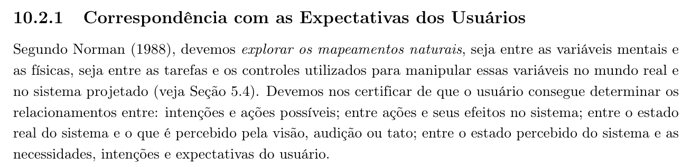
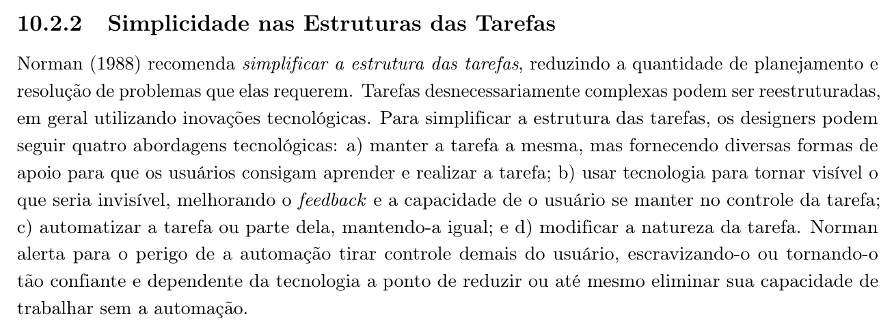
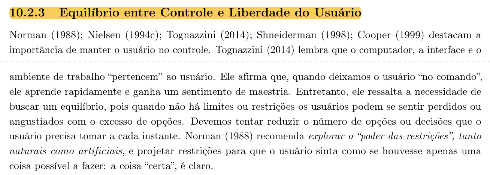
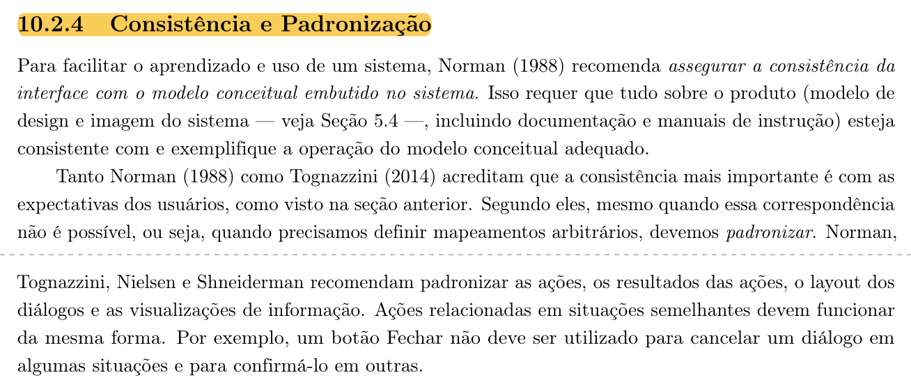
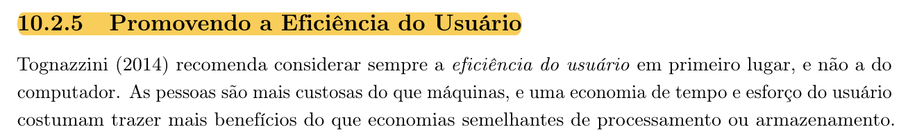
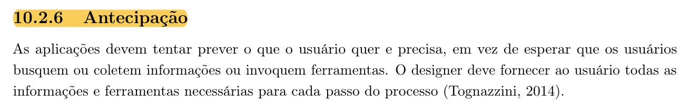
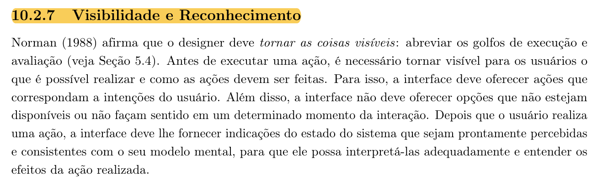
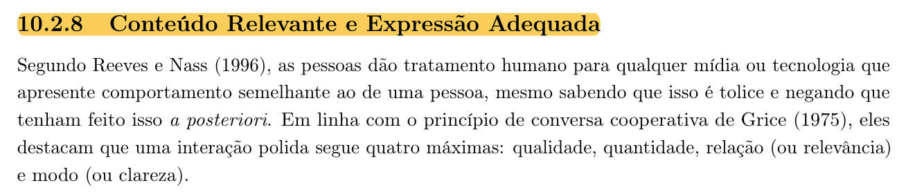
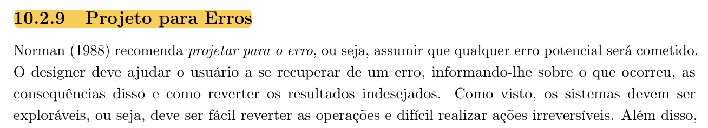

Responsável: Luís Henrique Luna de Arruda — Tópicos dos princípios gerais

# Tópicos dos princípios gerais

## Tabela de contribuição

A Tabela 1 registra quem atuou neste artefato.

| Integrante | Contribuição | Artefato / atividade |
| --- | --- | --- |
| [Caio Breno de Souza Bezerra](https://github.com/CaioBezerra-Dev) | Abertura da página, sem o conteúdo do item | [O que a lista pede](topicos-principios.md#o-que-a-lista-pede) |
| [Luís Henrique Luna de Arruda](https://github.com/Donnk61) | Leitura da seção 10.2, explicação dos oito tópicos e ligação com o Portal do Senado | [Os oito tópicos](topicos-principios.md#os-oito-topicos) |
| [Luís Henrique Luna de Arruda](https://github.com/Donnk61) | Fotos dos trechos do livro | [Apêndice A](topicos-principios.md#apendice-a-fotos-dos-trechos-do-livro) |
| Claude (Anthropic) | Recorte das páginas do livro e formatação Markdown | [Agradecimentos](topicos-principios.md#agradecimentos) |

Tabela 1 — Contribuição neste artefato.

Fonte: elaboração do Grupo 06 (2026).

## Introdução

Esta página é o item 12 da Apresentação 3. Luís Henrique Luna de Arruda explica os tópicos dos princípios gerais de projeto pedidos pela lista de verificação. Quais desses princípios o projeto vai utilizar fica com Israel Soares de Paiva, em [Princípios gerais](principios-gerais.md). O cronograma executado da etapa está na [tabela do cronograma](../entrega-1/cronograma.md#cronograma-executado).

## O que a lista pede

O plano pede que os princípios gerais contenham os oito tópicos abaixo, com referência bibliográfica, foto do trecho que explica esses tópicos e o nome do autor do item (SALES, 2026).

**Autor do item:** Luís Henrique Luna de Arruda

A fonte é a seção 10.2, *Princípios e Diretrizes Gerais*, do livro *Interação Humano-Computador e Experiência do Usuário* (BARBOSA et al., 2021, p. 238–248). É a edição de 2021 do livro de Barbosa e Silva (2010) e é o capítulo distribuído na disciplina. Nessa edição, a lista de tópicos está no início da seção, na p. 238 (**Figura 1**, [Apêndice A](topicos-principios.md#apendice-a-fotos-dos-trechos-do-livro)):

> "Os princípios e as diretrizes comumente utilizados em IHC giram em torno dos seguintes tópicos: correspondência com as expectativas dos usuários; simplicidade nas estruturas das tarefas; equilíbrio entre controle e liberdade do usuário; consistência e padronização; promoção da eficiência do usuário; antecipação das necessidades do usuário; visibilidade e reconhecimento; conteúdo relevante e expressão adequada; e projeto para erros." (BARBOSA et al., 2021, p. 238).

O livro lista nove tópicos e o plano lista oito, porque junta consistência e padronização e promoção da eficiência do usuário no item 4. O livro trata os dois em subseções separadas (10.2.4 e 10.2.5). Por isso, o item 4 abaixo explica os dois e tem duas fotos.

## Os oito tópicos

Cada tópico traz o que o livro diz, com a página, e um exemplo do Portal do Senado Federal tirado da sessão com a participante P5 na Etapa 2 ([cenário de Marina Alves](../entrega-2/individual/luis/cenario.md)). O exemplo mostra como o tópico aparece no portal. Quais princípios entram no projeto é decisão do item 11.

### 1. Correspondência com as expectativas dos usuários

A interface deve explorar mapeamentos naturais. O usuário precisa entender a relação entre o que pretende fazer e as ações possíveis, entre a ação e o efeito no sistema e entre o estado do sistema e o que ele percebe. A informação deve seguir uma ordem natural e lógica e usar palavras e conceitos do usuário, não termos do sistema ou dos desenvolvedores (BARBOSA et al., 2021, p. 238–239). A foto do trecho é a **Figura 2**.

**No portal:** P5 não conhecia a sigla CCJ e procurou a reunião em **Especiais → Grandes Coberturas**, porque esperava achá-la a partir de uma notícia. O caminho do portal, **Atividade legislativa → Comissões**, não correspondia ao que ela esperava.

### 2. Simplicidade nas estruturas das tarefas

O livro recomenda reduzir o planejamento e a resolução de problemas que a tarefa exige. Norman aponta quatro caminhos: apoiar o usuário na tarefa como ela é, tornar visível o que seria invisível, automatizar parte da tarefa ou mudar a natureza da tarefa. O livro também alerta para o risco de a automação tirar controle demais do usuário (BARBOSA et al., 2021, p. 239). A foto do trecho é a **Figura 3**.

**No portal:** chegar a uma reunião já realizada exigiu passar pela comissão, pela lista de reuniões e só então pela pauta. P5 levou cerca de oito minutos e quase desistiu.

### 3. Equilíbrio entre controle e liberdade do usuário

O usuário deve se sentir no comando, mas um excesso de opções o deixa perdido. O livro pede para reduzir as decisões a cada instante e usar restrições que deixem claro o caminho certo. Também pede saídas claras, para cancelar, desfazer e refazer, sem prender o usuário a um caminho único. Quanto mais inexperiente o usuário, mais apoio e menos alternativas (BARBOSA et al., 2021, p. 239–241). A foto do trecho é a **Figura 4**.

**No portal:** sem um caminho indicado, P5 seguiu por links internos (mensagem legislativa, tramitação, multimídia, eventos) e voltou várias vezes até encontrar **Comissões**.

### 4. Consistência e padronização; promoção da eficiência do usuário

**Consistência e padronização.** A interface deve ser consistente com o modelo conceitual do sistema e, acima de tudo, com as expectativas do usuário. Ações, resultados, layout dos diálogos e terminologia se padronizam, e o sistema segue as convenções da plataforma. Ação parecida funciona do mesmo jeito, e elemento com comportamento diferente tem aparência diferente (BARBOSA et al., 2021, p. 241–242). A foto do trecho é a **Figura 5**.

**Promoção da eficiência do usuário.** O tempo do usuário vale mais que o da máquina. Por isso, processamentos longos não devem travar a interação, o trabalho do usuário não pode se perder e o sistema deve lembrar o que o usuário já informou. Para usuários frequentes, o livro sugere atalhos, aceleradores e valores padrão configuráveis (BARBOSA et al., 2021, p. 242–243). A foto do trecho é a **Figura 6**.

**No portal:** uma notícia, uma tramitação e uma reunião mostram o mesmo assunto em páginas com estruturas diferentes. P5 abriu uma notícia da Comissão de Justiça e não conseguiu confirmar se estava na página de uma reunião.

### 5. Antecipação das necessidades do usuário

A aplicação deve prever o que o usuário vai precisar e oferecer a informação e a ferramenta de cada passo, sem esperar que ele as procure. Isso inclui dar informação útil além da pergunta feita e escolher bem os valores padrão, que precisam ser fáceis de trocar (BARBOSA et al., 2021, p. 243–244). A foto do trecho é a **Figura 7**.

**No portal:** P5 chegou primeiro a uma notícia da Comissão de Justiça e dali não alcançou a reunião. Uma ligação da notícia para a reunião e a pauta teria antecipado o próximo passo dela.

### 6. Visibilidade e reconhecimento

O designer deve tornar visível o que é possível fazer e como fazer, e não oferecer opções indisponíveis. Depois de cada ação, o estado do sistema precisa ficar claro. O usuário não deve ter de lembrar informações entre uma parte e outra do sistema. O feedback precisa ser proporcional à ação e vir no tempo certo, e o usuário deve saber onde está e por onde passou (BARBOSA et al., 2021, p. 244–245). A foto do trecho é a **Figura 8**.

**No portal:** a página da reunião da CCJ funcionou bem nesse ponto. Itens numerados e resultado ao lado da pauta deixaram claro, segundo P5, o que tinha sido decidido.

### 7. Conteúdo relevante e expressão adequada

O livro parte das máximas de conversa de Grice: qualidade (não dizer o que não é verdade), quantidade (nem mais nem menos que o necessário), relevância e clareza. Daí vêm o projeto estético e minimalista, rótulos claros e sem ambiguidade, texto legível com alto contraste e cor sempre acompanhada de uma pista secundária (BARBOSA et al., 2021, p. 246–247). A foto do trecho é a **Figura 9**.

**No portal:** P5 não conhecia a sigla CCJ e sabia só "mais ou menos" o que era uma comissão. Rótulos com siglas, sem o nome por extenso, ficam mais difíceis para quem está aprendendo o processo legislativo.

### 8. Projeto para erros

O livro manda supor que todo erro possível vai acontecer. A interface deve evitar o erro e, quando ele ocorrer, ajudar o usuário a reconhecê-lo, entender a causa e se recuperar, com mensagens em linguagem simples que sugiram uma solução. Operações frequentes não devem ficar ao lado de operações perigosas, e deve ser fácil desfazer e difícil fazer o irreversível (BARBOSA et al., 2021, p. 247–248). A foto do trecho é a **Figura 10**.

**No portal:** o erro de P5 foi de navegação, não de formulário. Ela se afastou da reunião sem perceber e só corrigiu o percurso ao voltar para **Atividade legislativa**.

## Agradecimentos

O Claude (Anthropic) ajudou a localizar a seção no PDF do capítulo, recortar as páginas usadas como fotos e formatar a página em Markdown. A leitura do livro, a escolha dos exemplos do portal e a responsabilidade pelo conteúdo publicado são de Luís Henrique Luna de Arruda.

## Histórico de versão

| Versão | Data | Descrição | Autor(es) | Revisor(es) |
| :---: | :---: | --- | --- | --- |
| `0.1` | 03/10/2026 | Abertura da página, sem o conteúdo do item 12 | [Caio Breno de Souza Bezerra](https://github.com/CaioBezerra-Dev) | [Israel Soares de Paiva](https://github.com/IsraelSoares-25) |
| `1.0` | 05/10/2026 | Explicação dos oito tópicos com citação, exemplos do portal e fotos do livro | [Luís Henrique Luna de Arruda](https://github.com/Donnk61) | [Caio Breno de Souza Bezerra](https://github.com/CaioBezerra-Dev) |

## Referências

[1] BARBOSA, Simone Diniz Junqueira; SILVA, Bruno Santana da; SILVEIRA, Milene Selbach; GASPARINI, Isabela; DARIN, Ticianne; BARBOSA, Gabriel Diniz Junqueira. Interação humano-computador e experiência do usuário. Rio de Janeiro: Autopublicação, 2021. ISBN 978-65-00-19677-1.

[2] BARBOSA, Simone Diniz Junqueira; SILVA, Bruno Santana da. Interação humano-computador. Rio de Janeiro: Elsevier, 2010.

[3] SALES, André Barros de. Plano de Ensino FIHC 022026 — Turma 01. Brasília: FCTE/UnB, 2026.

## Apêndice A — Fotos dos trechos do livro

As fotos citadas ao longo do texto ficam reunidas aqui, na ordem em que são citadas. A Figura 1, com a lista dos tópicos, fica sempre aberta. As outras abrem com um clique. Quando o trecho atravessa duas páginas, uma linha tracejada marca a virada de página.

!!! note "Figura 1 — Lista dos tópicos dos princípios gerais"

    <figure markdown="span">
      
      <figcaption>Figura 1 — Tópicos dos princípios e diretrizes gerais de IHC.</figcaption>
    </figure>
    
Fonte: BARBOSA et al. (2021, p. 238).

??? note "Figura 2 — Correspondência com as expectativas dos usuários"

    <figure markdown="span">
      
      <figcaption>Figura 2 — Subseção 10.2.1, Correspondência com as Expectativas dos Usuários.</figcaption>
    </figure>
    
Fonte: BARBOSA et al. (2021, p. 238).

??? note "Figura 3 — Simplicidade nas estruturas das tarefas"

    <figure markdown="span">
      
      <figcaption>Figura 3 — Subseção 10.2.2, Simplicidade nas Estruturas das Tarefas.</figcaption>
    </figure>
    
Fonte: BARBOSA et al. (2021, p. 239).

??? note "Figura 4 — Equilíbrio entre controle e liberdade do usuário"

    <figure markdown="span">
      
      <figcaption>Figura 4 — Subseção 10.2.3, Equilíbrio entre Controle e Liberdade do Usuário.</figcaption>
    </figure>
    
Fonte: BARBOSA et al. (2021, p. 239–240).

??? note "Figura 5 — Consistência e padronização"

    <figure markdown="span">
      
      <figcaption>Figura 5 — Subseção 10.2.4, Consistência e Padronização.</figcaption>
    </figure>
    
Fonte: BARBOSA et al. (2021, p. 241–242).

??? note "Figura 6 — Promoção da eficiência do usuário"

    <figure markdown="span">
      
      <figcaption>Figura 6 — Subseção 10.2.5, Promovendo a Eficiência do Usuário.</figcaption>
    </figure>
    
Fonte: BARBOSA et al. (2021, p. 242).

??? note "Figura 7 — Antecipação das necessidades do usuário"

    <figure markdown="span">
      
      <figcaption>Figura 7 — Subseção 10.2.6, Antecipação.</figcaption>
    </figure>
    
Fonte: BARBOSA et al. (2021, p. 243).

??? note "Figura 8 — Visibilidade e reconhecimento"

    <figure markdown="span">
      
      <figcaption>Figura 8 — Subseção 10.2.7, Visibilidade e Reconhecimento.</figcaption>
    </figure>
    
Fonte: BARBOSA et al. (2021, p. 244).

??? note "Figura 9 — Conteúdo relevante e expressão adequada"

    <figure markdown="span">
      
      <figcaption>Figura 9 — Subseção 10.2.8, Conteúdo Relevante e Expressão Adequada.</figcaption>
    </figure>
    
Fonte: BARBOSA et al. (2021, p. 246).

??? note "Figura 10 — Projeto para erros"

    <figure markdown="span">
      
      <figcaption>Figura 10 — Subseção 10.2.9, Projeto para Erros.</figcaption>
    </figure>
    
Fonte: BARBOSA et al. (2021, p. 247).

