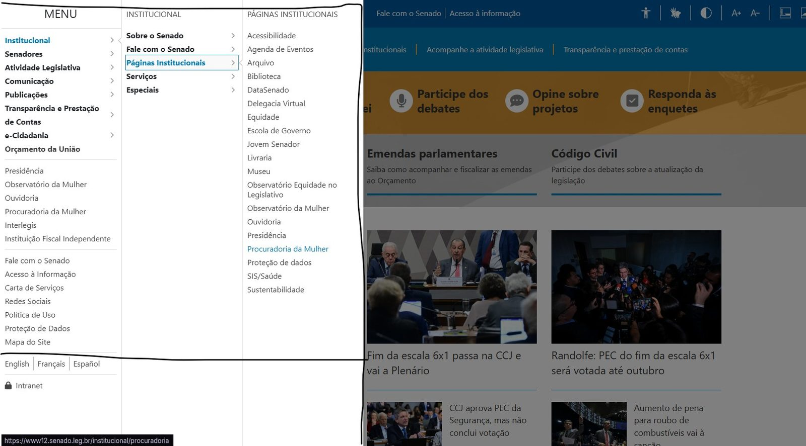

<span class="owner">Responsável: Caio Breno de Souza Bezerra — Infraestrutura</span>

# Figuras, tabelas e referências

## Introdução

Toda imagem ou tabela precisa de legenda, fonte e chamada no texto. Esta página fixa o formato para o semestre inteiro.

## Figuras

Numeração contínua por artefato: Figura 1, Figura 2, Figura 3.

```markdown
<figure markdown="span">
  
  <figcaption>Figura 1 — Página inicial do Portal do Senado Federal.</figcaption>
</figure>
<p class="source">Fonte: SENADO FEDERAL (2026).</p>
```

No parágrafo anterior ou seguinte, escreva: “A Figura 1 apresenta a página inicial do portal.”

O atributo `alt` descreve o conteúdo. A legenda titula. Não repita os dois iguais.

Fotos de livro, usadas nos itens de conteúdo da disciplina, seguem o mesmo formato e citam página.

### Onde a figura fica

Print de tela é evidência, não é o texto. Artefato com muita captura no meio dos parágrafos fica difícil de ler, e o professor pediu que essas imagens fiquem anexas e apareçam no fim, ou fiquem recolhidas.

A regra do semestre:

- **Até duas capturas** por artefato: podem ficar no corpo do texto, no formato acima.
- **Três ou mais**: vão todas para um **Apêndice** no fim da página, depois das Referências, cada uma dentro de um bloco recolhido.

No corpo do texto fica só a chamada, em negrito, com o número da figura e a ligação para o apêndice:

```markdown
A **Figura 2** registra o mega-menu aberto ([Apêndice A](site-escolhido.md#apendice-a-capturas-do-portal-escolhido)).
```

E o apêndice, no fim do artefato:

```markdown
## Apêndice A — Capturas do portal escolhido

As capturas citadas ao longo do texto ficam reunidas aqui, cada uma em um bloco que
abre com um clique. A ordem acompanha a ordem de citação.

??? note "Figura 2 — Mega-menu Institucional aberto sobre a página inicial"

    <figure markdown="span">
      
      <figcaption>Figura 2 — Mega-menu <em>Institucional</em>, com mais de trinta links.</figcaption>
    </figure>
    <p class="source">Fonte: PAIVA (2026); SENADO FEDERAL (2026).</p>
```

O bloco `???` recolhe a imagem; `!!!` no lugar dele deixa a imagem sempre aberta. A numeração é contínua e única no artefato: a mesma figura não muda de número ao ir para o apêndice. Legenda, fonte e `alt` continuam obrigatórios — nada some, só muda de lugar.

Artefatos com o apêndice já aplicado: [Sites avaliados](../entrega-1/sites-avaliados.md#apendice-a-capturas-das-inspecoes) e [Site escolhido](../entrega-1/site-escolhido.md#apendice-a-capturas-do-portal-escolhido).

## Tabelas

```markdown
| Coluna A | Coluna B |
| --- | --- |
| Dado | Dado |

<p class="caption">Tabela 1 — Título da tabela.</p>
<p class="source">Fonte: elaboração do Grupo 06 (2026).</p>
```

No texto: “A Tabela 1 sintetiza…”.

Não entregue tabela sem título. Não use print de tabela sem transcrever, salvo quando o print for evidência de interface — e mesmo assim a figura leva legenda e fonte.

## Referências

Use uma lista numerada, no final do artefato. Exemplos prontos para copiar:

[1] BARBOSA, Simone Diniz Junqueira; SILVA, Bruno Santana da. Interação humano-computador. Rio de Janeiro: Elsevier, 2010.

[2] SENADO FEDERAL. Portal do Senado Federal. Disponível em: https://www12.senado.leg.br/. Acesso em: 9 set. 2026.

[3] SALES, André Barros de. Plano de Ensino FIHC 022026 — Turma 01. Brasília: FCTE/UnB, 2026.

Citação no texto: (BARBOSA; SILVA, 2010, p. 264) ou “Barbosa e Silva (2010, p. 264) afirmam…”.

## Item de conteúdo da disciplina

Todo integrante precisa de pelo menos um item por entrega pertinente, com:

1. nome do autor do item
2. citação com página
3. foto legível do trecho
4. referência completa no final

## Histórico de versão

| Versão | Data | Descrição | Autor(es) | Revisor(es) |
| :---: | :---: | --- | --- | --- |
| `1.0` | 04/09/2026 | Padronização de legendas e ABNT | [Caio Breno de Souza Bezerra](https://github.com/CaioBezerra-Dev) | [Heitor Pinheiro Gonçalves das Chagas](https://github.com/Heitorovski01) |
| `1.1` | 09/09/2026 | Regra de apêndice para capturas de tela e exemplos com o portal escolhido | [Caio Breno de Souza Bezerra](https://github.com/CaioBezerra-Dev) | [Israel Soares de Paiva](https://github.com/IsraelSoares-25) |

## Referências

[1] ASSOCIAÇÃO BRASILEIRA DE NORMAS TÉCNICAS. NBR 6023: informação e documentação — referências — elaboração. Rio de Janeiro: ABNT, 2018.

[2] ASSOCIAÇÃO BRASILEIRA DE NORMAS TÉCNICAS. NBR 14724: informação e documentação — trabalhos acadêmicos — apresentação. Rio de Janeiro: ABNT, 2011.

[3] SALES, André Barros de. Plano de Ensino FIHC 022026 — Turma 01. Brasília: FCTE/UnB, 2026.
