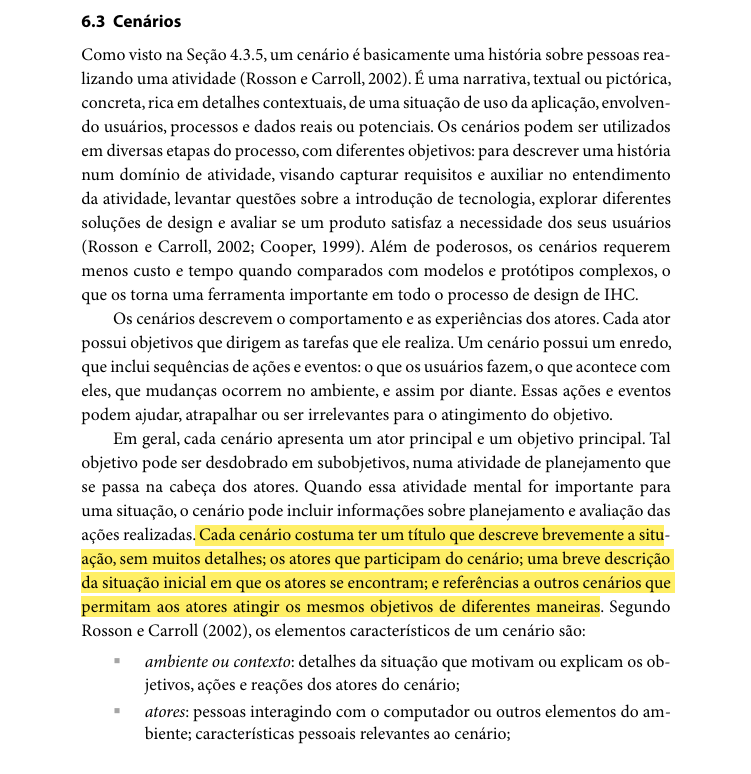
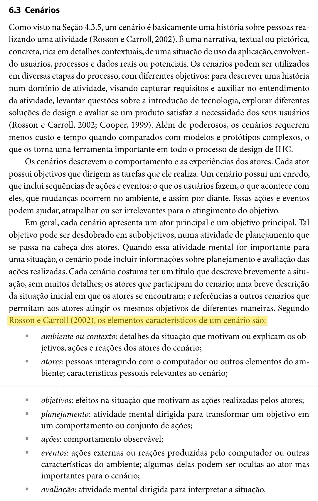
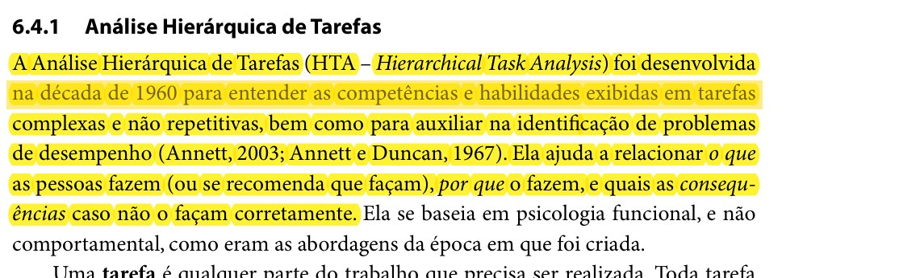
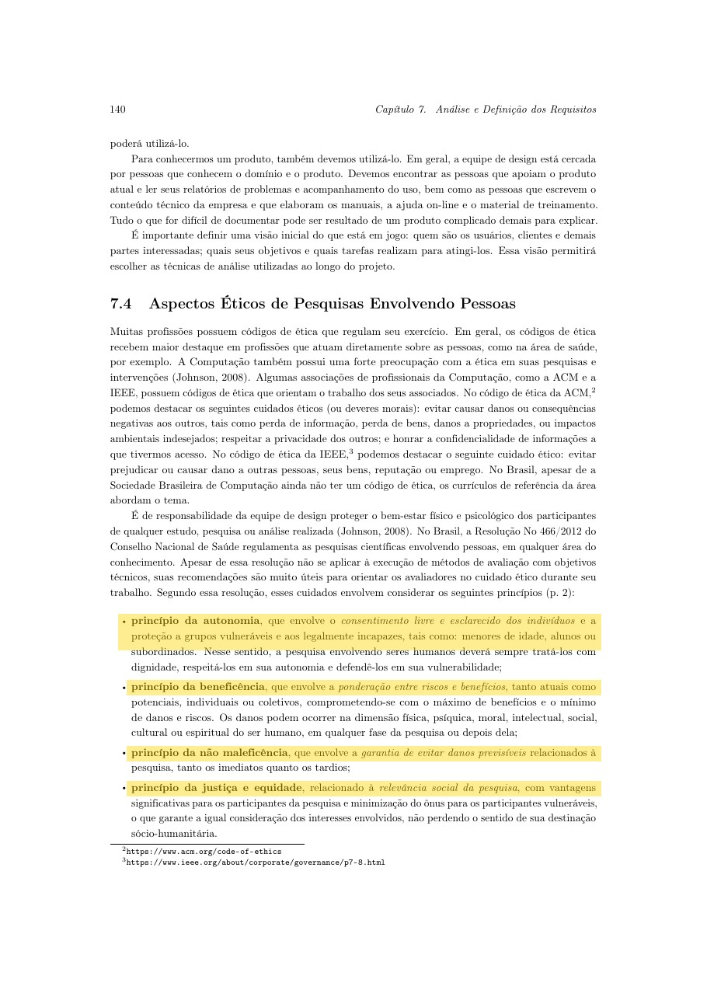
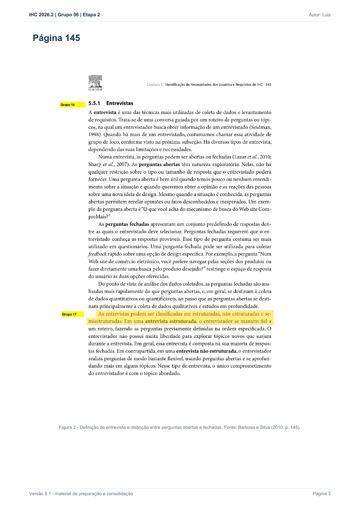
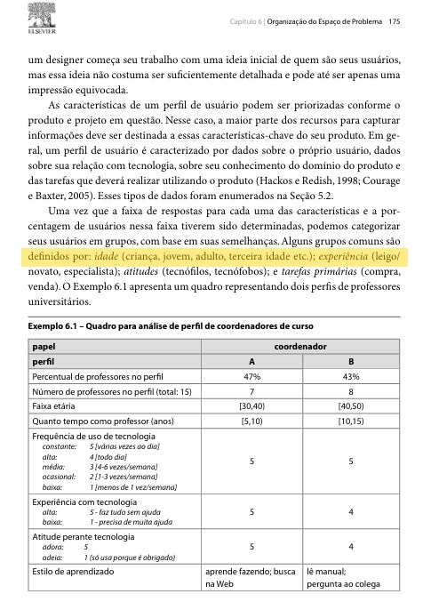
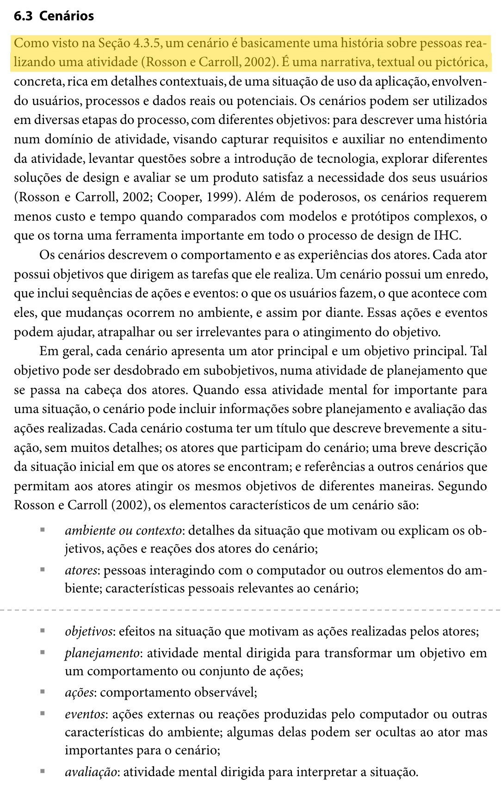
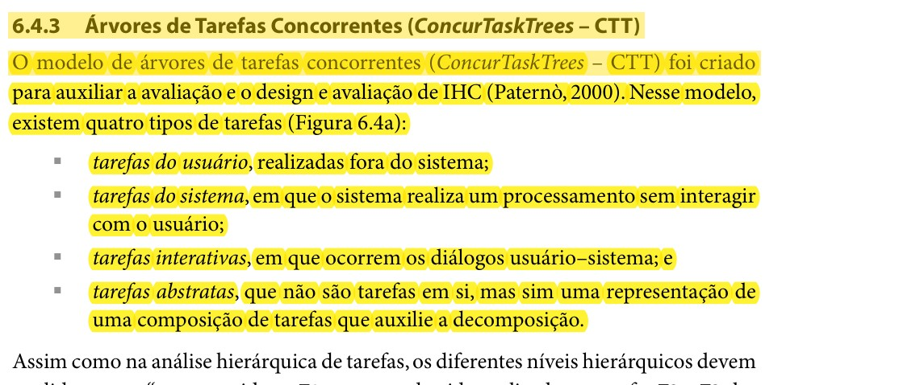
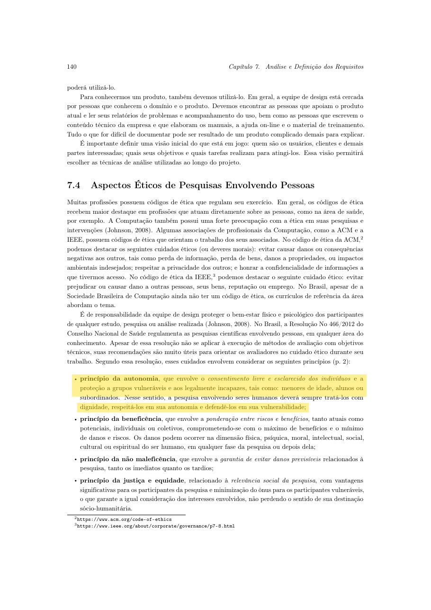
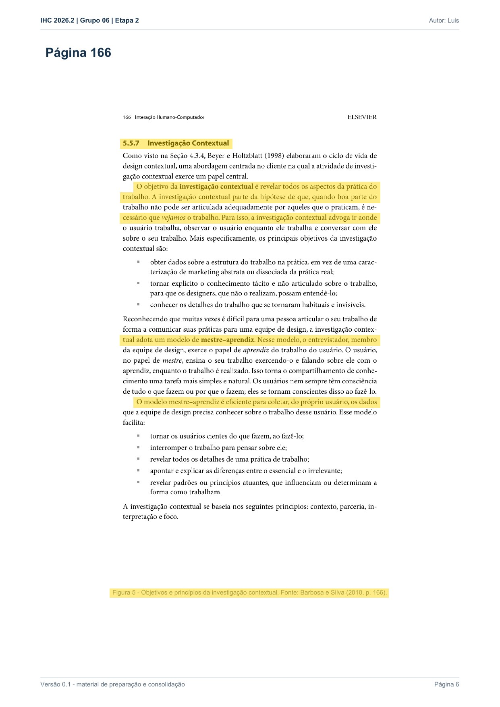

Responsável: Bruno Ferreira Dornelas — Verificação

# Lista de verificação — Etapa 2 

## Tabela de contribuição

A Tabela 1 registra quem atuou neste artefato.

| Integrante | Contribuição | Artefato / atividade |
| --- | --- | --- |
| [Bruno Ferreira Dornelas](https://github.com/brunnf) | Transposição da lista oficial e preenchimento dos itens | [Desenvolvimento](lista-verificacao.md#itens-de-desenvolvimento-do-projeto) |
| [Bruno Ferreira Dornelas](https://github.com/brunnf) | Itens de conteúdo da disciplina | [Conteúdo](lista-verificacao.md#itens-de-conteudo-da-disciplina) |

Tabela 1 — Contribuição neste artefato.

Fonte: elaboração do Grupo 06 (2026).

## Introdução

Este artefato reúne a lista de verificação da Entrega 2 aplicada aos artefatos do próprio Grupo 06, elaborada com base nos critérios definidos pelo professor André Barros no plano de ensino [1]. Cada item registra a resposta (**Sim**, **Não** ou **Incompleto**) e a **versão, data e hora da avaliação**.

## Vídeo de verificação

- Categoria no YouTube: **não listado**
- Link: a gravação própria da inspeção não foi publicada. A apresentação da etapa está em [https://youtu.be/Sw4IeebXzRQ](https://youtu.be/Sw4IeebXzRQ)
- Data da gravação da apresentação: 27/09/2026

## Itens de desenvolvimento do projeto

A Tabela 2 apresenta a avaliação dos 11 itens de desenvolvimento do projeto exigidos para a Entrega 2.

| # | Questão: O GitHub Pages possui… | Resposta | Versão, data e hora da avaliação |
| :---: | --- | :---: | :---: |
| 1 | O histórico de versão padronizado? | — | — |
| 2 | O(s) autor(es) e o(s) revisor(es) para cada artefato? | — | — |
| 3 | Referências bibliográficas e/ou bibliografia em todos os artefatos? | — | — |
| 4 | As tabelas e imagens possuem legenda e fonte e são chamadas dentro do texto? | — | — |
| 5 | Um texto fazendo uma introdução dos artefatos? | — | — |
| 6 | O cronograma executado com quem realizou cada artefato/atividade com as datas de início e fim? | — | — |
| 7 | Ata(s) da(s) reuniões (com data, horário de início e fim, participantes, objetivo, atividades definidas etc.)? | — | — |
| 8 | A gravação da reunião do grupo? | — | — |
| 9 | Vídeo de apresentação na categoria "não listado" no YouTube? | — | — |
| 10 | Tabela de contribuição no início do artefato com o nome de todos os integrantes? | — | — |
| 11 | A seção de agradecimentos apresentando o uso de Inteligência Artificial (IA) Generativa no artefato? | — | — |

Tabela 2 — Itens de desenvolvimento do projeto da Entrega 2.

Fonte: SALES (2026).

## Itens de conteúdo da disciplina

A Tabela 3 lista os itens de conteúdo da disciplina verificados na Entrega 2.

| # | Item | Resposta | Versão, data e hora da avaliação | Autor | Evidência |
| :---: | --- | :---: | :---: | --- | --- |
| 1 | O perfil do usuário é definido por mais de uma forma (técnica de elicitação e/ou ferramenta)? | — | — | [Bruno Ferreira Dornelas](https://github.com/brunnf) | [Perfil](../../../entrega-2/perfil-usuario.md) |
| 2 | O perfil do usuário possui os atributos de um perfil. Referência e foto: Hackos e Redish (1998 apud BARBOSA; SILVA, 2010, p. 134–135). | — | — | [Bruno Ferreira Dornelas](https://github.com/brunnf) | [Figuras 1 e 2](../../../entrega-2/perfil-usuario.md#item-de-conteudo-da-disciplina) |
| 3 | O perfil define os grupos idade, experiência, atitudes e tarefas primárias. Referência e foto: Courage e Baxter (2005 apud BARBOSA; SILVA, 2010, p. 175). | — | — | [Bruno Ferreira Dornelas](https://github.com/brunnf) | [Figura 3](../../../entrega-2/perfil-usuario.md#item-de-conteudo-da-disciplina) |
| 4 | Considera aspectos éticos de pesquisas envolvendo pessoas? | — | — | [Israel Soares de Paiva](https://github.com/IsraelSoares-25) | [Ética](../../../entrega-2/etica.md) |
| 5 | Os 4 princípios éticos (autonomia, beneficência, não maleficência, justiça e equidade). Foto do trecho na Figura 4 desta lista. | — | — | [Israel Soares de Paiva](https://github.com/IsraelSoares-25) | [Princípios](../../../entrega-2/etica.md#os-quatro-principios-eticos) |
| 6 | Solicita permissão para gravar a voz ou imagem antes de começar a gravação? | — | — | [Israel Soares de Paiva](https://github.com/IsraelSoares-25) | [Permissão](../../../entrega-2/etica.md#permissao-para-gravar-voz-ou-imagem) |
| 7 | O termo de consentimento livre e esclarecido (TCLE) dos participantes? | — | — | [Israel Soares de Paiva](https://github.com/IsraelSoares-25) | [TCLE](../../../entrega-2/etica.md#termo-de-consentimento-livre-e-esclarecido-tcle) |
| 8 | No mínimo duas técnicas de coleta. Referência e foto: BARBOSA; SILVA, 2010, p. 143, 145 e 166. | — | — | [Luís Henrique Luna de Arruda](https://github.com/Donnk61) | [Técnicas](../../../entrega-2/tecnicas-coleta.md) |
| 9 | Os cenários. Referência e foto: BARBOSA; SILVA, 2010, p. 183–184. | — | — | [Caio Breno de Souza Bezerra](https://github.com/CaioBezerra-Dev) | [Cenários](../../../entrega-2/cenarios.md) |
| 10 | A análise de tarefas. Referência e foto: BARBOSA; SILVA, 2010, p. 191. | — | — | [Heitor Pinheiro Gonçalves das Chagas](https://github.com/Heitorovski01) | [Análise de tarefas](../../../entrega-2/analise-tarefas.md) |
| 11 | Uma atividade por integrante em HTA e CTT. | — | — | Bruno Ferreira, Caio Breno, Heitor Pinheiro, Israel Soares e Luís Henrique | [Índice](../../../entrega-2/analise-tarefas.md#analises-de-tarefas-do-grupo) |
| 12 | Utilizaram alguma técnica para especificar as tarefas? HTA e CTT. | — | — | [Heitor Pinheiro Gonçalves das Chagas](https://github.com/Heitorovski01) | [HTA e CTT](../../../entrega-2/analise-tarefas.md#analise-hierarquica-de-tarefas-hta) |

Tabela 3 — Itens de conteúdo da disciplina na Entrega 2.

Fonte: SALES (2026).

## Itens elaborados pelo grupo

A Tabela 4 reúne os itens adicionais de verificação definidos pelo próprio Grupo 06, além dos itens oficiais da disciplina. Cada integrante criou ao menos um item, com base na literatura de Interação Humano-Computador.

| # | Item | Resposta | Versão, data e hora da avaliação | Autor |
| :---: | --- | :---: | :---: | --- |
| 13 | Cada cenário apresenta: (1) título que descreve brevemente a situação; (2) os atores que participam; e (3) uma breve descrição da situação inicial? | — | — | [Bruno Ferreira Dornelas](https://github.com/brunnf) |
| 14 | O cenário traz os elementos ambiente ou contexto, atores, objetivos, planejamento, ações, eventos e avaliação? | — | — | [Caio Breno de Souza Bezerra](https://github.com/CaioBezerra-Dev) |
| 15 | A HTA relaciona o que as pessoas fazem, por que o fazem e quais as consequências se não o fizerem corretamente? | — | — | [Heitor Pinheiro Gonçalves das Chagas](https://github.com/Heitorovski01) |
| 16 | A coleta observa os quatro princípios: autonomia, beneficência, não maleficência, justiça e equidade? | — | — | [Israel Soares de Paiva](https://github.com/IsraelSoares-25) |
| 17 | A entrevista semiestruturada usa roteiro e permite perguntas novas durante a conversa? | — | — | [Luís Henrique Luna de Arruda](https://github.com/Donnk61) |

| 18 | O perfil agrupa os atributos em idade, experiência, atitudes e tarefas primárias? | — | — | [Bruno Ferreira Dornelas](https://github.com/brunnf) |
| 19 | O cenário é uma narrativa sobre pessoas realizando uma atividade? | — | — | [Caio Breno de Souza Bezerra](https://github.com/CaioBezerra-Dev) |
| 20 | A CTT representa a relação temporal entre as tarefas da pessoa e do sistema? | — | — | [Heitor Pinheiro Gonçalves das Chagas](https://github.com/Heitorovski01) |
| 21 | O princípio da autonomia exige o consentimento livre e esclarecido? | — | — | [Israel Soares de Paiva](https://github.com/IsraelSoares-25) |
| 22 | A investigação contextual observa a pessoa no contexto de trabalho e conversa enquanto ela realiza a tarefa? | — | — | [Luís Henrique Luna de Arruda](https://github.com/Donnk61) |

Tabela 4 — Itens elaborados pelo Grupo 06.

Fonte: elaboração do Grupo 06 (2026).

### Item 13 — Bruno Ferreira Dornelas

**Referência:**

BARBOSA, Simone D. J.; SILVA, Bruno S. da; SILVEIRA, Milene S.; GASPARINI, Isabela; DARIN, Ticianne; BARBOSA, Gabriel D. J. Interação Humano-Computador e Experiência do Usuário. Autopublicação, 2021. Cap. 6, p. 183.

**Trecho do livro:**

??? note "Figura 1 — Barbosa et al. (2021), p. 183. Trecho: “Cada cenário costuma ter um título que descreve brevemente a situação, sem muitos detalhes; os atores que participam do cenário; uma breve descrição da situação inicial em que os atores se encontram.”"

    

    
Figura 1 — Barbosa et al. (2021), p. 183. Trecho: “Cada cenário costuma ter um título que descreve brevemente a situação, sem muitos detalhes; os atores que participam do cenário; uma breve descrição da situação inicial em que os atores se encontram.”

    
Fonte: BARBOSA et al. (2021, p. 183).

### Item 14 — Caio Breno de Souza Bezerra

**Referência:** BARBOSA, Simone Diniz Junqueira; SILVA, Bruno Santana da. Interação humano-computador. Rio de Janeiro: Elsevier, 2010. p. 183–184.

**Trecho do livro:**

??? note "Figura 2 — Barbosa e Silva (2010, p. 183–184). Elementos do cenário."

    

    
Figura 2 — Barbosa e Silva (2010, p. 183–184). Elementos do cenário.

    
Fonte: BARBOSA; SILVA (2010, p. 183–184).

### Item 15 — Heitor Pinheiro Gonçalves das Chagas

**Referência:** BARBOSA, Simone Diniz Junqueira; SILVA, Bruno Santana da. Interação humano-computador. Rio de Janeiro: Elsevier, 2010. p. 192.

**Trecho do livro:**

??? note "Figura 3 — Barbosa e Silva (2010, p. 192). Definição da HTA."

    

    
Figura 3 — Barbosa e Silva (2010, p. 192). Definição da HTA.

    
Fonte: BARBOSA; SILVA (2010, p. 192).

### Item 16 — Israel Soares de Paiva

**Referência:** BARBOSA, Simone Diniz Junqueira; SILVA, Bruno Santana da. Interação humano-computador. Rio de Janeiro: Elsevier, 2010. Seção 7.4.

**Trecho do livro:**

??? note "Figura 4 — Princípios da autonomia, da beneficência, da não maleficência e da justiça e equidade."

    

    
Figura 4 — Princípios da autonomia, da beneficência, da não maleficência e da justiça e equidade.

    
Fonte: BARBOSA; SILVA (2010, seção 7.4).

### Item 17 — Luís Henrique Luna de Arruda

**Referência:** BARBOSA, Simone Diniz Junqueira; SILVA, Bruno Santana da. Interação humano-computador. Rio de Janeiro: Elsevier, 2010. p. 145.

**Trecho do livro:**

??? note "Figura 5 — Barbosa e Silva (2010, p. 145). Entrevista semiestruturada."

    

    
Figura 5 — Barbosa e Silva (2010, p. 145). Entrevista semiestruturada.

    
Fonte: BARBOSA; SILVA (2010, p. 145).

### Item 18 — Bruno Ferreira Dornelas

**Referência:** BARBOSA, Simone Diniz Junqueira; SILVA, Bruno Santana da. Interação humano-computador. Rio de Janeiro: Elsevier, 2010. p. 175.

??? note "Figura 6 — Grupos de atributos do perfil"

    

    
Figura 6 — Barbosa e Silva (2010, p. 175). Grupos de atributos, com o trecho grifado.

    
Fonte: BARBOSA; SILVA (2010, p. 175).

### Item 19 — Caio Breno de Souza Bezerra

**Referência:** BARBOSA, Simone Diniz Junqueira; SILVA, Bruno Santana da. Interação humano-computador. Rio de Janeiro: Elsevier, 2010. p. 183.

??? note "Figura 7 — Cenário como narrativa de uma atividade"

    

    
Figura 7 — Barbosa e Silva (2010, p. 183). Definição de cenário, com o trecho grifado.

    
Fonte: BARBOSA; SILVA (2010, p. 183).

### Item 20 — Heitor Pinheiro Gonçalves das Chagas

**Referência:** BARBOSA, Simone Diniz Junqueira; SILVA, Bruno Santana da. Interação humano-computador. Rio de Janeiro: Elsevier, 2010. p. 203.

??? note "Figura 8 — Árvores de tarefas concorrentes"

    

    
Figura 8 — Barbosa e Silva (2010, p. 203). CTT, com o trecho grifado.

    
Fonte: BARBOSA; SILVA (2010, p. 203).

### Item 21 — Israel Soares de Paiva

**Referência:** BARBOSA, Simone Diniz Junqueira; SILVA, Bruno Santana da. Interação humano-computador. Rio de Janeiro: Elsevier, 2010. Seção 7.4.

??? note "Figura 9 — Autonomia e consentimento livre e esclarecido"

    

    
Figura 9 — Barbosa e Silva (2010, seção 7.4). Autonomia, com o trecho grifado.

    
Fonte: BARBOSA; SILVA (2010, seção 7.4).

### Item 22 — Luís Henrique Luna de Arruda

**Referência:** BARBOSA, Simone Diniz Junqueira; SILVA, Bruno Santana da. Interação humano-computador. Rio de Janeiro: Elsevier, 2010. p. 166.

??? note "Figura 10 — Investigação contextual"

    

    
Figura 10 — Barbosa e Silva (2010, p. 166). Investigação contextual, com o trecho grifado.

    
Fonte: BARBOSA; SILVA (2010, p. 166).

## Histórico de versão

| Versão | Data | Descrição | Autor(es) | Revisor(es) |
| :---: | :---: | --- | --- | --- |
| `1.0` | 26/09/2026 | Transposição da lista oficial da Entrega 2 para o site | [Bruno Ferreira Dornelas](https://github.com/brunnf) | [Caio Breno de Souza Bezerra](https://github.com/CaioBezerra-Dev) |
| `1.1` | 03/10/2026 | Preenche autores dos itens oficiais e os itens 14 a 17, um por integrante, com referência e foto | [Caio Breno de Souza Bezerra](https://github.com/CaioBezerra-Dev) | [Bruno Ferreira Dornelas](https://github.com/brunnf) |

## Referências

[1] SALES, André Barros de. Plano de Ensino FIHC 022026 — Turma 01. Brasília: FCTE/UnB, 2026.

[2] BARBOSA, Simone Diniz Junqueira; SILVA, Bruno Santana da. Interação humano-computador. Rio de Janeiro: Elsevier, 2010.

[3] BARBOSA, Simone D. J.; SILVA, Bruno S. da; SILVEIRA, Milene S.; GASPARINI, Isabela; DARIN, Ticianne; BARBOSA, Gabriel D. J. Interação humano-computador e experiência do usuário. Autopublicação, 2021.
