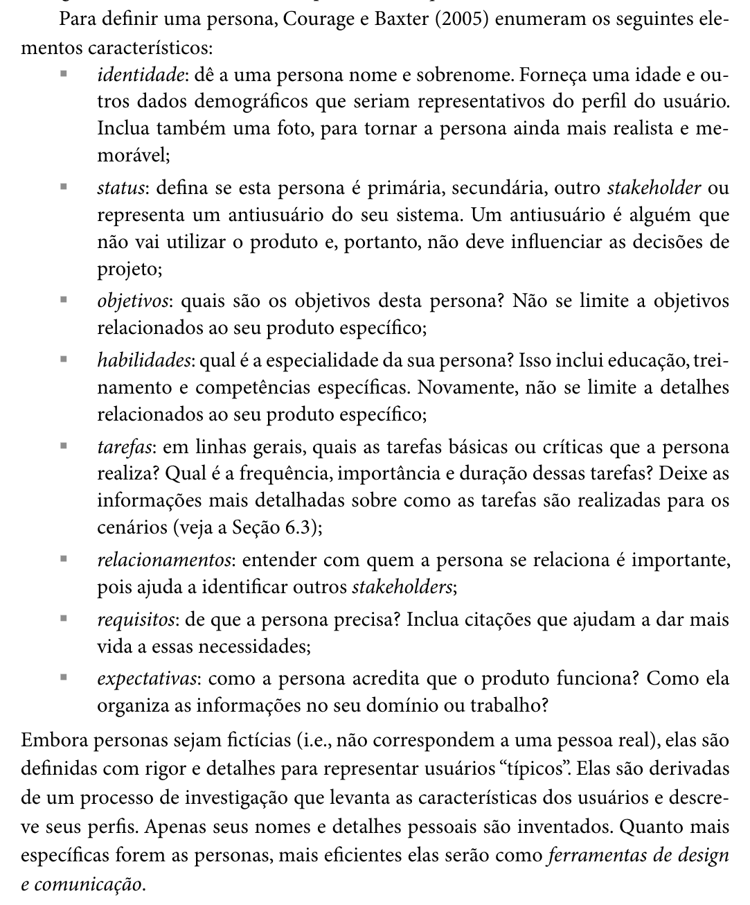
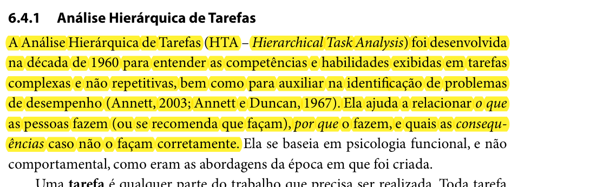

Responsável: Bruno Ferreira Dornelas — Verificação

# Lista de verificação — Etapa 2 

## Tabela de contribuição

A Tabela 1 registra quem atuou neste artefato.

| Integrante | Contribuição | Artefato / atividade |
| --- | --- | --- |
| [Bruno Ferreira Dornelas](https://github.com/brunnf) | Transposição da lista oficial e preenchimento dos itens | [Desenvolvimento](lista-verificacao.md#itens-de-desenvolvimento-do-projeto) |
| [Bruno Ferreira Dornelas](https://github.com/brunnf) | Itens de conteúdo da disciplina | [Conteúdo](lista-verificacao.md#itens-de-conteudo-da-disciplina) |
| [Luís Henrique Luna de Arruda](https://github.com/Donnk61) | Preenchimento das respostas com base na reunião de inspeção de 27/09/2026 e gravação do vídeo de verificação | [Desenvolvimento](lista-verificacao.md#itens-de-desenvolvimento-do-projeto), [Conteúdo](lista-verificacao.md#itens-de-conteudo-da-disciplina) e [Vídeo](lista-verificacao.md#video-de-verificacao) |
| [Luís Henrique Luna de Arruda](https://github.com/Donnk61) | Elaboração do item 18 sobre os tipos de tarefa da CTT | [Item 18](lista-verificacao.md#item-18-luis-henrique-luna-de-arruda) |

Tabela 1 — Contribuição neste artefato.

Fonte: elaboração do Grupo 06 (2026).

## Introdução

Este artefato reúne a lista de verificação da Entrega 2 aplicada aos artefatos do próprio Grupo 06, elaborada com base nos critérios definidos pelo professor André Barros no plano de ensino [1]. Cada item registra a resposta (**Sim**, **Não** ou **Incompleto**) e a **versão, data e hora da avaliação**.

## Vídeo de verificação

O vídeo a seguir apresenta a verificação realizada sobre os artefatos produzidos para a Etapa 2 do Grupo 06.

- Categoria no YouTube: **não listado**
- Link: [https://www.youtube.com/watch?v=12G4wjgpQck](https://www.youtube.com/watch?v=12G4wjgpQck)
- Data da gravação: 27/09/2026, das 20:42 às 20:49
- Participantes: Bruno Ferreira Dornelas, Caio Breno de Souza Bezerra, Israel Soares e Luís Henrique Luna de Arruda

??? note "Vídeo — Vídeo de verificação da Etapa 2 do Grupo 06"

    

      <iframe
        loading="lazy"
        style="position: absolute; top: 0; left: 0; width: 100%; height: 100%; border: 0;"
        src="https://www.youtube-nocookie.com/embed/12G4wjgpQck"
        title="Vídeo de verificação da Etapa 2 do Grupo 06"
        allow="accelerometer; autoplay; clipboard-write; encrypted-media; gyroscope; picture-in-picture; web-share"
        referrerpolicy="strict-origin-when-cross-origin"
        allowfullscreen>
      </iframe>
    

## Itens de desenvolvimento do projeto

A Tabela 2 apresenta a avaliação dos 11 itens de desenvolvimento do projeto exigidos para a Entrega 2.

| # | Questão: O GitHub Pages possui… | Resposta | Versão, data e hora da avaliação | Observação |
| :---: | --- | :---: | :---: | --- |
| 1 | O histórico de versão padronizado? | Sim | `v1.2` — 27/09/2026 às 20:43 | Inspeção em conjunto; ver nota abaixo da Tabela 2 |
| 2 | O(s) autor(es) e o(s) revisor(es) para cada artefato? | Sim | `v1.2` — 27/09/2026 às 20:43 | Inspeção em conjunto; ver nota abaixo da Tabela 2 |
| 3 | Referências bibliográficas e/ou bibliografia em todos os artefatos? | Sim | `v1.2` — 27/09/2026 às 20:43 | Inspeção em conjunto; ver nota abaixo da Tabela 2 |
| 4 | As tabelas e imagens possuem legenda e fonte e são chamadas dentro do texto? | Sim | `v1.2` — 27/09/2026 às 20:43 | Inspeção em conjunto; ver nota abaixo da Tabela 2 |
| 5 | Um texto fazendo uma introdução dos artefatos? | Sim | `v1.2` — 27/09/2026 às 20:43 | Inspeção em conjunto; ver nota abaixo da Tabela 2 |
| 6 | O cronograma executado com quem realizou cada artefato/atividade com as datas de início e fim? | Sim | `v1.2` — 27/09/2026 às 20:43 | Inspeção em conjunto; ver nota abaixo da Tabela 2 |
| 7 | Ata(s) da(s) reuniões (com data, horário de início e fim, participantes, objetivo, atividades definidas etc.)? | Sim | `v1.2` — 27/09/2026 às 20:43 | Inspeção em conjunto; ver nota abaixo da Tabela 2 |
| 8 | A gravação da reunião do grupo? | Sim | `v1.2` — 27/09/2026 às 20:43 | Inspeção em conjunto; ver nota abaixo da Tabela 2 |
| 9 | Vídeo de apresentação na categoria "não listado" no YouTube? | Sim | `v1.2` — 27/09/2026 às 20:43 | Inspeção em conjunto; ver nota abaixo da Tabela 2 |
| 10 | Tabela de contribuição no início do artefato com o nome de todos os integrantes? | Sim | `v1.2` — 27/09/2026 às 20:43 | Inspeção em conjunto; ver nota abaixo da Tabela 2 |
| 11 | A seção de agradecimentos apresentando o uso de Inteligência Artificial (IA) Generativa no artefato? | Sim | `v1.2` — 27/09/2026 às 20:43 | Inspeção em conjunto; ver nota abaixo da Tabela 2 |

Tabela 2 — Itens de desenvolvimento do projeto da Entrega 2.

Fonte: SALES (2026).

Os 11 itens de desenvolvimento foram inspecionados em conjunto, tomando como base a [lista de verificação da Etapa 1](../etapa-1/lista-verificacao.md), em que todos já estavam conformes. Como os mesmos padrões foram mantidos nos artefatos da Entrega 2, o grupo atribuiu **Sim** a todos eles.

## Itens de conteúdo da disciplina

A Tabela 3 lista os itens de conteúdo da disciplina verificados na Entrega 2.

| # | Item | Resposta | Versão, data e hora da avaliação | Observação |
| :---: | --- | :---: | :---: | --- |
| 1 | O perfil do usuário é definido por mais de uma forma (técnica de elicitação e/ou ferramenta)? | Sim | `v1.2` — 27/09/2026 às 20:43 | Entrevista e observação de tarefa |
| 2 | O perfil do usuário possui os atributos de um perfil (dados demográficos: idade, sexo, status socioeconômico; experiência no cargo; informações sobre a empresa; educação: grau de instrução, área de formação, cursos, alfabetismo etc.)? Incluindo referência bibliográfica e foto do texto da referência — Hackos e Redish (1998); Courage e Baxter (2005). Autor: | Sim | `v1.2` — 27/09/2026 às 20:44 | Atributos demográficos, experiência e educação presentes |
| 3 | O perfil do usuário define os grupos de atributos: (1) idade; (2) experiência (leigo/novato, especialista); (3) atitudes (tecnófilos, tecnófobos); (4) tarefas primárias? Incluindo referência bibliográfica e foto do texto da referência. Autor: | Sim | `v1.2` — 27/09/2026 às 20:45 | Grupos de idade, experiência, atitudes e tarefas primárias ao final da tabela do perfil de usuário |
| 4 | Considera aspectos éticos de pesquisas envolvendo pessoas? Incluindo referência bibliográfica e foto do texto da referência. Autor: | Sim | `v1.2` — 27/09/2026 às 20:45 | Aspectos éticos documentados |
| 5 | Os 4 princípios éticos (autonomia, beneficência, não maleficência, justiça e equidade)? Incluindo referência bibliográfica e foto do texto da referência. Autor: | Sim | `v1.2` — 27/09/2026 às 20:45 | Os quatro princípios são apresentados |
| 6 | Solicita permissão para gravar a voz ou imagem de qualquer pessoa antes de começar a gravação? | Sim | `v1.2` — 27/09/2026 às 20:45 | Gravação realizada somente após permissão, conforme os aspectos éticos e as sessões individuais |
| 7 | O termo de consentimento livre e esclarecido (TCLE) dos participantes? Incluindo referência bibliográfica e foto do texto da referência. Autor: | Incompleto | `v1.2` — 27/09/2026 às 20:46 | Não há modelo de TCLE no artefato do grupo; apenas alguns artefatos individuais (ex.: Caio Breno) apresentam o termo |
| 8 | Foram utilizadas no mínimo duas técnicas para coletar dados e levantar os requisitos dos usuários (entrevistas; grupos de foco; questionários; brainstorming; card sorting; estudos de campo; investigação contextual)? Incluindo referência bibliográfica e foto do texto da referência. Autor: | Sim | `v1.2` — 27/09/2026 às 20:46 | Entrevista, observação de tarefa e investigação |
| 9 | Os cenários? Incluindo referência bibliográfica e foto do texto da referência. Autor: | Sim | `v1.2` — 27/09/2026 às 20:46 | Cenários presentes |
| 10 | A análise de tarefas? Incluindo referência bibliográfica e foto do texto da referência. Autor: | Sim | `v1.2` — 27/09/2026 às 20:46 | Análise de tarefas presente |
| 11 | Uma atividade para cada integrante modelada em ao menos duas técnicas (HTA com diagrama, legenda e tabela; GOMS/KLM/CMN-GOMS/CPM-GOMS/CTT)? Incluindo referência bibliográfica e foto do texto da referência. Autor: | Sim | `v1.2` — 27/09/2026 às 20:47 | HTA e CTT elaborados por cada integrante |
| 12 | Utilizaram alguma técnica para especificar as tarefas? | Não | `v1.2` — 27/09/2026 às 20:48 | Não foi identificado item com técnica de especificação de tarefas além da modelagem HTA/CTT do item 11 |

Tabela 3 — Itens de conteúdo da disciplina na Entrega 2.

Fonte: SALES (2026).

Além dos itens da Tabela 3, a lista oficial destaca como **importante** que cada integrante da equipe elabore ao menos um item de conteúdo da disciplina com referência bibliográfica da fonte e foto do texto da referência. Resposta: **Sim** (`v1.2` — 27/09/2026 às 20:49). Cada artefato (perfil de usuário, técnicas de coleta, aspectos éticos, elenco de personas, cenários e análise de tarefas) é um item de conteúdo com autor, referência e foto do texto.

## Itens elaborados pelo grupo

A Tabela 4 reúne os itens adicionais de verificação definidos pelo próprio Grupo 06, além dos itens oficiais da disciplina. Cada integrante criou ao menos um item, com base na literatura de Interação Humano-Computador.

| # | Item | Resposta | Versão, data e hora da avaliação | Autor |
| :---: | --- | :---: | :---: | --- |
| 13 | Cada cenário apresenta: (1) título que descreve brevemente a situação; (2) os atores que participam; e (3) uma breve descrição da situação inicial? | — | — | [Bruno Ferreira Dornelas](https://github.com/brunnf) |
| 14 | Cada persona apresenta os elementos característicos de Courage e Baxter (2005): (1) identidade; (2) status; (3) objetivos; (4) habilidades; (5) tarefas; (6) relacionamentos; (7) requisitos; e (8) expectativas? | — | — | [Caio Breno de Souza Bezerra](https://github.com/CaioBezerra-Dev) |
| 15 | Cada análise hierárquica de tarefas (HTA) relaciona: (1) o que as pessoas fazem (ou se recomenda que façam); (2) por que o fazem; e (3) quais as consequências caso não o façam corretamente? | — | — | [Caio Breno de Souza Bezerra](https://github.com/CaioBezerra-Dev) |
| 16 | a preencher | — | — | [Heitor Pinheiro](https://github.com/heitor-pinheiro) |
| 17 | a preencher | — | — | [Israel Soares](https://github.com/israel-soares) |
| 18 | Nos diagramas CTT, cada tarefa está classificada em um dos quatro tipos da notação, de acordo com sua natureza: (1) tarefa do usuário, realizada fora do sistema; (2) tarefa do sistema, processada sem interação com o usuário; (3) tarefa interativa, composta por diálogo entre usuário e sistema; ou (4) tarefa abstrata, que representa uma composição de tarefas? | — | — | [Luís Henrique Luna de Arruda](https://github.com/Donnk61) |

Tabela 4 — Itens elaborados pelo Grupo 06.

Fonte: elaboração do Grupo 06 (2026).

### Item 13 — Bruno Ferreira Dornelas

**Referência:**

BARBOSA, Simone D. J.; SILVA, Bruno S. da; SILVEIRA, Milene S.; GASPARINI, Isabela; DARIN, Ticianne; BARBOSA, Gabriel D. J. Interação Humano-Computador e Experiência do Usuário. Autopublicação, 2021. Cap. 6, p. 183.

**Trecho do livro:**

Figura 1 — Barbosa et al. (2021), p. 183. Trecho: “Cada cenário costuma ter um título que descreve brevemente a situação, sem muitos detalhes; os atores que participam do cenário; uma breve descrição da situação inicial em que os atores se encontram.”

Fonte: BARBOSA et al. (2021, p. 183).

### Item 14 — Caio Breno de Souza Bezerra

**Referência:**

BARBOSA, Simone Diniz Junqueira; SILVA, Bruno Santana da. Interação humano-computador. Rio de Janeiro: Elsevier, 2010. p. 177.

**Trecho do livro:**

Figura 2 — Barbosa e Silva (2010), p. 177. Trecho: “Para definir uma persona, Courage e Baxter (2005) enumeram os seguintes elementos característicos: identidade; status; objetivos; habilidades; tarefas; relacionamentos; requisitos; expectativas.”

Fonte: BARBOSA; SILVA (2010, p. 177).

### Item 15 — Caio Breno de Souza Bezerra

**Referência:**

BARBOSA, Simone Diniz Junqueira; SILVA, Bruno Santana da. Interação humano-computador. Rio de Janeiro: Elsevier, 2010. p. 192.

**Trecho do livro:**

Figura 3 — Barbosa e Silva (2010), p. 192. Trecho: “Ela ajuda a relacionar o que as pessoas fazem (ou se recomenda que façam), por que o fazem, e quais as consequências caso não o façam corretamente.”

Fonte: BARBOSA; SILVA (2010, p. 192).

### Item 16 — Heitor Pinheiro

**Referência:** a preencher

**Trecho do livro:** a preencher

### Item 17 — Israel Soares

**Referência:** a preencher

**Trecho do livro:** a preencher

### Item 18 — Luís Henrique Luna de Arruda

**Referência:**

RAPOSO, Alberto. *Análise e Modelos de tarefas*. INF1403 – Introdução à Interação Humano-Computador. Rio de Janeiro: Departamento de Informática, PUC-Rio. Material didático, slide 38. Disponível em: <https://web.tecgraf.puc-rio.br/~abraposo/inf1403/INF1403_13_tarefas.pdf>. Acesso em: 22 set. 2026. Notação baseada em PATERNÒ, Fabio. *Model-Based Design and Evaluation of Interactive Applications*. London: Springer-Verlag, 2000. Cap. 4.

**Fundamentação:** na notação CTT, cada tarefa recebe um de quatro tipos, e cada tipo tem um ícone próprio. A tarefa do usuário acontece fora do sistema, como ler ou decidir. A tarefa do sistema é processada sem interação com o usuário. A tarefa interativa é um diálogo entre usuário e sistema. A tarefa abstrata agrupa outras tarefas. É o tipo que diz, no diagrama, quem faz cada parte da atividade.

O item 18 complementa o item oficial 11, que confere se cada integrante modelou uma atividade em HTA e CTT, e o item 15, que trata da HTA: aqui se confere se o diagrama CTT usa os tipos de tarefa da notação.

**Como verificar:** abrir a análise de tarefas de cada integrante, a partir da [análise de tarefas do grupo](../../../entrega-2/analise-tarefas.md), e conferir o ícone e o rótulo de cada nó do diagrama CTT. Considerar **Sim** quando todas as tarefas têm o tipo coerente com o que descrevem; **Incompleto** quando parte das tarefas está sem tipo ou com o tipo trocado, por exemplo uma leitura feita pelo usuário marcada como tarefa do sistema; e **Não** quando os diagramas não diferenciam os tipos.

| Versão | Data | Descrição | Autor(es) | Revisor(es) |
| :---: | :---: | --- | --- | --- |
| `1.0` | 26/09/2026 | Transposição da lista oficial da Entrega 2 para o site | [Bruno Ferreira Dornelas](https://github.com/brunnf) | [Caio Breno de Souza Bezerra](https://github.com/CaioBezerra-Dev) |
| `1.1` | 01/10/2026 | Adição do vídeo de verificação da Etapa 2 | [Luís Henrique Luna de Arruda](https://github.com/Donnk61) | [Caio Breno de Souza Bezerra](https://github.com/CaioBezerra-Dev) |
| `1.2` | 01/10/2026 | Preenchimento dos itens de desenvolvimento e de conteúdo com base na reunião de inspeção de 27/09/2026 | [Luís Henrique Luna de Arruda](https://github.com/Donnk61) | [Caio Breno de Souza Bezerra](https://github.com/CaioBezerra-Dev) |
| `1.3` | 05/10/2026 | Corrige data e hora de cada item conforme a transcrição da inspeção e adiciona data da gravação | [Luís Henrique Luna de Arruda](https://github.com/Donnk61) | [Caio Breno de Souza Bezerra](https://github.com/CaioBezerra-Dev) |
| `1.4` | 05/10/2026 | Padroniza o vídeo em bloco expansível fechado, conforme os demais registros do projeto | [Bruno Ferreira Dornelas](https://github.com/brunnf) | [Caio Breno de Souza Bezerra](https://github.com/CaioBezerra-Dev) |
| `1.5` | 06/10/2026 | Adiciona o item 18 sobre os tipos de tarefa da CTT | [Luís Henrique Luna de Arruda](https://github.com/Donnk61) | [Caio Breno de Souza Bezerra](https://github.com/CaioBezerra-Dev) |

## Referências

[1] SALES, André Barros de. Plano de Ensino FIHC 022026 — Turma 01. Brasília: FCTE/UnB, 2026.
