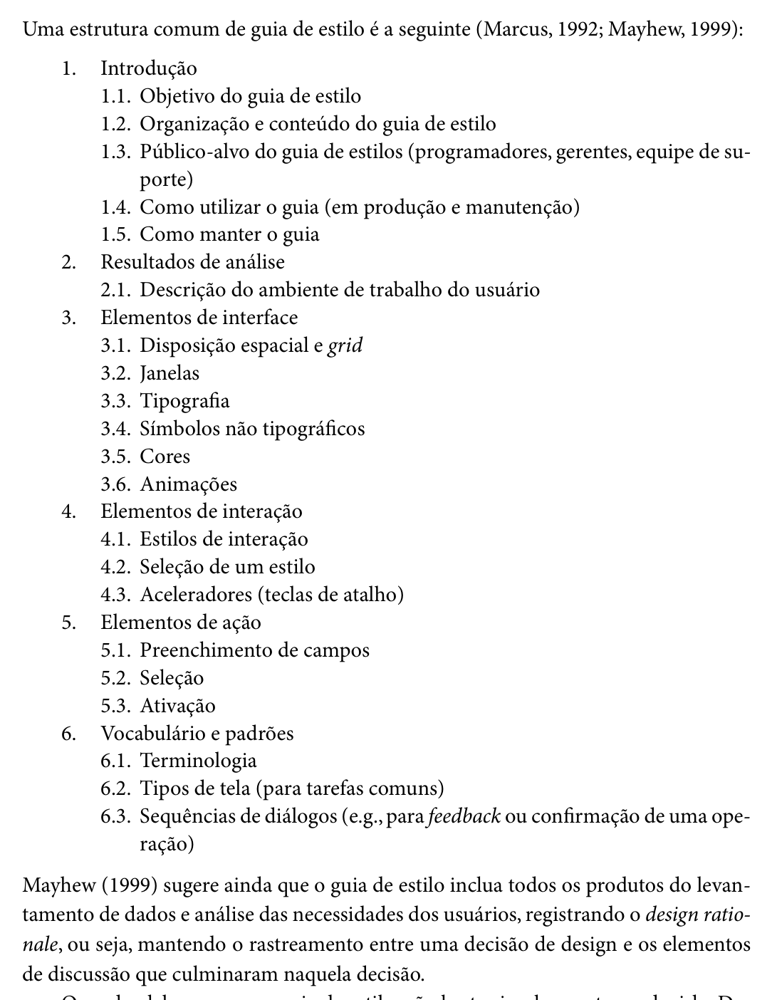
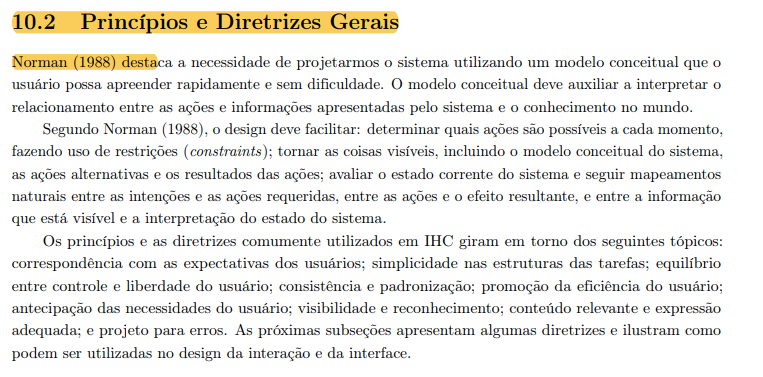

Responsável: Bruno Ferreira Dornelas — Verificação

# Lista de verificação — Etapa 3

## Tabela de contribuição

A Tabela 1 registra quem atuou neste artefato.

| Integrante | Contribuição | Artefato / atividade |
| --- | --- | --- |
| [Luís Henrique Luna de Arruda](https://github.com/Donnk61) | Transposição da lista oficial da Etapa 3 do plano de ensino | [Desenvolvimento](lista-verificacao.md#itens-de-desenvolvimento-do-projeto) e [Conteúdo](lista-verificacao.md#itens-de-conteudo-da-disciplina) |
| [Bruno Ferreira Dornelas](https://github.com/brunnf) | Estrutura dos itens adicionais e elaboração do item 18 | [Itens elaborados pelo grupo](#itens-elaborados-pelo-grupo) |
| [Heitor Pinheiro Gonçalves das Chagas](https://github.com/Heitorovski01) | Elaboração do item 20 sobre rastreabilidade e design rationale no guia de estilo | [Item 20](#item-20-heitor-pinheiro-goncalves-das-chagas) |
| Codex (OpenAI) | Apoio à redação e conferência da fundamentação bibliográfica | [Item 18](#item-18-bruno-ferreira-dornelas) |

Tabela 1 — Contribuição neste artefato.

Fonte: elaboração do Grupo 06 (2026).

## Introdução

Este artefato reúne a lista de verificação da Entrega 3 — Princípios Gerais de Projeto, Metas de usabilidade, Guia de Estilo (Fase: análise de requisitos) — aplicada aos artefatos do próprio Grupo 06, elaborada com base nos critérios definidos pelo professor André Barros no plano de ensino [1]. Cada item registra a resposta (**Sim**, **Não** ou **Incompleto**) e a **versão, data e hora da avaliação**.

## Vídeo de verificação

- Categoria no YouTube: **não listado**
- Link: a definir
- Data da gravação: a definir

## Itens de desenvolvimento do projeto

O plano de ensino pede, para a Entrega 3, a verificação de "Todos os 10 itens" de desenvolvimento do projeto [1]. A Tabela 2 reproduz os itens de desenvolvimento definidos na Entrega 1, os mesmos avaliados na [Etapa 2](../etapa-2/lista-verificacao.md).

| # | Questão: O GitHub Pages possui… | Resposta | Versão, data e hora da avaliação |
| :---: | --- | :---: | :---: |
| 1 | O histórico de versão padronizado? | — | — |
| 2 | O(s) autor(es) e o(s) revisor(es) para cada artefato? | — | — |
| 3 | Referências bibliográficas e/ou bibliografia em todos os artefatos? | — | — |
| 4 | As tabelas e imagens possuem legenda e fonte e são chamadas dentro do texto? | — | — |
| 5 | Um texto fazendo uma introdução dos artefatos? | — | — |
| 6 | O cronograma executado com quem realizou cada artefato/atividade com as datas de início e fim? | — | — |
| 7 | Ata(s) da(s) reuniões (com data, horário de início e fim, participantes, objetivo, atividades definidas etc.)? | — | — |
| 8 | A gravação da reunião do grupo? | — | — |
| 9 | Vídeo de apresentação na categoria "não listado" no YouTube? | — | — |
| 10 | Tabela de contribuição no início do artefato com o nome de todos os integrantes? | — | — |
| 11 | A seção de agradecimentos apresentando o uso de Inteligência Artificial (IA) Generativa no artefato? | — | — |

Tabela 2 — Itens de desenvolvimento do projeto da Entrega 3.

Fonte: SALES (2026).

## Itens de conteúdo da disciplina

A Tabela 3 lista os itens de conteúdo da disciplina verificados na Entrega 3. A numeração (10 a 17) segue a do plano de ensino [1].

| # | Item | Resposta | Versão, data e hora da avaliação |
| :---: | --- | :---: | :---: |
| 10 | As características da plataforma para o projeto | — | — |
| 11 | Os Princípios Gerais do Projeto que serão utilizados no projeto? Adicionar referência bibliográfica da fonte e foto do texto da referência explicando Os Princípios Gerais do Projeto. Autor: | — | — |
| 12 | Os Princípios Gerais do Projeto contém os seguintes tópicos: • 1- correspondência com as expectativas dos usuários; • 2- simplicidade nas estruturas das tarefas; • 3- equilíbrio entre controle e liberdade do usuário; • 4- consistência e padronização; promoção da eficiência do usuário; • 5- antecipação das necessidades do usuário; • 6 - visibilidade e reconhecimento; • 7- conteúdo relevante e expressão adequada; e • 8 - projeto para erros. Adicionar referência bibliográfica da fonte e foto do texto da referência explicando os tópicos dos Princípios Gerais do Projeto. Autor: | — | — |
| 13 | As metas de usabilidade que devem ser alcançadas no projeto ou os objetivos de uma avaliação de IHC. Adicionar referência bibliográfica da fonte e foto do texto da referência explicando as metas de usabilidade OU os objetivos de uma avaliação de IHC. Autor: | — | — |
| 14 | A razão da seleção das metas de usabilidade? | — | — |
| 15 | O Guia de Estilo do projeto? Adicionar referência bibliográfica da fonte e foto do texto da referência explicando guia de estilo. Autor: | — | — |
| 16 | O Guia de Estilo do projeto possui a seguinte estrutura: • 1. Introdução (com Objetivo do guia de estilo, Organização e conteúdo do guia de estilo, Público-alvo do guia de estilos (programadores, gerentes, equipe de suporte), Como utilizar o guia (em produção e manutenção), Como manter o guia • 2. Resultados de análise • Descrição do ambiente de trabalho do usuário • 3. Elementos de interface • Disposição espacial e grid • Janelas • Tipografia • Cores • 4. Elementos de interação - • Estilos de interação • Seleção de um estilo • Aceleradores (teclas de atalho) • 5. Elementos de ação • Preenchimento de campos • Seleçã • Ativação • 6. Vocabulário e padrões • Terminologia • Tipos de tela (para tarefas comuns) • Sequências de diálogos (e.g., para feedback ou confirmação de uma operação) Adicionar referência bibliográfica da fonte e foto do texto da referência explicando a estrutura do guia de estilo. Autor: | — | — |
| 17 | O Guia de Estilo corresponde ao site avaliado? | — | — |

Tabela 3 — Itens de conteúdo da disciplina na Entrega 3.

Fonte: SALES (2026).

Além dos itens da Tabela 3, a lista oficial destaca como **importante** que cada integrante da equipe elabore ao menos um 1 item de conteúdo da disciplina com referência bibliográfica da fonte e foto do texto da referência. Resposta: **—**.

## Itens elaborados pelo grupo

A Tabela 4 reúne os itens adicionais de verificação do Grupo 06, no mesmo formato da Etapa 2. O item 18 foi elaborado com base no livro; as demais linhas estão reservadas para os integrantes. Resposta e versão, data e hora permanecem sem preenchimento até a inspeção.

| # | Item | Resposta | Versão, data e hora da avaliação | Autor |
| :---: | --- | :---: | :---: | --- |
| 18 | As metas de usabilidade explicitam como serão avaliadas, com indicadores e faixas de valores inaceitáveis, aceitáveis e ideais para cada indicador? | — | — | [Bruno Ferreira Dornelas](https://github.com/brunnf) |
| 19 | a preencher | — | — | [Caio Breno de Souza Bezerra](https://github.com/CaioBezerra-Dev) |
| 20 | O Guia de Estilo registra o design rationale das decisões de design, estabelecendo a rastreabilidade entre os elementos de interface/interação e os resultados do perfil de usuário, da análise de tarefas e da plataforma? | — | — | [Heitor Pinheiro Gonçalves das Chagas](https://github.com/Heitorovski01) |
| 21 | Os Princípios Gerais do Projeto explicitam quais diretrizes e princípios de IHC foram selecionados para a aplicação, justificando suas escolhas com base nas necessidades dos usuários e na literatura de referência? | — | — | [Israel Soares de Paiva](https://github.com/IsraelSoares-25) |
| 22 | a preencher | — | — | [Luís Henrique Luna de Arruda](https://github.com/Donnk61) |

Tabela 4 — Itens elaborados pelo Grupo 06.

Fonte: elaboração do Grupo 06 (2026); item 18 fundamentado em BARBOSA; SILVA (2010, p. 105–106); item 20 fundamentado em BARBOSA; SILVA (2010, p. 283).

### Item 18 — Bruno Ferreira Dornelas

**Referência:**

BARBOSA, Simone Diniz Junqueira; SILVA, Bruno Santana da. *Interação humano-computador*. Rio de Janeiro: Elsevier, 2010. p. 105–106.

**Fundamentação:** o trecho começa na p. 105 e continua na p. 106. Os autores relacionam a definição das metas à escolha dos fatores prioritários, à forma de avaliação e às faixas de valores de cada indicador. O Exemplo 4.1 ilustra indicadores como conclusão ou abandono, tempo e erros. As figuras 1 e 2 reproduzem os trechos do livro.

O item 18 complementa os itens oficiais 13 e 14: verifica a possibilidade de medir e julgar o atendimento das metas, além de sua presença e justificativa. Não determina os mesmos valores numéricos para todos os projetos.

**Como verificar:** consultar as [metas de usabilidade](../../../entrega-3/metas-usabilidade.md#metas-que-o-projeto-deve-alcancar) e conferir, para cada indicador, a definição da medida, o procedimento de avaliação e as três faixas de aceitação. Considerar **Sim** quando esses elementos estiverem definidos para todos os indicadores; **Incompleto** quando existirem, mas faltarem definições em parte deles; e **Não** quando as metas não tiverem essa operacionalização. A resposta verifica a especificação das metas, não exige que os testes já tenham sido executados. Estes critérios de preenchimento são uma operacionalização do grupo a partir do livro.

**Trechos do livro:**

Figura 1 — Definição de metas de usabilidade: fatores e avaliação.

Fonte: BARBOSA; SILVA (2010, p. 105), recorte do livro.

Figura 2 — Faixas de aceitação e indicadores de usabilidade.

Fonte: BARBOSA; SILVA (2010, p. 106), recorte do livro.

### Item 20 — Heitor Pinheiro Gonçalves das Chagas

**Referência:**

BARBOSA, Simone Diniz Junqueira; SILVA, Bruno Santana da. *Interação humano-computador*. Rio de Janeiro: Elsevier, 2010. p. 283.

**Fundamentação:**

Na seção 8.4 (p. 283), logo após apresentar a estrutura clássica em seis tópicos para guias de estilo (Marcus, 1992; Mayhew, 1999), os autores enfatizam que Mayhew (1999) recomenda que o guia de estilo inclua os produtos do levantamento de dados e análise de necessidades dos usuários, registrando formalmente o *design rationale* — isto é, mantendo o rastreamento explícito entre uma decisão de design (como paleta de cores, tipografia, estilos de interação e vocabulário) e os elementos de discussão e problemas observados nas tarefas que culminaram naquela decisão.

O item 20 complementa os itens oficiais 15, 16 e 17: além de checar a existência e a estrutura formal em tópicos, verifica se as decisões de interface estão justificadas e ancoradas no contexto real dos usuários do Portal do Senado Federal, evitando que o guia seja apenas um catálogo visual descolado dos requisitos da disciplina.

**Como verificar:**

Consultar o artefato [Guia de Estilo](../../../entrega-3/guia-de-estilo.md) e examinar as seções 2 (Resultados de análise), 3 (Elementos de interface), 4 (Elementos de interação) e 6 (Vocabulário e padrões):
* **Sim:** quando o guia explicitar as justificativas (*design rationale*) de suas escolhas de layout, cores, tipografia, termos legislativos e atalhos, vinculando-as claramente ao [Perfil do Usuário](../../../entrega-2/perfil-usuario.md), à [Análise de Tarefas](../../../entrega-2/analise-tarefas.md) e às [Características da Plataforma](../../../entrega-3/plataforma.md);
* **Incompleto:** quando o guia apenas listar as cores, fontes e componentes de forma descritiva, sem fundamentar o porquê de sua escolha ou com vínculos superficiais às necessidades dos usuários;
* **Não:** quando o guia for genérico, sem qualquer rastreamento com as etapas anteriores de pesquisa e requisitos.

**Trecho do livro:**

A Figura 3 reproduz o trecho da página 283 do livro em que a estrutura e a recomendação de Mayhew (1999) sobre o *design rationale* são apresentadas.

Figura 3 — Estrutura e rastreabilidade (design rationale) no Guia de Estilo.

Fonte: BARBOSA; SILVA (2010, p. 283), recorte do livro.

### Item 21 — Israel Soares de Paiva

**Referência:**

BARBOSA, Simone Diniz Junqueira; SILVA, Bruno Santana da. *Interação humano-computador*. Rio de Janeiro: Elsevier, 2010. p. 283.

**Fundamentação:**

A inclusão e verificação deste item justificam-se pelo papel estratégico que os princípios e diretrizes de Interação Humano-Computador (IHC) desempenham na concepção de sistemas interativos:

1. **Diferenciação e Propósito dos Princípios e Diretrizes:** Na literatura de IHC, **princípios** representam objetivos gerais e de alto nível para o design de interfaces, enquanto **diretrizes** (*guidelines*) constituem recomendações práticas derivadas da experiência consolidada por autores clássicos da área (como Norman, Nielsen, Shneiderman e Tognazzini). O objetivo central de adotar esses princípios é orientar a construção de um modelo conceitual claro, que o usuário consiga apreender rapidamente e sem dificuldades durante a interação.
2. **Necessidade de Seleção e Justificativa Contextualizada:** A literatura ressalta que o uso de princípios e diretrizes não substitui o ciclo completo de análise, design e avaliação de IHC. Como diretrizes costumam ser genéricas, descontextualizadas e, por vezes, conflitantes entre si, cabe ao designer analisar criticamente e selecionar quais princípios são adequados à situação específica do projeto. Essa escolha deve ser formalmente justificada com base no domínio do problema, no perfil do usuário e nas suas necessidades reais.
3. **Design Reflexivo e Rastreabilidade (** **Design Rationale** **):** A formalização dos princípios adotados impede que o desenvolvimento se limite a uma aplicação mecânica ou arbitrária de regras visuais. Além disso, registrar a justificativa das escolhas estabelece o *design rationale* (a motivação por trás das decisões de design), garantindo a rastreabilidade entre as necessidades dos usuários levantadas na análise e os elementos concretos de interface projetados

**Como verificar:**

Consultar o artefato [Princípios Gerais](../../../entrega-3/principios-gerais.md) e examinar a lista de princípios adotados e a seção de princípios não priorizados:

**Sim**: quando cada princípio adotado tem uma justificativa ligada ao perfil do usuário ou a uma dificuldade observada no site avaliado, e cada princípio não adotado tem o motivo registrado;
**Incompleto**: quando os princípios adotados estão listados, mas a justificativa é genérica ou existe só para parte deles, ou quando os princípios não adotados não são mencionados;
**Não**: quando o artefato apenas copia os tópicos do livro, sem declarar quais serão usados nem por quê.

> A resposta verifica a escolha e a justificativa, não a aplicação posterior dos princípios no Guia de Estilo.

**Trecho do livro:**
A Figura 4 reproduz o trecho da página 238 que apresenta os tópicos como princípios comumente utilizados em IHC.

Figura 4 — Tópicos dos princípios e diretrizes gerais de IHC.
 

Fonte: BARBOSA et al. (2021, p. 238), recorte do livro.

## Agradecimentos

Este documento contou com apoio de inteligência artificial na organização e redação. A responsabilidade pelo conteúdo é dos autores.

## Histórico de versão

| Versão | Data | Descrição | Autor(es) | Revisor(es) |
| :---: | :---: | --- | --- | --- |
| `1.0` | 05/10/2026 | Transposição da lista oficial da Entrega 3 para o site | [Luís Henrique Luna de Arruda](https://github.com/Donnk61) | [Caio Breno de Souza Bezerra](https://github.com/CaioBezerra-Dev) |
| `1.1` | 05/10/2026 | Adiciona tabela de itens do grupo e item 18 sobre avaliação das metas, com referência e recortes das páginas 105–106 do livro | [Bruno Ferreira Dornelas](https://github.com/brunnf) | [Caio Breno de Souza Bezerra](https://github.com/CaioBezerra-Dev) |
| `1.2` | 05/10/2026 | Adiciona o item 20 sobre rastreabilidade e design rationale no guia de estilo, com referência e recorte da página 283 do livro | [Heitor Pinheiro Gonçalves das Chagas](https://github.com/Heitorovski01) | [Bruno Ferreira Dornelas](https://github.com/brunnf) |

## Referências

[1] SALES, André Barros de. Plano de Ensino FIHC 022026 — Turma 01. Brasília: FCTE/UnB, 2026.

[2] BARBOSA, Simone Diniz Junqueira; SILVA, Bruno Santana da. *Interação humano-computador*. Rio de Janeiro: Elsevier, 2010. p. 105–106, 283.
